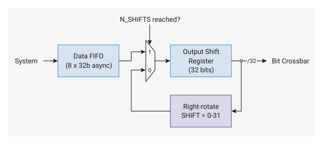

# 12.11.2. Output shift register

12.11.2. Output shift register

Figure 127. Every

cycle, the output shift

register either refills

32 bits from the FIFO

or recirculates data

System
Bit Crossbar
Data FIFO
(8 x 32b async)

through a right-rotate

function. The rotate

can be used to

perform left or right

shifts, and to repeat

data.

The HSTX’s internal data paths are 32 bits wide, but the output is narrower: no more than 16 bits can be output per

HSTX cycle (8 GPIOs × DDR). The output shift register adapts these mismatched data widths. The output shift register

is a 32-bit shift register, which always refills 32 bits at a time, either from the command expander output or directly from

the data FIFO.

The source of data for the output shift register is configured by the CSR.EXPAND_EN field:

• when set, the command expander interposes the FIFO and the output shift register
• when clear, the command expander is bypassed, popping the FIFO directly into the shift register

Whenever CSR.EN is low, the shift register is flushed to empty. Once HSTX has been configured, and EN is set high, the

shift register is ready to accept data, and will pop data as soon as it becomes available.

After popping the first data word, the shift register will now shift every HSTX clock cycle until it becomes empty. The

shift behaviour is configured by:

• CSR.N_SHIFTS, which determines how many times to shift before the register is considered empty
• CSR.SHIFT, which is a right-rotate applied to the shift register every cycle

CSR.N_SHIFTS and CSR.SHIFT must only be changed when CSR.EN is low. It is safe to change these fields in the same

register write that sets EN from low to high.

SHIFT × N_SHIFTS is not necessarily less than or equal to 32. For example, a SHIFT of 31 might be used to shift the register

left by one bit per cycle, since right-rotate is a modular operation, and -1 is equal to 31 under a modulus of 32.

When the shift register is about to become empty, it will immediately refill with fresh data from the command expander

or FIFO if data is available. When data is available, the shift register is never empty for any cycle. If data is not available,

12.11. HSTX
1203

RP2350 Datasheet

the shift register becomes empty and stops shifting until more data is provided. Once data is provided, the shift register

refills and begins shifting once again.
