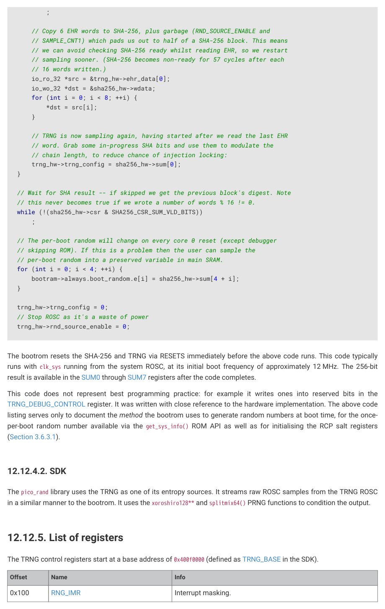

# 12.12.4. Caveats

RP2350 Datasheet

12.12.4. Caveats

The generation of random numbers by the TRNG block is not a deterministic process.

Although the modal and mean average times required to generate random numbers are quite similar, the generation

process can occasionally take much longer to complete: in excess of 100 times the average. Any run resulting in a failed

entropy check discards the result, requiring another generation process.

You can accommodate these unpredictable generation times in your system design. For example, you might generate a

small pool of random numbers, initiating subsequent generation whenever space becomes available in the pool.

In the interests of simplicity and timing predictability, alternative approaches were adopted for the RP2350 bootrom and

the SDK TRNG block drivers. The methodologies used can be found via the links below. However, nothing in the TRNG

block in RP2350 precludes using the block as specified in Arm documentation.

12.12.4.1. Bootrom

The bootrom streams raw TRNG ROSC samples (the TRNG random source) directly into the hardware SHA-256

accelerator. It bypasses all internal checking and conditioning in the TRNG. SHA-256 is a robust hash function which

avoids the pitfalls of some of the conditioning logic in the TRNG, most notably the von Neumann decorrelator.

The bootrom has some hard constraints which guide its implementation choices, most notably: the bootrom must boot.

It cannot afford to poll the TRNG for an indeterminate amount of time to wait for a random number to appear. Complex

error handling is also undesirable.

A link to the bootrom source can be found in Chapter 5. Consult the source code for the exact implementation of the

per-boot random number generation, in varm_boot_path.c.

The A2 bootrom TRNG code is written in assembly due to various implementation constraints, and may not be that

illuminating. The following is excerpted from the A1 bootrom source, lightly edited for readability:

// Boot RNG is derived by streaming a large number of TRNG ROSC samples

// into the SHA-256. BOOT_TRNG_SAMPLE_BLOCKS is the number of SHA-256

// blocks to hash, each containing 384 samples from the TRNG ROSC:

const int BOOT_TRNG_SAMPLE_BLOCKS = 25;

// Fixed delay is required after TRNG soft reset

trng_hw->trng_sw_reset = -1u;

(void)trng_hw->trng_sw_reset;

(void)trng_hw->trng_sw_reset;

// Initialise SHA internal state by writing START bit

sha256_hw->csr = SHA256_CSR_RESET | SHA256_CSR_START_BITS;

// Sample one ROSC bit into EHR every cycle, subject to CPU keeping up. More

// temporal resolution to measure ROSC phase noise is better, if we use a

// high quality hash function instead of naive VN decorrelation. (Also more

// metastability events, which are a secondary noise source)

trng_hw->sample_cnt1 = 0;

// Disable checks and bypass decorrelators, to stream raw TRNG ROSC samples:

trng_hw->trng_debug_control = -1u;

// Start ROSC if it is not already started

trng_hw->rnd_source_enable = -1u;

// Clear all interrupts (including EHR_VLD) -- we will check this

// later, after seeding RCP.

trng_hw->rng_icr = -1u;

// Each half-block (192 samples) takes approx 235 cycles, so 470 cycles/block:

for (int half_blocks = 0; half_blocks < 2 * BOOT_TRNG_SAMPLE_BLOCKS; ++half_blocks) {

    // Wait for 192 ROSC samples to fill EHR, this should take constant time:

    while (trng_hw->trng_busy)

12.12. TRNG
1214

RP2350 Datasheet

    // Copy 6 EHR words to SHA-256, plus garbage (RND_SOURCE_ENABLE and

    // SAMPLE_CNT1) which pads us out to half of a SHA-256 block. This means

    // we can avoid checking SHA-256 ready whilst reading EHR, so we restart

    // sampling sooner. (SHA-256 becomes non-ready for 57 cycles after each

    io_ro_32 *src = &trng_hw->ehr_data[0];

    io_wo_32 *dst = &sha256_hw->wdata;

    // TRNG is now sampling again, having started after we read the last EHR

    // word. Grab some in-progress SHA bits and use them to modulate the

    // chain length, to reduce chance of injection locking:

    trng_hw->trng_config = sha256_hw->sum[0];

// Wait for SHA result -- if skipped we get the previous block's digest. Note

// this never becomes true if we wrote a number of words % 16 != 0.

while (!(sha256_hw->csr & SHA256_CSR_SUM_VLD_BITS))

// The per-boot random will change on every core 0 reset (except debugger

// skipping ROM). If this is a problem then the user can sample the

// per-boot random into a preserved variable in main SRAM.

    bootram->always.boot_random.e[i] = sha256_hw->sum[4 + i];

// Stop ROSC as it's a waste of power

trng_hw->rnd_source_enable = 0;

The bootrom resets the SHA-256 and TRNG via RESETS immediately before the above code runs. This code typically

runs with clk_sys running from the system ROSC, at its initial boot frequency of approximately 12 MHz. The 256-bit

result is available in the SUM0 through SUM7 registers after the code completes.

This code does not represent best programming practice: for example it writes ones into reserved bits in the

TRNG_DEBUG_CONTROL register. It was written with close reference to the hardware implementation. The above code

listing serves only to document the method the bootrom uses to generate random numbers at boot time, for the once-

per-boot random number available via the get_sys_info() ROM API as well as for initialising the RCP salt registers

The pico_rand library uses the TRNG as one of its entropy sources. It streams raw ROSC samples from the TRNG ROSC

in a similar manner to the bootrom. It uses the xoroshiro128** and splitmix64() PRNG functions to condition the output.
