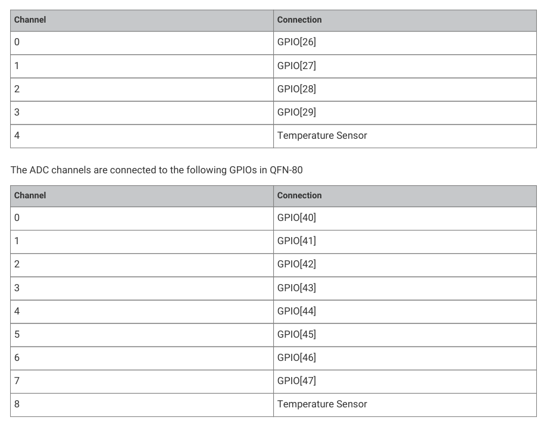

# 12.4.1. Changes from RP2040

12.4.1. Changes from RP2040

• Removed spikes in differential nonlinearity at codes 0x200, 0x600, 0xa00 and 0xe00, as documented by erratum

RP2040-E11, improving the ADC’s precision by around 0.5 ENOB.

12.4. ADC and Temperature Sensor
1068

RP2350 Datasheet

• Increased the number of external ADC input channels from 4 to 8 channels, in the QFN-80 package only.

