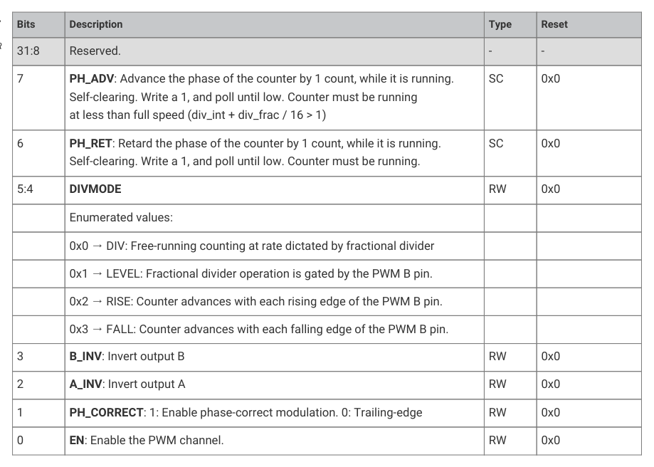

# 12.5.3. List of registers

12.5.3. List of registers

The PWM registers start at a base address of 0x400a8000 (defined as PWM_BASE in the SDK).

| Offset | Name | Info |
| --- | --- | --- |
| 0x000 | CH0_CSR | Control and status register |
| 0x004 | CH0_DIV | INT and FRAC form a fixed-point fractional number. Counting rate is system clock frequency divided by this number. Fractional division uses simple 1st-order sigma-delta. |
| 0x008 | CH0_CTR | Direct access to the PWM counter |
| 0x00c | CH0_CC | Counter compare values |
| 0x010 | CH0_TOP | Counter wrap value |
| 0x014 | CH1_CSR | Control and status register |
| 0x018 | CH1_DIV | INT and FRAC form a fixed-point fractional number. Counting rate is system clock frequency divided by this number. Fractional division uses simple 1st-order sigma-delta. |
| 0x01c | CH1_CTR | Direct access to the PWM counter |
| 0x020 | CH1_CC | Counter compare values |
| 0x024 | CH1_TOP | Counter wrap value |
| 0x028 | CH2_CSR | Control and status register |
| 0x02c | CH2_DIV | INT and FRAC form a fixed-point fractional number. Counting rate is system clock frequency divided by this number. Fractional division uses simple 1st-order sigma-delta. |
| 0x030 | CH2_CTR | Direct access to the PWM counter |
| 0x034 | CH2_CC | Counter compare values |
| 0x038 | CH2_TOP | Counter wrap value |
| 0x03c | CH3_CSR | Control and status register |
| 0x040 | CH3_DIV | INT and FRAC form a fixed-point fractional number. Counting rate is system clock frequency divided by this number. Fractional division uses simple 1st-order sigma-delta. |
| 0x044 | CH3_CTR | Direct access to the PWM counter |
| 0x048 | CH3_CC | Counter compare values |
| 0x04c | CH3_TOP | Counter wrap value |
| 0x050 | CH4_CSR | Control and status register |
| 0x054 | CH4_DIV | INT and FRAC form a fixed-point fractional number. Counting rate is system clock frequency divided by this number. Fractional division uses simple 1st-order sigma-delta. |
| 0x058 | CH4_CTR | Direct access to the PWM counter |
| 0x05c | CH4_CC | Counter compare values |
| 0x060 | CH4_TOP | Counter wrap value |
| 0x064 | CH5_CSR | Control and status register |
| 0x068 | CH5_DIV | INT and FRAC form a fixed-point fractional number. Counting rate is system clock frequency divided by this number. Fractional division uses simple 1st-order sigma-delta. |
| 0x06c | CH5_CTR | Direct access to the PWM counter |
| 0x070 | CH5_CC | Counter compare values |
| 0x074 | CH5_TOP | Counter wrap value |
| 0x078 | CH6_CSR | Control and status register |
| 0x07c | CH6_DIV | INT and FRAC form a fixed-point fractional number. Counting rate is system clock frequency divided by this number. Fractional division uses simple 1st-order sigma-delta. |
| 0x080 | CH6_CTR | Direct access to the PWM counter |
| 0x084 | CH6_CC | Counter compare values |
| 0x088 | CH6_TOP | Counter wrap value |
| 0x08c | CH7_CSR | Control and status register |
| 0x090 | CH7_DIV | INT and FRAC form a fixed-point fractional number. Counting rate is system clock frequency divided by this number. Fractional division uses simple 1st-order sigma-delta. |
| 0x094 | CH7_CTR | Direct access to the PWM counter |
| 0x098 | CH7_CC | Counter compare values |
| 0x09c | CH7_TOP | Counter wrap value |
| 0x0a0 | CH8_CSR | Control and status register |
| 0x0a4 | CH8_DIV | INT and FRAC form a fixed-point fractional number. Counting rate is system clock frequency divided by this number. Fractional division uses simple 1st-order sigma-delta. |
| 0x0a8 | CH8_CTR | Direct access to the PWM counter |
| 0x0ac | CH8_CC | Counter compare values |
| 0x0b0 | CH8_TOP | Counter wrap value |
| 0x0b4 | CH9_CSR | Control and status register |
| 0x0b8 | CH9_DIV | INT and FRAC form a fixed-point fractional number. Counting rate is system clock frequency divided by this number. Fractional division uses simple 1st-order sigma-delta. |
| 0x0bc | CH9_CTR | Direct access to the PWM counter |
| 0x0c0 | CH9_CC | Counter compare values |
| 0x0c4 | CH9_TOP | Counter wrap value |
| 0x0c8 | CH10_CSR | Control and status register |
| 0x0cc | CH10_DIV | INT and FRAC form a fixed-point fractional number. Counting rate is system clock frequency divided by this number. Fractional division uses simple 1st-order sigma-delta. |
| 0x0d0 | CH10_CTR | Direct access to the PWM counter |
| 0x0d4 | CH10_CC | Counter compare values |
| 0x0d8 | CH10_TOP | Counter wrap value |
| 0x0dc | CH11_CSR | Control and status register |
| 0x0e0 | CH11_DIV | INT and FRAC form a fixed-point fractional number. Counting rate is system clock frequency divided by this number. Fractional division uses simple 1st-order sigma-delta. |
| 0x0e4 | CH11_CTR | Direct access to the PWM counter |
| 0x0e8 | CH11_CC | Counter compare values |
| 0x0ec | CH11_TOP | Counter wrap value |
| 0x0f0 | EN | This register aliases the CSR_EN bits for all channels. Writing to this register allows multiple channels to be enabled or disabled simultaneously, so they can run in perfect sync. For each channel, there is only one physical EN register bit, which can be accessed through here or CHx_CSR. |
| 0x0f4 | INTR | Raw Interrupts |
| 0x0f8 | IRQ0_INTE | Interrupt Enable for irq0 |
| 0x0fc | IRQ0_INTF | Interrupt Force for irq0 |
| 0x100 | IRQ0_INTS | Interrupt status after masking & forcing for irq0 |
| 0x104 | IRQ1_INTE | Interrupt Enable for irq1 |
| 0x108 | IRQ1_INTF | Interrupt Force for irq1 |
| 0x10c | IRQ1_INTS | Interrupt status after masking & forcing for irq1 |

Table 1131. List of

12.5. PWM
1086

RP2350 Datasheet

12.5. PWM
1087

RP2350 Datasheet

12.5. PWM
1088

RP2350 Datasheet

PWM: CH0_CSR, CH1_CSR, …, CH10_CSR, CH11_CSR Registers

Offsets: 0x000, 0x014, …, 0x0c8, 0x0dc

Description

Control and status register

Table 1132. CH0_CSR,

Bits
Description
Type
Reset

CH1_CSR, …,

CH10_CSR, CH11_CSR

31:8
Reserved.
-
-

Registers

7
PH_ADV: Advance the phase of the counter by 1 count, while it is running.

Self-clearing. Write a 1, and poll until low. Counter must be running

at less than full speed (div_int + div_frac / 16 > 1)

6
PH_RET: Retard the phase of the counter by 1 count, while it is running.

Self-clearing. Write a 1, and poll until low. Counter must be running.

5:4
DIVMODE
RW
0x0

0x0 → DIV: Free-running counting at rate dictated by fractional divider

0x1 → LEVEL: Fractional divider operation is gated by the PWM B pin.

0x2 → RISE: Counter advances with each rising edge of the PWM B pin.

0x3 → FALL: Counter advances with each falling edge of the PWM B pin.

3
B_INV: Invert output B
RW
0x0

2
A_INV: Invert output A
RW
0x0

1
PH_CORRECT: 1: Enable phase-correct modulation. 0: Trailing-edge
RW
0x0

0
EN: Enable the PWM channel.
RW
0x0

PWM: CH0_DIV, CH1_DIV, …, CH10_DIV, CH11_DIV Registers

Offsets: 0x004, 0x018, …, 0x0cc, 0x0e0

Description

INT and FRAC form a fixed-point fractional number.

Counting rate is system clock frequency divided by this number.

Fractional division uses simple 1st-order sigma-delta.

| Bits | Description | Type | Reset |
| --- | --- | --- | --- |
| 31:12 | Reserved. | - | - |
| 11:4 | INT | RW | 0x01 |
| 3:0 | FRAC | RW | 0x0 |
| 31:16 | Reserved. | - | - |
| 15:0 | Direct access to the PWM counter | RW | 0x0000 |

Table 1133. CH0_DIV,

CH1_DIV, …,

CH10_DIV, CH11_DIV

Registers

PWM: CH0_CTR, CH1_CTR, …, CH10_CTR, CH11_CTR Registers

Offsets: 0x008, 0x01c, …, 0x0d0, 0x0e4

12.5. PWM
1089

RP2350 Datasheet

Table 1134. CH0_CTR,

CH1_CTR, …,

CH10_CTR, CH11_CTR

Registers

PWM: CH0_CC, CH1_CC, …, CH10_CC, CH11_CC Registers

Offsets: 0x00c, 0x020, …, 0x0d4, 0x0e8

Description

Counter compare values

| Bits | Description | Type | Reset |
| --- | --- | --- | --- |
| 31:16 | B | RW | 0x0000 |
| 15:0 | A | RW | 0x0000 |

Table 1135. CH0_CC,

CH1_CC, …, CH10_CC,

CH11_CC Registers

PWM: CH0_TOP, CH1_TOP, …, CH10_TOP, CH11_TOP Registers

Offsets: 0x010, 0x024, …, 0x0d8, 0x0ec

| Bits | Description | Type | Reset |
| --- | --- | --- | --- |
| 31:16 | Reserved. | - | - |
| 15:0 | Counter wrap value | RW | 0xffff |

Table 1136. CH0_TOP,

CH1_TOP, …,

CH10_TOP, CH11_TOP

Registers

PWM: EN Register

Offset: 0x0f0

Description

This register aliases the CSR_EN bits for all channels.

Writing to this register allows multiple channels to be enabled

or disabled simultaneously, so they can run in perfect sync.

For each channel, there is only one physical EN register bit,

which can be accessed through here or CHx_CSR.

| Bits | Description | Type | Reset |
| --- | --- | --- | --- |
| 31:12 | Reserved. | - | - |
| 11 | CH11 | RW | 0x0 |
| 10 | CH10 | RW | 0x0 |
| 9 | CH9 | RW | 0x0 |
| 8 | CH8 | RW | 0x0 |
| 7 | CH7 | RW | 0x0 |
| 6 | CH6 | RW | 0x0 |
| 5 | CH5 | RW | 0x0 |
| 4 | CH4 | RW | 0x0 |
| 3 | CH3 | RW | 0x0 |
| 2 | CH2 | RW | 0x0 |
| 1 | CH1 | RW | 0x0 |
| 0 | CH0 | RW | 0x0 |

Table 1137. EN

12.5. PWM
1090

RP2350 Datasheet

PWM: INTR Register

Offset: 0x0f4

Description

Raw Interrupts

| Bits | Description | Type | Reset |
| --- | --- | --- | --- |
| 31:12 | Reserved. | - | - |
| 11 | CH11 | WC | 0x0 |
| 10 | CH10 | WC | 0x0 |
| 9 | CH9 | WC | 0x0 |
| 8 | CH8 | WC | 0x0 |
| 7 | CH7 | WC | 0x0 |
| 6 | CH6 | WC | 0x0 |
| 5 | CH5 | WC | 0x0 |
| 4 | CH4 | WC | 0x0 |
| 3 | CH3 | WC | 0x0 |
| 2 | CH2 | WC | 0x0 |
| 1 | CH1 | WC | 0x0 |
| 0 | CH0 | WC | 0x0 |

Table 1138. INTR

PWM: IRQ0_INTE Register

Offset: 0x0f8

Description

Interrupt Enable for irq0

| Bits | Description | Type | Reset |
| --- | --- | --- | --- |
| 31:12 | Reserved. | - | - |
| 11 | CH11 | RW | 0x0 |
| 10 | CH10 | RW | 0x0 |
| 9 | CH9 | RW | 0x0 |
| 8 | CH8 | RW | 0x0 |
| 7 | CH7 | RW | 0x0 |
| 6 | CH6 | RW | 0x0 |
| 5 | CH5 | RW | 0x0 |
| 4 | CH4 | RW | 0x0 |
| 3 | CH3 | RW | 0x0 |
| 2 | CH2 | RW | 0x0 |
| 1 | CH1 | RW | 0x0 |
| 0 | CH0 | RW | 0x0 |

Table 1139.

12.5. PWM
1091

RP2350 Datasheet

PWM: IRQ0_INTF Register

Offset: 0x0fc

Description

Interrupt Force for irq0

| Bits | Description | Type | Reset |
| --- | --- | --- | --- |
| 31:12 | Reserved. | - | - |
| 11 | CH11 | RW | 0x0 |
| 10 | CH10 | RW | 0x0 |
| 9 | CH9 | RW | 0x0 |
| 8 | CH8 | RW | 0x0 |
| 7 | CH7 | RW | 0x0 |
| 6 | CH6 | RW | 0x0 |
| 5 | CH5 | RW | 0x0 |
| 4 | CH4 | RW | 0x0 |
| 3 | CH3 | RW | 0x0 |
| 2 | CH2 | RW | 0x0 |
| 1 | CH1 | RW | 0x0 |
| 0 | CH0 | RW | 0x0 |

Table 1140.

PWM: IRQ0_INTS Register

Offset: 0x100

Description

Interrupt status after masking & forcing for irq0

| Bits | Description | Type | Reset |
| --- | --- | --- | --- |
| 31:12 | Reserved. | - | - |
| 11 | CH11 | RO | 0x0 |
| 10 | CH10 | RO | 0x0 |
| 9 | CH9 | RO | 0x0 |
| 8 | CH8 | RO | 0x0 |
| 7 | CH7 | RO | 0x0 |
| 6 | CH6 | RO | 0x0 |
| 5 | CH5 | RO | 0x0 |
| 4 | CH4 | RO | 0x0 |
| 3 | CH3 | RO | 0x0 |
| 2 | CH2 | RO | 0x0 |
| 1 | CH1 | RO | 0x0 |
| 0 | CH0 | RO | 0x0 |

Table 1141.

12.5. PWM
1092

RP2350 Datasheet

PWM: IRQ1_INTE Register

Offset: 0x104

Description

Interrupt Enable for irq1

| Bits | Description | Type | Reset |
| --- | --- | --- | --- |
| 31:12 | Reserved. | - | - |
| 11 | CH11 | RW | 0x0 |
| 10 | CH10 | RW | 0x0 |
| 9 | CH9 | RW | 0x0 |
| 8 | CH8 | RW | 0x0 |
| 7 | CH7 | RW | 0x0 |
| 6 | CH6 | RW | 0x0 |
| 5 | CH5 | RW | 0x0 |
| 4 | CH4 | RW | 0x0 |
| 3 | CH3 | RW | 0x0 |
| 2 | CH2 | RW | 0x0 |
| 1 | CH1 | RW | 0x0 |
| 0 | CH0 | RW | 0x0 |

Table 1142.

PWM: IRQ1_INTF Register

Offset: 0x108

Description

Interrupt Force for irq1

| Bits | Description | Type | Reset |
| --- | --- | --- | --- |
| 31:12 | Reserved. | - | - |
| 11 | CH11 | RW | 0x0 |
| 10 | CH10 | RW | 0x0 |
| 9 | CH9 | RW | 0x0 |
| 8 | CH8 | RW | 0x0 |
| 7 | CH7 | RW | 0x0 |
| 6 | CH6 | RW | 0x0 |
| 5 | CH5 | RW | 0x0 |
| 4 | CH4 | RW | 0x0 |
| 3 | CH3 | RW | 0x0 |
| 2 | CH2 | RW | 0x0 |
| 1 | CH1 | RW | 0x0 |
| 0 | CH0 | RW | 0x0 |

Table 1143.

12.5. PWM
1093

RP2350 Datasheet

PWM: IRQ1_INTS Register

Offset: 0x10c

Description

Interrupt status after masking & forcing for irq1

| Bits | Description | Type | Reset |
| --- | --- | --- | --- |
| 31:12 | Reserved. | - | - |
| 11 | CH11 | RO | 0x0 |
| 10 | CH10 | RO | 0x0 |
| 9 | CH9 | RO | 0x0 |
| 8 | CH8 | RO | 0x0 |
| 7 | CH7 | RO | 0x0 |
| 6 | CH6 | RO | 0x0 |
| 5 | CH5 | RO | 0x0 |
| 4 | CH4 | RO | 0x0 |
| 3 | CH3 | RO | 0x0 |
| 2 | CH2 | RO | 0x0 |
| 1 | CH1 | RO | 0x0 |
| 0 | CH0 | RO | 0x0 |

Table 1144.
