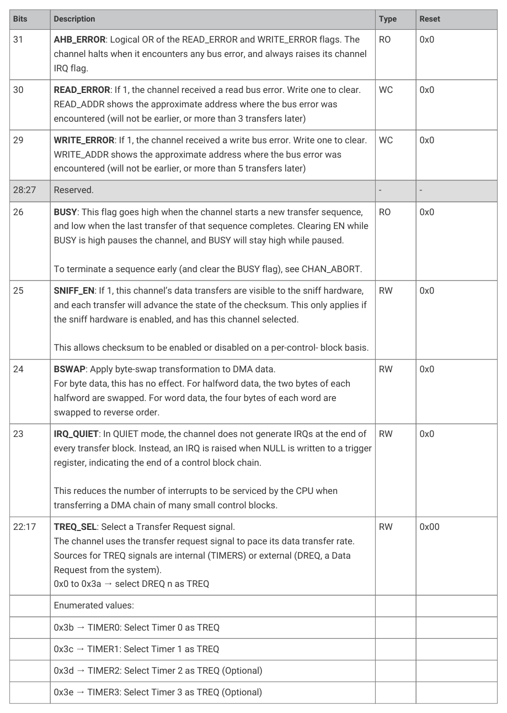
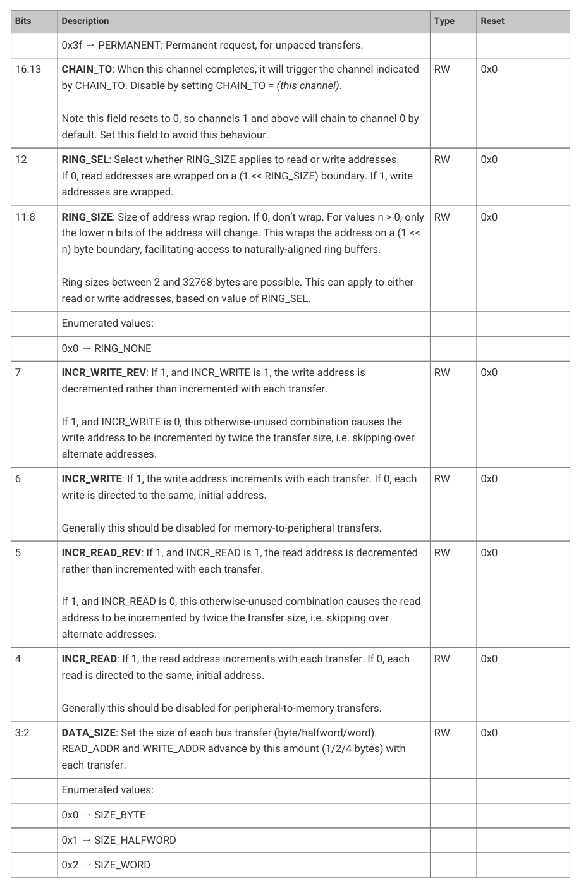
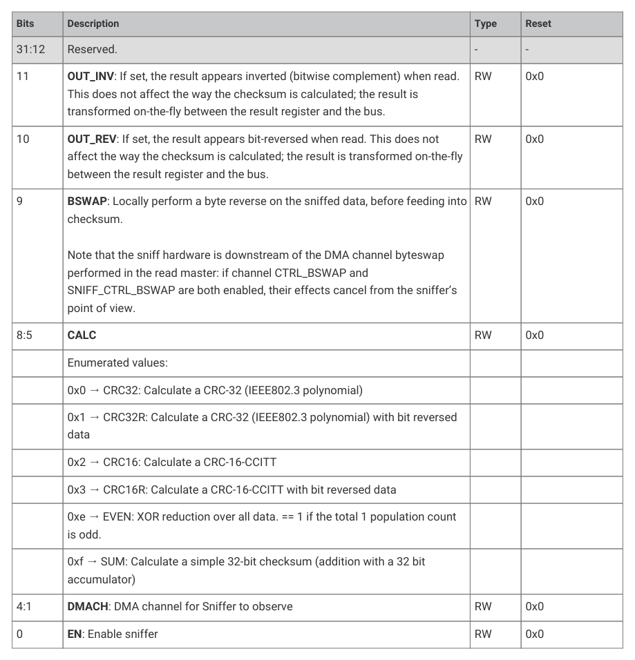

# 12.6.10. List of Registers

12.6.10. List of Registers

The DMA registers start at a base address of 0x50000000 (defined as DMA_BASE in SDK).

| Offset | Name | Info |
| --- | --- | --- |
| 0x000 | CH0_READ_ADDR | DMA Channel 0 Read Address pointer |
| 0x004 | CH0_WRITE_ADDR | DMA Channel 0 Write Address pointer |
| 0x008 | CH0_TRANS_COUNT | DMA Channel 0 Transfer Count |
| 0x00c | CH0_CTRL_TRIG | DMA Channel 0 Control and Status |
| 0x010 | CH0_AL1_CTRL | Alias for channel 0 CTRL register |
| 0x014 | CH0_AL1_READ_ADDR | Alias for channel 0 READ_ADDR register |
| 0x018 | CH0_AL1_WRITE_ADDR | Alias for channel 0 WRITE_ADDR register |
| 0x01c | CH0_AL1_TRANS_COUNT_TRIG | Alias for channel 0 TRANS_COUNT register This is a trigger register (0xc). Writing a nonzero value will reload the channel counter and start the channel. |
| 0x020 | CH0_AL2_CTRL | Alias for channel 0 CTRL register |
| 0x024 | CH0_AL2_TRANS_COUNT | Alias for channel 0 TRANS_COUNT register |
| 0x028 | CH0_AL2_READ_ADDR | Alias for channel 0 READ_ADDR register |
| 0x02c | CH0_AL2_WRITE_ADDR_TRIG | Alias for channel 0 WRITE_ADDR register This is a trigger register (0xc). Writing a nonzero value will reload the channel counter and start the channel. |
| 0x030 | CH0_AL3_CTRL | Alias for channel 0 CTRL register |
| 0x034 | CH0_AL3_WRITE_ADDR | Alias for channel 0 WRITE_ADDR register |
| 0x038 | CH0_AL3_TRANS_COUNT | Alias for channel 0 TRANS_COUNT register |
| 0x03c | CH0_AL3_READ_ADDR_TRIG | Alias for channel 0 READ_ADDR register This is a trigger register (0xc). Writing a nonzero value will reload the channel counter and start the channel. |
| 0x040 | CH1_READ_ADDR | DMA Channel 1 Read Address pointer |
| 0x044 | CH1_WRITE_ADDR | DMA Channel 1 Write Address pointer |
| 0x048 | CH1_TRANS_COUNT | DMA Channel 1 Transfer Count |
| 0x04c | CH1_CTRL_TRIG | DMA Channel 1 Control and Status |
| 0x050 | CH1_AL1_CTRL | Alias for channel 1 CTRL register |
| 0x054 | CH1_AL1_READ_ADDR | Alias for channel 1 READ_ADDR register |
| 0x058 | CH1_AL1_WRITE_ADDR | Alias for channel 1 WRITE_ADDR register |
| 0x05c | CH1_AL1_TRANS_COUNT_TRIG | Alias for channel 1 TRANS_COUNT register This is a trigger register (0xc). Writing a nonzero value will reload the channel counter and start the channel. |
| 0x060 | CH1_AL2_CTRL | Alias for channel 1 CTRL register |
| 0x064 | CH1_AL2_TRANS_COUNT | Alias for channel 1 TRANS_COUNT register |
| 0x068 | CH1_AL2_READ_ADDR | Alias for channel 1 READ_ADDR register |
| 0x06c | CH1_AL2_WRITE_ADDR_TRIG | Alias for channel 1 WRITE_ADDR register This is a trigger register (0xc). Writing a nonzero value will reload the channel counter and start the channel. |
| 0x070 | CH1_AL3_CTRL | Alias for channel 1 CTRL register |
| 0x074 | CH1_AL3_WRITE_ADDR | Alias for channel 1 WRITE_ADDR register |
| 0x078 | CH1_AL3_TRANS_COUNT | Alias for channel 1 TRANS_COUNT register |
| 0x07c | CH1_AL3_READ_ADDR_TRIG | Alias for channel 1 READ_ADDR register This is a trigger register (0xc). Writing a nonzero value will reload the channel counter and start the channel. |
| 0x080 | CH2_READ_ADDR | DMA Channel 2 Read Address pointer |
| 0x084 | CH2_WRITE_ADDR | DMA Channel 2 Write Address pointer |
| 0x088 | CH2_TRANS_COUNT | DMA Channel 2 Transfer Count |
| 0x08c | CH2_CTRL_TRIG | DMA Channel 2 Control and Status |
| 0x090 | CH2_AL1_CTRL | Alias for channel 2 CTRL register |
| 0x094 | CH2_AL1_READ_ADDR | Alias for channel 2 READ_ADDR register |
| 0x098 | CH2_AL1_WRITE_ADDR | Alias for channel 2 WRITE_ADDR register |
| 0x09c | CH2_AL1_TRANS_COUNT_TRIG | Alias for channel 2 TRANS_COUNT register This is a trigger register (0xc). Writing a nonzero value will reload the channel counter and start the channel. |
| 0x0a0 | CH2_AL2_CTRL | Alias for channel 2 CTRL register |
| 0x0a4 | CH2_AL2_TRANS_COUNT | Alias for channel 2 TRANS_COUNT register |
| 0x0a8 | CH2_AL2_READ_ADDR | Alias for channel 2 READ_ADDR register |
| 0x0ac | CH2_AL2_WRITE_ADDR_TRIG | Alias for channel 2 WRITE_ADDR register This is a trigger register (0xc). Writing a nonzero value will reload the channel counter and start the channel. |
| 0x0b0 | CH2_AL3_CTRL | Alias for channel 2 CTRL register |
| 0x0b4 | CH2_AL3_WRITE_ADDR | Alias for channel 2 WRITE_ADDR register |
| 0x0b8 | CH2_AL3_TRANS_COUNT | Alias for channel 2 TRANS_COUNT register |
| 0x0bc | CH2_AL3_READ_ADDR_TRIG | Alias for channel 2 READ_ADDR register This is a trigger register (0xc). Writing a nonzero value will reload the channel counter and start the channel. |
| 0x0c0 | CH3_READ_ADDR | DMA Channel 3 Read Address pointer |
| 0x0c4 | CH3_WRITE_ADDR | DMA Channel 3 Write Address pointer |
| 0x0c8 | CH3_TRANS_COUNT | DMA Channel 3 Transfer Count |
| 0x0cc | CH3_CTRL_TRIG | DMA Channel 3 Control and Status |
| 0x0d0 | CH3_AL1_CTRL | Alias for channel 3 CTRL register |
| 0x0d4 | CH3_AL1_READ_ADDR | Alias for channel 3 READ_ADDR register |
| 0x0d8 | CH3_AL1_WRITE_ADDR | Alias for channel 3 WRITE_ADDR register |
| 0x0dc | CH3_AL1_TRANS_COUNT_TRIG | Alias for channel 3 TRANS_COUNT register This is a trigger register (0xc). Writing a nonzero value will reload the channel counter and start the channel. |
| 0x0e0 | CH3_AL2_CTRL | Alias for channel 3 CTRL register |
| 0x0e4 | CH3_AL2_TRANS_COUNT | Alias for channel 3 TRANS_COUNT register |
| 0x0e8 | CH3_AL2_READ_ADDR | Alias for channel 3 READ_ADDR register |
| 0x0ec | CH3_AL2_WRITE_ADDR_TRIG | Alias for channel 3 WRITE_ADDR register This is a trigger register (0xc). Writing a nonzero value will reload the channel counter and start the channel. |
| 0x0f0 | CH3_AL3_CTRL | Alias for channel 3 CTRL register |
| 0x0f4 | CH3_AL3_WRITE_ADDR | Alias for channel 3 WRITE_ADDR register |
| 0x0f8 | CH3_AL3_TRANS_COUNT | Alias for channel 3 TRANS_COUNT register |
| 0x0fc | CH3_AL3_READ_ADDR_TRIG | Alias for channel 3 READ_ADDR register This is a trigger register (0xc). Writing a nonzero value will reload the channel counter and start the channel. |
| 0x100 | CH4_READ_ADDR | DMA Channel 4 Read Address pointer |
| 0x104 | CH4_WRITE_ADDR | DMA Channel 4 Write Address pointer |
| 0x108 | CH4_TRANS_COUNT | DMA Channel 4 Transfer Count |
| 0x10c | CH4_CTRL_TRIG | DMA Channel 4 Control and Status |
| 0x110 | CH4_AL1_CTRL | Alias for channel 4 CTRL register |
| 0x114 | CH4_AL1_READ_ADDR | Alias for channel 4 READ_ADDR register |
| 0x118 | CH4_AL1_WRITE_ADDR | Alias for channel 4 WRITE_ADDR register |
| 0x11c | CH4_AL1_TRANS_COUNT_TRIG | Alias for channel 4 TRANS_COUNT register This is a trigger register (0xc). Writing a nonzero value will reload the channel counter and start the channel. |
| 0x120 | CH4_AL2_CTRL | Alias for channel 4 CTRL register |
| 0x124 | CH4_AL2_TRANS_COUNT | Alias for channel 4 TRANS_COUNT register |
| 0x128 | CH4_AL2_READ_ADDR | Alias for channel 4 READ_ADDR register |
| 0x12c | CH4_AL2_WRITE_ADDR_TRIG | Alias for channel 4 WRITE_ADDR register This is a trigger register (0xc). Writing a nonzero value will reload the channel counter and start the channel. |
| 0x130 | CH4_AL3_CTRL | Alias for channel 4 CTRL register |
| 0x134 | CH4_AL3_WRITE_ADDR | Alias for channel 4 WRITE_ADDR register |
| 0x138 | CH4_AL3_TRANS_COUNT | Alias for channel 4 TRANS_COUNT register |
| 0x13c | CH4_AL3_READ_ADDR_TRIG | Alias for channel 4 READ_ADDR register This is a trigger register (0xc). Writing a nonzero value will reload the channel counter and start the channel. |
| 0x140 | CH5_READ_ADDR | DMA Channel 5 Read Address pointer |
| 0x144 | CH5_WRITE_ADDR | DMA Channel 5 Write Address pointer |
| 0x148 | CH5_TRANS_COUNT | DMA Channel 5 Transfer Count |
| 0x14c | CH5_CTRL_TRIG | DMA Channel 5 Control and Status |
| 0x150 | CH5_AL1_CTRL | Alias for channel 5 CTRL register |
| 0x154 | CH5_AL1_READ_ADDR | Alias for channel 5 READ_ADDR register |
| 0x158 | CH5_AL1_WRITE_ADDR | Alias for channel 5 WRITE_ADDR register |
| 0x15c | CH5_AL1_TRANS_COUNT_TRIG | Alias for channel 5 TRANS_COUNT register This is a trigger register (0xc). Writing a nonzero value will reload the channel counter and start the channel. |
| 0x160 | CH5_AL2_CTRL | Alias for channel 5 CTRL register |
| 0x164 | CH5_AL2_TRANS_COUNT | Alias for channel 5 TRANS_COUNT register |
| 0x168 | CH5_AL2_READ_ADDR | Alias for channel 5 READ_ADDR register |
| 0x16c | CH5_AL2_WRITE_ADDR_TRIG | Alias for channel 5 WRITE_ADDR register This is a trigger register (0xc). Writing a nonzero value will reload the channel counter and start the channel. |
| 0x170 | CH5_AL3_CTRL | Alias for channel 5 CTRL register |
| 0x174 | CH5_AL3_WRITE_ADDR | Alias for channel 5 WRITE_ADDR register |
| 0x178 | CH5_AL3_TRANS_COUNT | Alias for channel 5 TRANS_COUNT register |
| 0x17c | CH5_AL3_READ_ADDR_TRIG | Alias for channel 5 READ_ADDR register This is a trigger register (0xc). Writing a nonzero value will reload the channel counter and start the channel. |
| 0x180 | CH6_READ_ADDR | DMA Channel 6 Read Address pointer |
| 0x184 | CH6_WRITE_ADDR | DMA Channel 6 Write Address pointer |
| 0x188 | CH6_TRANS_COUNT | DMA Channel 6 Transfer Count |
| 0x18c | CH6_CTRL_TRIG | DMA Channel 6 Control and Status |
| 0x190 | CH6_AL1_CTRL | Alias for channel 6 CTRL register |
| 0x194 | CH6_AL1_READ_ADDR | Alias for channel 6 READ_ADDR register |
| 0x198 | CH6_AL1_WRITE_ADDR | Alias for channel 6 WRITE_ADDR register |
| 0x19c | CH6_AL1_TRANS_COUNT_TRIG | Alias for channel 6 TRANS_COUNT register This is a trigger register (0xc). Writing a nonzero value will reload the channel counter and start the channel. |
| 0x1a0 | CH6_AL2_CTRL | Alias for channel 6 CTRL register |
| 0x1a4 | CH6_AL2_TRANS_COUNT | Alias for channel 6 TRANS_COUNT register |
| 0x1a8 | CH6_AL2_READ_ADDR | Alias for channel 6 READ_ADDR register |
| 0x1ac | CH6_AL2_WRITE_ADDR_TRIG | Alias for channel 6 WRITE_ADDR register This is a trigger register (0xc). Writing a nonzero value will reload the channel counter and start the channel. |
| 0x1b0 | CH6_AL3_CTRL | Alias for channel 6 CTRL register |
| 0x1b4 | CH6_AL3_WRITE_ADDR | Alias for channel 6 WRITE_ADDR register |
| 0x1b8 | CH6_AL3_TRANS_COUNT | Alias for channel 6 TRANS_COUNT register |
| 0x1bc | CH6_AL3_READ_ADDR_TRIG | Alias for channel 6 READ_ADDR register This is a trigger register (0xc). Writing a nonzero value will reload the channel counter and start the channel. |
| 0x1c0 | CH7_READ_ADDR | DMA Channel 7 Read Address pointer |
| 0x1c4 | CH7_WRITE_ADDR | DMA Channel 7 Write Address pointer |
| 0x1c8 | CH7_TRANS_COUNT | DMA Channel 7 Transfer Count |
| 0x1cc | CH7_CTRL_TRIG | DMA Channel 7 Control and Status |
| 0x1d0 | CH7_AL1_CTRL | Alias for channel 7 CTRL register |
| 0x1d4 | CH7_AL1_READ_ADDR | Alias for channel 7 READ_ADDR register |
| 0x1d8 | CH7_AL1_WRITE_ADDR | Alias for channel 7 WRITE_ADDR register |
| 0x1dc | CH7_AL1_TRANS_COUNT_TRIG | Alias for channel 7 TRANS_COUNT register This is a trigger register (0xc). Writing a nonzero value will reload the channel counter and start the channel. |
| 0x1e0 | CH7_AL2_CTRL | Alias for channel 7 CTRL register |
| 0x1e4 | CH7_AL2_TRANS_COUNT | Alias for channel 7 TRANS_COUNT register |
| 0x1e8 | CH7_AL2_READ_ADDR | Alias for channel 7 READ_ADDR register |
| 0x1ec | CH7_AL2_WRITE_ADDR_TRIG | Alias for channel 7 WRITE_ADDR register This is a trigger register (0xc). Writing a nonzero value will reload the channel counter and start the channel. |
| 0x1f0 | CH7_AL3_CTRL | Alias for channel 7 CTRL register |
| 0x1f4 | CH7_AL3_WRITE_ADDR | Alias for channel 7 WRITE_ADDR register |
| 0x1f8 | CH7_AL3_TRANS_COUNT | Alias for channel 7 TRANS_COUNT register |
| 0x1fc | CH7_AL3_READ_ADDR_TRIG | Alias for channel 7 READ_ADDR register This is a trigger register (0xc). Writing a nonzero value will reload the channel counter and start the channel. |
| 0x200 | CH8_READ_ADDR | DMA Channel 8 Read Address pointer |
| 0x204 | CH8_WRITE_ADDR | DMA Channel 8 Write Address pointer |
| 0x208 | CH8_TRANS_COUNT | DMA Channel 8 Transfer Count |
| 0x20c | CH8_CTRL_TRIG | DMA Channel 8 Control and Status |
| 0x210 | CH8_AL1_CTRL | Alias for channel 8 CTRL register |
| 0x214 | CH8_AL1_READ_ADDR | Alias for channel 8 READ_ADDR register |
| 0x218 | CH8_AL1_WRITE_ADDR | Alias for channel 8 WRITE_ADDR register |
| 0x21c | CH8_AL1_TRANS_COUNT_TRIG | Alias for channel 8 TRANS_COUNT register This is a trigger register (0xc). Writing a nonzero value will reload the channel counter and start the channel. |
| 0x220 | CH8_AL2_CTRL | Alias for channel 8 CTRL register |
| 0x224 | CH8_AL2_TRANS_COUNT | Alias for channel 8 TRANS_COUNT register |
| 0x228 | CH8_AL2_READ_ADDR | Alias for channel 8 READ_ADDR register |
| 0x22c | CH8_AL2_WRITE_ADDR_TRIG | Alias for channel 8 WRITE_ADDR register This is a trigger register (0xc). Writing a nonzero value will reload the channel counter and start the channel. |
| 0x230 | CH8_AL3_CTRL | Alias for channel 8 CTRL register |
| 0x234 | CH8_AL3_WRITE_ADDR | Alias for channel 8 WRITE_ADDR register |
| 0x238 | CH8_AL3_TRANS_COUNT | Alias for channel 8 TRANS_COUNT register |
| 0x23c | CH8_AL3_READ_ADDR_TRIG | Alias for channel 8 READ_ADDR register This is a trigger register (0xc). Writing a nonzero value will reload the channel counter and start the channel. |
| 0x240 | CH9_READ_ADDR | DMA Channel 9 Read Address pointer |
| 0x244 | CH9_WRITE_ADDR | DMA Channel 9 Write Address pointer |
| 0x248 | CH9_TRANS_COUNT | DMA Channel 9 Transfer Count |
| 0x24c | CH9_CTRL_TRIG | DMA Channel 9 Control and Status |
| 0x250 | CH9_AL1_CTRL | Alias for channel 9 CTRL register |
| 0x254 | CH9_AL1_READ_ADDR | Alias for channel 9 READ_ADDR register |
| 0x258 | CH9_AL1_WRITE_ADDR | Alias for channel 9 WRITE_ADDR register |
| 0x25c | CH9_AL1_TRANS_COUNT_TRIG | Alias for channel 9 TRANS_COUNT register This is a trigger register (0xc). Writing a nonzero value will reload the channel counter and start the channel. |
| 0x260 | CH9_AL2_CTRL | Alias for channel 9 CTRL register |
| 0x264 | CH9_AL2_TRANS_COUNT | Alias for channel 9 TRANS_COUNT register |
| 0x268 | CH9_AL2_READ_ADDR | Alias for channel 9 READ_ADDR register |
| 0x26c | CH9_AL2_WRITE_ADDR_TRIG | Alias for channel 9 WRITE_ADDR register This is a trigger register (0xc). Writing a nonzero value will reload the channel counter and start the channel. |
| 0x270 | CH9_AL3_CTRL | Alias for channel 9 CTRL register |
| 0x274 | CH9_AL3_WRITE_ADDR | Alias for channel 9 WRITE_ADDR register |
| 0x278 | CH9_AL3_TRANS_COUNT | Alias for channel 9 TRANS_COUNT register |
| 0x27c | CH9_AL3_READ_ADDR_TRIG | Alias for channel 9 READ_ADDR register This is a trigger register (0xc). Writing a nonzero value will reload the channel counter and start the channel. |
| 0x280 | CH10_READ_ADDR | DMA Channel 10 Read Address pointer |
| 0x284 | CH10_WRITE_ADDR | DMA Channel 10 Write Address pointer |
| 0x288 | CH10_TRANS_COUNT | DMA Channel 10 Transfer Count |
| 0x28c | CH10_CTRL_TRIG | DMA Channel 10 Control and Status |
| 0x290 | CH10_AL1_CTRL | Alias for channel 10 CTRL register |
| 0x294 | CH10_AL1_READ_ADDR | Alias for channel 10 READ_ADDR register |
| 0x298 | CH10_AL1_WRITE_ADDR | Alias for channel 10 WRITE_ADDR register |
| 0x29c | CH10_AL1_TRANS_COUNT_TRIG | Alias for channel 10 TRANS_COUNT register This is a trigger register (0xc). Writing a nonzero value will reload the channel counter and start the channel. |
| 0x2a0 | CH10_AL2_CTRL | Alias for channel 10 CTRL register |
| 0x2a4 | CH10_AL2_TRANS_COUNT | Alias for channel 10 TRANS_COUNT register |
| 0x2a8 | CH10_AL2_READ_ADDR | Alias for channel 10 READ_ADDR register |
| 0x2ac | CH10_AL2_WRITE_ADDR_TRIG | Alias for channel 10 WRITE_ADDR register This is a trigger register (0xc). Writing a nonzero value will reload the channel counter and start the channel. |
| 0x2b0 | CH10_AL3_CTRL | Alias for channel 10 CTRL register |
| 0x2b4 | CH10_AL3_WRITE_ADDR | Alias for channel 10 WRITE_ADDR register |
| 0x2b8 | CH10_AL3_TRANS_COUNT | Alias for channel 10 TRANS_COUNT register |
| 0x2bc | CH10_AL3_READ_ADDR_TRIG | Alias for channel 10 READ_ADDR register This is a trigger register (0xc). Writing a nonzero value will reload the channel counter and start the channel. |
| 0x2c0 | CH11_READ_ADDR | DMA Channel 11 Read Address pointer |
| 0x2c4 | CH11_WRITE_ADDR | DMA Channel 11 Write Address pointer |
| 0x2c8 | CH11_TRANS_COUNT | DMA Channel 11 Transfer Count |
| 0x2cc | CH11_CTRL_TRIG | DMA Channel 11 Control and Status |
| 0x2d0 | CH11_AL1_CTRL | Alias for channel 11 CTRL register |
| 0x2d4 | CH11_AL1_READ_ADDR | Alias for channel 11 READ_ADDR register |
| 0x2d8 | CH11_AL1_WRITE_ADDR | Alias for channel 11 WRITE_ADDR register |
| 0x2dc | CH11_AL1_TRANS_COUNT_TRIG | Alias for channel 11 TRANS_COUNT register This is a trigger register (0xc). Writing a nonzero value will reload the channel counter and start the channel. |
| 0x2e0 | CH11_AL2_CTRL | Alias for channel 11 CTRL register |
| 0x2e4 | CH11_AL2_TRANS_COUNT | Alias for channel 11 TRANS_COUNT register |
| 0x2e8 | CH11_AL2_READ_ADDR | Alias for channel 11 READ_ADDR register |
| 0x2ec | CH11_AL2_WRITE_ADDR_TRIG | Alias for channel 11 WRITE_ADDR register This is a trigger register (0xc). Writing a nonzero value will reload the channel counter and start the channel. |
| 0x2f0 | CH11_AL3_CTRL | Alias for channel 11 CTRL register |
| 0x2f4 | CH11_AL3_WRITE_ADDR | Alias for channel 11 WRITE_ADDR register |
| 0x2f8 | CH11_AL3_TRANS_COUNT | Alias for channel 11 TRANS_COUNT register |
| 0x2fc | CH11_AL3_READ_ADDR_TRIG | Alias for channel 11 READ_ADDR register This is a trigger register (0xc). Writing a nonzero value will reload the channel counter and start the channel. |
| 0x300 | CH12_READ_ADDR | DMA Channel 12 Read Address pointer |
| 0x304 | CH12_WRITE_ADDR | DMA Channel 12 Write Address pointer |
| 0x308 | CH12_TRANS_COUNT | DMA Channel 12 Transfer Count |
| 0x30c | CH12_CTRL_TRIG | DMA Channel 12 Control and Status |
| 0x310 | CH12_AL1_CTRL | Alias for channel 12 CTRL register |
| 0x314 | CH12_AL1_READ_ADDR | Alias for channel 12 READ_ADDR register |
| 0x318 | CH12_AL1_WRITE_ADDR | Alias for channel 12 WRITE_ADDR register |
| 0x31c | CH12_AL1_TRANS_COUNT_TRIG | Alias for channel 12 TRANS_COUNT register This is a trigger register (0xc). Writing a nonzero value will reload the channel counter and start the channel. |
| 0x320 | CH12_AL2_CTRL | Alias for channel 12 CTRL register |
| 0x324 | CH12_AL2_TRANS_COUNT | Alias for channel 12 TRANS_COUNT register |
| 0x328 | CH12_AL2_READ_ADDR | Alias for channel 12 READ_ADDR register |
| 0x32c | CH12_AL2_WRITE_ADDR_TRIG | Alias for channel 12 WRITE_ADDR register This is a trigger register (0xc). Writing a nonzero value will reload the channel counter and start the channel. |
| 0x330 | CH12_AL3_CTRL | Alias for channel 12 CTRL register |
| 0x334 | CH12_AL3_WRITE_ADDR | Alias for channel 12 WRITE_ADDR register |
| 0x338 | CH12_AL3_TRANS_COUNT | Alias for channel 12 TRANS_COUNT register |
| 0x33c | CH12_AL3_READ_ADDR_TRIG | Alias for channel 12 READ_ADDR register This is a trigger register (0xc). Writing a nonzero value will reload the channel counter and start the channel. |
| 0x340 | CH13_READ_ADDR | DMA Channel 13 Read Address pointer |
| 0x344 | CH13_WRITE_ADDR | DMA Channel 13 Write Address pointer |
| 0x348 | CH13_TRANS_COUNT | DMA Channel 13 Transfer Count |
| 0x34c | CH13_CTRL_TRIG | DMA Channel 13 Control and Status |
| 0x350 | CH13_AL1_CTRL | Alias for channel 13 CTRL register |
| 0x354 | CH13_AL1_READ_ADDR | Alias for channel 13 READ_ADDR register |
| 0x358 | CH13_AL1_WRITE_ADDR | Alias for channel 13 WRITE_ADDR register |
| 0x35c | CH13_AL1_TRANS_COUNT_TRIG | Alias for channel 13 TRANS_COUNT register This is a trigger register (0xc). Writing a nonzero value will reload the channel counter and start the channel. |
| 0x360 | CH13_AL2_CTRL | Alias for channel 13 CTRL register |
| 0x364 | CH13_AL2_TRANS_COUNT | Alias for channel 13 TRANS_COUNT register |
| 0x368 | CH13_AL2_READ_ADDR | Alias for channel 13 READ_ADDR register |
| 0x36c | CH13_AL2_WRITE_ADDR_TRIG | Alias for channel 13 WRITE_ADDR register This is a trigger register (0xc). Writing a nonzero value will reload the channel counter and start the channel. |
| 0x370 | CH13_AL3_CTRL | Alias for channel 13 CTRL register |
| 0x374 | CH13_AL3_WRITE_ADDR | Alias for channel 13 WRITE_ADDR register |
| 0x378 | CH13_AL3_TRANS_COUNT | Alias for channel 13 TRANS_COUNT register |
| 0x37c | CH13_AL3_READ_ADDR_TRIG | Alias for channel 13 READ_ADDR register This is a trigger register (0xc). Writing a nonzero value will reload the channel counter and start the channel. |
| 0x380 | CH14_READ_ADDR | DMA Channel 14 Read Address pointer |
| 0x384 | CH14_WRITE_ADDR | DMA Channel 14 Write Address pointer |
| 0x388 | CH14_TRANS_COUNT | DMA Channel 14 Transfer Count |
| 0x38c | CH14_CTRL_TRIG | DMA Channel 14 Control and Status |
| 0x390 | CH14_AL1_CTRL | Alias for channel 14 CTRL register |
| 0x394 | CH14_AL1_READ_ADDR | Alias for channel 14 READ_ADDR register |
| 0x398 | CH14_AL1_WRITE_ADDR | Alias for channel 14 WRITE_ADDR register |
| 0x39c | CH14_AL1_TRANS_COUNT_TRIG | Alias for channel 14 TRANS_COUNT register This is a trigger register (0xc). Writing a nonzero value will reload the channel counter and start the channel. |
| 0x3a0 | CH14_AL2_CTRL | Alias for channel 14 CTRL register |
| 0x3a4 | CH14_AL2_TRANS_COUNT | Alias for channel 14 TRANS_COUNT register |
| 0x3a8 | CH14_AL2_READ_ADDR | Alias for channel 14 READ_ADDR register |
| 0x3ac | CH14_AL2_WRITE_ADDR_TRIG | Alias for channel 14 WRITE_ADDR register This is a trigger register (0xc). Writing a nonzero value will reload the channel counter and start the channel. |
| 0x3b0 | CH14_AL3_CTRL | Alias for channel 14 CTRL register |
| 0x3b4 | CH14_AL3_WRITE_ADDR | Alias for channel 14 WRITE_ADDR register |
| 0x3b8 | CH14_AL3_TRANS_COUNT | Alias for channel 14 TRANS_COUNT register |
| 0x3bc | CH14_AL3_READ_ADDR_TRIG | Alias for channel 14 READ_ADDR register This is a trigger register (0xc). Writing a nonzero value will reload the channel counter and start the channel. |
| 0x3c0 | CH15_READ_ADDR | DMA Channel 15 Read Address pointer |
| 0x3c4 | CH15_WRITE_ADDR | DMA Channel 15 Write Address pointer |
| 0x3c8 | CH15_TRANS_COUNT | DMA Channel 15 Transfer Count |
| 0x3cc | CH15_CTRL_TRIG | DMA Channel 15 Control and Status |
| 0x3d0 | CH15_AL1_CTRL | Alias for channel 15 CTRL register |
| 0x3d4 | CH15_AL1_READ_ADDR | Alias for channel 15 READ_ADDR register |
| 0x3d8 | CH15_AL1_WRITE_ADDR | Alias for channel 15 WRITE_ADDR register |
| 0x3dc | CH15_AL1_TRANS_COUNT_TRIG | Alias for channel 15 TRANS_COUNT register This is a trigger register (0xc). Writing a nonzero value will reload the channel counter and start the channel. |
| 0x3e0 | CH15_AL2_CTRL | Alias for channel 15 CTRL register |
| 0x3e4 | CH15_AL2_TRANS_COUNT | Alias for channel 15 TRANS_COUNT register |
| 0x3e8 | CH15_AL2_READ_ADDR | Alias for channel 15 READ_ADDR register |
| 0x3ec | CH15_AL2_WRITE_ADDR_TRIG | Alias for channel 15 WRITE_ADDR register This is a trigger register (0xc). Writing a nonzero value will reload the channel counter and start the channel. |
| 0x3f0 | CH15_AL3_CTRL | Alias for channel 15 CTRL register |
| 0x3f4 | CH15_AL3_WRITE_ADDR | Alias for channel 15 WRITE_ADDR register |
| 0x3f8 | CH15_AL3_TRANS_COUNT | Alias for channel 15 TRANS_COUNT register |
| 0x3fc | CH15_AL3_READ_ADDR_TRIG | Alias for channel 15 READ_ADDR register This is a trigger register (0xc). Writing a nonzero value will reload the channel counter and start the channel. |
| 0x400 | INTR | Interrupt Status (raw) |
| 0x404 | INTE0 | Interrupt Enables for IRQ 0 |
| 0x408 | INTF0 | Force Interrupts |
| 0x40c | INTS0 | Interrupt Status for IRQ 0 |
| 0x414 | INTE1 | Interrupt Enables for IRQ 1 |
| 0x418 | INTF1 | Force Interrupts |
| 0x41c | INTS1 | Interrupt Status for IRQ 1 |
| 0x424 | INTE2 | Interrupt Enables for IRQ 2 |
| 0x428 | INTF2 | Force Interrupts |
| 0x42c | INTS2 | Interrupt Status for IRQ 2 |
| 0x434 | INTE3 | Interrupt Enables for IRQ 3 |
| 0x438 | INTF3 | Force Interrupts |
| 0x43c | INTS3 | Interrupt Status for IRQ 3 |
| 0x440 | TIMER0 | Pacing timer (generate periodic TREQs) |
| 0x444 | TIMER1 | Pacing timer (generate periodic TREQs) |
| 0x448 | TIMER2 | Pacing timer (generate periodic TREQs) |
| 0x44c | TIMER3 | Pacing timer (generate periodic TREQs) |
| 0x450 | MULTI_CHAN_TRIGGER | Trigger one or more channels simultaneously |
| 0x454 | SNIFF_CTRL | Sniffer Control |
| 0x458 | SNIFF_DATA | Data accumulator for sniff hardware |
| 0x460 | FIFO_LEVELS | Debug RAF, WAF, TDF levels |
| 0x464 | CHAN_ABORT | Abort an in-progress transfer sequence on one or more channels |
| 0x468 | N_CHANNELS | The number of channels this DMA instance is equipped with. This DMA supports up to 16 hardware channels, but can be configured with as few as one, to minimise silicon area. |
| 0x480 | SECCFG_CH0 | Security level configuration for channel 0. |
| 0x484 | SECCFG_CH1 | Security level configuration for channel 1. |
| 0x488 | SECCFG_CH2 | Security level configuration for channel 2. |
| 0x48c | SECCFG_CH3 | Security level configuration for channel 3. |
| 0x490 | SECCFG_CH4 | Security level configuration for channel 4. |
| 0x494 | SECCFG_CH5 | Security level configuration for channel 5. |
| 0x498 | SECCFG_CH6 | Security level configuration for channel 6. |
| 0x49c | SECCFG_CH7 | Security level configuration for channel 7. |
| 0x4a0 | SECCFG_CH8 | Security level configuration for channel 8. |
| 0x4a4 | SECCFG_CH9 | Security level configuration for channel 9. |
| 0x4a8 | SECCFG_CH10 | Security level configuration for channel 10. |
| 0x4ac | SECCFG_CH11 | Security level configuration for channel 11. |
| 0x4b0 | SECCFG_CH12 | Security level configuration for channel 12. |
| 0x4b4 | SECCFG_CH13 | Security level configuration for channel 13. |
| 0x4b8 | SECCFG_CH14 | Security level configuration for channel 14. |
| 0x4bc | SECCFG_CH15 | Security level configuration for channel 15. |
| 0x4c0 | SECCFG_IRQ0 | Security configuration for IRQ 0. Control whether the IRQ permits configuration by Non-secure/Unprivileged contexts, and whether it can observe Secure/Privileged channel interrupt flags. |
| 0x4c4 | SECCFG_IRQ1 | Security configuration for IRQ 1. Control whether the IRQ permits configuration by Non-secure/Unprivileged contexts, and whether it can observe Secure/Privileged channel interrupt flags. |
| 0x4c8 | SECCFG_IRQ2 | Security configuration for IRQ 2. Control whether the IRQ permits configuration by Non-secure/Unprivileged contexts, and whether it can observe Secure/Privileged channel interrupt flags. |
| 0x4cc | SECCFG_IRQ3 | Security configuration for IRQ 3. Control whether the IRQ permits configuration by Non-secure/Unprivileged contexts, and whether it can observe Secure/Privileged channel interrupt flags. |
| 0x4d0 | SECCFG_MISC | Miscellaneous security configuration |
| 0x500 | MPU_CTRL | Control register for DMA MPU. Accessible only from a Privileged context. |
| 0x504 | MPU_BAR0 | Base address register for MPU region 0. Writable only from a Secure, Privileged context. |
| 0x508 | MPU_LAR0 | Limit address register for MPU region 0. Writable only from a Secure, Privileged context, with the exception of the P bit. |
| 0x50c | MPU_BAR1 | Base address register for MPU region 1. Writable only from a Secure, Privileged context. |
| 0x510 | MPU_LAR1 | Limit address register for MPU region 1. Writable only from a Secure, Privileged context, with the exception of the P bit. |
| 0x514 | MPU_BAR2 | Base address register for MPU region 2. Writable only from a Secure, Privileged context. |
| 0x518 | MPU_LAR2 | Limit address register for MPU region 2. Writable only from a Secure, Privileged context, with the exception of the P bit. |
| 0x51c | MPU_BAR3 | Base address register for MPU region 3. Writable only from a Secure, Privileged context. |
| 0x520 | MPU_LAR3 | Limit address register for MPU region 3. Writable only from a Secure, Privileged context, with the exception of the P bit. |
| 0x524 | MPU_BAR4 | Base address register for MPU region 4. Writable only from a Secure, Privileged context. |
| 0x528 | MPU_LAR4 | Limit address register for MPU region 4. Writable only from a Secure, Privileged context, with the exception of the P bit. |
| 0x52c | MPU_BAR5 | Base address register for MPU region 5. Writable only from a Secure, Privileged context. |
| 0x530 | MPU_LAR5 | Limit address register for MPU region 5. Writable only from a Secure, Privileged context, with the exception of the P bit. |
| 0x534 | MPU_BAR6 | Base address register for MPU region 6. Writable only from a Secure, Privileged context. |
| 0x538 | MPU_LAR6 | Limit address register for MPU region 6. Writable only from a Secure, Privileged context, with the exception of the P bit. |
| 0x53c | MPU_BAR7 | Base address register for MPU region 7. Writable only from a Secure, Privileged context. |
| 0x540 | MPU_LAR7 | Limit address register for MPU region 7. Writable only from a Secure, Privileged context, with the exception of the P bit. |
| 0x800 | CH0_DBG_CTDREQ | Read: get channel DREQ counter (i.e. how many accesses the DMA expects it can perform on the peripheral without overflow/underflow. Write any value: clears the counter, and cause channel to re-initiate DREQ handshake. |
| 0x804 | CH0_DBG_TCR | Read to get channel TRANS_COUNT reload value, i.e. the length of the next transfer |
| 0x840 | CH1_DBG_CTDREQ | Read: get channel DREQ counter (i.e. how many accesses the DMA expects it can perform on the peripheral without overflow/underflow. Write any value: clears the counter, and cause channel to re-initiate DREQ handshake. |
| 0x844 | CH1_DBG_TCR | Read to get channel TRANS_COUNT reload value, i.e. the length of the next transfer |
| 0x880 | CH2_DBG_CTDREQ | Read: get channel DREQ counter (i.e. how many accesses the DMA expects it can perform on the peripheral without overflow/underflow. Write any value: clears the counter, and cause channel to re-initiate DREQ handshake. |
| 0x884 | CH2_DBG_TCR | Read to get channel TRANS_COUNT reload value, i.e. the length of the next transfer |
| 0x8c0 | CH3_DBG_CTDREQ | Read: get channel DREQ counter (i.e. how many accesses the DMA expects it can perform on the peripheral without overflow/underflow. Write any value: clears the counter, and cause channel to re-initiate DREQ handshake. |
| 0x8c4 | CH3_DBG_TCR | Read to get channel TRANS_COUNT reload value, i.e. the length of the next transfer |
| 0x900 | CH4_DBG_CTDREQ | Read: get channel DREQ counter (i.e. how many accesses the DMA expects it can perform on the peripheral without overflow/underflow. Write any value: clears the counter, and cause channel to re-initiate DREQ handshake. |
| 0x904 | CH4_DBG_TCR | Read to get channel TRANS_COUNT reload value, i.e. the length of the next transfer |
| 0x940 | CH5_DBG_CTDREQ | Read: get channel DREQ counter (i.e. how many accesses the DMA expects it can perform on the peripheral without overflow/underflow. Write any value: clears the counter, and cause channel to re-initiate DREQ handshake. |
| 0x944 | CH5_DBG_TCR | Read to get channel TRANS_COUNT reload value, i.e. the length of the next transfer |
| 0x980 | CH6_DBG_CTDREQ | Read: get channel DREQ counter (i.e. how many accesses the DMA expects it can perform on the peripheral without overflow/underflow. Write any value: clears the counter, and cause channel to re-initiate DREQ handshake. |
| 0x984 | CH6_DBG_TCR | Read to get channel TRANS_COUNT reload value, i.e. the length of the next transfer |
| 0x9c0 | CH7_DBG_CTDREQ | Read: get channel DREQ counter (i.e. how many accesses the DMA expects it can perform on the peripheral without overflow/underflow. Write any value: clears the counter, and cause channel to re-initiate DREQ handshake. |
| 0x9c4 | CH7_DBG_TCR | Read to get channel TRANS_COUNT reload value, i.e. the length of the next transfer |
| 0xa00 | CH8_DBG_CTDREQ | Read: get channel DREQ counter (i.e. how many accesses the DMA expects it can perform on the peripheral without overflow/underflow. Write any value: clears the counter, and cause channel to re-initiate DREQ handshake. |
| 0xa04 | CH8_DBG_TCR | Read to get channel TRANS_COUNT reload value, i.e. the length of the next transfer |
| 0xa40 | CH9_DBG_CTDREQ | Read: get channel DREQ counter (i.e. how many accesses the DMA expects it can perform on the peripheral without overflow/underflow. Write any value: clears the counter, and cause channel to re-initiate DREQ handshake. |
| 0xa44 | CH9_DBG_TCR | Read to get channel TRANS_COUNT reload value, i.e. the length of the next transfer |
| 0xa80 | CH10_DBG_CTDREQ | Read: get channel DREQ counter (i.e. how many accesses the DMA expects it can perform on the peripheral without overflow/underflow. Write any value: clears the counter, and cause channel to re-initiate DREQ handshake. |
| 0xa84 | CH10_DBG_TCR | Read to get channel TRANS_COUNT reload value, i.e. the length of the next transfer |
| 0xac0 | CH11_DBG_CTDREQ | Read: get channel DREQ counter (i.e. how many accesses the DMA expects it can perform on the peripheral without overflow/underflow. Write any value: clears the counter, and cause channel to re-initiate DREQ handshake. |
| 0xac4 | CH11_DBG_TCR | Read to get channel TRANS_COUNT reload value, i.e. the length of the next transfer |
| 0xb00 | CH12_DBG_CTDREQ | Read: get channel DREQ counter (i.e. how many accesses the DMA expects it can perform on the peripheral without overflow/underflow. Write any value: clears the counter, and cause channel to re-initiate DREQ handshake. |
| 0xb04 | CH12_DBG_TCR | Read to get channel TRANS_COUNT reload value, i.e. the length of the next transfer |
| 0xb40 | CH13_DBG_CTDREQ | Read: get channel DREQ counter (i.e. how many accesses the DMA expects it can perform on the peripheral without overflow/underflow. Write any value: clears the counter, and cause channel to re-initiate DREQ handshake. |
| 0xb44 | CH13_DBG_TCR | Read to get channel TRANS_COUNT reload value, i.e. the length of the next transfer |
| 0xb80 | CH14_DBG_CTDREQ | Read: get channel DREQ counter (i.e. how many accesses the DMA expects it can perform on the peripheral without overflow/underflow. Write any value: clears the counter, and cause channel to re-initiate DREQ handshake. |
| 0xb84 | CH14_DBG_TCR | Read to get channel TRANS_COUNT reload value, i.e. the length of the next transfer |
| 0xbc0 | CH15_DBG_CTDREQ | Read: get channel DREQ counter (i.e. how many accesses the DMA expects it can perform on the peripheral without overflow/underflow. Write any value: clears the counter, and cause channel to re-initiate DREQ handshake. |
| 0xbc4 | CH15_DBG_TCR | Read to get channel TRANS_COUNT reload value, i.e. the length of the next transfer |

Table 1147. List of

12.6. DMA
1112

RP2350 Datasheet

12.6. DMA
1113

RP2350 Datasheet

12.6. DMA
1114

RP2350 Datasheet

12.6. DMA
1115

RP2350 Datasheet

12.6. DMA
1116

RP2350 Datasheet

12.6. DMA
1117

RP2350 Datasheet

12.6. DMA
1118

RP2350 Datasheet

12.6. DMA
1119

RP2350 Datasheet

12.6. DMA
1120

RP2350 Datasheet

12.6. DMA
1121

RP2350 Datasheet

12.6. DMA
1122

RP2350 Datasheet

12.6. DMA
1123

RP2350 Datasheet

12.6. DMA
1124

RP2350 Datasheet

DMA: 
CH0_READ_ADDR, 
CH1_READ_ADDR, 
…, 
CH14_READ_ADDR,
CH15_READ_ADDR Registers

Offsets: 0x000, 0x040, …, 0x380, 0x3c0

Description

DMA Channel N Read Address pointer

| Bits | Description | Type | Reset |
| --- | --- | --- | --- |
| 31:0 | This register updates automatically each time a read completes. The current value is the next address to be read by this channel. | RW | 0x00000000 |
| 31:0 | This register updates automatically each time a write completes. The current value is the next address to be written by this channel. | RW | 0x00000000 |

Table 1148.

CH0_READ_ADDR,

CH1_READ_ADDR, …,

CH14_READ_ADDR,

CH15_READ_ADDR

Registers

DMA: 
CH0_WRITE_ADDR, 
CH1_WRITE_ADDR, 
…, 
CH14_WRITE_ADDR,
CH15_WRITE_ADDR Registers

Offsets: 0x004, 0x044, …, 0x384, 0x3c4

12.6. DMA
1125

RP2350 Datasheet

Description

DMA Channel N Write Address pointer

Table 1149.

CH0_WRITE_ADDR,

CH1_WRITE_ADDR, …,

CH14_WRITE_ADDR,

CH15_WRITE_ADDR

Registers

DMA: CH0_TRANS_COUNT, CH1_TRANS_COUNT, …, CH14_TRANS_COUNT,
CH15_TRANS_COUNT Registers

Offsets: 0x008, 0x048, …, 0x388, 0x3c8

Description

DMA Channel N Transfer Count

Table 1150.

Bits
Description
Type
Reset

CH0_TRANS_COUNT,

CH1_TRANS_COUNT,

31:28
MODE: When MODE is 0x0, the transfer count decrements with each transfer

…,

until 0, and then the channel triggers the next channel indicated by

CH14_TRANS_COUNT,

CH15_TRANS_COUNT

Registers

When MODE is 0x1, the transfer count decrements with each transfer until 0,

and then the channel re-triggers itself, in addition to the trigger indicated by

CTRL_CHAIN_TO. This is useful for e.g. an endless ring-buffer DMA with

When MODE is 0xf, the transfer count does not decrement. The DMA channel

performs an endless sequence of transfers, never triggering other channels or

raising interrupts, until an ABORT is raised.

All other values are reserved.

27:0
COUNT: 28-bit transfer count (256 million transfers maximum).

Program the number of bus transfers a channel will perform before halting.

Note that, if transfers are larger than one byte in size, this is not equal to the

number of bytes transferred (see CTRL_DATA_SIZE).

When the channel is active, reading this register shows the number of

transfers remaining, updating automatically each time a write transfer

Writing this register sets the RELOAD value for the transfer counter. Each time

this channel is triggered, the RELOAD value is copied into the live transfer

counter. The channel can be started multiple times, and will perform the same

number of transfers each time, as programmed by most recent write.

The RELOAD value can be observed at CHx_DBG_TCR. If TRANS_COUNT is

used as a trigger, the written value is used immediately as the length of the

new transfer sequence, as well as being written to RELOAD.

12.6. DMA
1126

RP2350 Datasheet

DMA: 
CH0_CTRL_TRIG, 
CH1_CTRL_TRIG, 
…, 
CH14_CTRL_TRIG,
CH15_CTRL_TRIG Registers

Offsets: 0x00c, 0x04c, …, 0x38c, 0x3cc

Description

DMA Channel N Control and Status

Table 1151.

Bits
Description
Type
Reset

CH0_CTRL_TRIG,

CH1_CTRL_TRIG, …,

31
AHB_ERROR: Logical OR of the READ_ERROR and WRITE_ERROR flags. The

CH14_CTRL_TRIG,

channel halts when it encounters any bus error, and always raises its channel

CH15_CTRL_TRIG

Registers

30
READ_ERROR: If 1, the channel received a read bus error. Write one to clear.

READ_ADDR shows the approximate address where the bus error was

encountered (will not be earlier, or more than 3 transfers later)

29
WRITE_ERROR: If 1, the channel received a write bus error. Write one to clear.

WRITE_ADDR shows the approximate address where the bus error was

encountered (will not be earlier, or more than 5 transfers later)

28:27
Reserved.
-
-

26
BUSY: This flag goes high when the channel starts a new transfer sequence,

and low when the last transfer of that sequence completes. Clearing EN while

BUSY is high pauses the channel, and BUSY will stay high while paused.

To terminate a sequence early (and clear the BUSY flag), see CHAN_ABORT.

25
SNIFF_EN: If 1, this channel’s data transfers are visible to the sniff hardware,

and each transfer will advance the state of the checksum. This only applies if

the sniff hardware is enabled, and has this channel selected.

This allows checksum to be enabled or disabled on a per-control- block basis.

For byte data, this has no effect. For halfword data, the two bytes of each

halfword are swapped. For word data, the four bytes of each word are

23
IRQ_QUIET: In QUIET mode, the channel does not generate IRQs at the end of

every transfer block. Instead, an IRQ is raised when NULL is written to a trigger

register, indicating the end of a control block chain.

This reduces the number of interrupts to be serviced by the CPU when

transferring a DMA chain of many small control blocks.

The channel uses the transfer request signal to pace its data transfer rate.

Sources for TREQ signals are internal (TIMERS) or external (DREQ, a Data

0x0 to 0x3a → select DREQ n as TREQ

0x3b → TIMER0: Select Timer 0 as TREQ

0x3c → TIMER1: Select Timer 1 as TREQ

0x3d → TIMER2: Select Timer 2 as TREQ (Optional)

0x3e → TIMER3: Select Timer 3 as TREQ (Optional)

12.6. DMA
1127

RP2350 Datasheet

Bits
Description
Type
Reset

0x3f → PERMANENT: Permanent request, for unpaced transfers.

16:13
CHAIN_TO: When this channel completes, it will trigger the channel indicated

by CHAIN_TO. Disable by setting CHAIN_TO = (this channel).

Note this field resets to 0, so channels 1 and above will chain to channel 0 by

default. Set this field to avoid this behaviour.

12
RING_SEL: Select whether RING_SIZE applies to read or write addresses.

If 0, read addresses are wrapped on a (1 << RING_SIZE) boundary. If 1, write

11:8
RING_SIZE: Size of address wrap region. If 0, don’t wrap. For values n > 0, only

the lower n bits of the address will change. This wraps the address on a (1 <<

n) byte boundary, facilitating access to naturally-aligned ring buffers.

Ring sizes between 2 and 32768 bytes are possible. This can apply to either

read or write addresses, based on value of RING_SEL.

7
INCR_WRITE_REV: If 1, and INCR_WRITE is 1, the write address is

decremented rather than incremented with each transfer.

If 1, and INCR_WRITE is 0, this otherwise-unused combination causes the

write address to be incremented by twice the transfer size, i.e. skipping over

6
INCR_WRITE: If 1, the write address increments with each transfer. If 0, each

write is directed to the same, initial address.

Generally this should be disabled for memory-to-peripheral transfers.

5
INCR_READ_REV: If 1, and INCR_READ is 1, the read address is decremented

rather than incremented with each transfer.

If 1, and INCR_READ is 0, this otherwise-unused combination causes the read

address to be incremented by twice the transfer size, i.e. skipping over

4
INCR_READ: If 1, the read address increments with each transfer. If 0, each

read is directed to the same, initial address.

Generally this should be disabled for peripheral-to-memory transfers.

3:2
DATA_SIZE: Set the size of each bus transfer (byte/halfword/word).

READ_ADDR and WRITE_ADDR advance by this amount (1/2/4 bytes) with

12.6. DMA
1128

RP2350 Datasheet

| Bits | Description | Type | Reset |
| --- | --- | --- | --- |
| 1 | HIGH_PRIORITY: HIGH_PRIORITY gives a channel preferential treatment in issue scheduling: in each scheduling round, all high priority channels are considered first, and then only a single low priority channel, before returning to the high priority channels. This only affects the order in which the DMA schedules channels. The DMA’s bus priority is not changed. If the DMA is not saturated then a low priority channel will see no loss of throughput. | RW | 0x0 |
| 0 | EN: DMA Channel Enable. When 1, the channel will respond to triggering events, which will cause it to become BUSY and start transferring data. When 0, the channel will ignore triggers, stop issuing transfers, and pause the current transfer sequence (i.e. BUSY will remain high if already high) | RW | 0x0 |

DMA: CH0_AL1_CTRL, CH1_AL1_CTRL, …, CH14_AL1_CTRL, CH15_AL1_CTRL
Registers

Offsets: 0x010, 0x050, …, 0x390, 0x3d0

| Bits | Description | Type | Reset |
| --- | --- | --- | --- |
| 31:0 | Alias for channel N CTRL register | RW | - |

Table 1152.

CH0_AL1_CTRL,

CH1_AL1_CTRL, …,

CH14_AL1_CTRL,

CH15_AL1_CTRL

Registers

DMA: 
CH0_AL1_READ_ADDR, 
CH1_AL1_READ_ADDR, 
…,
CH14_AL1_READ_ADDR, CH15_AL1_READ_ADDR Registers

Offsets: 0x014, 0x054, …, 0x394, 0x3d4

| Bits | Description | Type | Reset |
| --- | --- | --- | --- |
| 31:0 | Alias for channel N READ_ADDR register | RW | - |

Table 1153.

CH0_AL1_READ_ADDR

,

CH1_AL1_READ_ADDR

, …,

CH14_AL1_READ_ADD

DMA: 
CH0_AL1_WRITE_ADDR, 
CH1_AL1_WRITE_ADDR, 
…,
CH14_AL1_WRITE_ADDR, CH15_AL1_WRITE_ADDR Registers

R,

CH15_AL1_READ_ADD

R Registers

Offsets: 0x018, 0x058, …, 0x398, 0x3d8

| Bits | Description | Type | Reset |
| --- | --- | --- | --- |
| 31:0 | Alias for channel N WRITE_ADDR register | RW | - |

Table 1154.

CH0_AL1_WRITE_ADD

R,

CH1_AL1_WRITE_ADD

R, …,

CH14_AL1_WRITE_AD

DMA: CH0_AL1_TRANS_COUNT_TRIG, CH1_AL1_TRANS_COUNT_TRIG, …,
CH14_AL1_TRANS_COUNT_TRIG, CH15_AL1_TRANS_COUNT_TRIG Registers

DR,

CH15_AL1_WRITE_AD

DR Registers

Offsets: 0x01c, 0x05c, …, 0x39c, 0x3dc

| Bits | Description | Type | Reset |
| --- | --- | --- | --- |
| 31:0 | Alias for channel N TRANS_COUNT register This is a trigger register (0xc). Writing a nonzero value will reload the channel counter and start the channel. | RW | - |
| 31:0 | Alias for channel N CTRL register | RW | - |

Table 1155.

CH0_AL1_TRANS_COU

NT_TRIG,

CH1_AL1_TRANS_COU

NT_TRIG, …,

CH14_AL1_TRANS_CO

UNT_TRIG,

CH15_AL1_TRANS_CO

DMA: CH0_AL2_CTRL, CH1_AL2_CTRL, …, CH14_AL2_CTRL, CH15_AL2_CTRL
Registers

UNT_TRIG Registers

12.6. DMA
1129

RP2350 Datasheet

Offsets: 0x020, 0x060, …, 0x3a0, 0x3e0

Table 1156.

CH0_AL2_CTRL,

CH1_AL2_CTRL, …,

CH14_AL2_CTRL,

CH15_AL2_CTRL

Registers

DMA: 
CH0_AL2_TRANS_COUNT, 
CH1_AL2_TRANS_COUNT, 
…,
CH14_AL2_TRANS_COUNT, CH15_AL2_TRANS_COUNT Registers

Offsets: 0x024, 0x064, …, 0x3a4, 0x3e4

| Bits | Description | Type | Reset |
| --- | --- | --- | --- |
| 31:0 | Alias for channel N TRANS_COUNT register | RW | - |

Table 1157.

CH0_AL2_TRANS_COU

NT,

CH1_AL2_TRANS_COU

NT, …,

CH14_AL2_TRANS_CO

DMA: 
CH0_AL2_READ_ADDR, 
CH1_AL2_READ_ADDR, 
…,
CH14_AL2_READ_ADDR, CH15_AL2_READ_ADDR Registers

UNT,

CH15_AL2_TRANS_CO

UNT Registers

Offsets: 0x028, 0x068, …, 0x3a8, 0x3e8

| Bits | Description | Type | Reset |
| --- | --- | --- | --- |
| 31:0 | Alias for channel N READ_ADDR register | RW | - |

Table 1158.

CH0_AL2_READ_ADDR

,

CH1_AL2_READ_ADDR

, …,

CH14_AL2_READ_ADD

DMA: 
CH0_AL2_WRITE_ADDR_TRIG, 
CH1_AL2_WRITE_ADDR_TRIG, 
…,
CH14_AL2_WRITE_ADDR_TRIG, CH15_AL2_WRITE_ADDR_TRIG Registers

R,

CH15_AL2_READ_ADD

R Registers

Offsets: 0x02c, 0x06c, …, 0x3ac, 0x3ec

| Bits | Description | Type | Reset |
| --- | --- | --- | --- |
| 31:0 | Alias for channel N WRITE_ADDR register This is a trigger register (0xc). Writing a nonzero value will reload the channel counter and start the channel. | RW | - |

Table 1159.

CH0_AL2_WRITE_ADD

R_TRIG,

CH1_AL2_WRITE_ADD

R_TRIG, …,

CH14_AL2_WRITE_AD

DR_TRIG,

CH15_AL2_WRITE_AD

DMA: CH0_AL3_CTRL, CH1_AL3_CTRL, …, CH14_AL3_CTRL, CH15_AL3_CTRL
Registers

DR_TRIG Registers

Offsets: 0x030, 0x070, …, 0x3b0, 0x3f0

| Bits | Description | Type | Reset |
| --- | --- | --- | --- |
| 31:0 | Alias for channel N CTRL register | RW | - |

Table 1160.

CH0_AL3_CTRL,

CH1_AL3_CTRL, …,

CH14_AL3_CTRL,

CH15_AL3_CTRL

Registers

DMA: 
CH0_AL3_WRITE_ADDR, 
CH1_AL3_WRITE_ADDR, 
…,
CH14_AL3_WRITE_ADDR, CH15_AL3_WRITE_ADDR Registers

Offsets: 0x034, 0x074, …, 0x3b4, 0x3f4

| Bits | Description | Type | Reset |
| --- | --- | --- | --- |
| 31:0 | Alias for channel N WRITE_ADDR register | RW | - |
| 31:0 | Alias for channel N TRANS_COUNT register | RW | - |

Table 1161.

CH0_AL3_WRITE_ADD

R,

CH1_AL3_WRITE_ADD

R, …,

CH14_AL3_WRITE_AD

DMA: 
CH0_AL3_TRANS_COUNT, 
CH1_AL3_TRANS_COUNT, 
…,
CH14_AL3_TRANS_COUNT, CH15_AL3_TRANS_COUNT Registers

DR,

CH15_AL3_WRITE_AD

DR Registers

Offsets: 0x038, 0x078, …, 0x3b8, 0x3f8

12.6. DMA
1130

RP2350 Datasheet

Table 1162.

CH0_AL3_TRANS_COU

NT,

CH1_AL3_TRANS_COU

NT, …,

CH14_AL3_TRANS_CO

DMA: 
CH0_AL3_READ_ADDR_TRIG, 
CH1_AL3_READ_ADDR_TRIG, 
…,
CH14_AL3_READ_ADDR_TRIG, CH15_AL3_READ_ADDR_TRIG Registers

UNT,

CH15_AL3_TRANS_CO

UNT Registers

Offsets: 0x03c, 0x07c, …, 0x3bc, 0x3fc

| Bits | Description | Type | Reset |
| --- | --- | --- | --- |
| 31:0 | Alias for channel N READ_ADDR register This is a trigger register (0xc). Writing a nonzero value will reload the channel counter and start the channel. | RW | - |

Table 1163.

CH0_AL3_READ_ADDR

_TRIG,

CH1_AL3_READ_ADDR

_TRIG, …,

CH14_AL3_READ_ADD

R_TRIG,

CH15_AL3_READ_ADD

DMA: INTR Register

R_TRIG Registers

Offset: 0x400

Description

Interrupt Status (raw)

| Bits | Description | Type | Reset |
| --- | --- | --- | --- |
| 31:16 | Reserved. | - | - |
| 15:0 | Raw interrupt status for DMA Channels 0..15. Bit n corresponds to channel n. Ignores any masking or forcing. Channel interrupts can be cleared by writing a bit mask to INTR or INTS0/1/2/3. Channel interrupts can be routed to either of four system-level IRQs based on INTE0, INTE1, INTE2 and INTE3. The multiple system-level interrupts might be used to allow NVIC IRQ preemption for more time-critical channels, to spread IRQ load across different cores, or to target IRQs to different security domains. It is also valid to ignore the multiple IRQs, and just use INTE0/INTS0/IRQ 0. If this register is accessed at a security/privilege level less than that of a given channel (as defined by that channel’s SECCFG_CHx register), then that channel’s interrupt status will read as 0, ignore writes. | WC | 0x0000 |
| 31:16 | Reserved. | - | - |
| 15:0 | Set bit n to pass interrupts from channel n to DMA IRQ 0. Note this bit has no effect if the channel security/privilege level, defined by SECCFG_CHx, is greater than the IRQ security/privilege defined by SECCFG_IRQ0. | RW | 0x0000 |

Table 1164. INTR

DMA: INTE0 Register

Offset: 0x404

Description

Interrupt Enables for IRQ 0

12.6. DMA
1131

RP2350 Datasheet

Table 1165. INTE0

DMA: INTF0 Register

Offset: 0x408

Description

Force Interrupts

| Bits | Description | Type | Reset |
| --- | --- | --- | --- |
| 31:16 | Reserved. | - | - |
| 15:0 | Write 1s to force the corresponding bits in INTS0. The interrupt remains asserted until INTF0 is cleared. | RW | 0x0000 |

Table 1166. INTF0

DMA: INTS0 Register

Offset: 0x40c

Description

Interrupt Status for IRQ 0

| Bits | Description | Type | Reset |
| --- | --- | --- | --- |
| 31:16 | Reserved. | - | - |
| 15:0 | Indicates active channel interrupt requests which are currently causing IRQ 0 to be asserted. Channel interrupts can be cleared by writing a bit mask here. Channels with a security/privilege (SECCFG_CHx) greater SECCFG_IRQ0) read as 0 in this register, and ignore writes. | WC | 0x0000 |
| 31:16 | Reserved. | - | - |
| 15:0 | Set bit n to pass interrupts from channel n to DMA IRQ 1. Note this bit has no effect if the channel security/privilege level, defined by SECCFG_CHx, is greater than the IRQ security/privilege defined by SECCFG_IRQ1. | RW | 0x0000 |

Table 1167. INTS0

DMA: INTE1 Register

Offset: 0x414

Description

Interrupt Enables for IRQ 1

12.6. DMA
1132

RP2350 Datasheet

Table 1168. INTE1

DMA: INTF1 Register

Offset: 0x418

Description

Force Interrupts

| Bits | Description | Type | Reset |
| --- | --- | --- | --- |
| 31:16 | Reserved. | - | - |
| 15:0 | Write 1s to force the corresponding bits in INTS1. The interrupt remains asserted until INTF1 is cleared. | RW | 0x0000 |

Table 1169. INTF1

DMA: INTS1 Register

Offset: 0x41c

Description

Interrupt Status for IRQ 1

| Bits | Description | Type | Reset |
| --- | --- | --- | --- |
| 31:16 | Reserved. | - | - |
| 15:0 | Indicates active channel interrupt requests which are currently causing IRQ 1 to be asserted. Channel interrupts can be cleared by writing a bit mask here. Channels with a security/privilege (SECCFG_CHx) greater SECCFG_IRQ1) read as 0 in this register, and ignore writes. | WC | 0x0000 |
| 31:16 | Reserved. | - | - |
| 15:0 | Set bit n to pass interrupts from channel n to DMA IRQ 2. Note this bit has no effect if the channel security/privilege level, defined by SECCFG_CHx, is greater than the IRQ security/privilege defined by SECCFG_IRQ2. | RW | 0x0000 |

Table 1170. INTS1

DMA: INTE2 Register

Offset: 0x424

Description

Interrupt Enables for IRQ 2

12.6. DMA
1133

RP2350 Datasheet

Table 1171. INTE2

DMA: INTF2 Register

Offset: 0x428

Description

Force Interrupts

| Bits | Description | Type | Reset |
| --- | --- | --- | --- |
| 31:16 | Reserved. | - | - |
| 15:0 | Write 1s to force the corresponding bits in INTS2. The interrupt remains asserted until INTF2 is cleared. | RW | 0x0000 |

Table 1172. INTF2

DMA: INTS2 Register

Offset: 0x42c

Description

Interrupt Status for IRQ 2

| Bits | Description | Type | Reset |
| --- | --- | --- | --- |
| 31:16 | Reserved. | - | - |
| 15:0 | Indicates active channel interrupt requests which are currently causing IRQ 2 to be asserted. Channel interrupts can be cleared by writing a bit mask here. Channels with a security/privilege (SECCFG_CHx) greater SECCFG_IRQ2) read as 0 in this register, and ignore writes. | WC | 0x0000 |
| 31:16 | Reserved. | - | - |
| 15:0 | Set bit n to pass interrupts from channel n to DMA IRQ 3. Note this bit has no effect if the channel security/privilege level, defined by SECCFG_CHx, is greater than the IRQ security/privilege defined by SECCFG_IRQ3. | RW | 0x0000 |

Table 1173. INTS2

DMA: INTE3 Register

Offset: 0x434

Description

Interrupt Enables for IRQ 3

12.6. DMA
1134

RP2350 Datasheet

Table 1174. INTE3

DMA: INTF3 Register

Offset: 0x438

Description

Force Interrupts

| Bits | Description | Type | Reset |
| --- | --- | --- | --- |
| 31:16 | Reserved. | - | - |
| 15:0 | Write 1s to force the corresponding bits in INTS3. The interrupt remains asserted until INTF3 is cleared. | RW | 0x0000 |

Table 1175. INTF3

DMA: INTS3 Register

Offset: 0x43c

Description

Interrupt Status for IRQ 3

| Bits | Description | Type | Reset |
| --- | --- | --- | --- |
| 31:16 | Reserved. | - | - |
| 15:0 | Indicates active channel interrupt requests which are currently causing IRQ 3 to be asserted. Channel interrupts can be cleared by writing a bit mask here. Channels with a security/privilege (SECCFG_CHx) greater SECCFG_IRQ3) read as 0 in this register, and ignore writes. | WC | 0x0000 |

Table 1176. INTS3

DMA: TIMER0, TIMER1, TIMER2, TIMER3 Registers

Offsets: 0x440, 0x444, 0x448, 0x44c

Description

Pacing (X/Y) fractional timer

The pacing timer produces TREQ assertions at a rate set by ((X/Y) * sys_clk). This equation is evaluated every

sys_clk cycles and therefore can only generate TREQs at a rate of 1 per sys_clk (i.e. permanent TREQ) or less.

| Bits | Description | Type | Reset |
| --- | --- | --- | --- |
| 31:16 | X: Pacing Timer Dividend. Specifies the X value for the (X/Y) fractional timer. | RW | 0x0000 |
| 15:0 | Y: Pacing Timer Divisor. Specifies the Y value for the (X/Y) fractional timer. | RW | 0x0000 |
| 31:16 | Reserved. | - | - |
| 15:0 | Each bit in this register corresponds to a DMA channel. Writing a 1 to the relevant bit is the same as writing to that channel’s trigger register; the channel will start if it is currently enabled and not already busy. | SC | 0x0000 |
| 31:0 | Write an initial seed value here before starting a DMA transfer on the channel indicated by SNIFF_CTRL_DMACH. The hardware will update this register each time it observes a read from the indicated channel. Once the channel completes, the final result can be read from this register. | RW | 0x00000000 |

Table 1177. TIMER0,

TIMER1, TIMER2,

TIMER3 Registers

DMA: MULTI_CHAN_TRIGGER Register

Offset: 0x450

12.6. DMA
1135

RP2350 Datasheet

Description

Trigger one or more channels simultaneously

Table 1178.

MULTI_CHAN_TRIGGE

R Register

DMA: SNIFF_CTRL Register

Offset: 0x454

Description

Sniffer Control

Table 1179.

SNIFF_CTRL Register
Bits
Description
Type
Reset

31:12
Reserved.
-
-

11
OUT_INV: If set, the result appears inverted (bitwise complement) when read.

This does not affect the way the checksum is calculated; the result is

transformed on-the-fly between the result register and the bus.

10
OUT_REV: If set, the result appears bit-reversed when read. This does not

affect the way the checksum is calculated; the result is transformed on-the-fly

between the result register and the bus.

9
BSWAP: Locally perform a byte reverse on the sniffed data, before feeding into

Note that the sniff hardware is downstream of the DMA channel byteswap

performed in the read master: if channel CTRL_BSWAP and

SNIFF_CTRL_BSWAP are both enabled, their effects cancel from the sniffer’s

8:5
CALC
RW
0x0

0x0 → CRC32: Calculate a CRC-32 (IEEE802.3 polynomial)

0x1 → CRC32R: Calculate a CRC-32 (IEEE802.3 polynomial) with bit reversed

0x2 → CRC16: Calculate a CRC-16-CCITT

0x3 → CRC16R: Calculate a CRC-16-CCITT with bit reversed data

0xe → EVEN: XOR reduction over all data. == 1 if the total 1 population count

0xf → SUM: Calculate a simple 32-bit checksum (addition with a 32 bit

4:1
DMACH: DMA channel for Sniffer to observe
RW
0x0

0
EN: Enable sniffer
RW
0x0

DMA: SNIFF_DATA Register

Offset: 0x458

12.6. DMA
1136

RP2350 Datasheet

Description

Data accumulator for sniff hardware

Table 1180.

DMA: FIFO_LEVELS Register

Offset: 0x460

Description

Debug RAF, WAF, TDF levels

| Bits | Description | Type | Reset |
| --- | --- | --- | --- |
| 31:24 | Reserved. | - | - |
| 23:16 | RAF_LVL: Current Read-Address-FIFO fill level | RO | 0x00 |
| 15:8 | WAF_LVL: Current Write-Address-FIFO fill level | RO | 0x00 |
| 7:0 | TDF_LVL: Current Transfer-Data-FIFO fill level | RO | 0x00 |

Table 1181.

DMA: CHAN_ABORT Register

Offset: 0x464

Description

Abort an in-progress transfer sequence on one or more channels

| Bits | Description | Type | Reset |
| --- | --- | --- | --- |
| 31:16 | Reserved. | - | - |
| 15:0 | Each bit corresponds to a channel. Writing a 1 aborts whatever transfer sequence is in progress on that channel. The bit will remain high until any in- flight transfers have been flushed through the address and data FIFOs. After writing, this register must be polled until it returns all-zero. Until this point, it is unsafe to restart the channel. | SC | 0x0000 |

Table 1182.

CHAN_ABORT

Register

DMA: N_CHANNELS Register

Offset: 0x468

| Bits | Description | Type | Reset |
| --- | --- | --- | --- |
| 31:5 | Reserved. | - | - |
| 4:0 | The number of channels this DMA instance is equipped with. This DMA supports up to 16 hardware channels, but can be configured with as few as one, to minimise silicon area. | RO | - |

Table 1183.

DMA: 
SECCFG_CH0, 
SECCFG_CH1, 
…, 
SECCFG_CH14, 
SECCFG_CH15
Registers

Offsets: 0x480, 0x484, …, 0x4b8, 0x4bc

12.6. DMA
1137

RP2350 Datasheet

Description

Security configuration for channel N. Control whether this channel performs Secure/Non-secure and

Privileged/Unprivileged bus accesses.

If this channel generates bus accesses of some security level, an access of at least that level (in the order S+P > S+U >

NS+P > NS+U) is required to program, trigger, abort, check the status of, interrupt on or acknowledge the interrupt of

this channel.

This register automatically locks down (becomes read-only) once software starts to configure the channel.

This register is world-readable, but is writable only from a Secure, Privileged context.

| Bits | Description | Type | Reset |
| --- | --- | --- | --- |
| 31:3 | Reserved. | - | - |
| 2 | LOCK: LOCK is 0 at reset, and is set to 1 automatically upon a successful write to this channel’s control registers. That is, a write to CTRL, READ_ADDR, WRITE_ADDR, TRANS_COUNT and their aliases. Once its LOCK bit is set, this register becomes read-only. A failed write, for example due to the write’s privilege being lower than that specified in the channel’s SECCFG register, will not set the LOCK bit. | RW | 0x0 |
| 1 | S: Secure channel. If 1, this channel performs Secure bus accesses. If 0, it performs Non-secure bus accesses. If 1, this channel is controllable only from a Secure context. | RW | 0x1 |
| 0 | P: Privileged channel. If 1, this channel performs Privileged bus accesses. If 0, it performs Unprivileged bus accesses. If 1, this channel is controllable only from a Privileged context of the same Secure/Non-secure level, or any context of a higher Secure/Non-secure level. | RW | 0x1 |

Table 1184.

SECCFG_CH0,

SECCFG_CH1, …,

SECCFG_CH14,

SECCFG_CH15

Registers

DMA: SECCFG_IRQ0, SECCFG_IRQ1, SECCFG_IRQ2, SECCFG_IRQ3 Registers

Offsets: 0x4c0, 0x4c4, 0x4c8, 0x4cc

Description

Security configuration for IRQ N. Control whether the IRQ permits configuration by Non-secure/Unprivileged

contexts, and whether it can observe Secure/Privileged channel interrupt flags.

| Bits | Description | Type | Reset |
| --- | --- | --- | --- |
| 31:2 | Reserved. | - | - |
| 1 | S: Secure IRQ. If 1, this IRQ’s control registers can only be accessed from a Secure context. If 0, this IRQ’s control registers can be accessed from a Non-secure context, but Secure channels (as per SECCFG_CHx) are masked from the IRQ status, and this IRQ’s registers can not be used to acknowledge the channel interrupts of Secure channels. | RW | 0x1 |
| 0 | P: Privileged IRQ. If 1, this IRQ’s control registers can only be accessed from a Privileged context. If 0, this IRQ’s control registers can be accessed from an Unprivileged context, but Privileged channels (as per SECCFG_CHx) are masked from the IRQ status, and this IRQ’s registers can not be used to acknowledge the channel interrupts of Privileged channels. | RW | 0x1 |

Table 1185.

SECCFG_IRQ0,

SECCFG_IRQ1,

SECCFG_IRQ2,

SECCFG_IRQ3

Registers

12.6. DMA
1138

RP2350 Datasheet

DMA: SECCFG_MISC Register

Offset: 0x4d0

Description

Miscellaneous security configuration

| Bits | Description | Type | Reset |
| --- | --- | --- | --- |
| 31:10 | Reserved. | - | - |
| 9 | TIMER3_S: If 1, the TIMER3 register is only accessible from a Secure context, and timer DREQ 3 is only visible to Secure channels. | RW | 0x1 |
| 8 | TIMER3_P: If 1, the TIMER3 register is only accessible from a Privileged (or more Secure) context, and timer DREQ 3 is only visible to Privileged (or more Secure) channels. | RW | 0x1 |
| 7 | TIMER2_S: If 1, the TIMER2 register is only accessible from a Secure context, and timer DREQ 2 is only visible to Secure channels. | RW | 0x1 |
| 6 | TIMER2_P: If 1, the TIMER2 register is only accessible from a Privileged (or more Secure) context, and timer DREQ 2 is only visible to Privileged (or more Secure) channels. | RW | 0x1 |
| 5 | TIMER1_S: If 1, the TIMER1 register is only accessible from a Secure context, and timer DREQ 1 is only visible to Secure channels. | RW | 0x1 |
| 4 | TIMER1_P: If 1, the TIMER1 register is only accessible from a Privileged (or more Secure) context, and timer DREQ 1 is only visible to Privileged (or more Secure) channels. | RW | 0x1 |
| 3 | TIMER0_S: If 1, the TIMER0 register is only accessible from a Secure context, and timer DREQ 0 is only visible to Secure channels. | RW | 0x1 |
| 2 | TIMER0_P: If 1, the TIMER0 register is only accessible from a Privileged (or more Secure) context, and timer DREQ 0 is only visible to Privileged (or more Secure) channels. | RW | 0x1 |
| 1 | SNIFF_S: If 1, the sniffer can see data transfers from Secure channels, and can itself only be accessed from a Secure context. If 0, the sniffer can be accessed from either a Secure or Non-secure context, but can not see data transfers of Secure channels. | RW | 0x1 |
| 0 | SNIFF_P: If 1, the sniffer can see data transfers from Privileged channels, and can itself only be accessed from a privileged context, or from a Secure context when SNIFF_S is 0. If 0, the sniffer can be accessed from either a Privileged or Unprivileged context (with sufficient security level) but can not see transfers from Privileged channels. | RW | 0x1 |
| 31:4 | Reserved. | - | - |
| 3 | NS_HIDE_ADDR: By default, when a region’s S bit is clear, Non-secure- Privileged reads can see the region’s base address and limit address. Set this bit to make the addresses appear as 0 to Non-secure reads, even when the region is Non-secure, to avoid leaking information about the processor SAU map. | RW | 0x0 |
| 2 | S: Determine whether an address not covered by an active MPU region is Secure (1) or Non-secure (0) | RW | 0x0 |
| 1 | P: Determine whether an address not covered by an active MPU region is Privileged (1) or Unprivileged (0) | RW | 0x0 |
| 0 | Reserved. | - | - |

Table 1186.

SECCFG_MISC

Register

12.6. DMA
1139

RP2350 Datasheet

DMA: MPU_CTRL Register

Offset: 0x500

Description

Control register for DMA MPU. Accessible only from a Privileged context.

Table 1187.

DMA: MPU_BAR0, MPU_BAR1, …, MPU_BAR6, MPU_BAR7 Registers

Offsets: 0x504, 0x50c, …, 0x534, 0x53c

Description

Base address register for MPU region N. Writable only from a Secure, Privileged context.

| Bits | Description | Type | Reset |
| --- | --- | --- | --- |
| 31:5 | ADDR: This MPU region matches addresses where addr[31:5] (the 27 most significant bits) are greater than or equal to BAR_ADDR, and less than or equal to LAR_ADDR. Readable from any Privileged context, if and only if this region’s S bit is clear, and MPU_CTRL_NS_HIDE_ADDR is clear. Otherwise readable only from a Secure, Privileged context. | RW | 0x0000000 |
| 4:0 | Reserved. | - | - |

Table 1188.

MPU_BAR0,

MPU_BAR1, …,

MPU_BAR6,

MPU_BAR7 Registers

DMA: MPU_LAR0, MPU_LAR1, …, MPU_LAR6, MPU_LAR7 Registers

Offsets: 0x508, 0x510, …, 0x538, 0x540

Description

Limit address register for MPU region N. Writable only from a Secure, Privileged context, with the exception of the P

bit.

| Bits | Description | Type | Reset |
| --- | --- | --- | --- |
| 31:5 | ADDR: Limit address bits 31:5. Readable from any Privileged context, if and only if this region’s S bit is clear, and MPU_CTRL_NS_HIDE_ADDR is clear. Otherwise readable only from a Secure, Privileged context. | RW | 0x0000000 |
| 4:3 | Reserved. | - | - |
| 2 | S: Determines the Secure/Non-secure (=1/0) status of addresses matching this region, if this region is enabled. | RW | 0x0 |
| 1 | P: Determines the Privileged/Unprivileged (=1/0) status of addresses matching this region, if this region is enabled. Writable from any Privileged context, if and only if the S bit is clear. Otherwise, writable only from a Secure, Privileged context. | RW | 0x0 |
| 0 | EN: Region enable. If 1, any address within range specified by the base address (BAR_ADDR) and limit address (LAR_ADDR) has the attributes specified by S and P. | RW | 0x0 |

Table 1189.

MPU_LAR0,

MPU_LAR1, …,

MPU_LAR6,

MPU_LAR7 Registers

12.6. DMA
1140

RP2350 Datasheet

DMA: 
CH0_DBG_CTDREQ, 
CH1_DBG_CTDREQ, 
…, 
CH14_DBG_CTDREQ,
CH15_DBG_CTDREQ Registers

Offsets: 0x800, 0x840, …, 0xb80, 0xbc0

| Bits | Description | Type | Reset |
| --- | --- | --- | --- |
| 31:6 | Reserved. | - | - |
| 5:0 | Read: get channel DREQ counter (i.e. how many accesses the DMA expects it can perform on the peripheral without overflow/underflow. Write any value: clears the counter, and cause channel to re-initiate DREQ handshake. | WC | 0x00 |

Table 1190.

CH0_DBG_CTDREQ,

CH1_DBG_CTDREQ, …,

CH14_DBG_CTDREQ,

CH15_DBG_CTDREQ

Registers

DMA: CH0_DBG_TCR, CH1_DBG_TCR, …, CH14_DBG_TCR, CH15_DBG_TCR
Registers

Offsets: 0x804, 0x844, …, 0xb84, 0xbc4

| Bits | Description | Type | Reset |
| --- | --- | --- | --- |
| 31:0 | Read to get channel TRANS_COUNT reload value, i.e. the length of the next transfer | RO | 0x00000000 |

Table 1191.

CH0_DBG_TCR,

CH1_DBG_TCR, …,

CH14_DBG_TCR,

CH15_DBG_TCR

Registers

12.7. USB
