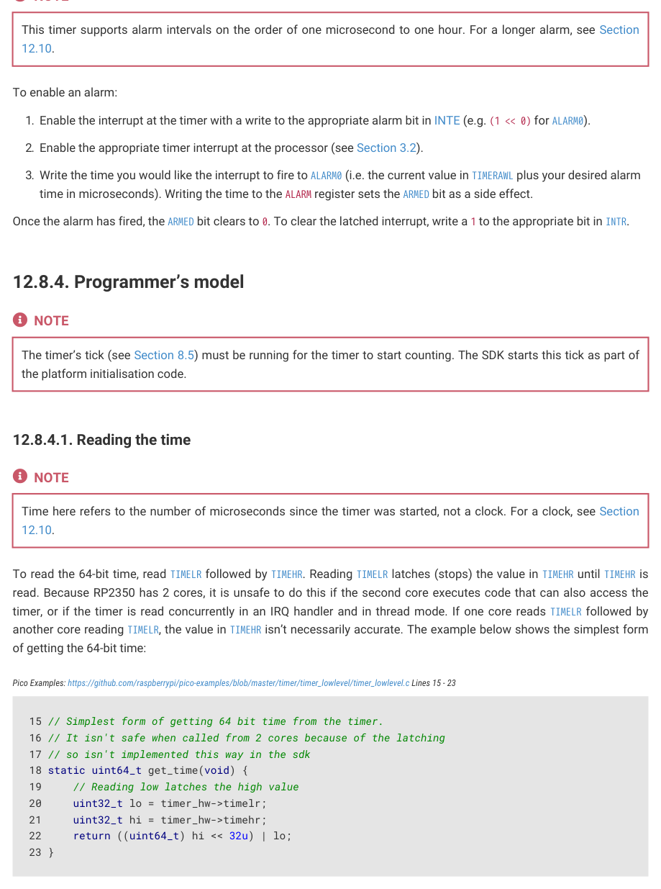
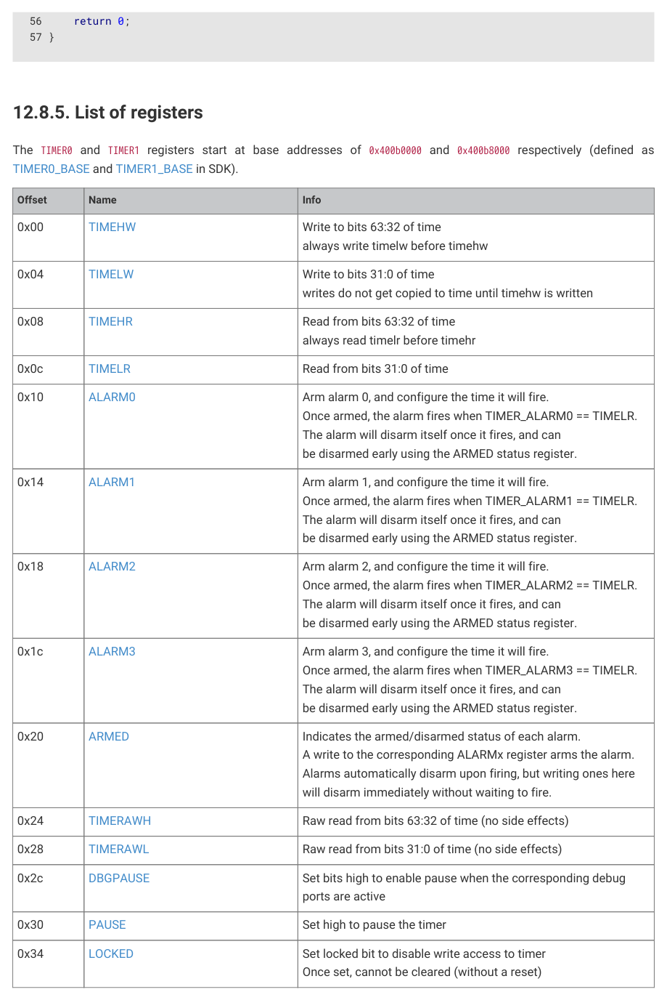

# 12.8.4. Programmer’s model

The timer’s tick (see Section 8.5) must be running for the timer to start counting. The SDK starts this tick as part of

the platform initialisation code.

Time here refers to the number of microseconds since the timer was started, not a clock. For a clock, see Section

To read the 64-bit time, read TIMELR followed by TIMEHR. Reading TIMELR latches (stops) the value in TIMEHR until TIMEHR is

read. Because RP2350 has 2 cores, it is unsafe to do this if the second core executes code that can also access the

timer, or if the timer is read concurrently in an IRQ handler and in thread mode. If one core reads TIMELR followed by

another core reading TIMELR, the value in TIMEHR isn’t necessarily accurate. The example below shows the simplest form

Pico Examples: https://github.com/raspberrypi/pico-examples/blob/master/timer/timer_lowlevel/timer_lowlevel.c Lines 15 - 23

15 // Simplest form of getting 64 bit time from the timer.

16 // It isn't safe when called from 2 cores because of the latching

17 // so isn't implemented this way in the sdk

18 static uint64_t get_time(void) {

19     // Reading low latches the high value

20     uint32_t lo = timer_hw->timelr;

21     uint32_t hi = timer_hw->timehr;

22     return ((uint64_t) hi << 32u) | lo;

The SDK provides a time_us_64 function that uses a more thorough method to get the 64-bit time, which makes use of

the TIMERAWH and TIMERAWL registers. The RAW registers don’t latch, making time_us_64 safe to call from multiple cores at

once.

12.8. System timers
1184

RP2350 Datasheet

SDK: https://github.com/raspberrypi/pico-sdk/blob/master/src/rp2_common/hardware_timer/timer.c Lines 57 - 73

57 uint64_t timer_time_us_64(timer_hw_t *timer) {

58     // Need to make sure that the upper 32 bits of the timer

59     // don't change, so read that first

60     uint32_t hi = timer->timerawh;

61     uint32_t lo;

62     do {

63         // Read the lower 32 bits

64         lo = timer->timerawl;

65         // Now read the upper 32 bits again and

66         // check that it hasn't incremented. If it has loop around

67         // and read the lower 32 bits again to get an accurate value

68         uint32_t next_hi = timer->timerawh;

69         if (hi == next_hi) break;

70         hi = next_hi;

71     } while (true);

72     return ((uint64_t) hi << 32u) | lo;

73 }

12.8.4.2. Set an alarm

The standalone timer example, timer_lowlevel, demonstrates how to set an alarm at a hardware level without the

additional abstraction over the timer provided by SDK. To use these abstractions, see Section 12.8.4.4.

Pico Examples: https://github.com/raspberrypi/pico-examples/blob/master/timer/timer_lowlevel/timer_lowlevel.c Lines 27 - 74

27 // Use alarm 0

28 #define ALARM_NUM 0

29 #define ALARM_IRQ timer_hardware_alarm_get_irq_num(timer_hw, ALARM_NUM)

30 

31 // Alarm interrupt handler

32 static volatile bool alarm_fired;

33 

34 static void alarm_irq(void) {

35     // Clear the alarm irq

36     hw_clear_bits(&timer_hw->intr, 1u << ALARM_NUM);

37 

38     // Assume alarm 0 has fired

39     printf("Alarm IRQ fired\n");

40     alarm_fired = true;

41 }

42 

43 static void alarm_in_us(uint32_t delay_us) {

44     // Enable the interrupt for our alarm (the timer outputs 4 alarm irqs)

45     hw_set_bits(&timer_hw->inte, 1u << ALARM_NUM);

46     // Set irq handler for alarm irq

47     irq_set_exclusive_handler(ALARM_IRQ, alarm_irq);

48     // Enable the alarm irq

49     irq_set_enabled(ALARM_IRQ, true);

50     // Enable interrupt in block and at processor

51 

52     // Alarm is only 32 bits so if trying to delay more

53     // than that need to be careful and keep track of the upper

54     // bits

55     uint64_t target = timer_hw->timerawl + delay_us;

56 

57     // Write the lower 32 bits of the target time to the alarm which

58     // will arm it

59     timer_hw->alarm[ALARM_NUM] = (uint32_t) target;

12.8. System timers
1185

RP2350 Datasheet

60 }

61 

62 int main() {

63     stdio_init_all();

64     printf("Timer lowlevel!\n");

65 

66     // Set alarm every 2 seconds

67     while (1) {

68         alarm_fired = false;

69         alarm_in_us(1000000 * 2);

70         // Wait for alarm to fire

71         while (!alarm_fired);

72     }

73 }

12.8.4.3. Busy wait

If you don’t want to use an alarm to wait for a period of time, use a while loop instead. The SDK provides various

busy_wait_ functions to do this:

SDK: https://github.com/raspberrypi/pico-sdk/blob/master/src/rp2_common/hardware_timer/timer.c Lines 77 - 122

 77 void timer_busy_wait_us_32(timer_hw_t *timer, uint32_t delay_us) {

 78     if (0 <= (int32_t)delay_us) {

 79         // we only allow 31 bits, otherwise we could have a race in the loop below with

 80         // values very close to 2^32

 81         uint32_t start = timer->timerawl;

 82         while (timer->timerawl - start < delay_us) {

 83             tight_loop_contents();

 84         }

 85     } else {

 86         busy_wait_us(delay_us);

 87     }

 88 }

 89 

 90 void timer_busy_wait_us(timer_hw_t *timer, uint64_t delay_us) {

 91     uint64_t base = timer_time_us_64(timer);

 92     uint64_t target = base + delay_us;

 93     if (target < base) {

 94         target = (uint64_t)-1;

 95     }

 96     absolute_time_t t;

 97     update_us_since_boot(&t, target);

 98     timer_busy_wait_until(timer, t);

 99 }

100 

101 void timer_busy_wait_ms(timer_hw_t *timer, uint32_t delay_ms)

102 {

103     if (delay_ms <= 0x7fffffffu / 1000) {

104         timer_busy_wait_us_32(timer, delay_ms * 1000);

105     } else {

106         timer_busy_wait_us(timer, delay_ms * 1000ull);

107     }

108 }

109 

110 void timer_busy_wait_until(timer_hw_t *timer, absolute_time_t t) {

111     uint64_t target = to_us_since_boot(t);

112     uint32_t hi_target = (uint32_t)(target >> 32u);

113     uint32_t hi = timer->timerawh;

114     while (hi < hi_target) {

12.8. System timers
1186

RP2350 Datasheet

115         hi = timer->timerawh;

116         tight_loop_contents();

117     }

118     while (hi == hi_target && timer->timerawl < (uint32_t) target) {

119         hi = timer->timerawh;

120         tight_loop_contents();

121     }

122 }

12.8.4.4. Complete example using SDK

Pico Examples: https://github.com/raspberrypi/pico-examples/blob/master/timer/hello_timer/hello_timer.c Lines 11 - 57

11 volatile bool timer_fired = false;

12 

13 int64_t alarm_callback(alarm_id_t id, __unused void *user_data) {

14     printf("Timer %d fired!\n", (int) id);

15     timer_fired = true;

16     // Can return a value here in us to fire in the future

17     return 0;

18 }

19 

20 bool repeating_timer_callback(__unused struct repeating_timer *t) {

21     printf("Repeat at %lld\n", time_us_64());

22     return true;

23 }

24 

25 int main() {

26     stdio_init_all();

27     printf("Hello Timer!\n");

28 

29     // Call alarm_callback in 2 seconds

30     add_alarm_in_ms(2000, alarm_callback, NULL, false);

31 

32     // Wait for alarm callback to set timer_fired

33     while (!timer_fired) {

34         tight_loop_contents();

35     }

36 

37     // Create a repeating timer that calls repeating_timer_callback.

38     // If the delay is > 0 then this is the delay between the previous callback ending and the

   next starting.

39     // If the delay is negative (see below) then the next call to the callback will be exactly

   500ms after the

40     // start of the call to the last callback

41     struct repeating_timer timer;

42     add_repeating_timer_ms(500, repeating_timer_callback, NULL, &timer);

43     sleep_ms(3000);

44     bool cancelled = cancel_repeating_timer(&timer);

45     printf("cancelled... %d\n", cancelled);

46     sleep_ms(2000);

47 

48     // Negative delay so means we will call repeating_timer_callback, and call it again

49     // 500ms later regardless of how long the callback took to execute

50     add_repeating_timer_ms(-500, repeating_timer_callback, NULL, &timer);

51     sleep_ms(3000);

52     cancelled = cancel_repeating_timer(&timer);

53     printf("cancelled... %d\n", cancelled);

54     sleep_ms(2000);

55     printf("Done\n");

12.8. System timers
1187

RP2350 Datasheet

