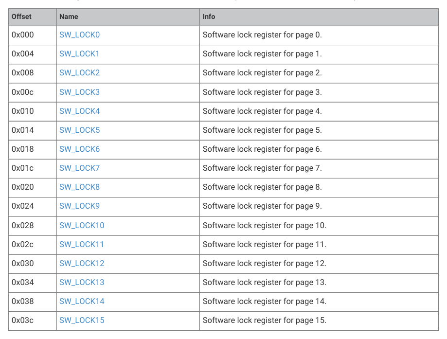

# 13.8.1. Best Practices

13.8.1. Best Practices

The following best practices minimise your susceptibility to imaging of OTP contents:

13.7. Device decommissioning (RMA)
1279

RP2350 Datasheet

• Provision unique keys per device, rather than sharing secrets across a fleet of devices.
• Use chaff as described in the next section to make imaging more difficult.

