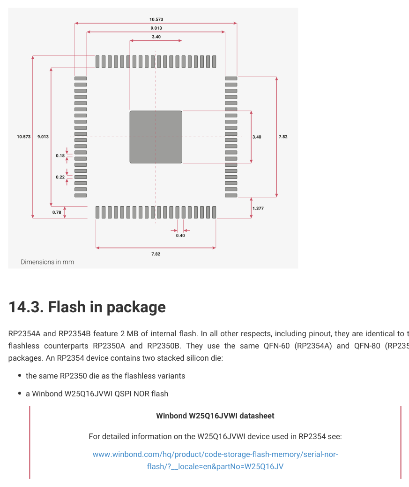

# 14.3. Flash in package

RP2354A and RP2354B feature 2 MB of internal flash. In all other respects, including pinout, they are identical to their

flashless counterparts RP2350A and RP2350B. They use the same QFN-60 (RP2354A) and QFN-80 (RP2354B)

packages. An RP2354 device contains two stacked silicon die:

• the same RP2350 die as the flashless variants
• a Winbond W25Q16JVWI QSPI NOR flash

For detailed information on the W25Q16JVWI device used in RP2354 see:

www.winbond.com/hq/product/code-storage-flash-memory/serial-nor-

flash/?__locale=en&partNo=W25Q16JV

The six dedicated QSPI pads on the RP2350 die (CSn, SCK and SD0 through SD3) connect to both the internal flash die and

the external package pins. This makes them behave similarly to flashless RP2350 devices in the following ways:

• The QSPI CSn can be driven low at reset or power-up to select BOOTSEL mode

◦This harmlessly selects the internal flash die but does not issue commands to it
• The QSPI SD1 pin can be driven high when selecting BOOTSEL to choose UART boot

◦UART TX appears on SD2 and UART RX on SD3, as per Section 5.8

◦Even with the chip select asserted low, the internal flash die maintains a high-impedance state on its SD0

through SD3 pins if there are no transitions on SCK, so you can keep CSn asserted throughout UART boot
• Internal flash can be programmed via UF2 drag-and-drop download using the USB BOOTSEL mode
• A second QSPI device can be attached externally by connecting it to the QSPI pins and a secondary chip select

from the Bank 0 GPIOs

◦This may be used for additional flash capacity, or external QSPI RAM

14.3. Flash in package
1330

RP2350 Datasheet

◦See Section 12.14 for more details of the RP2350 QSPI memory interface and its capabilities

The internal flash die can also be programmed externally by holding the RP2350 die in reset via the RUN pin (active-low

reset), and driving QSPI signals into the chip from an external programmer.

The internal flash is powered by the QSPI_IOVDD supply input. This voltage must be in the range 2.7 to 3.6 V. You

should account for the increased high-frequency currents on this supply pin in your decoupling circuit and PCB layout.

The maximum QSPI clock frequency of the W25Q16JVWI is 133 MHz. Consult the W25Q16JVWI datasheet for detailed

timings and AC parameters.

If you do not require access to the RP2350 QSPI bus from the outside, you should minimise the track length connected

to the QSPI package pins on your PCB. This avoids unnecessary emissions and capacitive loading of the QSPI bus.

The PADRESETB reset input on the W25Q16JVWI is not connected to any external package pins, or to any internal

signals on the RP2350 die. This means there is no way to perform a hardware reset of the flash die. When the RP2350

die comes out of reset it initialises the flash die in the same way it would an external flash device by issuing a fixed XIP

exit sequence that returns the flash die to a serial command state in preparation for execute-in-place setup.
