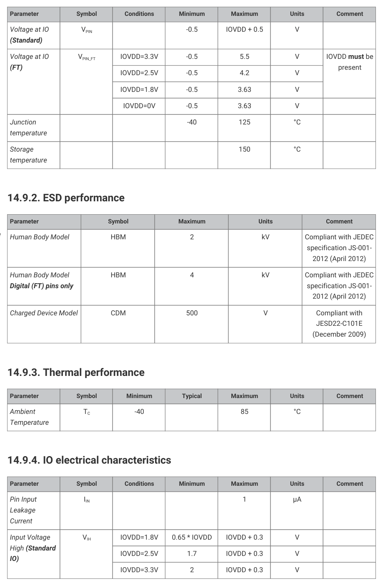
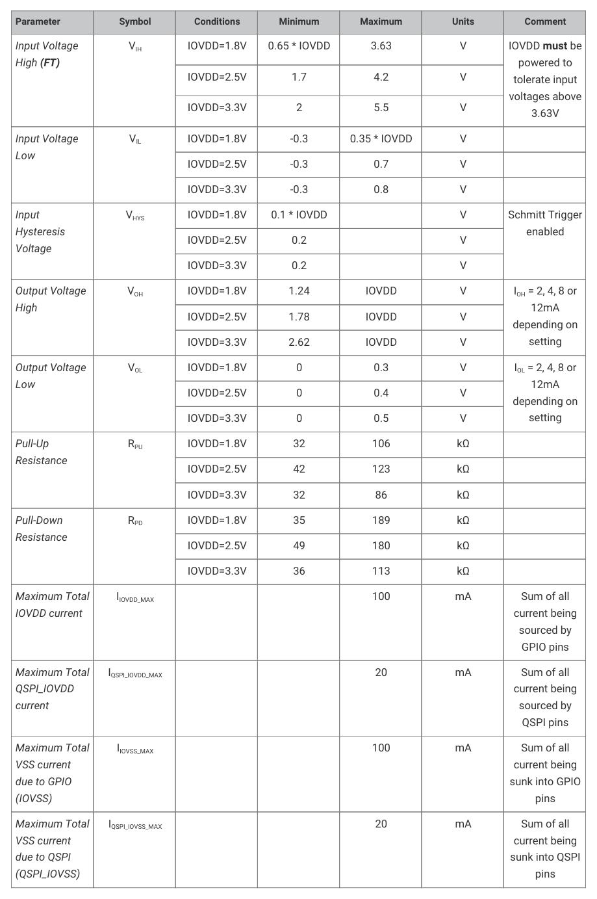
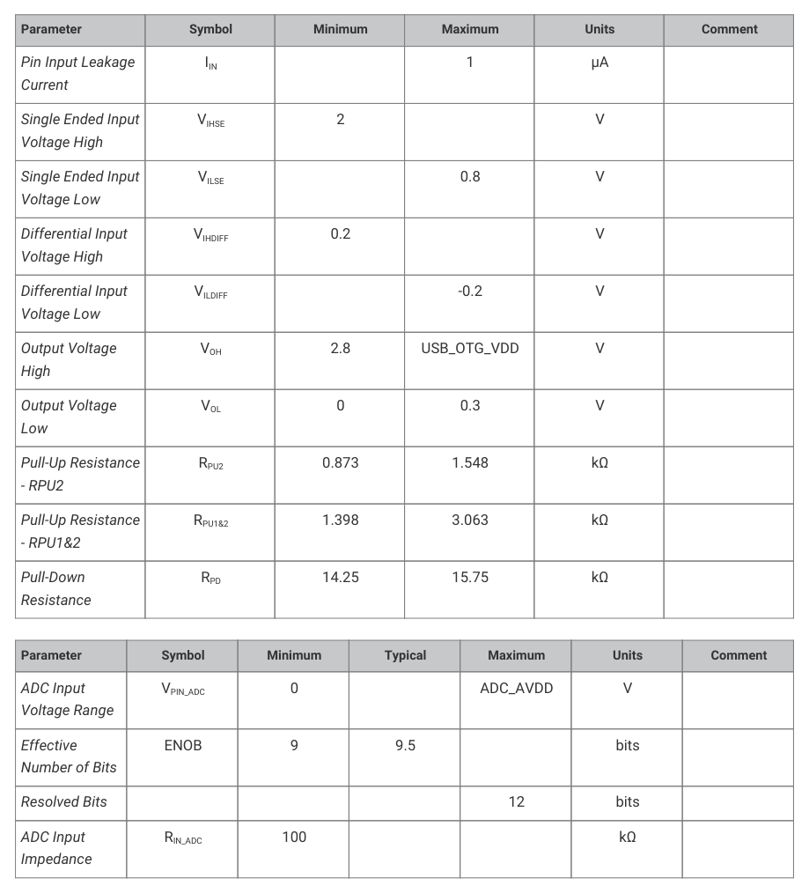
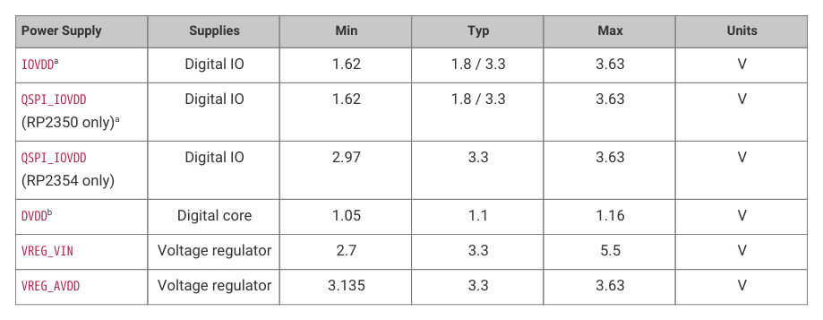

# 14.9.4. IO electrical characteristics

14.9.4. IO electrical characteristics

Table 1436. Digital IO

Parameter
Symbol
Conditions
Minimum
Maximum
Units
Comment

characteristics -

Standard and FT

IIN
1
μA

unless otherwise

stated. In this table

IOVDD also refers to

QSPI_IOVDD where

VIH
IOVDD=1.8V
0.65 * IOVDD
IOVDD + 0.3
V

appropriate

IOVDD=2.5V
1.7
IOVDD + 0.3
V

IOVDD=3.3V
2
IOVDD + 0.3
V

14.9. Electrical specifications
1339

RP2350 Datasheet

Parameter
Symbol
Conditions
Minimum
Maximum
Units
Comment

VIH
IOVDD=1.8V
0.65 * IOVDD
3.63
V
IOVDD must be

IOVDD=2.5V
1.7
4.2
V

IOVDD=3.3V
2
5.5
V

VIL
IOVDD=1.8V
-0.3
0.35 * IOVDD
V

IOVDD=2.5V
-0.3
0.7
V

IOVDD=3.3V
-0.3
0.8
V

VHYS
IOVDD=1.8V
0.1 * IOVDD
V
Schmitt Trigger

enabled
IOVDD=2.5V
0.2
V

VOH
IOVDD=1.8V
1.24
IOVDD
V
IOH = 2, 4, 8 or

IOVDD=2.5V
1.78
IOVDD
V

IOVDD=3.3V
2.62
IOVDD
V

VOL
IOVDD=1.8V
0
0.3
V
IOL = 2, 4, 8 or

IOVDD=2.5V
0
0.4
V

IOVDD=3.3V
0
0.5
V

RPU
IOVDD=1.8V
32
106
kΩ

IOVDD=2.5V
42
123
kΩ

IOVDD=3.3V
32
86
kΩ

RPD
IOVDD=1.8V
35
189
kΩ

IOVDD=2.5V
49
180
kΩ

IOVDD=3.3V
36
113
kΩ

IIOVDD_MAX
100
mA
Sum of all

IQSPI_IOVDD_MAX
20
mA
Sum of all

IIOVSS_MAX
100
mA
Sum of all

IQSPI_IOVSS_MAX
20
mA
Sum of all

Table 1437. USB IO

characteristics

14.9. Electrical specifications
1340

RP2350 Datasheet

Parameter
Symbol
Minimum
Maximum
Units
Comment

VOH
2.8
USB_OTG_VDD
V

VOL
0
0.3
V

RPU2
0.873
1.548
kΩ

RPU1&2
1.398
3.063
kΩ

RPD
14.25
15.75
kΩ

Table 1438. ADC

characteristics
Parameter
Symbol
Minimum
Typical
Maximum
Units
Comment

VPIN_ADC
0
ADC_AVDD
V

ENOB
9
9.5
bits

Resolved Bits
12
bits

RIN_ADC
100
kΩ

| Parameter | Symbol | Minimum | Typical | Maximum | Units | Comment |
| --- | --- | --- | --- | --- | --- | --- |
| Input Frequency | f osc | 1 | 12 | 50 | MHz | See Section 8.6.3 for restrictions imposed by PLLs. See Section 5.2.8.1 for restrictions imposed by the USB and UART bootloaders. |
| Input Voltage High | V IH | 0.65*IOVDD |  | IOVDD + 0.3 | V | Square Wave input. XIN only. XOUT floating |
| Input Voltage Low | V IL | 0 |  | 0.35*IOVDD | V | Square Wave input. XIN only. XOUT floating |

Table 1439. Oscillator

14.9. Electrical specifications
1341

RP2350 Datasheet

NOTE

By default, USB Bootmode relies on a 12MHz input being present. However OTP can be configured to override the

XOSC and PLL settings during USB Bootmode. See Section 13.10 for details.

See Section 8.2 for more details on the Oscillator, and the Minimal Design Example in Hardware design with RP2350 for

information on crystal usage.

| Parameter | Symbol | Minimum | Typical | Maximum | Units | Comment |
| --- | --- | --- | --- | --- | --- | --- |
| SWCLK Input Frequency | f SWCLK | 0 | 10 | 50 | MHz | See Table 1430 for SWCLK pin definitions. |

Table 1440. SWCLK

Host-to-target data on the SWDIO pin should be transmitted centre-aligned with SWCLK. Target-to-host data on the SWDIO pin

transitions on rising edges of SWCLK.

NOTE

RP2350 internal SWD logic in the SW-DP operates reliably up to 50 MHz. However, signal integrity of the external

SWD signals may be a challenge.

If you observe unreliable SWD operation such as write data parity errors from the SW-DP, reduce the SWCLK frequency.

Always connect ground directly between the SWD probe and RP2350 in addition to SWDIO and SWCLK. Minimise the wire

length between the probe and RP2350, and avoid multi-drop wiring at higher frequencies.

14.9.4.1. Interpreting GPIO output voltage specifications

The GPIOs on RP2350 have four different output drive strengths, nominally called 2, 4, 8 and 12mA modes. These are

not hard limits, nor do they mean that they will always source (or sink) the selected amount of milliamps.

The amount of current a GPIO sources or sinks is dependent on the load attached. It will attempt to drive the output to

the IOVDD level (or 0V in the case of a logic 0), but the amount of current it is able to source is limited and dependent on

the selected drive strength.

Therefore the higher the current load is, the lower the voltage will be at the pin. At some point, the GPIO will source so

much current and the voltage will drop so low that it won’t be recognised as a logic 1 by the input of a connected device.

The output specifications in Table 1436 quantify how much lower the voltage can be expected to be when drawing

specified amounts of current from the pin.

The Output High Voltage (VOH) is defined as the lowest voltage the output pin can be when driven to a logic 1 with a

particular selected drive strength; e.g., 4mA sourced by the pin whilst in 4mA drive strength mode. The Output Low

Voltage is similar, but with a logic 0 being driven.

In addition to this, the sum of all the IO currents being sourced (i.e. when outputs are being driven high) from the IOVDD

bank (essentially the GPIO and QSPI pins), must not exceed IIOVDD_MAX. Similarly, the sum of all the IO currents being sunk

(i.e. when the outputs are being driven low) must not exceed IIOVSS_MAX.

14.9. Electrical specifications
1342

RP2350 Datasheet

Figure 150. Typical

Current vs Voltage

curves of a GPIO

output.

Figure 150 shows the effect on the output voltage as the current load on the pin increases. You can clearly see the

effect of the different drive strengths; the higher the drive strength, the closer the output voltage is to IOVDD (or 0V) for

a given current. The minimum VOH and maximum VOL limits are shown in red.

You can see that at the specified current for each drive strength, the voltage is well within the allowed limits, meaning

that this particular device could drive a lot more current and still be within VOH/VOL specification. This is a typical part at

room temperature, but because devices vary, there will be a spread of other devices which will have voltages much

closer to this limit.

If your application doesn’t need such tightly controlled voltages, you can source or sink more current from the GPIO

than the selected drive strength setting. However, experimentation is required to determine if it indeed safe to do so in

your application.

## Embedded Images

