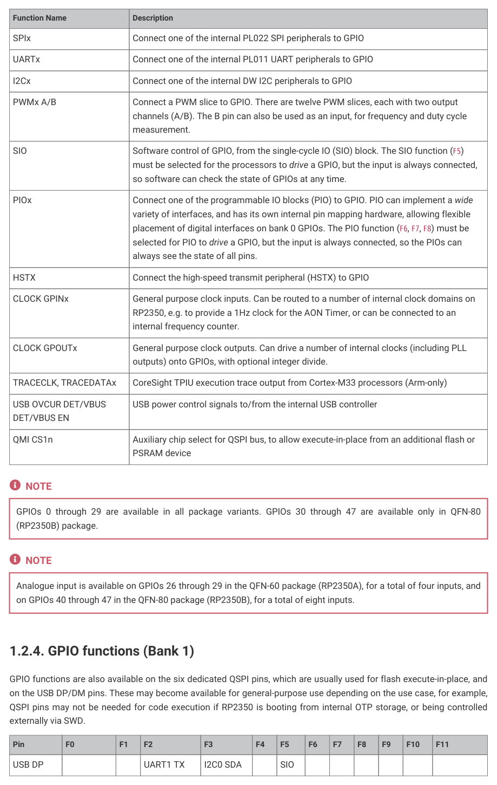
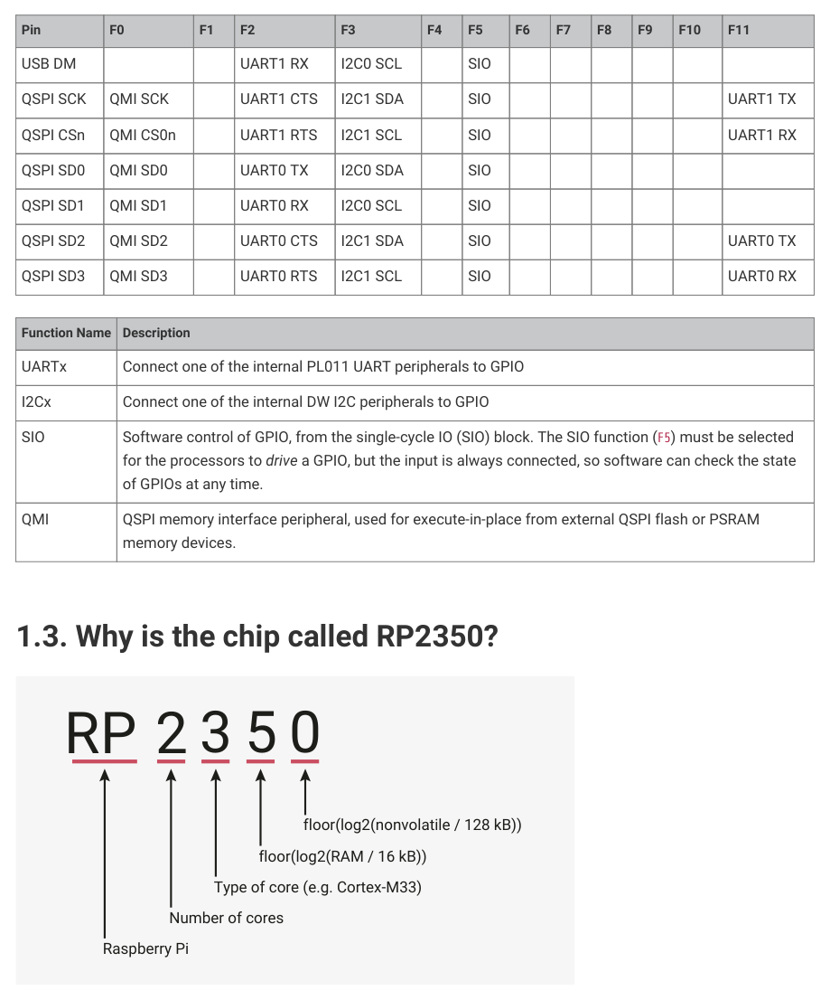

# 1.2.4. GPIO functions (Bank 1)

1.2.4. GPIO functions (Bank 1)

GPIO functions are also available on the six dedicated QSPI pins, which are usually used for flash execute-in-place, and

on the USB DP/DM pins. These may become available for general-purpose use depending on the use case, for example,

QSPI pins may not be needed for code execution if RP2350 is booting from internal OTP storage, or being controlled

Table 5. GPIO Bank 1

Functions
Pin
F0
F1
F2
F3
F4
F5
F6
F7
F8
F9
F10
F11

USB DP
UART1 TX
I2C0 SDA
SIO

1.2. Pinout reference
21

RP2350 Datasheet

Pin
F0
F1
F2
F3
F4
F5
F6
F7
F8
F9
F10
F11

USB DM
UART1 RX
I2C0 SCL
SIO

QSPI SCK
QMI SCK
UART1 CTS
I2C1 SDA
SIO
UART1 TX

QSPI CSn
QMI CS0n
UART1 RTS
I2C1 SCL
SIO
UART1 RX

QSPI SD0
QMI SD0
UART0 TX
I2C0 SDA
SIO

QSPI SD1
QMI SD1
UART0 RX
I2C0 SCL
SIO

QSPI SD2
QMI SD2
UART0 CTS
I2C1 SDA
SIO
UART0 TX

QSPI SD3
QMI SD3
UART0 RTS
I2C1 SCL
SIO
UART0 RX

| Function Name | Description |
| --- | --- |
| UARTx | Connect one of the internal PL011 UART peripherals to GPIO |
| I2Cx | Connect one of the internal DW I2C peripherals to GPIO |
| SIO | Software control of GPIO, from the single-cycle IO (SIO) block. The SIO function (F5) must be selected for the processors to drive a GPIO, but the input is always connected, so software can check the state of GPIOs at any time. |
| QMI | QSPI memory interface peripheral, used for execute-in-place from external QSPI flash or PSRAM memory devices. |

Table 6. GPIO bank 1

## Embedded Images

