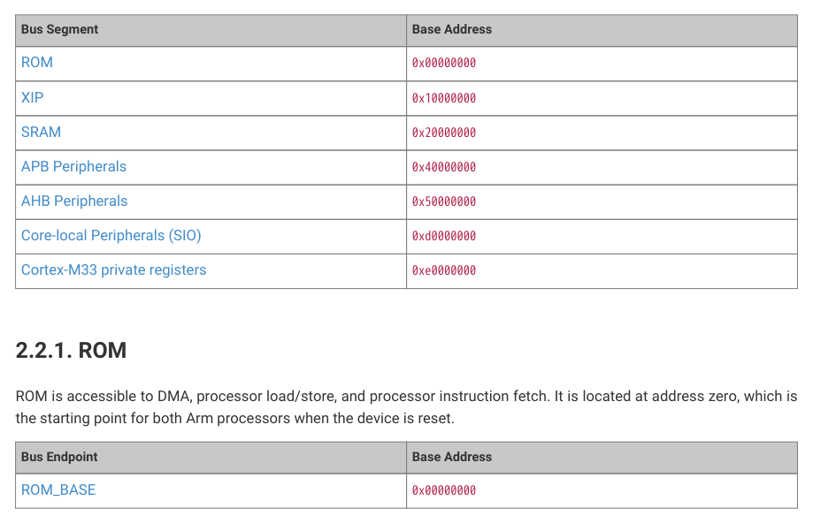

# 2.2.1. ROM

2.2.1. ROM

ROM is accessible to DMA, processor load/store, and processor instruction fetch. It is located at address zero, which is

the starting point for both Arm processors when the device is reset.

| Bus Endpoint | Base Address |
| --- | --- |
| ROM_BASE | 0x00000000 |

Table 9. Address map
