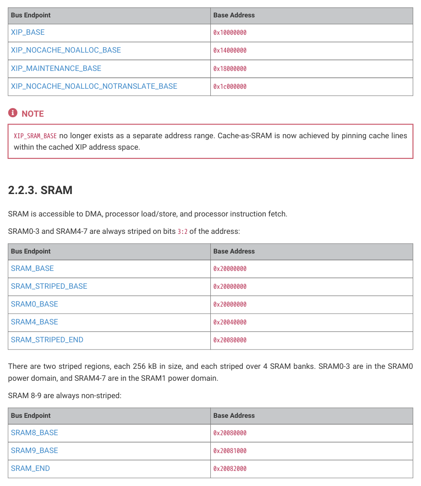
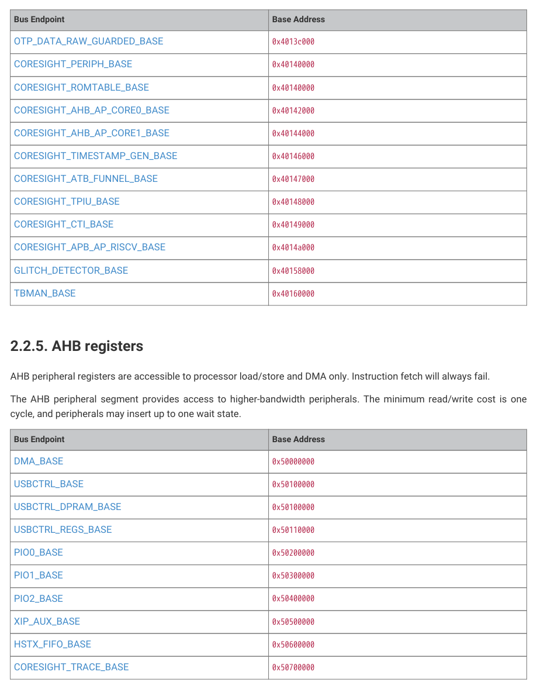

# 2.2.4. APB registers

2.2.4. APB registers

APB peripheral registers are accessible to processor load/store and DMA only. Instruction fetch will always fail.

The APB peripheral segment provides access to control and configuration registers, as well as data access for lower-

bandwidth peripherals. APB writes cost a minimum of four cycles, and APB reads a minimum of three.

| Bus Endpoint | Base Address |
| --- | --- |
| SYSINFO_BASE | 0x40000000 |
| SYSCFG_BASE | 0x40008000 |
| CLOCKS_BASE | 0x40010000 |
| PSM_BASE | 0x40018000 |
| RESETS_BASE | 0x40020000 |
| IO_BANK0_BASE | 0x40028000 |
| IO_QSPI_BASE | 0x40030000 |
| PADS_BANK0_BASE | 0x40038000 |
| PADS_QSPI_BASE | 0x40040000 |
| XOSC_BASE | 0x40048000 |
| PLL_SYS_BASE | 0x40050000 |
| PLL_USB_BASE | 0x40058000 |
| ACCESSCTRL_BASE | 0x40060000 |
| BUSCTRL_BASE | 0x40068000 |
| UART0_BASE | 0x40070000 |
| UART1_BASE | 0x40078000 |
| SPI0_BASE | 0x40080000 |
| SPI1_BASE | 0x40088000 |
| I2C0_BASE | 0x40090000 |
| I2C1_BASE | 0x40098000 |
| ADC_BASE | 0x400a0000 |
| PWM_BASE | 0x400a8000 |
| TIMER0_BASE | 0x400b0000 |
| TIMER1_BASE | 0x400b8000 |
| HSTX_CTRL_BASE | 0x400c0000 |
| XIP_CTRL_BASE | 0x400c8000 |
| XIP_QMI_BASE | 0x400d0000 |
| WATCHDOG_BASE | 0x400d8000 |
| BOOTRAM_BASE | 0x400e0000 |
| ROSC_BASE | 0x400e8000 |
| TRNG_BASE | 0x400f0000 |
| SHA256_BASE | 0x400f8000 |
| POWMAN_BASE | 0x40100000 |
| TICKS_BASE | 0x40108000 |
| OTP_BASE | 0x40120000 |
| OTP_DATA_BASE | 0x40130000 |
| OTP_DATA_RAW_BASE | 0x40134000 |
| OTP_DATA_GUARDED_BASE | 0x40138000 |
| OTP_DATA_RAW_GUARDED_BASE | 0x4013c000 |
| CORESIGHT_PERIPH_BASE | 0x40140000 |
| CORESIGHT_ROMTABLE_BASE | 0x40140000 |
| CORESIGHT_AHB_AP_CORE0_BASE | 0x40142000 |
| CORESIGHT_AHB_AP_CORE1_BASE | 0x40144000 |
| CORESIGHT_TIMESTAMP_GEN_BASE | 0x40146000 |
| CORESIGHT_ATB_FUNNEL_BASE | 0x40147000 |
| CORESIGHT_TPIU_BASE | 0x40148000 |
| CORESIGHT_CTI_BASE | 0x40149000 |
| CORESIGHT_APB_AP_RISCV_BASE | 0x4014a000 |
| GLITCH_DETECTOR_BASE | 0x40158000 |
| TBMAN_BASE | 0x40160000 |

Table 13. Address

map for APB bus

segment

2.2. Address map
31

RP2350 Datasheet

2.2. Address map
32

RP2350 Datasheet

