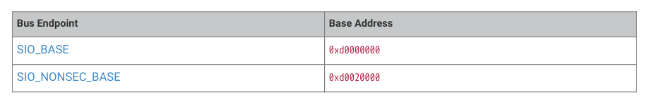

# 2.2.6. Core-local peripherals (SIO)

2.2.6. Core-local peripherals (SIO)

SIO is accessible to processor load/store only. It contains registers which need single-cycle access from both cores

concurrently, such as the GPIO registers. Access is always zero-wait-state.

2.2. Address map
33

RP2350 Datasheet

| Bus Endpoint | Base Address |
| --- | --- |
| SIO_BASE | 0xd0000000 |
| SIO_NONSEC_BASE | 0xd0020000 |

Table 15. Address

map for SIO bus

segment

