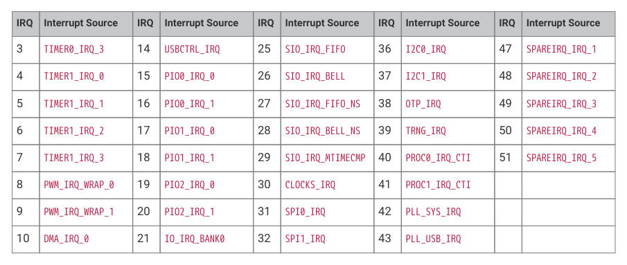

# 3.2.1. Non-maskable interrupt (NMI)

3.2.1. Non-maskable interrupt (NMI)

The system IRQ signals can be routed to the Cortex-M33 non-maskable interrupt (NMI) input, by setting the bit for that

IRQ number in NMI_MASK0 or NMI_MASK1. The non-maskable interrupt ignores the processor’s interrupt

enable/disable state (PRIMASK), and can pre-empt any other active interrupt. NMIs are generally used for emergent

circumstances that require the processor’s unconditional attention, such as loss of PLL lock or power supply integrity.

The NMI mask registers are core-local, so each core can have a different combination of interrupts routed to its NMI

input. The NMI mask, along with all other EPPB registers, is reset by a warm reset of that core. This avoids an issue on

RP2040 where the NMI mask could be left set following a processor reset.

In addition to system-level interrupts, the non-maskable interrupt is asserted when an integrity check is failed in the

redundancy coprocessor (RCP, Section 3.6.3). This behaviour cannot be disabled, but a correctly-programmed RCP

does not trigger under normal voltage, frequency, and temperature conditions. Likewise, if user code does not execute

any RCP instructions, the RCP will never trigger. The RCP NMI output is asserted on both cores when an integrity check

fails, and is de-asserted by a warm processor reset.
