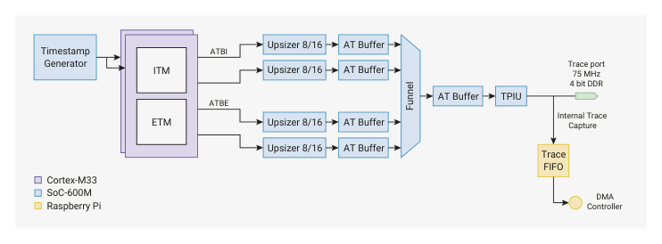

# 3.5.7. Trace

3.5.7. Trace

3.5.7.1. Overview

The ATB trace subsystem is based on the Coresight SoC-600M architecture, as shown in Figure 11.

Figure 11. Trace

Subsystem

The trace subsystem captures trace messages from each of the Cortex-M33 ITM/ETM components, merges them into

a single trace bus, and sends off-chip through the 4-bit DDR trace port for subsequent capture and analysis by a trace

port analyser.

This allows the developer to review a detailed log of software executed on the processors. The advantage over

conventional hardware debug is that it does this without halting the processors or affecting their execution timing, so

you can diagnose software issues that are hard to reproduce under a debugger.

The trace subsystem comprises the following main components:

• Timestamp Generator: Timestamps propagate to both Cortex-M33 processors, and are applied to ETM and ITM

output so that the relative timing of their trace streams can be recovered.
• Cortex-M33 ETM: Embedded Trace Macrocell, for real-time instruction flow messages generated from

observations of the Cortex-M33’s execution.
• Cortex-M33 ITM: Instruction Trace Macrocell, for software-generated messages.
• ATB Funnel: Merges the Cortex-M33 trace sources into a single trace stream using the timestamps from the

Timestamp Generator.
• TPIU: Trace Port Interface Unit, outputs trace data over trace port pins. The source-synchronous trace interface is

4-bits DDR, up to 75 MHz clock, giving a maximum trace data rate of up to 600 Mb/s.

3.5. Debug
88

RP2350 Datasheet

• Trace FIFO: Optionally captures the 32-bit TPIU trace stream on-device, from which point the DMA can transfer to

main system SRAM.

See the Arm CoreSight ETM-M33 Technical Reference Manual for information about the Cortex-M33 ETM. See the SoC-

600M Technical Reference Manual for information about the other trace components in Figure 11

The trace output clock is fixed at one half of clk_sys. At the maximum system frequency of 150 MHz this yields a

75 MHz TPIU output clock. The trace throughput is reduced at lower system clock frequencies, though this is rarely an

issue in practice as the processor instruction throughput (and therefore the demand for trace output bandwidth) scales

accordingly.

3.5.7.2. Trace FIFO

Trace output goes to one of two data sinks:

• The four-bit TPIU interface streams data out of the chip through GPIOs, for capture by an external probe
• The trace FIFO streams data into SRAM via the system DMA

The bandwidth of the DMA is greater than the bandwidth of the TPIU interface. Capturing into an on-chip buffer also

allows trace to operate through a comparatively low-speed SWD probe without restricting trace bandwidth.

The operation is similar to a micro-trace buffer (MTB). However, all of system SRAM is available for trace. You can also

use other DMA endpoints like the PIO and HSTX to implement your own trace data sinks, for example if you would

prefer a wider and lower-frequency bus than the TPIU provides.

You must enable DMA access to the trace FIFO registers by setting the DMA bit in the ACCESSCTRL CORESIGHT_TRACE

register before attempting to DMA from this FIFO. Configure the DMA for DREQ 53 to select the trace FIFO.

3.5.7.3. List of trace FIFO registers

The trace FIFO registers start at a base address of 0x50700000 (defined as CORESIGHT_TRACE_BASE in the SDK).

| Offset | Name | Info |
| --- | --- | --- |
| 0x0 | CTRL_STATUS | Control and status register |
| 0x4 | TRACE_CAPTURE_FIFO | FIFO for trace data captured from the TPIU |

Table 96. List of

CORESIGHT_TRACE

registers

CORESIGHT_TRACE: CTRL_STATUS Register

Offset: 0x0

Description

Control and status register

| Bits | Description | Type | Reset |
| --- | --- | --- | --- |
| 31:2 | Reserved. | - | - |
| 1 | TRACE_CAPTURE_FIFO_OVERFLOW: This status flag is set high when trace data has been dropped due to the FIFO being full at the point trace data was sampled. Write 1 to acknowledge and clear the bit. | RW | 0x0 |
| 0 | TRACE_CAPTURE_FIFO_FLUSH: Set to 1 to continuously hold the trace FIFO in a flushed state and prevent overflow. Before clearing this flag, configure and start a DMA channel with the correct DREQ for the TRACE_CAPTURE_FIFO register. Clear this flag to begin sampling trace data, and set once again once the trace capture buffer is full. You must configure the TPIU in order to generate trace packets to be captured, as well as components like the ETM further upstream to generate the event stream propagated to the TPIU. | RW | 0x1 |

Table 97.

CTRL_STATUS

Register

3.5. Debug
89

RP2350 Datasheet

CORESIGHT_TRACE: TRACE_CAPTURE_FIFO Register

Offset: 0x4

Description

FIFO for trace data captured from the TPIU

| Bits | Description | Type | Reset |
| --- | --- | --- | --- |
| 31:0 | RDATA: Read from an 8 x 32-bit FIFO containing trace data captured from the TPIU. Hardware pushes to the FIFO on rising edges of clk_sys, when either of the following is true: * TPIU TRACECTL output is low (normal trace data) * TPIU TRACETCL output is high, and TPIU TRACEDATA0 and TRACEDATA1 are both low (trigger packet) These conditions are in accordance with Arm Coresight Architecture Spec v3.0 section D3.3.3: Decoding requirements for Trace Capture Devices The data captured into the FIFO is the full 32-bit TRACEDATA bus output by the TPIU. Note that the TPIU is a DDR output at half of clk_sys, therefore this interface can capture the full 32-bit TPIU DDR output bandwidth as it samples once per active edge of the TPIU output clock. | RF | 0x00000000 |

Table 98.

TRACE_CAPTURE_FIF

O Register
