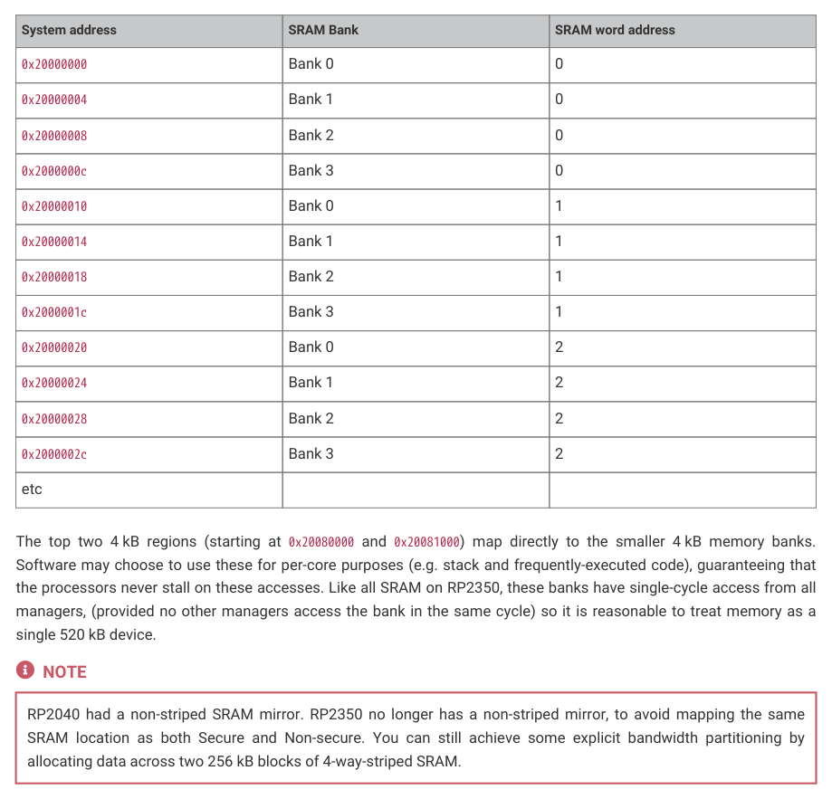
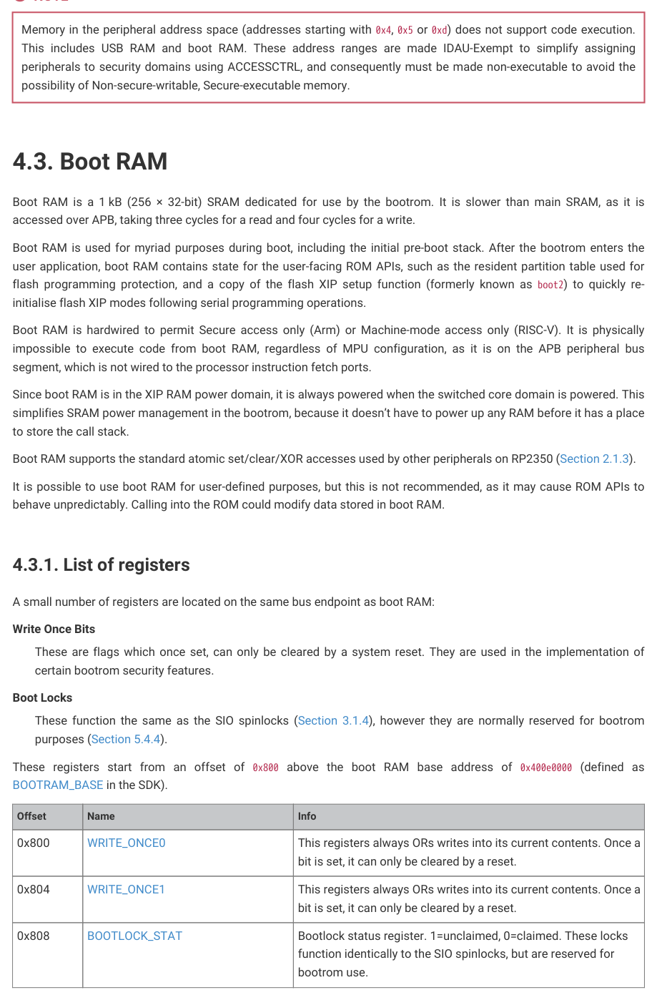

# 4.2.1. Other on-chip memory

4.2.1. Other on-chip memory

Besides the 520 kB main memory, there are two other dedicated RAM blocks that may be used in some circumstances:

• Cache lines can be individually pinned within the XIP address space for use as SRAM, up to the total cache size of

16 kB (see Section 4.4.1.3). Unpinned cache lines remain available for transparent caching of XIP accesses.
• If USB is not used, the USB data DPRAM can be used as a 4 kB memory starting at 0x50100000.

There is also 1 kB of dedicated boot RAM, hardwired to Secure access only, whose contents and layout is defined by the

bootrom — see Chapter 5.

4.2. SRAM
338

RP2350 Datasheet

NOTE

Memory in the peripheral address space (addresses starting with 0x4, 0x5 or 0xd) does not support code execution.

This includes USB RAM and boot RAM. These address ranges are made IDAU-Exempt to simplify assigning

peripherals to security domains using ACCESSCTRL, and consequently must be made non-executable to avoid the

possibility of Non-secure-writable, Secure-executable memory.

Boot RAM is a 1 kB (256 × 32-bit) SRAM dedicated for use by the bootrom. It is slower than main SRAM, as it is

accessed over APB, taking three cycles for a read and four cycles for a write.

Boot RAM is used for myriad purposes during boot, including the initial pre-boot stack. After the bootrom enters the

user application, boot RAM contains state for the user-facing ROM APIs, such as the resident partition table used for

flash programming protection, and a copy of the flash XIP setup function (formerly known as boot2) to quickly re-

initialise flash XIP modes following serial programming operations.

Boot RAM is hardwired to permit Secure access only (Arm) or Machine-mode access only (RISC-V). It is physically

impossible to execute code from boot RAM, regardless of MPU configuration, as it is on the APB peripheral bus

segment, which is not wired to the processor instruction fetch ports.

Since boot RAM is in the XIP RAM power domain, it is always powered when the switched core domain is powered. This

simplifies SRAM power management in the bootrom, because it doesn’t have to power up any RAM before it has a place

Boot RAM supports the standard atomic set/clear/XOR accesses used by other peripherals on RP2350 (Section 2.1.3).

It is possible to use boot RAM for user-defined purposes, but this is not recommended, as it may cause ROM APIs to

behave unpredictably. Calling into the ROM could modify data stored in boot RAM.
