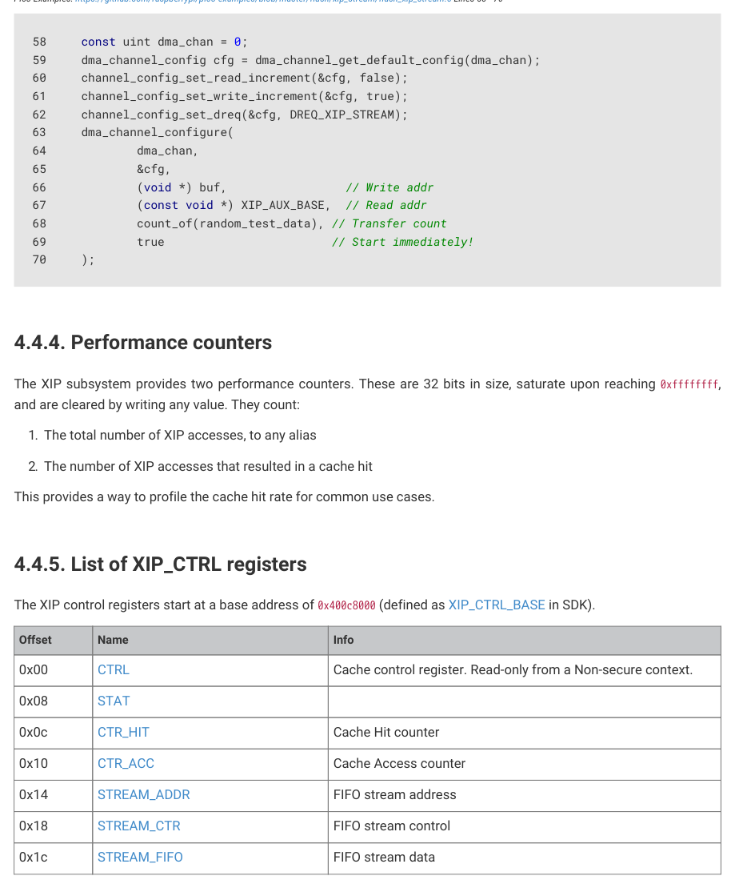

# 4.4.3. Streaming DMA interface

4.4.3. Streaming DMA interface

As the flash is generally much larger than on-chip SRAM, it’s often useful to stream chunks of data into memory from

flash. It’s convenient to have the DMA stream this data in the background while software in the foreground does other

things. It’s even more convenient if code can continue to execute from flash whilst this takes place.

This doesn’t interact well with standard XIP operation because QMI serial transfers force lengthy bus stalls on the DMA.

These stalls are tolerable for a processor because an in-order processor tends to have nothing better to do while

waiting for an instruction fetch to retire, and because typical code execution tends to have much higher cache hit rates

than bulk streaming of infrequently accessed data. In contrast, stalling the DMA prevents any other active DMA

channels from making progress during this time, slowing overall DMA throughput.

The STREAM_ADDR and STREAM_CTR registers are used to program a linear sequence of flash reads. The XIP

subsystem performs these reads in the background in a best-effort fashion. To minimise impact on code executed from

flash whilst the stream is ongoing, the streaming hardware has lower priority access to the QMI than regular XIP

accesses, and there is a brief cooldown (9 cycles) between the last XIP cache miss and resuming streaming. This

avoids increases in initial access latency on XIP cache misses.

Pico Examples: https://github.com/raspberrypi/pico-examples/blob/master/flash/xip_stream/flash_xip_stream.c Lines 45 - 48

45     while (!(xip_ctrl_hw->stat & XIP_STAT_FIFO_EMPTY))

46         (void) xip_ctrl_hw->stream_fifo;

47     xip_ctrl_hw->stream_addr = (uint32_t) &random_test_data[0];

48     xip_ctrl_hw->stream_ctr = count_of(random_test_data);

The streamed data is pushed to a small FIFO, which generates DREQ signals that tell the DMA to collect the streamed

data. As the DMA does not initiate a read until after reading the data from flash, the DMA does not stall when accessing

the data. The DMA can then retrieve this data through the auxiliary AHB port, which provides direct single-cycle access

to the streaming data FIFO.

On RP2350, you can also use the auxiliary AHB port to access the QMI direct-mode FIFOs. This is faster than accessing

4.4. External flash and PSRAM (XIP)
345

RP2350 Datasheet

the FIFOs through the QMI APB configuration port. When QMI access chaining is enabled, the streaming XIP DMA is

close to the maximum theoretical QSPI throughput, but the direct-mode FIFOs are available on AHB for situations that

require 100% of the theoretical throughput.

Pico Examples: https://github.com/raspberrypi/pico-examples/blob/master/flash/xip_stream/flash_xip_stream.c Lines 58 - 70

58     const uint dma_chan = 0;

59     dma_channel_config cfg = dma_channel_get_default_config(dma_chan);

60     channel_config_set_read_increment(&cfg, false);

61     channel_config_set_write_increment(&cfg, true);

62     channel_config_set_dreq(&cfg, DREQ_XIP_STREAM);

66             (void *) buf,                 // Write addr

67             (const void *) XIP_AUX_BASE,  // Read addr

68             count_of(random_test_data), // Transfer count

69             true                        // Start immediately!
