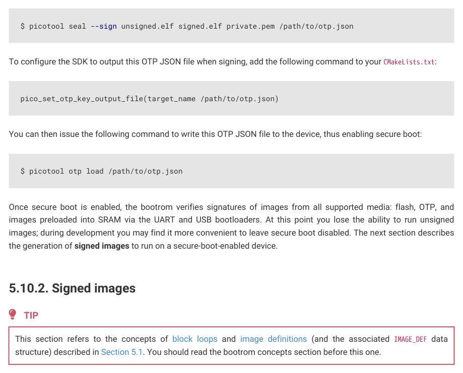

# 5.10.2. Signed images

This section refers to the concepts of block loops and image definitions (and the associated IMAGE_DEF data

structure) described in Section 5.1. You should read the bootrom concepts section before this one.

An example of an image (and its block loop) produced by the SDK is shown below.

5.10. Example boot scenarios
430

RP2350 Datasheet

The first block must be within the first 4 kB of the image, and is an IMAGE_DEF block describing the image. This block is

linking to an empty block at the end of the image, that is included in the block loop to help detect partially written

binaries. If the end of the image is missing or overwritten, then the block loop not be properly closed and will be

considered invalid.

picotool can be used to sign a binary, in which case it modifies the image as follows:

5.10. Example boot scenarios
431

RP2350 Datasheet

Note that the marker block at the end of the image has been replaced with a new IMAGE_DEF block including the first

block’s information along with additional new information. The new information includes the signature (or hash value if

hashing only), along with a LOAD_MAP entry indicating the regions of the image that are signed or hashed.

At runtime, the bootrom will pick the last valid IMAGE_DEF in the block loop as the one to boot.

Signing requires a SHA-256 hash of the data specified in the LOAD_MAP, along with the words of the block specified by the

HASH_VALUE Item (which must include the first word of the SIGNATURE Item). This hash is then signed with an ECDSA

secp256k1 private key, to produce the 64 byte signature stored in the SIGNATURE Item.

For secure boot, it is recommended to use packaged SRAM binaries instead of flash binaries, as the signature check is

only performed during boot, so a malicious actor with physical access could replace the data on the external flash after

the signature check to run unsigned code.

To sign and/or hash a binary in the SDK, you can add the following functions to your CMakeLists.txt file:

pico_sign_binary(target_name /path/to/keyfile.pem)

This will invoke the picotool seal command to sign and/or hash your binary when you call pico_add_extra_outputs. You

can manually invoke picotool seal to sign and/or hash a binary using:

$ picotool seal --sign --hash unsigned.elf signed.elf private.pem

5.10. Example boot scenarios
432
