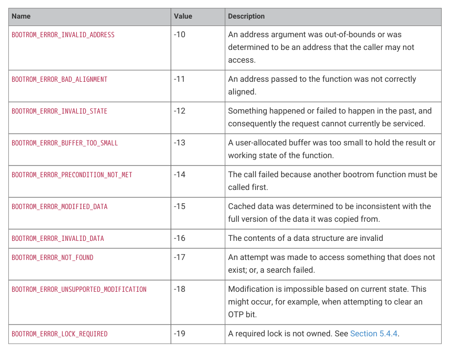

# 5.4.4. API functions and exclusive access

5.4.4. API functions and exclusive access

Various bootrom functions require access to parts of the system which:

• cannot be safely accessed by both cores at once, or
• limit the functionality of other hardware when in use

For example:

• Programming OTP: it is not possible to read from the memory mapped OTP data regions at the same time as

accessing its serial programming interface.
• Use of the SHA-256 block: only one SHA-256 sum can be in progress at a time.
• Using the QSPI direct-mode interface to program the flash causes XIP access to return a bus fault.

It is beyond the purview of the bootrom to implement a locking strategy, as the style and scope of the locking required

is entirely up to how the application itself uses these resources.

Nevertheless, it is important that, say, a Non-secure call to a flash programming API can’t cause a hard fault in other

Secure code running from flash. There must be some way for user software to coordinate with bootrom APIs on such

changes of state. The bootrom implements the mechanism but not the policy for mutual exclusion over bootrom API

calls.

The solution the bootrom provides is to use the boot locks (boot RAM registers BOOTLOCK0 through BOOTLOCK7) to

inform the bootrom which resources are currently owned by the caller and therefore safe for it to use.

To enable lock checking in bootrom APIs, set boot lock 7 (LOCK_ENABLE) to the claimed state. When enabled, bootrom

functions which use certain hardware resources (listed below) will check the status of the boot lock assigned to that

resource, and return BOOTROM_ERROR_LOCK_REQUIRED if that lock is not in the claimed state.

Before calling a bootrom function with locking enabled, you must claim the relevant locks. It may take multiple attempts

5.4. Bootrom APIs
379

RP2350 Datasheet

to claim if the API is concurrently accessed from other contexts. Follow the same steps as the SIO spinlocks (Section

3.1.4) to claim a lock.

The following boot locks are assigned:

• 0x0 : LOCK_SHA_256 - if owned, then a bootrom API is allowed to use the SHA-256 block
• 0x1 : LOCK_FLASH_OP - if owned, then a bootrom API is allowed to enter direct mode on the QSPI memory interface

(Section 12.14.5) in order to perform low-level flash operations
• 0x2 : LOCK_OTP - if owned, then a bootrom API is allowed to access OTP via the serial interface
• 0x7 : LOCK_ENABLE - if owned, then bootrom API resource ownership checking is enabled. This is off by default, since

the bootrom APIs aim to be usable by default without additional setup.
