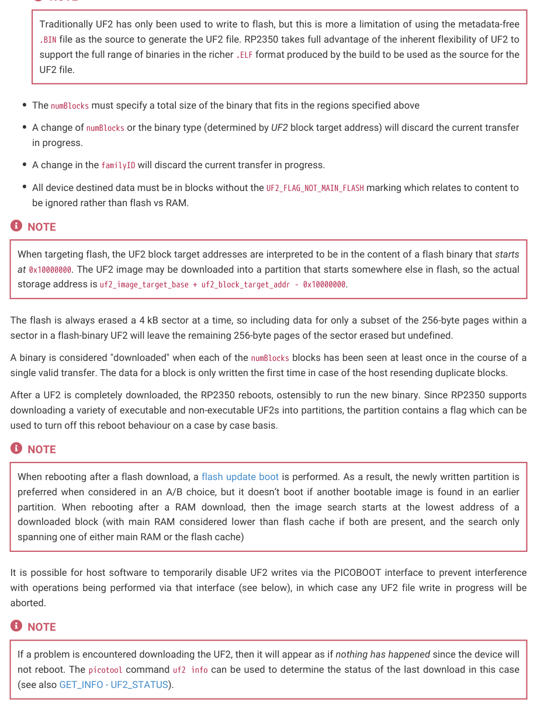

# 5.5.2. UF2 format details

5.5.2. UF2 format details

This section describes the constraints on a UF2 file to be valid for download.


TIP

To generate UF2 files, you can use the picootol uf2 convert functionality in picotool.

All data destined for the device must be in UF2 blocks with:

• A familyID present, with a value in the reserved range 0xe48bff58 through 0xe48bff5b or a user family ID configured in

a partition table (see table in Section 5.5.3).
• A payload_size of 256.

All data must be destined for (and fit entirely within) the following memory ranges (depending on the type of binary

being downloaded which is determined by the address of the first UF2 block encountered):

• A regular flash image

◦0x10000000-0x12000000 flash: All blocks must be targeted at 256 byte alignments. Writes beyond the end of

physical flash will wrap back to the beginning of flash.
• A RAM only image

◦0x20000000-0x20082000 main RAM: Blocks can be positioned with byte alignment.

◦0x13ffc000-0x14000000 XIP RAM: (since flash isn’t being targeted, the flash cache is available for use as RAM

with same properties as main RAM).

5.5. USB mass storage interface
400

RP2350 Datasheet

NOTE

Traditionally UF2 has only been used to write to flash, but this is more a limitation of using the metadata-free

.BIN file as the source to generate the UF2 file. RP2350 takes full advantage of the inherent flexibility of UF2 to

support the full range of binaries in the richer .ELF format produced by the build to be used as the source for the

• The numBlocks must specify a total size of the binary that fits in the regions specified above
• A change of numBlocks or the binary type (determined by UF2 block target address) will discard the current transfer

in progress.
• A change in the familyID will discard the current transfer in progress.
• All device destined data must be in blocks without the UF2_FLAG_NOT_MAIN_FLASH marking which relates to content to

be ignored rather than flash vs RAM.

When targeting flash, the UF2 block target addresses are interpreted to be in the content of a flash binary that starts

at 0x10000000. The UF2 image may be downloaded into a partition that starts somewhere else in flash, so the actual

storage address is uf2_image_target_base + uf2_block_target_addr - 0x10000000.

The flash is always erased a 4 kB sector at a time, so including data for only a subset of the 256-byte pages within a

sector in a flash-binary UF2 will leave the remaining 256-byte pages of the sector erased but undefined.

A binary is considered "downloaded" when each of the numBlocks blocks has been seen at least once in the course of a

single valid transfer. The data for a block is only written the first time in case of the host resending duplicate blocks.

After a UF2 is completely downloaded, the RP2350 reboots, ostensibly to run the new binary. Since RP2350 supports

downloading a variety of executable and non-executable UF2s into partitions, the partition contains a flag which can be

used to turn off this reboot behaviour on a case by case basis.

When rebooting after a flash download, a flash update boot is performed. As a result, the newly written partition is

preferred when considered in an A/B choice, but it doesn’t boot if another bootable image is found in an earlier

partition. When rebooting after a RAM download, then the image search starts at the lowest address of a

downloaded block (with main RAM considered lower than flash cache if both are present, and the search only

spanning one of either main RAM or the flash cache)

It is possible for host software to temporarily disable UF2 writes via the PICOBOOT interface to prevent interference

with operations being performed via that interface (see below), in which case any UF2 file write in progress will be

If a problem is encountered downloading the UF2, then it will appear as if nothing has happened since the device will

not reboot. The picotool command uf2 info can be used to determine the status of the last download in this case

(see also GET_INFO - UF2_STATUS).
