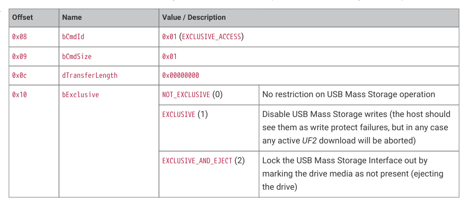
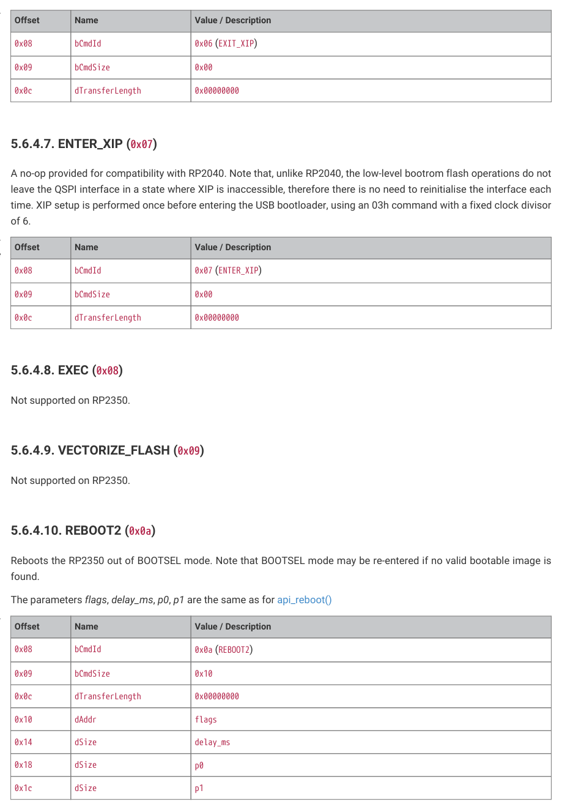

# 5.6.4. PICOBOOT Commands

RP2350 Datasheet

5.6.4. PICOBOOT Commands

The two bulk endpoints are used for sending commands and retrieved successful command results. All commands are

exactly 32 bytes (see Table 458) and sent to the BULK_OUT endpoint.

| Offset | Name | Description |
| --- | --- | --- |
| 0x00 | dMagic | The value 0x431fd10b |
| 0x04 | dToken | A user provided token to identify this request by |
| 0x08 | bCmdId | The ID of the command. Note that the top bit indicates data transfer direction (0x80 = IN) |
| 0x09 | bCmdSize | Number of bytes of valid data in the args field |
| 0x0a | reserved | 0x0000 |
| 0x0c | dTransferLength | The number of bytes the host expects to send or receive over the bulk channel |
| 0x10 | args | 16 bytes of command-specific data padded with zeros |

Table 458. PICOBOOT

If a command sent is invalid or not recognised, the bulk endpoints will be stalled. Further information will be available

via the GET_COMMAND_STATUS request (see Section 5.6.5.2).

Following the initial 32 byte packet, if dTransferLength is non-zero, then that many bytes are transferred over the bulk pipe

and the command is completed with an empty packet in the opposite direction. If dTransferLength is zero then command

success is indicated by an empty IN packet.

The following commands are supported (note common fields dMagic, dToken, and reserved are omitted for clarity)

5.6.4.1. EXCLUSIVE_ACCESS (0x01)

Claim or release exclusive access for writing to the RP2350 over USB (versus the Mass Storage Interface)

Table 459. PICOBOOT

EXCLUSIVE_ACCESS

command structure

0x10
bExclusive
NOT_EXCLUSIVE (0)
No restriction on USB Mass Storage operation

EXCLUSIVE (1)
Disable USB Mass Storage writes (the host should

see them as write protect failures, but in any case

any active UF2 download will be aborted)

EXCLUSIVE_AND_EJECT (2)
Lock the USB Mass Storage Interface out by

marking the drive media as not present (ejecting

5.6.4.2. REBOOT (0x02)

Not supported on RP2350.

Use Section 5.6.4.10 instead.

5.6. USB PICOBOOT interface
405

RP2350 Datasheet

5.6.4.3. FLASH_ERASE (0x03)

Erases a contiguous range of flash sectors.

| Offset | Name | Value / Description |  |
| --- | --- | --- | --- |
| 0x08 | bCmdId | 0x03 (FLASH ERASE) _ |  |
| 0x09 | bCmdSize | 0x08 |  |
| 0x0c | dTransferLength | 0x00000000 |  |
| 0x10 | dAddr | The address in flash to er (4 kB) aligned | ase, starting at this location. This must be sector |
| 0x14 | dSize | The number of bytes to er (4 kB) | ase. This must an exact multiple number of sectors |

Table 460. PICOBOOT

FLASH_ERASE

command structure

5.6.4.4. READ (0x84)

Read a contiguous memory (flash or RAM or ROM) range from the RP2350

| Offset | Name | Value / Description |  |
| --- | --- | --- | --- |
| 0x08 | bCmdId | 0x84 (READ) |  |
| 0x09 | bCmdSize | 0x08 |  |
| 0x0c | dTransferLength | Must be the same as dSiz | e |
| 0x10 | dAddr | The address to read from. | May be in flash or RAM or ROM |
| 0x14 | dSize | The number of bytes to re | ad |

Table 461. PICOBOOT

Read memory

command (flash, RAM,

ROM) structure

5.6.4.5. WRITE (0x05)

Writes a contiguous memory range of memory (flash or RAM) on the RP2350.

| Offset | Name | Value / Description |  |
| --- | --- | --- | --- |
| 0x08 | bCmdId | 0x05 (WRITE) |  |
| 0x09 | bCmdSize | 0x08 |  |
| 0x0c | dTransferLength | Must be the same as dSiz | e |
| 0x10 | dAddr | The address to write from (256 byte) aligned if in fla undefined. | . May be in flash or RAM, however must be page sh. Flash must be erased first or the results are |
| 0x14 | dSize | The number of bytes to w multiple of pages (256 byt | rite. If writing to flash and the size isn’t an exact es) then the last page is zero-filled to the end. |

Table 462. PICOBOOT

Write memory

command (flash,

RAM) structure

5.6.4.6. EXIT_XIP (0x06)

A no-op provided for compatibility with RP2040. An XIP exit sequence (flash_exit_xip()) is issued once before entering

the USB bootloader, which returns the external QSPI device from whatever XIP state it was in to a serial command state,

and the external QSPI device then remains in this state until reboot.

5.6. USB PICOBOOT interface
406

RP2350 Datasheet

Table 463. PICOBOOT

EXIT_XIP command

structure

A no-op provided for compatibility with RP2040. Note that, unlike RP2040, the low-level bootrom flash operations do not

leave the QSPI interface in a state where XIP is inaccessible, therefore there is no need to reinitialise the interface each

time. XIP setup is performed once before entering the USB bootloader, using an 03h command with a fixed clock divisor

Table 464. PICOBOOT

Enter Execute in place

(XIP) command

5.6.4.9. VECTORIZE_FLASH (0x09)

Reboots the RP2350 out of BOOTSEL mode. Note that BOOTSEL mode may be re-entered if no valid bootable image is

The parameters flags, delay_ms, p0, p1 are the same as for api_reboot()

Table 465. PICOBOOT

REBOOT2 command

structure

5.6.4.11. GET_INFO (0x8b)

Generic conduit for retrieving information from the device.

5.6. USB PICOBOOT interface
407

RP2350 Datasheet

The transfer length indicates the maximum number of bytes to be retrieved. The fist word returned indicates the number

of significant words of data that follow. A full "transfer length" is always returned, padding with zeroes as necessary.

"Word 0", below, refers to the first word of the actual response (the word after the count word).

| Offset | Name | Value / Description |  |
| --- | --- | --- | --- |
| 0x08 | bCmdId | 0x0b (GET INFO) _ |  |
| 0x09 | bCmdSize | 0x10 |  |
| 0x0c | dTransferLength | the size of data to be rece 256 | ived. Note this must be a multiple of 4, and less than |
| 0x10 | bType | the type of information be • 0x1 - INFO SYS : Retriev _ parameter for that fu • 0x2 - PARTITION : Retrie flags and partition p _ _ • 0x03 - UF2 TARGET PART _ _ family_id would be d in BOOTSEL mode). ◦ Word 0 : Target ▪ 0-15 : the p ▪ 0xff : if the location ▪ -1 : if there ◦ Word 1 : Target not -1 ◦ Word 2 : Target not -1 • 0x04 - UF2 STATUS : Ret _ download ◦ Word 0 - 0xnnrr0 ▪ 'n' - no reb download ▪ 'r' - if 0x01 ▪ 'a' - UF2 d ▪ 0x1 EX ▪ 0x2 BA ▪ 0x4 WR ▪ 0x8 RE archit ▪ 'f' - UF2 d ▪ 0x1 IG ◦ Word 1 - the cur ◦ Word 2 - the nu ◦ Word 3 - the tot | ing retrieved: es information from get_sys_info(); the flag nction comes from dParam0. ves information from get_partition_table_info(); the arameter for that function comes from dParam0. ITION : Retrieves the partition that a given UF2 ownloaded into (if it were dragged on the USB drive The family id is passed in dParam0. partition number: artition number the family would be downloaded to family would be downloaded at an absolute is nowhere to download the family partition Section 5.9.4.2 if the partition number is partition Section 5.9.4.2 if the partition number is rieves information about the current/recent UF2 0af oot flag; if 0x01, there is no reboot when the UF2 completes , the UF2 being download is a RAM UF2 ownload abort reason flags CLUSIVELY LOCKED _ D ADDRESS _ ITE ERROR _ BOOT FAILURE // if the UF2 targeted a disabled _ ecture ownload status flags NORED FAMILY _ rent family id mber of 256 byte blocks successfully downloaded al number of 256 byte blocks in the UF2 to download |
| 0x08 | bCmdId | 0x8c (OTP READ) _ |  |
| 0x09 | bCmdSize | 0x05 |  |
| 0x0c | dTransferLength |  |  |
| 0x10 | wRow | the first row number to re | ad |
| 0x12 | wRowCount | the number of rows to rea | d |
| 0x14 | bEcc | • 0 - if reading raw row are zero) • 1 - if reading rows as | s (32 bits are returned per row, the top 8 of which ECC rows (16 bits per row are returned) |

Table 466. PICOBOOT

GET_INFO command

structure

5.6. USB PICOBOOT interface
408

RP2350 Datasheet

5.6.4.12. OTP_READ (0x8c)

Reads data out of OTP. (see also otp_access() which provides the data). Data returned is subject to the "BL" OTP

permissions, which define bootloader OTP access permissions.

5.6. USB PICOBOOT interface
409

RP2350 Datasheet

Table 467. PICOBOOT

OTP_READ command

structure

5.6.4.13. OTP_WRITE (0x0d)

Reads data out of OTP. (see also otp_access() which performs the operation). Writing is subject to the "BL" OTP

permissions, which define bootloader OTP access permissions.

| Offset | Name | Value / Description |  |
| --- | --- | --- | --- |
| 0x08 | bCmdId | 0x0d (OTP WRITE) _ |  |
| 0x09 | bCmdSize | 0x05 |  |
| 0x0c | dTransferLength |  |  |
| 0x10 | wRow | the first row number to re | ad |
| 0x12 | wRowCount | the number of rows to rea | d |
| 0x14 | bEcc | • 0 - if writing raw row are ignored) • 1 - if writing ECC row error correcting infor | s (32 bits are provided per row, the top 8 of which s (16 bits are provided per row, and are written with mation to the OTP) |

Table 468. PICOBOOT

OTP_WRITE command

structure

## Embedded Images

