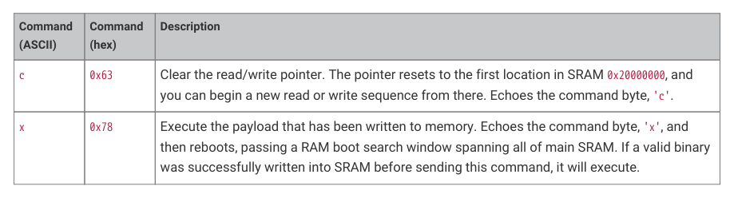

# 5.8.3. UART boot programming flow

5.8.3. UART boot programming flow

1. Reset or power down the RP2350 device.

2. Drive CSn low to select BOOTSEL, and SD1 high to select UART.

3. Release the reset or power up the device.

4. Wait for the splash string to be transmitted on QSPI SD2 (TX).

5. Transmit the knock sequence 0x56, 0xff, 0x8b, 0xe4 on QSPI SD3 (RX)

6. Send a 'n' nop command to ensure the interface is awake; if there is no reply, send the knock sequence again.

7. Send 'w' commands until your entire write payload transfers.

8. (Optional) Send a 'c' clear command to reset the address pointer, and then send 'r' read commands to read back

and verify the payload.

9. Send an 'x' execute command to attempt to run the payload.

There is no feedback from UART boot after echoing the final 'x' command. At this point the device reboots to attempt a

RAM image boot on the data loaded by the Non-secure UART bootloader. If the RAM image boot fails, the bootrom falls

through to the next boot source, continuing the normal boot flow. Maintaining CSn driven low and SD1 driven high will

cause the bootrom to fall through back to UART boot a second time, re-sending the UART splash screen: this indicates

the bootrom failed to recognise the UART boot binary.
