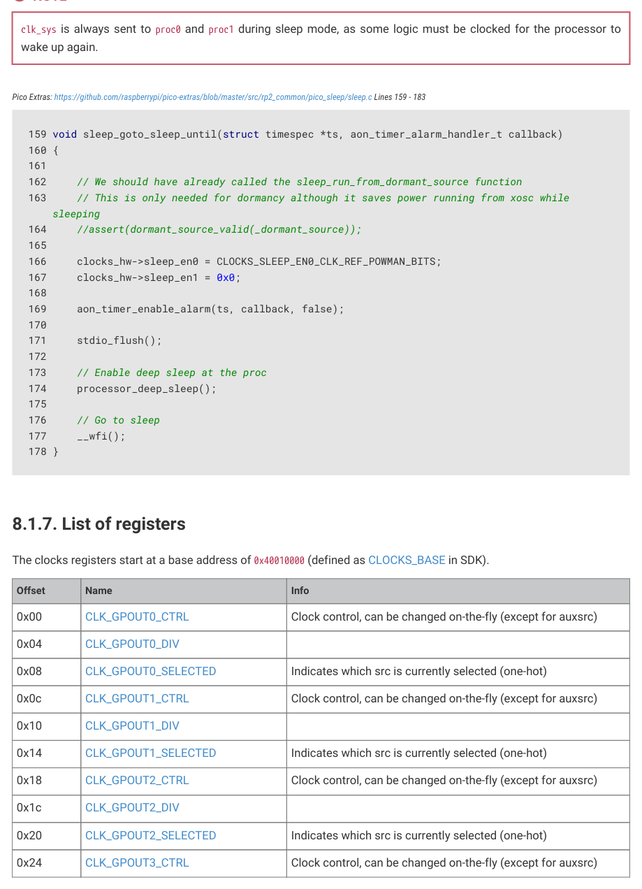

# 8.1.6. Programmer’s model

8.1.6. Programmer’s model

8.1.6.1. Configuring a clock generator

The SDK defines an enum of clocks:

SDK: https://github.com/raspberrypi/pico-sdk/blob/master/src/rp2350/hardware_structs/include/hardware/structs/clocks.h Lines 30 - 42

30 typedef enum clock_num_rp2350 {

31     clk_gpout0 = 0, ///< Select CLK_GPOUT0 as clock source

32     clk_gpout1 = 1, ///< Select CLK_GPOUT1 as clock source

33     clk_gpout2 = 2, ///< Select CLK_GPOUT2 as clock source

34     clk_gpout3 = 3, ///< Select CLK_GPOUT3 as clock source

35     clk_ref = 4, ///< Select CLK_REF as clock source

36     clk_sys = 5, ///< Select CLK_SYS as clock source

37     clk_peri = 6, ///< Select CLK_PERI as clock source

38     clk_hstx = 7, ///< Select CLK_HSTX as clock source

39     clk_usb = 8, ///< Select CLK_USB as clock source

40     clk_adc = 9, ///< Select CLK_ADC as clock source

41     CLK_COUNT

42 } clock_num_t;

Additionally, the SDK defines a struct to describe the registers of a clock generator:

SDK: https://github.com/raspberrypi/pico-sdk/blob/master/src/rp2350/hardware_structs/include/hardware/structs/clocks.h Lines 116 - 137

116 typedef struct {

117     _REG_(CLOCKS_CLK_GPOUT0_CTRL_OFFSET) // CLOCKS_CLK_GPOUT0_CTRL

118     // Clock control, can be changed on-the-fly (except for auxsrc)

119     // 0x10000000 [28]    ENABLED      (0) clock generator is enabled

120     // 0x00100000 [20]    NUDGE        (0) An edge on this signal shifts the phase of the

    output by...

121     // 0x00030000 [17:16] PHASE        (0x0) This delays the enable signal by up to 3 cycles

    of the...

122     // 0x00001000 [12]    DC50         (0) Enables duty cycle correction for odd divisors, can

    be...

123     // 0x00000800 [11]    ENABLE       (0) Starts and stops the clock generator cleanly

124     // 0x00000400 [10]    KILL         (0) Asynchronously kills the clock generator, enable

    must be...

125     // 0x000001e0 [8:5]   AUXSRC       (0x0) Selects the auxiliary clock source, will glitch

    when switching

126     io_rw_32 ctrl;

127 

128     _REG_(CLOCKS_CLK_GPOUT0_DIV_OFFSET) // CLOCKS_CLK_GPOUT0_DIV

129     // 0xffff0000 [31:16] INT          (0x0001) Integer part of clock divisor, 0 -> max+1, can

    be...

130     // 0x0000ffff [15:0]  FRAC         (0x0000) Fractional component of the divisor, can be

8.1. Overview
523

RP2350 Datasheet

    changed on-the-fly

131     io_rw_32 div;

132 

133     _REG_(CLOCKS_CLK_GPOUT0_SELECTED_OFFSET) // CLOCKS_CLK_GPOUT0_SELECTED

134     // Indicates which src is currently selected (one-hot)

135     // 0x00000001 [0]     CLK_GPOUT0_SELECTED (1) This slice does not have a glitchless mux

(only the...

136     io_ro_32 selected;

137 } clock_hw_t;

Clock configuration requires the following pieces of information:

• The frequency of the clock source
• The mux / aux mux position of the clock source
• The desired output frequency

The SDK provides clock_configure to configure a clock:

SDK: https://github.com/raspberrypi/pico-sdk/blob/master/src/rp2_common/hardware_clocks/clocks.c Lines 40 - 133

 40 static void clock_configure_internal(clock_handle_t clock, uint32_t src, uint32_t auxsrc,

    uint32_t actual_freq, uint32_t div) {

 41     clock_hw_t *clock_hw = &clocks_hw->clk[clock];

 42 

 43     // If increasing divisor, set divisor before source. Otherwise set source

 44     // before divisor. This avoids a momentary overspeed when e.g. switching

 45     // to a faster source and increasing divisor to compensate.

 46     if (div > clock_hw->div)

 47         clock_hw->div = div;

 48 

 49     // If switching a glitchless slice (ref or sys) to an aux source, switch

 50     // away from aux *first* to avoid passing glitches when changing aux mux.

 51     // Assume (!!!) glitchless source 0 is no faster than the aux source.

 52     if (has_glitchless_mux(clock) && src ==

    CLOCKS_CLK_SYS_CTRL_SRC_VALUE_CLKSRC_CLK_SYS_AUX) {

 53         hw_clear_bits(&clock_hw->ctrl, CLOCKS_CLK_REF_CTRL_SRC_BITS);

 54         while (!(clock_hw->selected & 1u))

 55             tight_loop_contents();

 56     }

 57     // If no glitchless mux, cleanly stop the clock to avoid glitches

 58     // propagating when changing aux mux. Note it would be a really bad idea

 59     // to do this on one of the glitchless clocks (clk_sys, clk_ref).

 60     else {

 61         // Disable clock. On clk_ref and clk_sys this does nothing,

 62         // all other clocks have the ENABLE bit in the same position.

 63         hw_clear_bits(&clock_hw->ctrl, CLOCKS_CLK_GPOUT0_CTRL_ENABLE_BITS);

 64         if (configured_freq[clock] > 0) {

 65             // Delay for 3 cycles of the target clock, for ENABLE propagation.

 66             // Note XOSC_COUNT is not helpful here because XOSC is not

 67             // necessarily running, nor is timer...

 68             uint delay_cyc = configured_freq[clk_sys] / configured_freq[clock] + 1;

 69             busy_wait_at_least_cycles(delay_cyc * 3);

 70         }

 71     }

 72 

 73     // Set aux mux first, and then glitchless mux if this clock has one

 74     hw_write_masked(&clock_hw->ctrl,

 75         (auxsrc << CLOCKS_CLK_SYS_CTRL_AUXSRC_LSB),

 76         CLOCKS_CLK_SYS_CTRL_AUXSRC_BITS

 77     );

 78 

8.1. Overview
524

RP2350 Datasheet

 79     if (has_glitchless_mux(clock)) {

 80         hw_write_masked(&clock_hw->ctrl,

 81             src << CLOCKS_CLK_REF_CTRL_SRC_LSB,

 82             CLOCKS_CLK_REF_CTRL_SRC_BITS

 83         );

 84         while (!(clock_hw->selected & (1u << src)))

 85             tight_loop_contents();

 86     }

 87 

 88     // Enable clock. On clk_ref and clk_sys this does nothing,

 89     // all other clocks have the ENABLE bit in the same position.

 90     hw_set_bits(&clock_hw->ctrl, CLOCKS_CLK_GPOUT0_CTRL_ENABLE_BITS);

 91 

 92     // Now that the source is configured, we can trust that the user-supplied

 93     // divisor is a safe value.

 94     clock_hw->div = div;

 95     configured_freq[clock] = actual_freq;

 96 }

 97 

 98 bool clock_configure(clock_handle_t clock, uint32_t src, uint32_t auxsrc, uint32_t src_freq,

    uint32_t freq) {

 99     assert(src_freq >= freq);

100 

101     if (freq > src_freq)

102         return false;

103 

104     uint64_t div64 =((((uint64_t) src_freq) << CLOCKS_CLK_GPOUT0_DIV_INT_LSB) / freq);

105     uint32_t div, actual_freq;

106     if (div64 >> 32) {

107         // set div to 0 for maximum clock divider

108         div = 0;

109         actual_freq = src_freq >> (32 - CLOCKS_CLK_GPOUT0_DIV_INT_LSB);

110     } else {

111         div = (uint32_t) div64;

112         actual_freq = (uint32_t) ((((uint64_t) src_freq) << CLOCKS_CLK_GPOUT0_DIV_INT_LSB) /

    div);

113     }

114 

115     clock_configure_internal(clock, src, auxsrc, actual_freq, div);

116     // Store the configured frequency

117     return true;

118 }

119 

120 void clock_configure_int_divider(clock_handle_t clock, uint32_t src, uint32_t auxsrc,

    uint32_t src_freq, uint32_t int_divider) {

121     clock_configure_internal(clock, src, auxsrc, src_freq / int_divider, int_divider <<

    CLOCKS_CLK_GPOUT0_DIV_INT_LSB);

122 }

123 

124 void clock_configure_undivided(clock_handle_t clock, uint32_t src, uint32_t auxsrc, uint32_t

    src_freq) {

125     clock_configure_internal(clock, src, auxsrc, src_freq, 1u <<

    CLOCKS_CLK_GPOUT0_DIV_INT_LSB);

126 }

clocks_init calls clock_configure for each clock. The following example shows the clk_sys configuration:

SDK: https://github.com/raspberrypi/pico-sdk/blob/master/src/rp2_common/pico_runtime_init/runtime_init_clocks.c Lines 100 - 104

100         // CLK SYS = PLL SYS (usually) 125MHz / 1 = 125MHz

101         clock_configure_undivided(clk_sys,

102                         CLOCKS_CLK_SYS_CTRL_SRC_VALUE_CLKSRC_CLK_SYS_AUX,

8.1. Overview
525

RP2350 Datasheet

103                         CLOCKS_CLK_SYS_CTRL_AUXSRC_VALUE_CLKSRC_PLL_SYS,

104                         SYS_CLK_HZ);

Once a clock is configured, call clock_get_hz to get the output frequency in Hz.

SDK: https://github.com/raspberrypi/pico-sdk/blob/master/src/rp2_common/hardware_clocks/clocks.c Lines 137 - 139

137 uint32_t clock_get_hz(clock_handle_t clock) {

138     return configured_freq[clock];

The frequency returned by clock_get_hz will be inaccurate if the provided source frequency is incorrect.

8.1.6.2. Using the frequency counter

To use the frequency counter, the programmer must:

1. Set the reference frequency: clk_ref.

2. Set the mux position of the source they want to measure. See FC0_SRC.

3. Wait for the DONE status bit in FC0_STATUS to be set.

The SDK defines a frequency_count function that takes the source as an argument and returns the frequency in kHz:

SDK: https://github.com/raspberrypi/pico-sdk/blob/master/src/rp2_common/hardware_clocks/clocks.c Lines 147 - 174

147 uint32_t frequency_count_khz(uint src) {

148     fc_hw_t *fc = &clocks_hw->fc0;

150     // If frequency counter is running need to wait for it. It runs even if the source is NULL

151     while(fc->status & CLOCKS_FC0_STATUS_RUNNING_BITS) {

152         tight_loop_contents();

156     fc->ref_khz = clock_get_hz(clk_ref) / 1000;

158     // FIXME: Don't pick random interval. Use best interval

163     fc->max_khz = 0xffffffff;

165     // Set SRC which automatically starts the measurement

168     while(!(fc->status & CLOCKS_FC0_STATUS_DONE_BITS)) {

169         tight_loop_contents();

173     return fc->result >> CLOCKS_FC0_RESULT_KHZ_LSB;

8.1. Overview
526

RP2350 Datasheet

There is also a wrapper function to change the unit to MHz:

SDK: https://github.com/raspberrypi/pico-sdk/blob/master/src/rp2_common/hardware_clocks/include/hardware/clocks.h Lines 377 - 379

377 static inline float frequency_count_mhz(uint src) {

378     return ((float) (frequency_count_khz(src))) / KHZ;

379 }

The frequency counter can also be used in a test mode. This allows the hardware to check if the frequency is between a

minimum and a maximum frequency, set in FC0_MIN_KHZ and FC0_MAX_KHZ. This mode will set one of the following

bits in FC0_STATUS when DONE is set:

• SLOW: if the frequency is below the specified range
• PASS: if the frequency is within the specified range
• FAST: if the frequency is above the specified range
• DIED: if the clock is stopped or stops running

Test mode will also set the FAIL bit if DIED, FAST, or SLOW are set.

8.1.6.3. Configuring a GPIO output clock

SDK: https://github.com/raspberrypi/pico-sdk/blob/master/src/rp2_common/hardware_clocks/clocks.c Lines 245 - 263

245 void clock_gpio_init_int_frac16(uint gpio, uint src, uint32_t div_int, uint16_t div_frac16)

    {

246     // note this includes an invalid_params_if before defaulting to clk_gpout0

247     uint gpclk = gpio_to_gpout_clock_handle(gpio, clk_gpout0);

248 

249     invalid_params_if(HARDWARE_CLOCKS, div_int >> REG_FIELD_WIDTH(

    CLOCKS_CLK_GPOUT0_DIV_INT));

250     // Set up the gpclk generator

251     clocks_hw->clk[gpclk].ctrl = (src << CLOCKS_CLK_GPOUT0_CTRL_AUXSRC_LSB) |

252                                  CLOCKS_CLK_GPOUT0_CTRL_ENABLE_BITS;

253 #ifdef REG_FIELD_WIDTH(CLOCKS_CLK_GPOUT0_DIV_FRAC) == 16

254     clocks_hw->clk[gpclk].div = (div_int << CLOCKS_CLK_GPOUT0_DIV_INT_LSB) | (div_frac16 <<

    CLOCKS_CLK_GPOUT0_DIV_FRAC_LSB);

255 #elif REG_FIELD_WIDTH(CLOCKS_CLK_GPOUT0_DIV_FRAC) == 8

256     clocks_hw->clk[gpclk].div = (div_int << CLOCKS_CLK_GPOUT0_DIV_INT_LSB) | ((div_frac16

    >>8u) << CLOCKS_CLK_GPOUT0_DIV_FRAC_LSB);

257 #else

258 #error unsupported number of fractional bits

259 #endif

260 

261     // Set gpio pin to gpclock function

262     gpio_set_function(gpio, GPIO_FUNC_GPCK);

263 }

8.1.6.4. Configuring a GPIO input clock

SDK: https://github.com/raspberrypi/pico-sdk/blob/master/src/rp2_common/hardware_clocks/clocks.c Lines 300 - 330

300 bool clock_configure_gpin(clock_handle_t clock, uint gpio, uint32_t src_freq, uint32_t freq)

    {

301     // Configure a clock to run from a GPIO input

8.1. Overview
527

RP2350 Datasheet

302     uint gpin = 0;

303     if      (gpio == 20) gpin = 0;

304     else if (gpio == 22) gpin = 1;

305     else if (gpio == 12) gpin = 0;

306     else if (gpio == 14) gpin = 1;

307     else {

308         invalid_params_if(HARDWARE_CLOCKS, true);

309     }

310 

311     // Work out sources. GPIN is always an auxsrc

312     uint src = 0;

313 

314     // GPIN1 == GPIN0 + 1

315     uint auxsrc = gpin0_src[clock] + gpin;

316 

317     if (has_glitchless_mux(clock)) {

318         // AUX src is always 1

319         src = 1;

320     }

321 

322     // Set the GPIO function

323     gpio_set_function(gpio, GPIO_FUNC_GPCK);

324 

325     // Now we have the src, auxsrc, and configured the gpio input

326     // call clock configure to run the clock from a gpio

327     return clock_configure(clock, src, auxsrc, src_freq, freq);

328 }

8.1.6.5. Enabling resus

SDK: https://github.com/raspberrypi/pico-sdk/blob/master/src/rp2_common/hardware_clocks/clocks.c Lines 221 - 243

221 void clocks_enable_resus(resus_callback_t resus_callback) {

222     // Restart clk_sys if it is stopped by forcing it

223     // to the default source of clk_ref. If clk_ref stops running this will

224     // not work.

225 

226     // Store user's resus callback

227     _resus_callback = resus_callback;

228 

229     irq_set_exclusive_handler(CLOCKS_IRQ, clocks_irq_handler);

230 

231     // Enable the resus interrupt in clocks

232     clocks_hw->inte = CLOCKS_INTE_CLK_SYS_RESUS_BITS;

233 

234     // Enable the clocks irq

235     irq_set_enabled(CLOCKS_IRQ, true);

236 

237     // 2 * clk_ref freq / clk_sys_min_freq;

238     // assume clk_ref is 3MHz and we want clk_sys to be no lower than 1MHz

239     uint timeout = 2 * 3 * 1;

240 

241     // Enable resus with the maximum timeout

242     clocks_hw->resus.ctrl = CLOCKS_CLK_SYS_RESUS_CTRL_ENABLE_BITS | timeout;

243 }

8.1. Overview
528

RP2350 Datasheet

8.1.6.6. Configuring sleep mode

Sleep mode is active when neither processor core nor the DMA are requesting clocks. For example, sleep mode is active

when the DMA is not active and both core 0 and core 1 are waiting for an interrupt.

The SLEEP_EN registers set what clocks run in sleep mode. The hello_sleep example (hello_sleep_aon.c in the pico-

playground GitHub repository) illustrates how to put the chip to sleep until the AON Timer fires.

NOTE

clk_sys is always sent to proc0 and proc1 during sleep mode, as some logic must be clocked for the processor to

Pico Extras: https://github.com/raspberrypi/pico-extras/blob/master/src/rp2_common/pico_sleep/sleep.c Lines 159 - 183

159 void sleep_goto_sleep_until(struct timespec *ts, aon_timer_alarm_handler_t callback)

162     // We should have already called the sleep_run_from_dormant_source function

163     // This is only needed for dormancy although it saves power running from xosc while

164     //assert(dormant_source_valid(_dormant_source));

166     clocks_hw->sleep_en0 = CLOCKS_SLEEP_EN0_CLK_REF_POWMAN_BITS;

167     clocks_hw->sleep_en1 = 0x0;

169     aon_timer_enable_alarm(ts, callback, false);

173     // Enable deep sleep at the proc

174     processor_deep_sleep();
