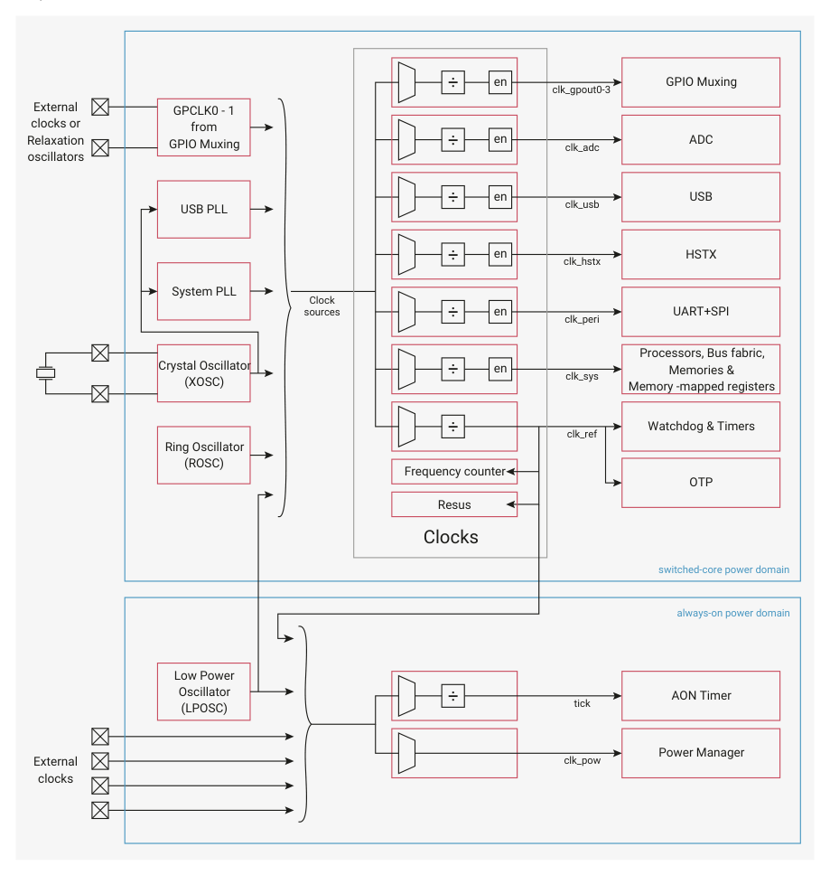

# 8.1. Overview

8.1. Overview

The clocks block provides independent clocks to on-chip and external components. It takes inputs from a variety of

clock sources, allowing the user to trade off performance against cost, board area and power consumption. From these

sources it uses multiple clock generators to provide the required clocks. This architecture allows the user flexibility to

start and stop clocks independently and to vary some clock frequencies whilst maintaining others at their optimum

frequencies.

Figure 33. Clocks

overview

External 
clocks or 
Relaxation 
oscillators

The crystal oscillator (XOSC) provides a reference to two PLLs, which provide high precision clocks to the processors

and peripherals. These are slow to start when waking from the various low-power modes, so the on-chip ring oscillator

(ROSC) is provided to boot the device until they are available. When the switched-core is powered down or the device is

in DORMANT mode (see Section 6.5.3, “DORMANT state”) the on-chip 32kHz low-power oscillator (LPOSC) provides a

clock to the power manager and a tick to the Always-on Timer (AON Timer).

8.1. Overview
513

RP2350 Datasheet

The clock generators select from the clock sources and optionally divide the selected clock before outputting through

enable logic that provides automatic clock gating in sleep mode (see Section 8.1.3.5.2, “System sleep mode”).

An on-chip frequency counter facilitates debugging of the clock setup and also allows measurement of the frequencies

of LPOSC, ROSC and external clocks. If the system clock stops accidentally, the on-chip resus (short for resuscitate)

component restarts it from a known good clock. This allows the software debugger to access registers and debug the

problem.

When the switched-core is powered, the power manager clock automatically switches to the reference clock (clk_ref).

The user can optionally switch the AON Timer tick, though we recommend waiting until clk_ref is running from the

XOSC, because the ROSC frequency is imprecise.

You can substitute the clock sources with up to 2 GPIO clock inputs. This helps avoid adding a second crystal into

systems that already have an accurate clock source and enables replacement of the ROSC and LPOSC with more

accurate external sources.

You can also output up to 4 generated clocks to GPIOs at up to 50MHz. This enables you to supply clocks to external

devices, reducing the need for additional clock components that consume power and board area.
