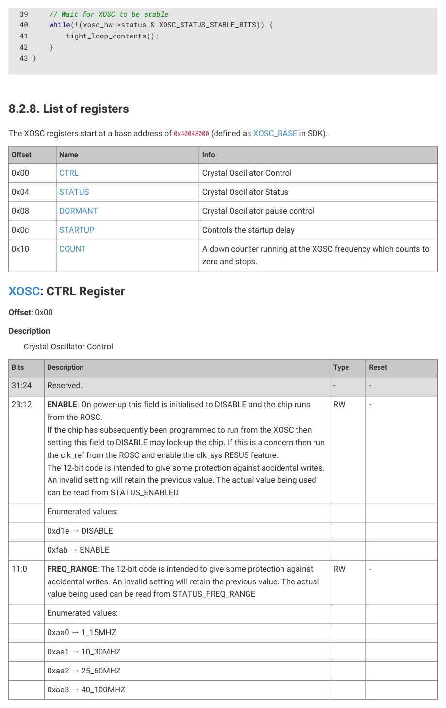

# 8.2.7. Programmer’s model

8.2.7. Programmer’s model

SDK: https://github.com/raspberrypi/pico-sdk/blob/master/src/rp2350/hardware_structs/include/hardware/structs/xosc.h Lines 27 - 57

27 typedef struct {

28     _REG_(XOSC_CTRL_OFFSET) // XOSC_CTRL

29     // Crystal Oscillator Control

30     // 0x00fff000 [23:12] ENABLE       (-) On power-up this field is initialised to DISABLE and

   the...

31     // 0x00000fff [11:0]  FREQ_RANGE   (-) The 12-bit code is intended to give some

   protection...

32     io_rw_32 ctrl;

33 

34     _REG_(XOSC_STATUS_OFFSET) // XOSC_STATUS

35     // Crystal Oscillator Status

36     // 0x80000000 [31]    STABLE       (0) Oscillator is running and stable

37     // 0x01000000 [24]    BADWRITE     (0) An invalid value has been written to CTRL_ENABLE

   or...

38     // 0x00001000 [12]    ENABLED      (-) Oscillator is enabled but not necessarily running

   and...

39     // 0x00000003 [1:0]   FREQ_RANGE   (-) The current frequency range setting

40     io_rw_32 status;

41 

42     _REG_(XOSC_DORMANT_OFFSET) // XOSC_DORMANT

43     // Crystal Oscillator pause control

44     // 0xffffffff [31:0]  DORMANT      (-) This is used to save power by pausing the XOSC +

45     io_rw_32 dormant;

46 

47     _REG_(XOSC_STARTUP_OFFSET) // XOSC_STARTUP

48     // Controls the startup delay

49     // 0x00100000 [20]    X4           (-) Multiplies the startup_delay by 4, just in case

50     // 0x00003fff [13:0]  DELAY        (-) in multiples of 256*xtal_period

51     io_rw_32 startup;

52 

53     _REG_(XOSC_COUNT_OFFSET) // XOSC_COUNT

54     // A down counter running at the XOSC frequency which counts to zero and stops.

55     // 0x0000ffff [15:0]  COUNT        (0x0000)

56     io_rw_32 count;

57 } xosc_hw_t;

SDK: https://github.com/raspberrypi/pico-sdk/blob/master/src/rp2_common/hardware_xosc/xosc.c Lines 29 - 43

29 void xosc_init(void) {

30     // Assumes 1-15 MHz input, checked above.

31     xosc_hw->ctrl = XOSC_CTRL_FREQ_RANGE_VALUE_1_15MHZ;

32 

33     // Set xosc startup delay

34     xosc_hw->startup = STARTUP_DELAY;

35 

36     // Set the enable bit now that we have set freq range and startup delay

37     hw_set_bits(&xosc_hw->ctrl, XOSC_CTRL_ENABLE_VALUE_ENABLE << XOSC_CTRL_ENABLE_LSB);

38 

8.2. Crystal oscillator (XOSC)
558

RP2350 Datasheet

39     // Wait for XOSC to be stable

40     while(!(xosc_hw->status & XOSC_STATUS_STABLE_BITS)) {

41         tight_loop_contents();
