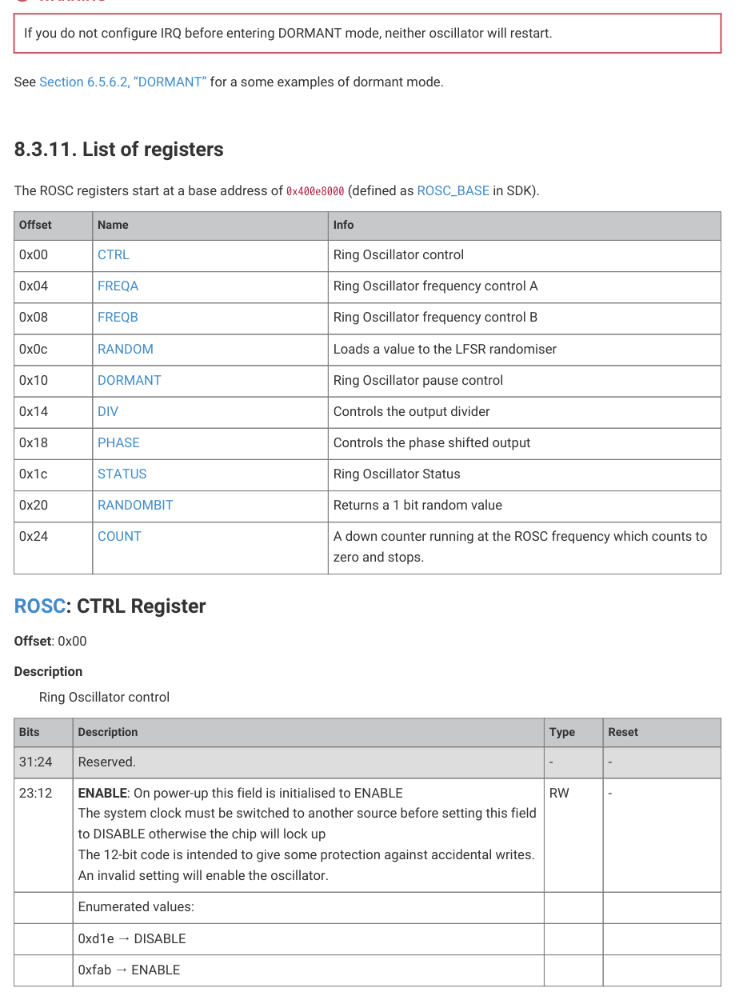

# 8.3.10. DORMANT mode

8.3.10. DORMANT mode

In DORMANT mode (see Section 6.5.3, “DORMANT state”), all of the on-chip clocks can be paused to save power. This

is particularly useful in battery-powered applications. RP2350 wakes from DORMANT mode by interrupt: either from an

external event, such as an edge on a GPIO pin, or from the AON Timer. This must be configured before entering

DORMANT mode. To use the AON Timer to trigger a wake from DORMANT mode, it must be clocked from the LPOSC or

from an external source.

To enter DORMANT mode:

1. Switch all internal clocks to be driven from XOSC or ROSC and stop the PLLs.

2. Choose an oscillator (XOSC or ROSC). Write a specific 32-bit value to the DORMANT register of the chosen oscillator to

stop it.

When exiting DORMANT mode, the chosen oscillator will restart. If you chose XOSC, the frequency will be more precise,

but the restart will take more time due to startup delay (>1ms on the RP2350 reference design (see Hardware design

with RP2350, Minimal Design Example)). If you chose ROSC, the frequency will be less precise, but the start-up time is

very short (approximately 1μs). See Section 6.5.3.1, “Waking from the DORMANT state” for the events which cause the

system to exit DORMANT mode.

NOTE

You must stop the PLLs before entering DORMANT mode.

Pico Extras: https://github.com/raspberrypi/pico-extras/blob/master/src/rp2_common/hardware_rosc/rosc.c Lines 56 - 61

56 void rosc_set_dormant(void) {

57     // WARNING: This stops the rosc until woken up by an irq

58     rosc_write(&rosc_hw->dormant, ROSC_DORMANT_VALUE_DORMANT);

59     // Wait for it to become stable once woken up

60     while(!(rosc_hw->status & ROSC_STATUS_STABLE_BITS));

61 }

8.3. Ring oscillator (ROSC)
564

RP2350 Datasheet

WARNING

If you do not configure IRQ before entering DORMANT mode, neither oscillator will restart.

See Section 6.5.6.2, “DORMANT” for a some examples of dormant mode.
