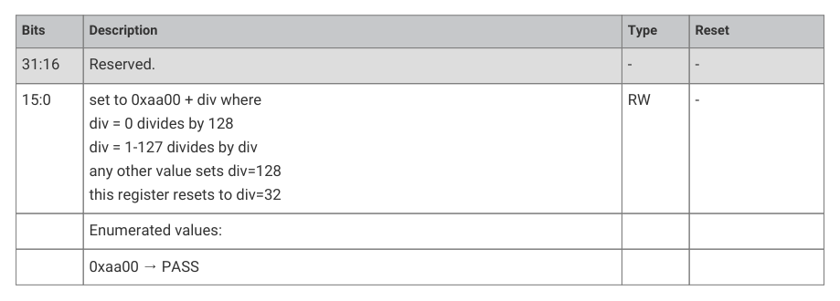

# 8.3.11. List of registers

The ROSC registers start at a base address of 0x400e8000 (defined as ROSC_BASE in SDK).

| Offset | Name | Info |
| --- | --- | --- |
| 0x00 | CTRL | Ring Oscillator control |
| 0x04 | FREQA | Ring Oscillator frequency control A |
| 0x08 | FREQB | Ring Oscillator frequency control B |
| 0x0c | RANDOM | Loads a value to the LFSR randomiser |
| 0x10 | DORMANT | Ring Oscillator pause control |
| 0x14 | DIV | Controls the output divider |
| 0x18 | PHASE | Controls the phase shifted output |
| 0x1c | STATUS | Ring Oscillator Status |
| 0x20 | RANDOMBIT | Returns a 1 bit random value |
| 0x24 | COUNT | A down counter running at the ROSC frequency which counts to zero and stops. |

Table 605. List of

Table 606. CTRL

Register
Bits
Description
Type
Reset

31:24
Reserved.
-
-

23:12
ENABLE: On power-up this field is initialised to ENABLE

The system clock must be switched to another source before setting this field

to DISABLE otherwise the chip will lock up

The 12-bit code is intended to give some protection against accidental writes.

An invalid setting will enable the oscillator.

8.3. Ring oscillator (ROSC)
565

RP2350 Datasheet

Bits
Description
Type
Reset

11:0
FREQ_RANGE: Controls the number of delay stages in the ROSC ring

TOOHIGH uses stages 0 to 1 and should not be used because its frequency

The clock output will not glitch when changing the range up one step at a time

The clock output will glitch when changing the range down

Note: the values here are gray coded which is why HIGH comes before

ROSC: FREQA Register

Offset: 0x04

Description

The FREQA & FREQB registers control the frequency by controlling the drive strength of each stage

The drive strength has 4 levels determined by the number of bits set

Increasing the number of bits set increases the drive strength and increases the oscillation frequency

0 bits set is the default drive strength

1 bit set doubles the drive strength

2 bits set triples drive strength

3 bits set quadruples drive strength

For frequency randomisation set both DS0_RANDOM=1 & DS1_RANDOM=1

| Bits | Description | Type | Reset |
| --- | --- | --- | --- |
| 31:16 | PASSWD: Set to 0x9696 to apply the settings Any other value in this field will set all drive strengths to 0 | RW | 0x0000 |
|  | Enumerated values: |  |  |
|  | 0x9696 → PASS |  |  |
| 15 | Reserved. | - | - |
| 14:12 | DS3: Stage 3 drive strength | RW | 0x0 |
| 11 | Reserved. | - | - |
| 10:8 | DS2: Stage 2 drive strength | RW | 0x0 |
| 7 | DS1_RANDOM: Randomises the stage 1 drive strength | RW | 0x1 |
| 6:4 | DS1: Stage 1 drive strength | RW | 0x0 |
| 3 | DS0_RANDOM: Randomises the stage 0 drive strength | RW | 0x1 |
| 2:0 | DS0: Stage 0 drive strength | RW | 0x0 |
| 31:16 | PASSWD: Set to 0x9696 to apply the settings Any other value in this field will set all drive strengths to 0 | RW | 0x0000 |
|  | Enumerated values: |  |  |
|  | 0x9696 → PASS |  |  |
| 15 | Reserved. | - | - |
| 14:12 | DS7: Stage 7 drive strength | RW | 0x0 |
| 11 | Reserved. | - | - |
| 10:8 | DS6: Stage 6 drive strength | RW | 0x0 |
| 7 | Reserved. | - | - |
| 6:4 | DS5: Stage 5 drive strength | RW | 0x0 |
| 3 | Reserved. | - | - |
| 2:0 | DS4: Stage 4 drive strength | RW | 0x0 |

Table 607. FREQA

ROSC: FREQB Register

Offset: 0x08

8.3. Ring oscillator (ROSC)
566

RP2350 Datasheet

Description

For a detailed description see freqa register

Table 608. FREQB

ROSC: RANDOM Register

Offset: 0x0c

Description

Loads a value to the LFSR randomiser

| Bits | Description | Type | Reset |
| --- | --- | --- | --- |
| 31:0 | SEED | RW | 0x3f04b16d |

Table 609. RANDOM

ROSC: DORMANT Register

Offset: 0x10

Description

Ring Oscillator pause control

Table 610. DORMANT

Register
Bits
Description
Type
Reset

On power-up this field is initialised to WAKE

An invalid write will also select WAKE

Warning: setup the irq before selecting dormant mode

ROSC: DIV Register

Offset: 0x14

Description

Controls the output divider

8.3. Ring oscillator (ROSC)
567

RP2350 Datasheet

Table 611. DIV

Register
Bits
Description
Type
Reset

31:16
Reserved.
-
-

this register resets to div=32

ROSC: PHASE Register

Offset: 0x18

Description

Controls the phase shifted output

| Bits | Description | Type | Reset |
| --- | --- | --- | --- |
| 31:12 | Reserved. | - | - |
| 11:4 | PASSWD: set to 0xaa any other value enables the output with shift=0 | RW | 0x00 |
| 3 | ENABLE: enable the phase-shifted output this can be changed on-the-fly | RW | 0x1 |
| 2 | FLIP: invert the phase-shifted output this is ignored when div=1 | RW | 0x0 |
| 1:0 | SHIFT: phase shift the phase-shifted output by SHIFT input clocks this can be changed on-the-fly must be set to 0 before setting div=1 | RW | 0x0 |

Table 612. PHASE

ROSC: STATUS Register

Offset: 0x1c

Description

Ring Oscillator Status

| Bits | Description | Type | Reset |
| --- | --- | --- | --- |
| 31 | STABLE: Oscillator is running and stable | RO | 0x0 |
| 30:25 | Reserved. | - | - |
| 24 | BADWRITE: An invalid value has been written to CTRL_ENABLE or CTRL_FREQ_RANGE or FREQA or FREQB or DIV or PHASE or DORMANT | WC | 0x0 |
| 23:17 | Reserved. | - | - |
| 16 | DIV_RUNNING: post-divider is running this resets to 0 but transitions to 1 during chip startup | RO | - |
| 15:13 | Reserved. | - | - |
| 12 | ENABLED: Oscillator is enabled but not necessarily running and stable this resets to 0 but transitions to 1 during chip startup | RO | - |
| 11:0 | Reserved. | - | - |
| 31:1 | Reserved. | - | - |
| 0 | This just reads the state of the oscillator output so randomness is compromised if the ring oscillator is stopped or run at a harmonic of the bus frequency | RO | 0x1 |

Table 613. STATUS

8.3. Ring oscillator (ROSC)
568

RP2350 Datasheet

ROSC: RANDOMBIT Register

Offset: 0x20

Table 614.

ROSC: COUNT Register

Offset: 0x24

| Bits | Description | Type | Reset |
| --- | --- | --- | --- |
| 31:16 | Reserved. | - | - |
| 15:0 | A down counter running at the ROSC frequency which counts to zero and stops. To start the counter write a non-zero value. Can be used for short software pauses when setting up time sensitive hardware. | RW | 0x0000 |

Table 615. COUNT

8.4. Low Power oscillator (LPOSC)

The Low Power Oscillator (LPOSC) provides a clock signal to the always-on logic when the main crystal oscillator is

powered down in a low power (P1.x) state. It operates at a nominal 32.768kHz and is an RC oscillator, requiring no

external components. The oscillator’s output clock is used to sequence initial chip start up and transition to and from

low-power states. It can also be used by the AON Timer, see Section 12.10, “Always-on timer”.

The oscillator starts up as soon as the core power supply is available and power-on reset has been released. If

brownout detection is enabled, the oscillator will be disabled when a core supply brownout is detected, but will restart

as soon as the core supply has recovered and brownout reset has been released. The oscillator’s frequency takes

around 1ms to stabilise, and the chip will be held in reset during this period.

