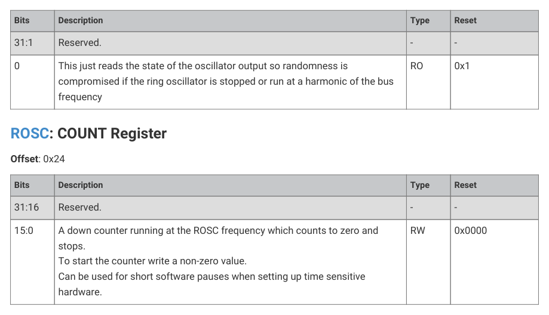

# 8.4.1. Frequency accuracy and calibration

8.4.1. Frequency accuracy and calibration

The low power oscillator has an initial frequency accuracy of ±20%. However, it can be trimmed to ±1.5% using the TRIM

field in the LPOSC register. 63 trim steps are available, each between 1% and 3% of the oscillator’s initial frequency. The

frequency can be trimmed down by 32 steps or up by 31 steps. See Table 616, “low power oscillator output frequency

and trimming” and Section 8.4.3, “List of registers” for details.

| Parameter | Description | Min | Typ | Max | Units |
| --- | --- | --- | --- | --- | --- |
| F 0.initial | initial output frequency | 26.2144 | 32.768 | 39.3216 | kHz |
| trim STEP | frequency trim step | - | 1 | 3 | % of initial output frequency |
| F 0.trimmed | trimmed output frequency | 32.27648 | 32.768 | 33.25952 | kHz |

Table 616. low power

oscillator output

frequency and

trimming

Frequency drift with temperature: ±14%.

8.4. Low Power oscillator (LPOSC)
569

RP2350 Datasheet

Frequency drift with power supply voltage: ±20%.
