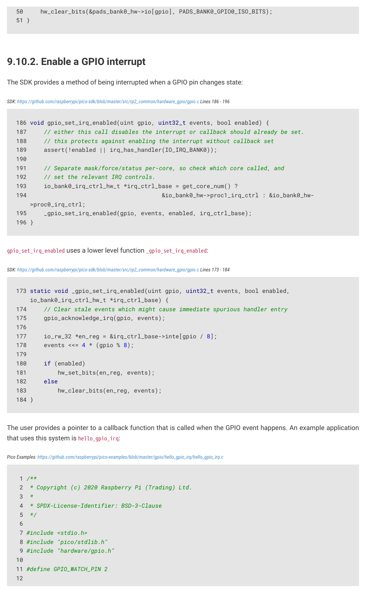

# 9.10.2. Enable a GPIO interrupt

9.10.2. Enable a GPIO interrupt

The SDK provides a method of being interrupted when a GPIO pin changes state:

SDK: https://github.com/raspberrypi/pico-sdk/blob/master/src/rp2_common/hardware_gpio/gpio.c Lines 186 - 196

186 void gpio_set_irq_enabled(uint gpio, uint32_t events, bool enabled) {

187     // either this call disables the interrupt or callback should already be set.

188     // this protects against enabling the interrupt without callback set

189     assert(!enabled || irq_has_handler(IO_IRQ_BANK0));

191     // Separate mask/force/status per-core, so check which core called, and

192     // set the relevant IRQ controls.

193     io_bank0_irq_ctrl_hw_t *irq_ctrl_base = get_core_num() ?

194                                       &io_bank0_hw->proc1_irq_ctrl : &io_bank0_hw-

195     _gpio_set_irq_enabled(gpio, events, enabled, irq_ctrl_base);

gpio_set_irq_enabled uses a lower level function _gpio_set_irq_enabled:

SDK: https://github.com/raspberrypi/pico-sdk/blob/master/src/rp2_common/hardware_gpio/gpio.c Lines 173 - 184

173 static void _gpio_set_irq_enabled(uint gpio, uint32_t events, bool enabled,

    io_bank0_irq_ctrl_hw_t *irq_ctrl_base) {

174     // Clear stale events which might cause immediate spurious handler entry

175     gpio_acknowledge_irq(gpio, events);

177     io_rw_32 *en_reg = &irq_ctrl_base->inte[gpio / 8];

178     events <<= 4 * (gpio % 8);

181         hw_set_bits(en_reg, events);

183         hw_clear_bits(en_reg, events);

The user provides a pointer to a callback function that is called when the GPIO event happens. An example application

that uses this system is hello_gpio_irq:

Pico Examples: https://github.com/raspberrypi/pico-examples/blob/master/gpio/hello_gpio_irq/hello_gpio_irq.c

 2  * Copyright (c) 2020 Raspberry Pi (Trading) Ltd.

 4  * SPDX-License-Identifier: BSD-3-Clause

9.10. Software examples
603

RP2350 Datasheet

13 static char event_str[128];

14 

15 void gpio_event_string(char *buf, uint32_t events);

16 

17 void gpio_callback(uint gpio, uint32_t events) {

18     // Put the GPIO event(s) that just happened into event_str

19     // so we can print it

20     gpio_event_string(event_str, events);

21     printf("GPIO %d %s\n", gpio, event_str);

22 }

23 

24 int main() {

25     stdio_init_all();

26 

27     printf("Hello GPIO IRQ\n");

28     gpio_init(GPIO_WATCH_PIN);

29     gpio_set_irq_enabled_with_callback(GPIO_WATCH_PIN, GPIO_IRQ_EDGE_RISE |

   GPIO_IRQ_EDGE_FALL, true, &gpio_callback);

30 

31     // Wait forever

32     while (1);

33 }

34 

35 

36 static const char *gpio_irq_str[] = {

37         "LEVEL_LOW",  // 0x1

38         "LEVEL_HIGH", // 0x2

39         "EDGE_FALL",  // 0x4

40         "EDGE_RISE"   // 0x8

41 };

42 

43 void gpio_event_string(char *buf, uint32_t events) {

44     for (uint i = 0; i < 4; i++) {

45         uint mask = (1 << i);

46         if (events & mask) {

47             // Copy this event string into the user string

48             const char *event_str = gpio_irq_str[i];

49             while (*event_str != '\0') {

50                 *buf++ = *event_str++;

51             }

52             events &= ~mask;

53 

54             // If more events add ", "

55             if (events) {

56                 *buf++ = ',';

57                 *buf++ = ' ';

58             }

59         }

60     }

61     *buf++ = '\0';

62 }

9.11. List of registers
