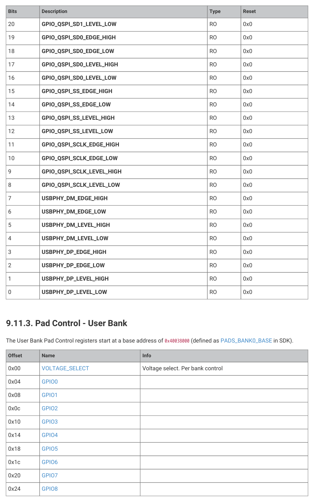
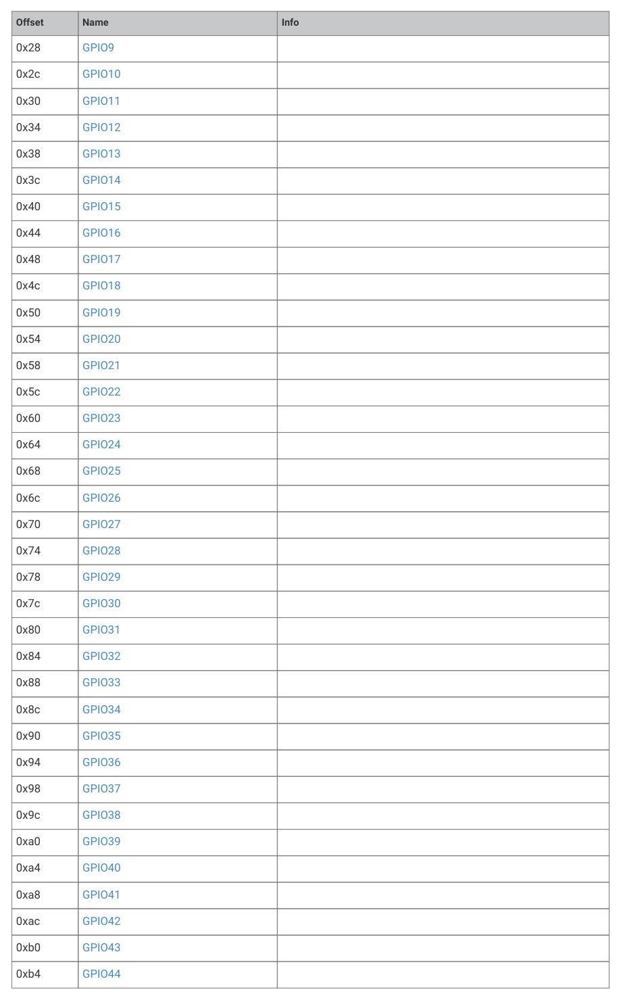
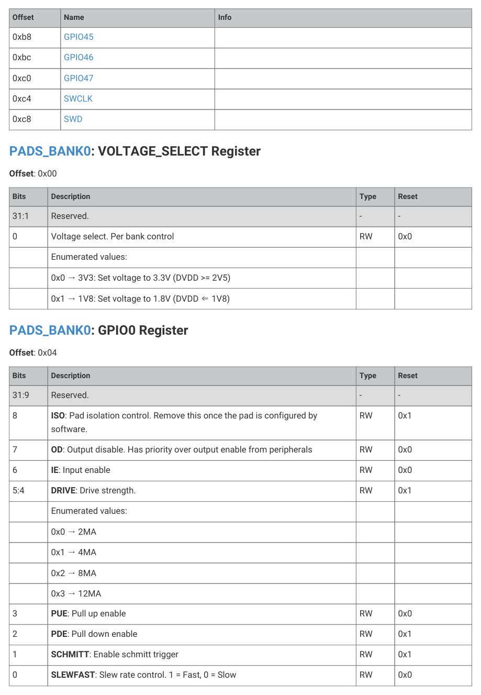
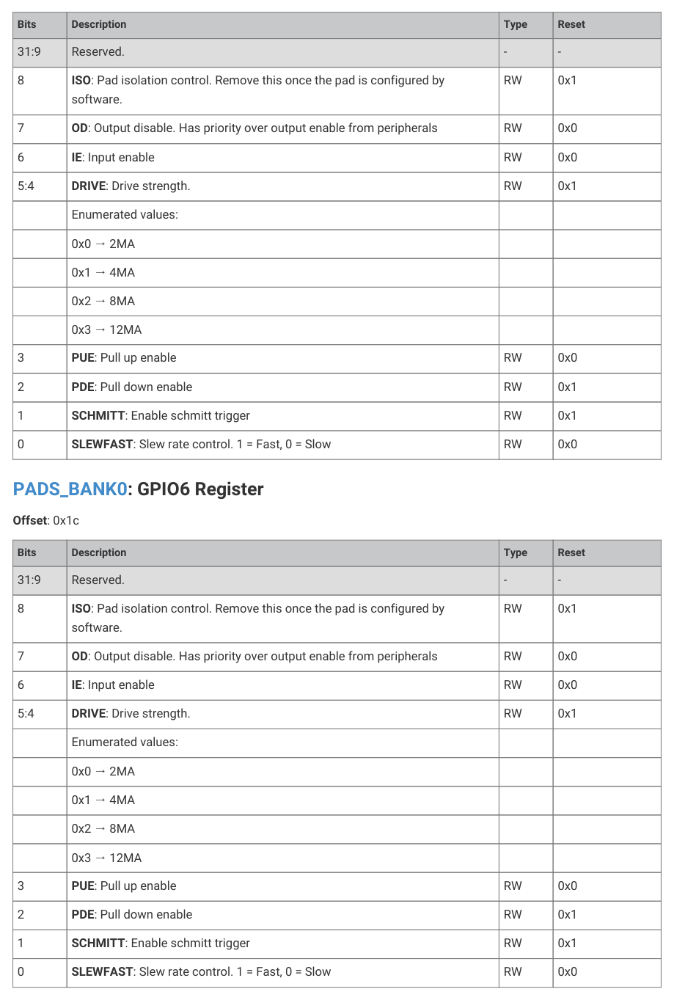
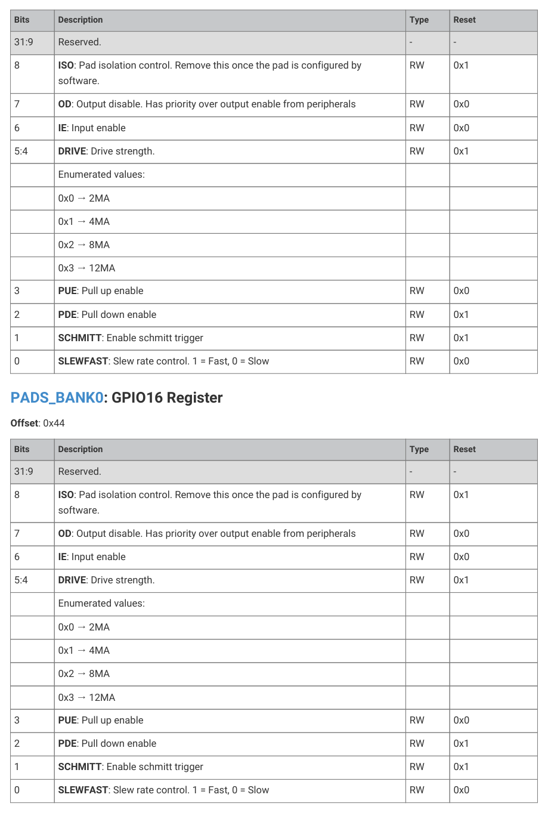
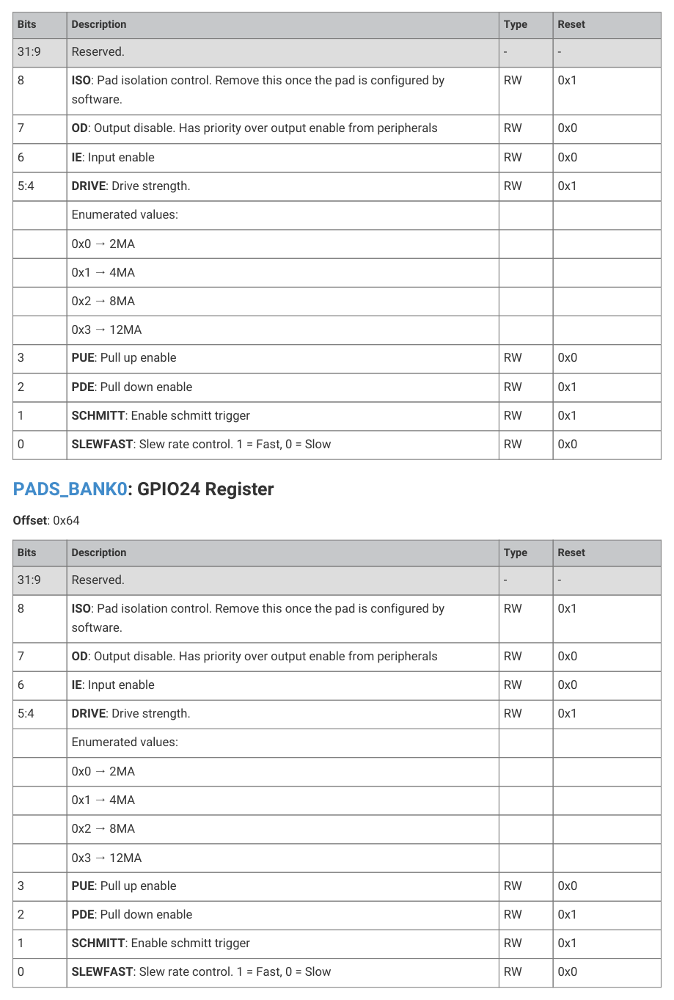
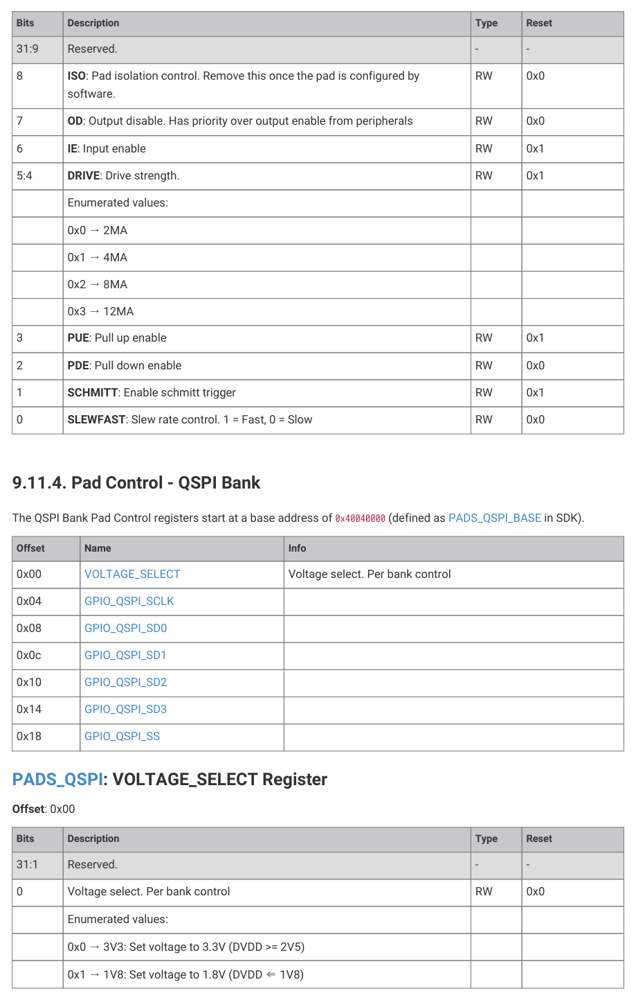

# 9.11.3. Pad Control - User Bank

9.11.3. Pad Control - User Bank

The User Bank Pad Control registers start at a base address of 0x40038000 (defined as PADS_BANK0_BASE in SDK).

Table 851. List of

PADS_BANK0

registers

0x00
VOLTAGE_SELECT
Voltage select. Per bank control

9.11. List of registers
785

RP2350 Datasheet

9.11. List of registers
786

RP2350 Datasheet

PADS_BANK0: VOLTAGE_SELECT Register

Table 852.

Bits
Description
Type
Reset

VOLTAGE_SELECT

Register

31:1
Reserved.
-
-

0
Voltage select. Per bank control
RW
0x0

0x0 → 3V3: Set voltage to 3.3V (DVDD >= 2V5)

0x1 → 1V8: Set voltage to 1.8V (DVDD ⇐ 1V8)

Table 853. GPIO0

Register
Bits
Description
Type
Reset

31:9
Reserved.
-
-

8
ISO: Pad isolation control. Remove this once the pad is configured by

7
OD: Output disable. Has priority over output enable from peripherals
RW
0x0

6
IE: Input enable
RW
0x0

5:4
DRIVE: Drive strength.
RW
0x1

3
PUE: Pull up enable
RW
0x0

2
PDE: Pull down enable
RW
0x1

1
SCHMITT: Enable schmitt trigger
RW
0x1

0
SLEWFAST: Slew rate control. 1 = Fast, 0 = Slow
RW
0x0

PADS_BANK0: GPIO1 Register

Offset: 0x08

9.11. List of registers
787

RP2350 Datasheet

Table 854. GPIO1

Register
Bits
Description
Type
Reset

31:9
Reserved.
-
-

8
ISO: Pad isolation control. Remove this once the pad is configured by

7
OD: Output disable. Has priority over output enable from peripherals
RW
0x0

6
IE: Input enable
RW
0x0

5:4
DRIVE: Drive strength.
RW
0x1

3
PUE: Pull up enable
RW
0x0

2
PDE: Pull down enable
RW
0x1

1
SCHMITT: Enable schmitt trigger
RW
0x1

0
SLEWFAST: Slew rate control. 1 = Fast, 0 = Slow
RW
0x0

Table 855. GPIO2

Register
Bits
Description
Type
Reset

31:9
Reserved.
-
-

8
ISO: Pad isolation control. Remove this once the pad is configured by

7
OD: Output disable. Has priority over output enable from peripherals
RW
0x0

6
IE: Input enable
RW
0x0

5:4
DRIVE: Drive strength.
RW
0x1

3
PUE: Pull up enable
RW
0x0

2
PDE: Pull down enable
RW
0x1

1
SCHMITT: Enable schmitt trigger
RW
0x1

0
SLEWFAST: Slew rate control. 1 = Fast, 0 = Slow
RW
0x0

PADS_BANK0: GPIO3 Register

Offset: 0x10

9.11. List of registers
788

RP2350 Datasheet

Table 856. GPIO3

Register
Bits
Description
Type
Reset

31:9
Reserved.
-
-

8
ISO: Pad isolation control. Remove this once the pad is configured by

7
OD: Output disable. Has priority over output enable from peripherals
RW
0x0

6
IE: Input enable
RW
0x0

5:4
DRIVE: Drive strength.
RW
0x1

3
PUE: Pull up enable
RW
0x0

2
PDE: Pull down enable
RW
0x1

1
SCHMITT: Enable schmitt trigger
RW
0x1

0
SLEWFAST: Slew rate control. 1 = Fast, 0 = Slow
RW
0x0

Table 857. GPIO4

Register
Bits
Description
Type
Reset

31:9
Reserved.
-
-

8
ISO: Pad isolation control. Remove this once the pad is configured by

7
OD: Output disable. Has priority over output enable from peripherals
RW
0x0

6
IE: Input enable
RW
0x0

5:4
DRIVE: Drive strength.
RW
0x1

3
PUE: Pull up enable
RW
0x0

2
PDE: Pull down enable
RW
0x1

1
SCHMITT: Enable schmitt trigger
RW
0x1

0
SLEWFAST: Slew rate control. 1 = Fast, 0 = Slow
RW
0x0

PADS_BANK0: GPIO5 Register

Offset: 0x18

9.11. List of registers
789

RP2350 Datasheet

Table 858. GPIO5

Register
Bits
Description
Type
Reset

31:9
Reserved.
-
-

8
ISO: Pad isolation control. Remove this once the pad is configured by

7
OD: Output disable. Has priority over output enable from peripherals
RW
0x0

6
IE: Input enable
RW
0x0

5:4
DRIVE: Drive strength.
RW
0x1

3
PUE: Pull up enable
RW
0x0

2
PDE: Pull down enable
RW
0x1

1
SCHMITT: Enable schmitt trigger
RW
0x1

0
SLEWFAST: Slew rate control. 1 = Fast, 0 = Slow
RW
0x0

Table 859. GPIO6

Register
Bits
Description
Type
Reset

31:9
Reserved.
-
-

8
ISO: Pad isolation control. Remove this once the pad is configured by

7
OD: Output disable. Has priority over output enable from peripherals
RW
0x0

6
IE: Input enable
RW
0x0

5:4
DRIVE: Drive strength.
RW
0x1

3
PUE: Pull up enable
RW
0x0

2
PDE: Pull down enable
RW
0x1

1
SCHMITT: Enable schmitt trigger
RW
0x1

0
SLEWFAST: Slew rate control. 1 = Fast, 0 = Slow
RW
0x0

PADS_BANK0: GPIO7 Register

Offset: 0x20

9.11. List of registers
790

RP2350 Datasheet

Table 860. GPIO7

Register
Bits
Description
Type
Reset

31:9
Reserved.
-
-

8
ISO: Pad isolation control. Remove this once the pad is configured by

7
OD: Output disable. Has priority over output enable from peripherals
RW
0x0

6
IE: Input enable
RW
0x0

5:4
DRIVE: Drive strength.
RW
0x1

3
PUE: Pull up enable
RW
0x0

2
PDE: Pull down enable
RW
0x1

1
SCHMITT: Enable schmitt trigger
RW
0x1

0
SLEWFAST: Slew rate control. 1 = Fast, 0 = Slow
RW
0x0

Table 861. GPIO8

Register
Bits
Description
Type
Reset

31:9
Reserved.
-
-

8
ISO: Pad isolation control. Remove this once the pad is configured by

7
OD: Output disable. Has priority over output enable from peripherals
RW
0x0

6
IE: Input enable
RW
0x0

5:4
DRIVE: Drive strength.
RW
0x1

3
PUE: Pull up enable
RW
0x0

2
PDE: Pull down enable
RW
0x1

1
SCHMITT: Enable schmitt trigger
RW
0x1

0
SLEWFAST: Slew rate control. 1 = Fast, 0 = Slow
RW
0x0

PADS_BANK0: GPIO9 Register

Offset: 0x28

9.11. List of registers
791

RP2350 Datasheet

Table 862. GPIO9

Register
Bits
Description
Type
Reset

31:9
Reserved.
-
-

8
ISO: Pad isolation control. Remove this once the pad is configured by

7
OD: Output disable. Has priority over output enable from peripherals
RW
0x0

6
IE: Input enable
RW
0x0

5:4
DRIVE: Drive strength.
RW
0x1

3
PUE: Pull up enable
RW
0x0

2
PDE: Pull down enable
RW
0x1

1
SCHMITT: Enable schmitt trigger
RW
0x1

0
SLEWFAST: Slew rate control. 1 = Fast, 0 = Slow
RW
0x0

Table 863. GPIO10

Register
Bits
Description
Type
Reset

31:9
Reserved.
-
-

8
ISO: Pad isolation control. Remove this once the pad is configured by

7
OD: Output disable. Has priority over output enable from peripherals
RW
0x0

6
IE: Input enable
RW
0x0

5:4
DRIVE: Drive strength.
RW
0x1

3
PUE: Pull up enable
RW
0x0

2
PDE: Pull down enable
RW
0x1

1
SCHMITT: Enable schmitt trigger
RW
0x1

0
SLEWFAST: Slew rate control. 1 = Fast, 0 = Slow
RW
0x0

PADS_BANK0: GPIO11 Register

Offset: 0x30

9.11. List of registers
792

RP2350 Datasheet

Table 864. GPIO11

Register
Bits
Description
Type
Reset

31:9
Reserved.
-
-

8
ISO: Pad isolation control. Remove this once the pad is configured by

7
OD: Output disable. Has priority over output enable from peripherals
RW
0x0

6
IE: Input enable
RW
0x0

5:4
DRIVE: Drive strength.
RW
0x1

3
PUE: Pull up enable
RW
0x0

2
PDE: Pull down enable
RW
0x1

1
SCHMITT: Enable schmitt trigger
RW
0x1

0
SLEWFAST: Slew rate control. 1 = Fast, 0 = Slow
RW
0x0

Table 865. GPIO12

Register
Bits
Description
Type
Reset

31:9
Reserved.
-
-

8
ISO: Pad isolation control. Remove this once the pad is configured by

7
OD: Output disable. Has priority over output enable from peripherals
RW
0x0

6
IE: Input enable
RW
0x0

5:4
DRIVE: Drive strength.
RW
0x1

3
PUE: Pull up enable
RW
0x0

2
PDE: Pull down enable
RW
0x1

1
SCHMITT: Enable schmitt trigger
RW
0x1

0
SLEWFAST: Slew rate control. 1 = Fast, 0 = Slow
RW
0x0

PADS_BANK0: GPIO13 Register

Offset: 0x38

9.11. List of registers
793

RP2350 Datasheet

Table 866. GPIO13

Register
Bits
Description
Type
Reset

31:9
Reserved.
-
-

8
ISO: Pad isolation control. Remove this once the pad is configured by

7
OD: Output disable. Has priority over output enable from peripherals
RW
0x0

6
IE: Input enable
RW
0x0

5:4
DRIVE: Drive strength.
RW
0x1

3
PUE: Pull up enable
RW
0x0

2
PDE: Pull down enable
RW
0x1

1
SCHMITT: Enable schmitt trigger
RW
0x1

0
SLEWFAST: Slew rate control. 1 = Fast, 0 = Slow
RW
0x0

Table 867. GPIO14

Register
Bits
Description
Type
Reset

31:9
Reserved.
-
-

8
ISO: Pad isolation control. Remove this once the pad is configured by

7
OD: Output disable. Has priority over output enable from peripherals
RW
0x0

6
IE: Input enable
RW
0x0

5:4
DRIVE: Drive strength.
RW
0x1

3
PUE: Pull up enable
RW
0x0

2
PDE: Pull down enable
RW
0x1

1
SCHMITT: Enable schmitt trigger
RW
0x1

0
SLEWFAST: Slew rate control. 1 = Fast, 0 = Slow
RW
0x0

PADS_BANK0: GPIO15 Register

Offset: 0x40

9.11. List of registers
794

RP2350 Datasheet

Table 868. GPIO15

Register
Bits
Description
Type
Reset

31:9
Reserved.
-
-

8
ISO: Pad isolation control. Remove this once the pad is configured by

7
OD: Output disable. Has priority over output enable from peripherals
RW
0x0

6
IE: Input enable
RW
0x0

5:4
DRIVE: Drive strength.
RW
0x1

3
PUE: Pull up enable
RW
0x0

2
PDE: Pull down enable
RW
0x1

1
SCHMITT: Enable schmitt trigger
RW
0x1

0
SLEWFAST: Slew rate control. 1 = Fast, 0 = Slow
RW
0x0

Table 869. GPIO16

Register
Bits
Description
Type
Reset

31:9
Reserved.
-
-

8
ISO: Pad isolation control. Remove this once the pad is configured by

7
OD: Output disable. Has priority over output enable from peripherals
RW
0x0

6
IE: Input enable
RW
0x0

5:4
DRIVE: Drive strength.
RW
0x1

3
PUE: Pull up enable
RW
0x0

2
PDE: Pull down enable
RW
0x1

1
SCHMITT: Enable schmitt trigger
RW
0x1

0
SLEWFAST: Slew rate control. 1 = Fast, 0 = Slow
RW
0x0

PADS_BANK0: GPIO17 Register

Offset: 0x48

9.11. List of registers
795

RP2350 Datasheet

Table 870. GPIO17

Register
Bits
Description
Type
Reset

31:9
Reserved.
-
-

8
ISO: Pad isolation control. Remove this once the pad is configured by

7
OD: Output disable. Has priority over output enable from peripherals
RW
0x0

6
IE: Input enable
RW
0x0

5:4
DRIVE: Drive strength.
RW
0x1

3
PUE: Pull up enable
RW
0x0

2
PDE: Pull down enable
RW
0x1

1
SCHMITT: Enable schmitt trigger
RW
0x1

0
SLEWFAST: Slew rate control. 1 = Fast, 0 = Slow
RW
0x0

Table 871. GPIO18

Register
Bits
Description
Type
Reset

31:9
Reserved.
-
-

8
ISO: Pad isolation control. Remove this once the pad is configured by

7
OD: Output disable. Has priority over output enable from peripherals
RW
0x0

6
IE: Input enable
RW
0x0

5:4
DRIVE: Drive strength.
RW
0x1

3
PUE: Pull up enable
RW
0x0

2
PDE: Pull down enable
RW
0x1

1
SCHMITT: Enable schmitt trigger
RW
0x1

0
SLEWFAST: Slew rate control. 1 = Fast, 0 = Slow
RW
0x0

PADS_BANK0: GPIO19 Register

Offset: 0x50

9.11. List of registers
796

RP2350 Datasheet

Table 872. GPIO19

Register
Bits
Description
Type
Reset

31:9
Reserved.
-
-

8
ISO: Pad isolation control. Remove this once the pad is configured by

7
OD: Output disable. Has priority over output enable from peripherals
RW
0x0

6
IE: Input enable
RW
0x0

5:4
DRIVE: Drive strength.
RW
0x1

3
PUE: Pull up enable
RW
0x0

2
PDE: Pull down enable
RW
0x1

1
SCHMITT: Enable schmitt trigger
RW
0x1

0
SLEWFAST: Slew rate control. 1 = Fast, 0 = Slow
RW
0x0

Table 873. GPIO20

Register
Bits
Description
Type
Reset

31:9
Reserved.
-
-

8
ISO: Pad isolation control. Remove this once the pad is configured by

7
OD: Output disable. Has priority over output enable from peripherals
RW
0x0

6
IE: Input enable
RW
0x0

5:4
DRIVE: Drive strength.
RW
0x1

3
PUE: Pull up enable
RW
0x0

2
PDE: Pull down enable
RW
0x1

1
SCHMITT: Enable schmitt trigger
RW
0x1

0
SLEWFAST: Slew rate control. 1 = Fast, 0 = Slow
RW
0x0

PADS_BANK0: GPIO21 Register

Offset: 0x58

9.11. List of registers
797

RP2350 Datasheet

Table 874. GPIO21

Register
Bits
Description
Type
Reset

31:9
Reserved.
-
-

8
ISO: Pad isolation control. Remove this once the pad is configured by

7
OD: Output disable. Has priority over output enable from peripherals
RW
0x0

6
IE: Input enable
RW
0x0

5:4
DRIVE: Drive strength.
RW
0x1

3
PUE: Pull up enable
RW
0x0

2
PDE: Pull down enable
RW
0x1

1
SCHMITT: Enable schmitt trigger
RW
0x1

0
SLEWFAST: Slew rate control. 1 = Fast, 0 = Slow
RW
0x0

Table 875. GPIO22

Register
Bits
Description
Type
Reset

31:9
Reserved.
-
-

8
ISO: Pad isolation control. Remove this once the pad is configured by

7
OD: Output disable. Has priority over output enable from peripherals
RW
0x0

6
IE: Input enable
RW
0x0

5:4
DRIVE: Drive strength.
RW
0x1

3
PUE: Pull up enable
RW
0x0

2
PDE: Pull down enable
RW
0x1

1
SCHMITT: Enable schmitt trigger
RW
0x1

0
SLEWFAST: Slew rate control. 1 = Fast, 0 = Slow
RW
0x0

PADS_BANK0: GPIO23 Register

Offset: 0x60

9.11. List of registers
798

RP2350 Datasheet

Table 876. GPIO23

Register
Bits
Description
Type
Reset

31:9
Reserved.
-
-

8
ISO: Pad isolation control. Remove this once the pad is configured by

7
OD: Output disable. Has priority over output enable from peripherals
RW
0x0

6
IE: Input enable
RW
0x0

5:4
DRIVE: Drive strength.
RW
0x1

3
PUE: Pull up enable
RW
0x0

2
PDE: Pull down enable
RW
0x1

1
SCHMITT: Enable schmitt trigger
RW
0x1

0
SLEWFAST: Slew rate control. 1 = Fast, 0 = Slow
RW
0x0

Table 877. GPIO24

Register
Bits
Description
Type
Reset

31:9
Reserved.
-
-

8
ISO: Pad isolation control. Remove this once the pad is configured by

7
OD: Output disable. Has priority over output enable from peripherals
RW
0x0

6
IE: Input enable
RW
0x0

5:4
DRIVE: Drive strength.
RW
0x1

3
PUE: Pull up enable
RW
0x0

2
PDE: Pull down enable
RW
0x1

1
SCHMITT: Enable schmitt trigger
RW
0x1

0
SLEWFAST: Slew rate control. 1 = Fast, 0 = Slow
RW
0x0

PADS_BANK0: GPIO25 Register

Offset: 0x68

9.11. List of registers
799

RP2350 Datasheet

Table 878. GPIO25

Register
Bits
Description
Type
Reset

31:9
Reserved.
-
-

8
ISO: Pad isolation control. Remove this once the pad is configured by

7
OD: Output disable. Has priority over output enable from peripherals
RW
0x0

6
IE: Input enable
RW
0x0

5:4
DRIVE: Drive strength.
RW
0x1

3
PUE: Pull up enable
RW
0x0

2
PDE: Pull down enable
RW
0x1

1
SCHMITT: Enable schmitt trigger
RW
0x1

0
SLEWFAST: Slew rate control. 1 = Fast, 0 = Slow
RW
0x0

Table 879. GPIO26

Register
Bits
Description
Type
Reset

31:9
Reserved.
-
-

8
ISO: Pad isolation control. Remove this once the pad is configured by

7
OD: Output disable. Has priority over output enable from peripherals
RW
0x0

6
IE: Input enable
RW
0x0

5:4
DRIVE: Drive strength.
RW
0x1

3
PUE: Pull up enable
RW
0x0

2
PDE: Pull down enable
RW
0x1

1
SCHMITT: Enable schmitt trigger
RW
0x1

0
SLEWFAST: Slew rate control. 1 = Fast, 0 = Slow
RW
0x0

PADS_BANK0: GPIO27 Register

Offset: 0x70

9.11. List of registers
800

RP2350 Datasheet

Table 880. GPIO27

Register
Bits
Description
Type
Reset

31:9
Reserved.
-
-

8
ISO: Pad isolation control. Remove this once the pad is configured by

7
OD: Output disable. Has priority over output enable from peripherals
RW
0x0

6
IE: Input enable
RW
0x0

5:4
DRIVE: Drive strength.
RW
0x1

3
PUE: Pull up enable
RW
0x0

2
PDE: Pull down enable
RW
0x1

1
SCHMITT: Enable schmitt trigger
RW
0x1

0
SLEWFAST: Slew rate control. 1 = Fast, 0 = Slow
RW
0x0

Table 881. GPIO28

Register
Bits
Description
Type
Reset

31:9
Reserved.
-
-

8
ISO: Pad isolation control. Remove this once the pad is configured by

7
OD: Output disable. Has priority over output enable from peripherals
RW
0x0

6
IE: Input enable
RW
0x0

5:4
DRIVE: Drive strength.
RW
0x1

3
PUE: Pull up enable
RW
0x0

2
PDE: Pull down enable
RW
0x1

1
SCHMITT: Enable schmitt trigger
RW
0x1

0
SLEWFAST: Slew rate control. 1 = Fast, 0 = Slow
RW
0x0

PADS_BANK0: GPIO29 Register

Offset: 0x78

9.11. List of registers
801

RP2350 Datasheet

Table 882. GPIO29

Register
Bits
Description
Type
Reset

31:9
Reserved.
-
-

8
ISO: Pad isolation control. Remove this once the pad is configured by

7
OD: Output disable. Has priority over output enable from peripherals
RW
0x0

6
IE: Input enable
RW
0x0

5:4
DRIVE: Drive strength.
RW
0x1

3
PUE: Pull up enable
RW
0x0

2
PDE: Pull down enable
RW
0x1

1
SCHMITT: Enable schmitt trigger
RW
0x1

0
SLEWFAST: Slew rate control. 1 = Fast, 0 = Slow
RW
0x0

Table 883. GPIO30

Register
Bits
Description
Type
Reset

31:9
Reserved.
-
-

8
ISO: Pad isolation control. Remove this once the pad is configured by

7
OD: Output disable. Has priority over output enable from peripherals
RW
0x0

6
IE: Input enable
RW
0x0

5:4
DRIVE: Drive strength.
RW
0x1

3
PUE: Pull up enable
RW
0x0

2
PDE: Pull down enable
RW
0x1

1
SCHMITT: Enable schmitt trigger
RW
0x1

0
SLEWFAST: Slew rate control. 1 = Fast, 0 = Slow
RW
0x0

PADS_BANK0: GPIO31 Register

Offset: 0x80

9.11. List of registers
802

RP2350 Datasheet

Table 884. GPIO31

Register
Bits
Description
Type
Reset

31:9
Reserved.
-
-

8
ISO: Pad isolation control. Remove this once the pad is configured by

7
OD: Output disable. Has priority over output enable from peripherals
RW
0x0

6
IE: Input enable
RW
0x0

5:4
DRIVE: Drive strength.
RW
0x1

3
PUE: Pull up enable
RW
0x0

2
PDE: Pull down enable
RW
0x1

1
SCHMITT: Enable schmitt trigger
RW
0x1

0
SLEWFAST: Slew rate control. 1 = Fast, 0 = Slow
RW
0x0

Table 885. GPIO32

Register
Bits
Description
Type
Reset

31:9
Reserved.
-
-

8
ISO: Pad isolation control. Remove this once the pad is configured by

7
OD: Output disable. Has priority over output enable from peripherals
RW
0x0

6
IE: Input enable
RW
0x0

5:4
DRIVE: Drive strength.
RW
0x1

3
PUE: Pull up enable
RW
0x0

2
PDE: Pull down enable
RW
0x1

1
SCHMITT: Enable schmitt trigger
RW
0x1

0
SLEWFAST: Slew rate control. 1 = Fast, 0 = Slow
RW
0x0

PADS_BANK0: GPIO33 Register

Offset: 0x88

9.11. List of registers
803

RP2350 Datasheet

Table 886. GPIO33

Register
Bits
Description
Type
Reset

31:9
Reserved.
-
-

8
ISO: Pad isolation control. Remove this once the pad is configured by

7
OD: Output disable. Has priority over output enable from peripherals
RW
0x0

6
IE: Input enable
RW
0x0

5:4
DRIVE: Drive strength.
RW
0x1

3
PUE: Pull up enable
RW
0x0

2
PDE: Pull down enable
RW
0x1

1
SCHMITT: Enable schmitt trigger
RW
0x1

0
SLEWFAST: Slew rate control. 1 = Fast, 0 = Slow
RW
0x0

Table 887. GPIO34

Register
Bits
Description
Type
Reset

31:9
Reserved.
-
-

8
ISO: Pad isolation control. Remove this once the pad is configured by

7
OD: Output disable. Has priority over output enable from peripherals
RW
0x0

6
IE: Input enable
RW
0x0

5:4
DRIVE: Drive strength.
RW
0x1

3
PUE: Pull up enable
RW
0x0

2
PDE: Pull down enable
RW
0x1

1
SCHMITT: Enable schmitt trigger
RW
0x1

0
SLEWFAST: Slew rate control. 1 = Fast, 0 = Slow
RW
0x0

PADS_BANK0: GPIO35 Register

Offset: 0x90

9.11. List of registers
804

RP2350 Datasheet

Table 888. GPIO35

Register
Bits
Description
Type
Reset

31:9
Reserved.
-
-

8
ISO: Pad isolation control. Remove this once the pad is configured by

7
OD: Output disable. Has priority over output enable from peripherals
RW
0x0

6
IE: Input enable
RW
0x0

5:4
DRIVE: Drive strength.
RW
0x1

3
PUE: Pull up enable
RW
0x0

2
PDE: Pull down enable
RW
0x1

1
SCHMITT: Enable schmitt trigger
RW
0x1

0
SLEWFAST: Slew rate control. 1 = Fast, 0 = Slow
RW
0x0

Table 889. GPIO36

Register
Bits
Description
Type
Reset

31:9
Reserved.
-
-

8
ISO: Pad isolation control. Remove this once the pad is configured by

7
OD: Output disable. Has priority over output enable from peripherals
RW
0x0

6
IE: Input enable
RW
0x0

5:4
DRIVE: Drive strength.
RW
0x1

3
PUE: Pull up enable
RW
0x0

2
PDE: Pull down enable
RW
0x1

1
SCHMITT: Enable schmitt trigger
RW
0x1

0
SLEWFAST: Slew rate control. 1 = Fast, 0 = Slow
RW
0x0

PADS_BANK0: GPIO37 Register

Offset: 0x98

9.11. List of registers
805

RP2350 Datasheet

Table 890. GPIO37

Register
Bits
Description
Type
Reset

31:9
Reserved.
-
-

8
ISO: Pad isolation control. Remove this once the pad is configured by

7
OD: Output disable. Has priority over output enable from peripherals
RW
0x0

6
IE: Input enable
RW
0x0

5:4
DRIVE: Drive strength.
RW
0x1

3
PUE: Pull up enable
RW
0x0

2
PDE: Pull down enable
RW
0x1

1
SCHMITT: Enable schmitt trigger
RW
0x1

0
SLEWFAST: Slew rate control. 1 = Fast, 0 = Slow
RW
0x0

Table 891. GPIO38

Register
Bits
Description
Type
Reset

31:9
Reserved.
-
-

8
ISO: Pad isolation control. Remove this once the pad is configured by

7
OD: Output disable. Has priority over output enable from peripherals
RW
0x0

6
IE: Input enable
RW
0x0

5:4
DRIVE: Drive strength.
RW
0x1

3
PUE: Pull up enable
RW
0x0

2
PDE: Pull down enable
RW
0x1

1
SCHMITT: Enable schmitt trigger
RW
0x1

0
SLEWFAST: Slew rate control. 1 = Fast, 0 = Slow
RW
0x0

PADS_BANK0: GPIO39 Register

Offset: 0xa0

9.11. List of registers
806

RP2350 Datasheet

Table 892. GPIO39

Register
Bits
Description
Type
Reset

31:9
Reserved.
-
-

8
ISO: Pad isolation control. Remove this once the pad is configured by

7
OD: Output disable. Has priority over output enable from peripherals
RW
0x0

6
IE: Input enable
RW
0x0

5:4
DRIVE: Drive strength.
RW
0x1

3
PUE: Pull up enable
RW
0x0

2
PDE: Pull down enable
RW
0x1

1
SCHMITT: Enable schmitt trigger
RW
0x1

0
SLEWFAST: Slew rate control. 1 = Fast, 0 = Slow
RW
0x0

Table 893. GPIO40

Register
Bits
Description
Type
Reset

31:9
Reserved.
-
-

8
ISO: Pad isolation control. Remove this once the pad is configured by

7
OD: Output disable. Has priority over output enable from peripherals
RW
0x0

6
IE: Input enable
RW
0x0

5:4
DRIVE: Drive strength.
RW
0x1

3
PUE: Pull up enable
RW
0x0

2
PDE: Pull down enable
RW
0x1

1
SCHMITT: Enable schmitt trigger
RW
0x1

0
SLEWFAST: Slew rate control. 1 = Fast, 0 = Slow
RW
0x0

PADS_BANK0: GPIO41 Register

Offset: 0xa8

9.11. List of registers
807

RP2350 Datasheet

Table 894. GPIO41

Register
Bits
Description
Type
Reset

31:9
Reserved.
-
-

8
ISO: Pad isolation control. Remove this once the pad is configured by

7
OD: Output disable. Has priority over output enable from peripherals
RW
0x0

6
IE: Input enable
RW
0x0

5:4
DRIVE: Drive strength.
RW
0x1

3
PUE: Pull up enable
RW
0x0

2
PDE: Pull down enable
RW
0x1

1
SCHMITT: Enable schmitt trigger
RW
0x1

0
SLEWFAST: Slew rate control. 1 = Fast, 0 = Slow
RW
0x0

Table 895. GPIO42

Register
Bits
Description
Type
Reset

31:9
Reserved.
-
-

8
ISO: Pad isolation control. Remove this once the pad is configured by

7
OD: Output disable. Has priority over output enable from peripherals
RW
0x0

6
IE: Input enable
RW
0x0

5:4
DRIVE: Drive strength.
RW
0x1

3
PUE: Pull up enable
RW
0x0

2
PDE: Pull down enable
RW
0x1

1
SCHMITT: Enable schmitt trigger
RW
0x1

0
SLEWFAST: Slew rate control. 1 = Fast, 0 = Slow
RW
0x0

PADS_BANK0: GPIO43 Register

Offset: 0xb0

9.11. List of registers
808

RP2350 Datasheet

Table 896. GPIO43

Register
Bits
Description
Type
Reset

31:9
Reserved.
-
-

8
ISO: Pad isolation control. Remove this once the pad is configured by

7
OD: Output disable. Has priority over output enable from peripherals
RW
0x0

6
IE: Input enable
RW
0x0

5:4
DRIVE: Drive strength.
RW
0x1

3
PUE: Pull up enable
RW
0x0

2
PDE: Pull down enable
RW
0x1

1
SCHMITT: Enable schmitt trigger
RW
0x1

0
SLEWFAST: Slew rate control. 1 = Fast, 0 = Slow
RW
0x0

Table 897. GPIO44

Register
Bits
Description
Type
Reset

31:9
Reserved.
-
-

8
ISO: Pad isolation control. Remove this once the pad is configured by

7
OD: Output disable. Has priority over output enable from peripherals
RW
0x0

6
IE: Input enable
RW
0x0

5:4
DRIVE: Drive strength.
RW
0x1

3
PUE: Pull up enable
RW
0x0

2
PDE: Pull down enable
RW
0x1

1
SCHMITT: Enable schmitt trigger
RW
0x1

0
SLEWFAST: Slew rate control. 1 = Fast, 0 = Slow
RW
0x0

PADS_BANK0: GPIO45 Register

Offset: 0xb8

9.11. List of registers
809

RP2350 Datasheet

Table 898. GPIO45

Register
Bits
Description
Type
Reset

31:9
Reserved.
-
-

8
ISO: Pad isolation control. Remove this once the pad is configured by

7
OD: Output disable. Has priority over output enable from peripherals
RW
0x0

6
IE: Input enable
RW
0x0

5:4
DRIVE: Drive strength.
RW
0x1

3
PUE: Pull up enable
RW
0x0

2
PDE: Pull down enable
RW
0x1

1
SCHMITT: Enable schmitt trigger
RW
0x1

0
SLEWFAST: Slew rate control. 1 = Fast, 0 = Slow
RW
0x0

Table 899. GPIO46

Register
Bits
Description
Type
Reset

31:9
Reserved.
-
-

8
ISO: Pad isolation control. Remove this once the pad is configured by

7
OD: Output disable. Has priority over output enable from peripherals
RW
0x0

6
IE: Input enable
RW
0x0

5:4
DRIVE: Drive strength.
RW
0x1

3
PUE: Pull up enable
RW
0x0

2
PDE: Pull down enable
RW
0x1

1
SCHMITT: Enable schmitt trigger
RW
0x1

0
SLEWFAST: Slew rate control. 1 = Fast, 0 = Slow
RW
0x0

PADS_BANK0: GPIO47 Register

Offset: 0xc0

9.11. List of registers
810

RP2350 Datasheet

Table 900. GPIO47

Register
Bits
Description
Type
Reset

31:9
Reserved.
-
-

8
ISO: Pad isolation control. Remove this once the pad is configured by

7
OD: Output disable. Has priority over output enable from peripherals
RW
0x0

6
IE: Input enable
RW
0x0

5:4
DRIVE: Drive strength.
RW
0x1

3
PUE: Pull up enable
RW
0x0

2
PDE: Pull down enable
RW
0x1

1
SCHMITT: Enable schmitt trigger
RW
0x1

0
SLEWFAST: Slew rate control. 1 = Fast, 0 = Slow
RW
0x0

Table 901. SWCLK

Register
Bits
Description
Type
Reset

31:9
Reserved.
-
-

8
ISO: Pad isolation control. Remove this once the pad is configured by

7
OD: Output disable. Has priority over output enable from peripherals
RW
0x0

6
IE: Input enable
RW
0x1

5:4
DRIVE: Drive strength.
RW
0x1

3
PUE: Pull up enable
RW
0x1

2
PDE: Pull down enable
RW
0x0

1
SCHMITT: Enable schmitt trigger
RW
0x1

0
SLEWFAST: Slew rate control. 1 = Fast, 0 = Slow
RW
0x0

PADS_BANK0: SWD Register

Offset: 0xc8

9.11. List of registers
811

RP2350 Datasheet

Table 902. SWD

Register
Bits
Description
Type
Reset

31:9
Reserved.
-
-

8
ISO: Pad isolation control. Remove this once the pad is configured by

7
OD: Output disable. Has priority over output enable from peripherals
RW
0x0

6
IE: Input enable
RW
0x1

5:4
DRIVE: Drive strength.
RW
0x1

3
PUE: Pull up enable
RW
0x1

2
PDE: Pull down enable
RW
0x0

1
SCHMITT: Enable schmitt trigger
RW
0x1

0
SLEWFAST: Slew rate control. 1 = Fast, 0 = Slow
RW
0x0
