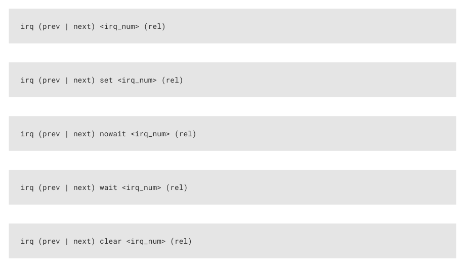

# 11.4.11. IRQ

11.4.11. IRQ

11.4.11.1. Encoding

| Bit | 15 | 14 | 13 | 12 | 11 | 10 | 9 | 8 | 7 | 6 | 5 | 4 | 3 | 2 | 1 | 0 |
| --- | --- | --- | --- | --- | --- | --- | --- | --- | --- | --- | --- | --- | --- | --- | --- | --- |
| IRQ | 1 | 1 | 0 |  | Del | ay/side | -set |  | 0 | Clr | Wait | IdxM | ode |  | Index |  |

11.4.11.2. Operation

Set or clear the IRQ flag selected by Index argument.

• Clear: if 1, clear the flag selected by Index, instead of raising it. If Clear is set, the Wait bit has no effect.
• Wait: if 1, halt until the raised flag is lowered again, e.g. if a system interrupt handler has acknowledged the flag.
• Index: specifies an IRQ index from 0-7. This IRQ flag will be set/cleared depending on the Clear bit.
• IdxMode: modify the behaviour if the Index field, either modifying the index, or indexing IRQ flags from a different

PIO block:

◦00: the three LSBs are used directly to index the IRQ flags in this PIO block.

◦01 (PREV): the instruction references an IRQ flag from the next-lower-numbered PIO in the system, wrapping to

the highest-numbered PIO if this is PIO0.

◦10 (REL): the state machine ID (0…3) is added to the IRQ flag index, by way of modulo-4 addition on the two

LSBs. For example, state machine 2 with a flag value of '0x11' will wait on flag 3, and a flag value of '0x13' will

wait on flag 1. This allows multiple state machines running the same program to synchronise with each other.

◦11 (NEXT): the instruction references an IRQ flag from the next-higher-numbered PIO in the system, wrapping to

PIO0 if this is the highest-numbered PIO.

All IRQ flags 0-7 can be routed out to system level interrupts, on either of the PIO’s two external interrupt request lines,

configured by IRQ0_INTE and IRQ1_INTE.

The modulo addition mode (REL) allows relative addressing of 'IRQ' and 'WAIT' instructions, for synchronising state

machines which are running the same program. Bit 2 (the third LSB) is unaffected by this addition.

The NEXT/PREV modes can be used to synchronise between state machines in different PIO blocks. If these state

machines' clocks are divided, their clock dividers must be the same, and must have been synchronised by writing

CTRL.NEXTPREV_CLKDIV_RESTART in addition to the relevant NEXT_PIO_MASK/PREV_PIO_MASK bits. Note that the

cross-PIO connection is severed between PIOs with different accessibility to Non-secure code, as per ACCESSCTRL.

If Wait is set, Delay cycles do not begin until after the wait period elapses.

11.4. Instruction Set
900

RP2350 Datasheet

11.4.11.3. Assembler syntax

irq (prev | next) <irq_num> (rel)

irq (prev | next) set <irq_num> (rel)

irq (prev | next) nowait <irq_num> (rel)

irq (prev | next) wait <irq_num> (rel)

irq (prev | next) clear <irq_num> (rel)

where:

| <irq num> (rel) _ | A value (see Section 11.3.2) specifying the IRQ number to target (0-7). If rel is present, then the actual IRQ number used is calculated by replacing the low two bits of the IRQ number (irq num ) _ 10 with the low two bits of the sum (irq num + sm num ) where sm num is the state machine number. _ 10 _ 10 _ 10 |
| --- | --- |
| irq | Set the IRQ without waiting. |
| irq set | Set the IRQ without waiting. |
| irq nowait | Set the IRQ without waiting. |
| irq wait | Set the IRQ and wait for it to be cleared before proceeding. |
| irq clear | Clear the IRQ. |
| prev | To target the IRQ on the next lower numbered PIO block instead of the current PIO block |
| next | To target the IRQ on the next higher numbered PIO block instead of the current PIO block |
