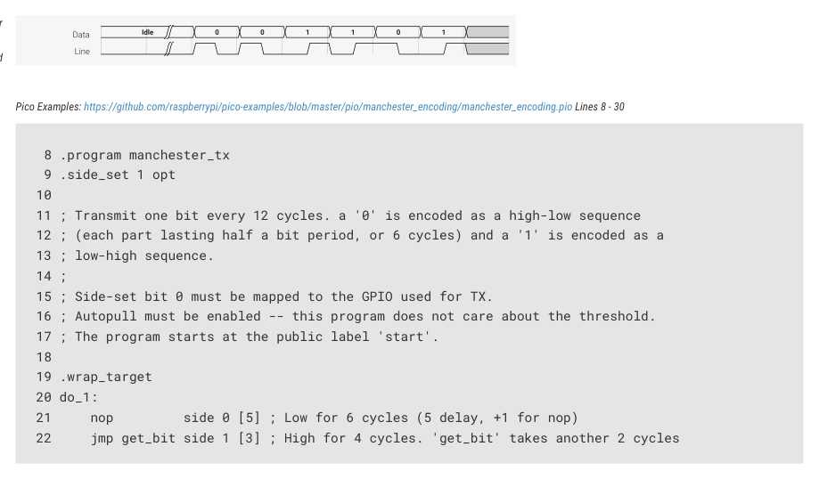

# 11.6.5. Manchester serial TX and RX

11.6.5. Manchester serial TX and RX

Figure 59. Manchester

serial line code. Each

data bit is represented

by either a high pulse

followed by a low

Pico Examples: https://github.com/raspberrypi/pico-examples/blob/master/pio/manchester_encoding/manchester_encoding.pio Lines 8 - 30

pulse (representing a

'0' bit) or a low pulse

followed by a high

pulse (a '1' bit).

11 ; Transmit one bit every 12 cycles. a '0' is encoded as a high-low sequence

12 ; (each part lasting half a bit period, or 6 cycles) and a '1' is encoded as a

15 ; Side-set bit 0 must be mapped to the GPIO used for TX.

16 ; Autopull must be enabled -- this program does not care about the threshold.

17 ; The program starts at the public label 'start'.

21     nop         side 0 [5] ; Low for 6 cycles (5 delay, +1 for nop)

22     jmp get_bit side 1 [3] ; High for 4 cycles. 'get_bit' takes another 2 cycles

11.6. Examples
926

RP2350 Datasheet

23 do_0:

24     nop         side 1 [5] ; Output high for 6 cycles

25     nop         side 0 [3] ; Output low for 4 cycles

26 public start:

27 get_bit:

28     out x, 1               ; Always shift out one bit from OSR to X, so we can

29     jmp !x do_0            ; branch on it. Autopull refills the OSR when empty.

30 .wrap

Starting from the label called start, this program shifts one data bit at a time into the X register, so that it can branch on

the value. Depending on the outcome, it uses side-set to drive either a 1-0 or 0-1 sequence onto the chosen GPIO. This

program uses autopull (Section 11.5.4.2) to automatically replenish the OSR from the TX FIFO once a certain amount of

data has been shifted out, without interrupting program control flow or timing. This feature is enabled by a helper

function in the .pio file which configures and starts the state machine:

Pico Examples: https://github.com/raspberrypi/pico-examples/blob/master/pio/manchester_encoding/manchester_encoding.pio Lines 33 - 46

33 static inline void manchester_tx_program_init(PIO pio, uint sm, uint offset, uint pin, float

   div) {

34     pio_sm_set_pins_with_mask(pio, sm, 0, 1u << pin);

35     pio_sm_set_consecutive_pindirs(pio, sm, pin, 1, true);

36     pio_gpio_init(pio, pin);

37 

38     pio_sm_config c = manchester_tx_program_get_default_config(offset);

39     sm_config_set_sideset_pins(&c, pin);

40     sm_config_set_out_shift(&c, true, true, 32);

41     sm_config_set_fifo_join(&c, PIO_FIFO_JOIN_TX);

42     sm_config_set_clkdiv(&c, div);

43     pio_sm_init(pio, sm, offset + manchester_tx_offset_start, &c);

44 

45     pio_sm_set_enabled(pio, sm, true);

46 }

Another state machine can be programmed to recover the original data from the transmitted signal:

Pico Examples: https://github.com/raspberrypi/pico-examples/blob/master/pio/manchester_encoding/manchester_encoding.pio Lines 49 - 71

49 .program manchester_rx

50 

51 ; Assumes line is idle low, first bit is 0

52 ; One bit is 12 cycles

53 ; a '0' is encoded as 10

54 ; a '1' is encoded as 01

55 ;

56 ; Both the IN base and the JMP pin mapping must be pointed at the GPIO used for RX.

57 ; Autopush must be enabled.

58 ; Before enabling the SM, it should be placed in a 'wait 1, pin` state, so that

59 ; it will not start sampling until the initial line idle state ends.

60 

61 start_of_0:            ; We are 0.25 bits into a 0 - signal is high

62     wait 0 pin 0       ; Wait for the 1->0 transition - at this point we are 0.5 into the bit

63     in y, 1 [8]        ; Emit a 0, sleep 3/4 of a bit

64     jmp pin start_of_0 ; If signal is 1 again, it's another 0 bit, otherwise it's a 1

65 

66 .wrap_target

67 start_of_1:            ; We are 0.25 bits into a 1 - signal is 1   

68     wait 1 pin 0       ; Wait for the 0->1 transition - at this point we are 0.5 into the bit

69     in x, 1 [8]        ; Emit a 1, sleep 3/4 of a bit

70     jmp pin start_of_0 ; If signal is 0 again, it's another 1 bit otherwise it's a 0

11.6. Examples
927

RP2350 Datasheet

71 .wrap

The main complication here is staying aligned to the input transitions, as the transmitter’s and receiver’s clocks may

drift relative to one another. In Manchester code there is always a transition in the centre of the symbol, and based on

the initial line state (high or low) we know the direction of this transition, so we can use a wait instruction to

resynchronise to the line transitions on every data bit.

This program expects the X and Y registers to be initialised with the values 1 and 0 respectively, so that a constant 1 or

0 can be provided to the in instruction. The code that configures the state machine initialises these registers by

executing some set instructions before setting the program running.

Pico Examples: https://github.com/raspberrypi/pico-examples/blob/master/pio/manchester_encoding/manchester_encoding.pio Lines 74 - 94

74 static inline void manchester_rx_program_init(PIO pio, uint sm, uint offset, uint pin, float

   div) {

75     pio_sm_set_consecutive_pindirs(pio, sm, pin, 1, false);

76     pio_gpio_init(pio, pin);

77 

78     pio_sm_config c = manchester_rx_program_get_default_config(offset);

79     sm_config_set_in_pins(&c, pin); // for WAIT

80     sm_config_set_jmp_pin(&c, pin); // for JMP

81     sm_config_set_in_shift(&c, true, true, 32);

82     sm_config_set_fifo_join(&c, PIO_FIFO_JOIN_RX);

83     sm_config_set_clkdiv(&c, div);

84     pio_sm_init(pio, sm, offset, &c);

85 

86     // X and Y are set to 0 and 1, to conveniently emit these to ISR/FIFO.

87     pio_sm_exec(pio, sm, pio_encode_set(pio_x, 1));

88     pio_sm_exec(pio, sm, pio_encode_set(pio_y, 0));

89     // Assume line is idle low, and first transmitted bit is 0. Put SM in a

90     // wait state before enabling. RX will begin once the first 0 symbol is

91     // detected.

92     pio_sm_exec(pio, sm, pio_encode_wait_pin(1, 0) | pio_encode_delay(2));

93     pio_sm_set_enabled(pio, sm, true);

94 }

The example C program in the SDK will transmit Manchester serial data from GPIO2 to GPIO3 at approximately 10 Mb/s

(assuming a system clock of 125 MHz).

Pico Examples: https://github.com/raspberrypi/pico-examples/blob/master/pio/manchester_encoding/manchester_encoding.c Lines 20 - 43

20 int main() {

21     stdio_init_all();

22 

23     PIO pio = pio0;

24     uint sm_tx = 0;

25     uint sm_rx = 1;

26 

27     uint offset_tx = pio_add_program(pio, &manchester_tx_program);

28     uint offset_rx = pio_add_program(pio, &manchester_rx_program);

29     printf("Transmit program loaded at %d\n", offset_tx);

30     printf("Receive program loaded at %d\n", offset_rx);

31 

32     manchester_tx_program_init(pio, sm_tx, offset_tx, pin_tx, 1.f);

33     manchester_rx_program_init(pio, sm_rx, offset_rx, pin_rx, 1.f);

34 

35     pio_sm_set_enabled(pio, sm_tx, false);

36     pio_sm_put_blocking(pio, sm_tx, 0);

37     pio_sm_put_blocking(pio, sm_tx, 0x0ff0a55a);

38     pio_sm_put_blocking(pio, sm_tx, 0x12345678);

11.6. Examples
928

RP2350 Datasheet

39     pio_sm_set_enabled(pio, sm_tx, true);

40 

41     for (int i = 0; i < 3; ++i)

42         printf("%08x\n", pio_sm_get_blocking(pio, sm_rx));

43 }
