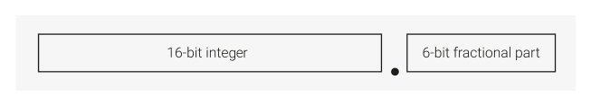

# 12.1.3. Operation

12.1.3. Operation

12.1.3.1. Clock signals

The frequency selected for UARTCLK must accommodate the required range of baud rates:

• FUARTCLK (min) ≥ 16 × baud_rate (max)
• FUARTCLK (max) ≤ 16 × 65535 × baud_rate (min)

For example, for a range of baud rates from 110 baud to 460800 baud the UARTCLK frequency must be between

7.3728MHz to 115.34MHz.

To use all baud rates, the UARTCLK frequency must fall within the required error limits.

There is also a constraint on the ratio of clock frequencies for PCLK to UARTCLK. The frequency of UARTCLK must be no more

than 5/3 times faster than the frequency of PCLK:

• FUARTCLK ≤ 5/3 × FPCLK

For example, in UART mode, to generate 921600 baud when UARTCLK is 14.7456MHz, PCLK must be greater than or equal

to 8.85276MHz. This ensures that the UART has sufficient time to write the received data to the receive FIFO.

12.1.3.2. UART operation

Control data is written to the UART Line Control Register, UARTLCR. This register is 30 bits wide internally, but provides

external access through the APB interface by writes to the following registers:

• UARTLCR_H, which defines the following:

◦transmission parameters

◦word length

◦buffer mode

◦number of transmitted stop bits

◦parity mode

◦break generation
• UARTIBRD, which defines the integer baud rate divider
• UARTFBRD, which defines the fractional baud rate divider

12.1.3.2.1. Fractional baud rate divider

The baud rate divisor is a 22-bit number consisting of a 16-bit integer and a 6-bit fractional part. The baud rate generator

uses the baud rate divisor to determine the bit period. The fractional baud rate divider enables the use of any clock with

a frequency greater than 3.6864MHz to act as UARTCLK, while it is still possible to generate all the standard baud rates.

The 16-bit integer is written to the Integer Baud Rate Register, UARTIBRD. The 6-bit fractional part is written to the

Fractional Baud Rate Register, UARTFBRD. The Baud Rate Divisor has the following relationship to UARTCLK:

12.1. UART
964

RP2350 Datasheet

Baud Rate Divisor = UARTCLK/(16×Baud Rate) = 
 where 
 is the integer part and 
 is the

fractional part separated by a decimal point as shown in Figure 64.

Figure 64. Baud rate

divisor.

To calculate the 6-bit number (
), multiply the fractional part of the required baud rate divisor by 64 (
, where 
 is the

width of the UARTFBRD register) and add 0.5 to account for rounding errors:

The UART generates an internal clock enable signal, Baud16. This is a stream of UARTCLK-wide pulses with an average

frequency of 16 times the required baud rate. Divide this signal by 16 to give the transmit clock. A low number in the

baud rate divisor produces a short bit period, and a high number in the baud rate divisor produces a long bit period.

12.1.3.2.2. Data transmission or reception

The UART uses two 32-byte FIFOs to store data received and transmitted. The receive FIFO has an extra four bits per

character for status information. For transmission, data is written into the transmit FIFO. If the UART is enabled, it

causes a data frame to start transmitting with the parameters indicated in the Line Control Register, UARTLCR_H. Data

continues to be transmitted until there is no data left in the transmit FIFO. The BUSY signal goes HIGH immediately after

data writes to the transmit FIFO (that is, the FIFO is non-empty) and remains asserted HIGH while data transmits. BUSY

is negated only when the transmit FIFO is empty, and the last character has been transmitted from the shift register,

including the stop bits. BUSY can be asserted HIGH even though the UART might no longer be enabled.

For each sample of data, three readings are taken and the majority value is kept. In the following paragraphs, the middle

sampling point is defined, and one sample is taken either side of it.

When the receiver is idle (UARTRXD continuously 1, in the marking state) and a LOW is detected on the data input (a start

bit has been received), the receive counter, with the clock enabled by Baud16, begins running and data is sampled on

the eighth cycle of that counter in UART mode, or the fourth cycle of the counter in SIR mode to allow for the shorter

logic 0 pulses (half way through a bit period).

The start bit is valid if UARTRXD is still LOW on the eighth cycle of Baud16, otherwise a false start bit is detected and it is

ignored.

If the start bit was valid, successive data bits are sampled on every 16th cycle of Baud16 (that is, one bit period later)

according to the programmed length of the data characters. The parity bit is then checked if parity mode was enabled.

Lastly, a valid stop bit is confirmed if UARTRXD is HIGH, otherwise a framing error has occurred. When a full word is

received, the data is stored in the receive FIFO, with any error bits associated with that word

12.1.3.2.3. Error bits

The receive FIFO stores three error bits in bits 8 (framing), 9 (parity), and 10 (break), each associated with a particular

character. An additional error bit, stored in bit 11 of the receive FIFO, indicates an overrun error.

12.1.3.2.4. Overrun bit

The overrun bit is not associated with the character in the receive FIFO. The overrun error is set when the FIFO is full and

the next character is completely received in the shift register. The data in the shift register is overwritten, but it is not

written into the FIFO. When an empty location becomes available in the FIFO, another character is received and the state

of the overrun bit is copied into the receive FIFO along with the received character. The overrun state is then cleared.

Table 1025 lists the bit functions of the receive FIFO.

12.1. UART
965

RP2350 Datasheet

| FIFO bit | Function |
| --- | --- |
| 11 | Overrun indicator |
| 10 | Break error |
| 9 | Parity error |
| 8 | Framing error |
| 7:0 | Received data |

Table 1025. Receive

12.1.3.2.5. Disabling the FIFOs

The bottom entry of the transmit and receive sides of the UART both have the equivalent of a 1-byte holding register.

You can manipulate flags to disable the FIFOs, allowing you to use the bottom entry of the FIFOs as a 1-byte register.

However, this doesn’t physically disable the FIFOs. When using the FIFOs as a 1-byte register, a write to the data register

bypasses the holding register unless the transmit shift register is already in use.

12.1.3.2.6. System and diagnostic loopback testing

To perform loopback testing for UART data, set the Loop Back Enable (LBE) bit to 1 in the Control Register, UARTCR.

Data transmitted on UARTTXD is received on the UARTRXD input.

12.1.3.3. UART character frame

Figure 65. UART

character frame.

## Embedded Images

