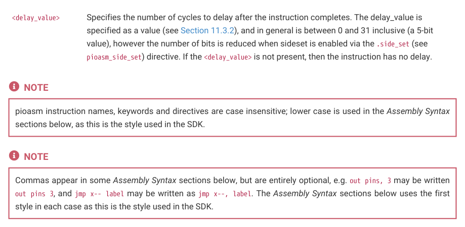

# 11.3.6. Instructions

11.3.6. Instructions

All pioasm instructions follow a common pattern:

```c
<instruction> (side <side_set_value>) ([<delay_value>])
```

where:

| <instruction> | An assembly instruction detailed in the following sections. (see Section 11.4) |
| --- | --- |
| <side set value> _ _ | A value (see Section 11.3.2) to apply to the side_set pins at the start of the instruction. Note that the rules for a side-set value via side <side set value> are dependent on the .side set (see _ _ _ pioasm side set) directive for the program. If no .side set is specified then the side <side set value> _ _ _ _ _ is invalid, if an optional number of sideset pins is specified then side <side set value> may be _ _ present, and if a non-optional number of sideset pins is specified, then side <side set value> is _ _ required. The <side set value> must fit within the number of side-set bits specified in the .side set _ _ _ directive. |

11.3. PIO assembler (pioasm)
888

RP2350 Datasheet



<delay_value>
Specifies the number of cycles to delay after the instruction completes. The delay_value is

specified as a value (see Section 11.3.2), and in general is between 0 and 31 inclusive (a 5-bit

value), however the number of bits is reduced when sideset is enabled via the .side_set (see

pioasm_side_set) directive. If the <delay_value> is not present, then the instruction has no delay.

pioasm instruction names, keywords and directives are case insensitive; lower case is used in the Assembly Syntax

sections below, as this is the style used in the SDK.

Commas appear in some Assembly Syntax sections below, but are entirely optional, e.g. out pins, 3 may be written

out pins 3, and jmp x-- label may be written as jmp x--, label. The Assembly Syntax sections below uses the first

style in each case as this is the style used in the SDK.
