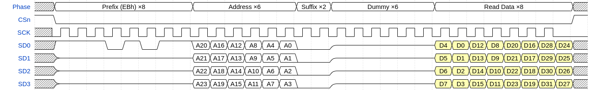

# 12.14.2. QSPI transfers

RP2350 Datasheet

12.14.2. QSPI transfers

A QSPI bus connects one host, such as QMI, to multiple devices, such as a serial NOR flash. It consists of:

• One chip select line per device (CSn)
• One shared clock line (SCK)
• Up to four shared data lines (SD0 through SD3)

No single specification defines the format of QSPI commands. However, certain de facto command sets exist on most

QSPI flash/SRAM/PSRAM devices. QMI supports the most common variations of these commands.

QMI is primarily a memory interface, not a general-purpose QSPI peripheral. Although the direct-mode interface (Section

12.14.5) allows arbitrary QSPI accesses by passing raw data through the FIFOs, QMI is optimised for preformatted

read/write transfers in response to AHB read/write bus accesses.

All QSPI read/write accesses performed by the QMI use the following five phases:

1. Prefix: An optional, constant 8-bit value that indicates the SPI command being performed (referred to as the

command prefix or instruction prefix in SPI device datasheets)

2. Address: A 24-bit byte address that specifies the SPI memory location being read/written, corresponding to the

lower 24 bits of the AHB address

3. Suffix: An optional, constant 8-bit value which follows the address in certain access modes

4. Dummy: 0-value (SPI) or high-impedance (dual/quad-SPI) cycles which precede the data, to provide the SPI device

adequate time to access the first address

5. Data: Transfers memory contents to/from the SPI device at sequential byte addresses from the initial address

indicated in the address phase

The chip select for the addressed device is asserted before the prefix phase, and de-asserted at the end of the data

phase.

Each phase has a length in bits and interface width (single/dual/quad) configured using M0_RFMT/M1_RFMT (for

reads) and M0_WFMT/M1_WFMT for writes. The M0/M1 versions of each register configure accesses to memory

windows 0 and 1 (the two chip selects) respectively. This allows you to address two different QSPI devices with

different command formats transparently.

Figure 130. An

example serial read.

After an 8-bit prefix,

the host sends 24

address bits, and the

device replies with

data starting from the

next cycle.

Figure 130 illustrates the 03h serial read command. This section refers to a handful of common QSPI read/write

commands used by QSPI flash/SRAM/PSRAM devices; refer to a QSPI device datasheet for command details. For

example, the W25Q16JV datasheet available from Winbond provides descriptions of all of the read commands

mentioned in this section.

Applying the five-phase structure introduced previously, the 03h QSPI transaction breaks down as follows:

1. 8-bit prefix, at serial width (prefix = 0x03)

2. 24-bit address, at serial width

3. No suffix (length 0)

4. No dummy bits (length 0)

5. Data bits, at serial width

The number of address bits is fixed at 24 for all QMI accesses. The number of data bits depends on the size of the

transfer: this diagram shows 8 bits being transferred, which corresponds to an uncached byte read from the processor.

12.14. QSPI memory interface (QMI)
1228

RP2350 Datasheet

The M0_RFMT/M1_RFMT registers configure all other parameters used for the data phase, such as serial interface

width.

The four data lines SD3 through SD0 make up the QSPI bus. At serial width, the host drives data out on SD0, and the device

responds with data travelling in the opposite direction on SD1. SD3 and SD2 are undriven during serial-SPI and dual-SPI

width parts of a transfer, and are usually pulled high. The shaded background behind the D7 through D0 data bits

indicates that the transfer direction is device-to-host. Higher interface widths use the SDx lines bidirectionally.

Figure 131. The 0Bh

read command adds 8

dummy cycles

between address and

data, to permit higher

bus frequencies.

Figure 131 shows the 0Bh serial read command, a common variation on the 03h. 0Bh adds dummy cycles between the

address and data phases, which helps hide the initial access latency of the storage array inside of the QSPI device. This

allows higher operating frequencies.

Applying the five-phase structure introduced previously, the 0Bh QSPI transaction breaks down as follows:

1. 8-bit prefix, at serial width (prefix = 0x0b)

2. 24-bit address, at serial width

3. No suffix (length 0)

4. Eight dummy bits, at serial width

5. Data bits, at serial width

At serial width, the QMI continues to drive the SD0 line low throughout the dummy phase, as this line is unidirectional at

this width. At dual-SPI and quad-SPI width, SD0 is tristated during the dummy phase along with SD1 through SD3.

QMI idles its clock low between transfers, expecting data to be captured on the leading edge of each clock pulse (i.e.

the rising edge). In legacy Motorola SPI terms, the clock polarity is 0 and the clock phase is 0. Other clock polarities and

phases are not supported. To ensure data is stable across the rising edge, new data is launched on each falling edge.

When transfer chaining is disabled (Section 12.14.2.1), QMI takes advantage of this clock behaviour by suppressing the

final clock pulse on reads. This saves energy by avoiding unnecessary SCK transitions, and by not inadvertently

requesting the data that immediately follows the requested data. QMI still leaves one full SCK period where the last data

is valid, and still captures at the point the SCK rising edge would be launched (Section 12.14.3), but the actual SCK clock

pulse is suppressed.

Figure 132. An EBh

quad I/O read

command. The

command prefix is

serial, but address and

data are 4 bits per

cycle.

Figure 132 shows a quad-width read transfer. In this example, the command prefix is still transferred at serial width, but

the full quad-width is used thereafter, as the prefix identifies the width of the access.

Applying the five-phase structure introduced previously, the QSPI transaction breaks down as follows:

1. 8-bit prefix, at serial width (prefix = 0xeb)

2. 24-bit address, at quad width

3. 8-bit suffix, at quad width (suffix = 0x00)

4. 24 dummy bits, at quad width

5. Data bits, at quad width

The suffix is an extension of the command prefix, placed after the address bits to avoid extending the initial access

12.14. QSPI memory interface (QMI)
1229

RP2350 Datasheet

latency. The bit patterns used for prefixes and suffixes are configured using the M0_RCMD/M1_RCMD registers (for

reads) and M0_WCMD/M1_WCMD registers (for writes). One common use of the suffix on EBh quad I/O read

commands is to enter a so-called continuous read mode, where the prefix of the next command is skipped (assumed to

be the same as the current command) to reduce the number of cycles required for the next read access.

Figure 133. An 02h

write transfer, shown

with the device in QPI

mode (4 bits per cycle

for all transfers)

Figure 133 shows a write command at quad width. In this example, the command prefix is also issued in quad mode,

which is common for QSPI RAM. Since read and write commands mix freely, dropping the prefix (like flash continuous

read mode) is less useful, so QSPI RAM devices often support a QPI mode that also issues command prefixes in quad

width to reduce per-access cost.

Applying the five-phase structure introduced previously, the QSPI transaction breaks down as follows:

1. 8-bit prefix, at quad width (prefix = 0x02)

2. 24-bit address, at quad width

3. No suffix (0 bits)

4. No dummy bits

5. Data bits, at quad width

It is worth noting the bit and byte order in this diagram. SPI is conventionally MSB-first within each byte. When multiple

bits transfer each cycle (using the SD0, SD1, SD2 and SD3 data lines in parallel), higher-numbered data lines carry more-

significant bits. The first cycle of the data transfer in Figure 133 transfers the four most-significant bits of the first byte

of data. The most-significant bit (bit 7) transfers on SD3, and the least-significant of these bits (bit 4) transfers on SD0.

Since RP2350 is a little-endian system, higher byte addresses correspond to higher numerical significance. Figure

Figure 133shows the transfer of a 32-bit value spanning four consecutive byte addresses, starting at the initial address

transmitted by the host during the address phase. The first two cycles of the data phase transfer the first byte,

containing the 8 least-significant bits of the 32-bit value. The last two cycles of the data phase transfer the last byte,

containing the 8 most-significant bits of the 32-bit value (bits 31 through 24, inclusive).

12.14.2.1. Transfer chaining

Referring back to Figure 132, which shows a 32-bit QSPI read with an EBh serial prefix, it’s evident that more time is

spent issuing the prefix and address (14 cycles) and waiting for the initial read latency (an additional 8 cycles), than

actually transferring the data (8 cycles). This overhead leaves only a small fraction of the theoretical maximum QSPI

throughput available for transferring data from flash, which limits the performance of direct code execution.

Figure 134. An EBh

read, without the

command prefix. The

suffix is used to

indicate the lack of

prefix on the next

command.

Figure 134 shows how this can be improved by continuous read mode, which uses a suffix (here 0xa0) to indicate the

lack of command prefix on the next command. This example only transfers 16 bits of data (e.g. an uncached halfword

read by the processor). Suffixes are effectively free to transfer, because they are transferred during the latency wait

period between the address being issued and the first data returned from the QSPI device’s internal storage. However,

this still leaves the majority of the QSPI bus cycles spent issuing addresses and waiting, not transferring data.

12.14. QSPI memory interface (QMI)
1230

RP2350 Datasheet

Consequently, QSPI memory’s random-access performance is much lower than its sequential-access performance.

Figure 135. An EBh

read, with a

subsequent sequential

read chained onto the

next transfer

QMI’s transfer chaining feature exploits the difference between sequential and non-sequential access speed. Figure 135

shows two sequentially-addressed halfword reads (i.e. the address of the second transfer is two plus the address of the

first transfer), with M0_TIMING.COOLDOWN/M1_TIMING.COOLDOWN set to a non-zero value.

In Figure 134, QMI suppressed the last clock pulse and immediately released the chip select after the last data

transferred. When transfer chaining is enabled, as in Figure 135, QMI does not suppress the last clock pulse, instead

keeping the chip select asserted. It remains in this state for a certain amount of time, configured by the COOLDOWN register

field, waiting for another transfer. QMI then executes the next transfer by appending more clocks to the current transfer.

The chip select remains asserted throughout instead of releasing and reasserting between commands. To benefit from

transfer chaining, the next transfer must meet the following criteria:

• same direction as the previous transfer (read/write)
• address sequential to the previous transfer (equal to previous address plus previous size)
• address in the same window as the previous transfer (same chip select)
• previous transfer did not reach a page break boundary (configured by M0_TIMING.PAGEBREAK/

M1_TIMING.PAGEBREAK)

This considerably improves throughput for long uncached linear transfers such as using the XIP stream peripheral

(Section 4.4.3) or executing cold code sequences which tend to miss the cache many times sequentially.

This can continue for arbitrarily many transfers. It is possible to read the entire contents of a typical flash device using

transfer chaining from a single address.

Note that the transfer chaining feature can slightly degrade random access performance. If the next transfer is non-

sequential, the chip select must be de-asserted, possibly dwell high for some minimum period (depending on timing

requirements of the QSPI device), and then be reasserted to issue the new address. If transfer chaining were not used,

the chip select would have de-asserted immediately following the end of the previous transfer, avoiding some of this

delay. This can be mitigated by tuning the COOLDOWN timer register parameter to avoid leaving the chip select asserted for

excessively long periods, since sequential transfers are usually tightly grouped in time.

## Embedded Images

