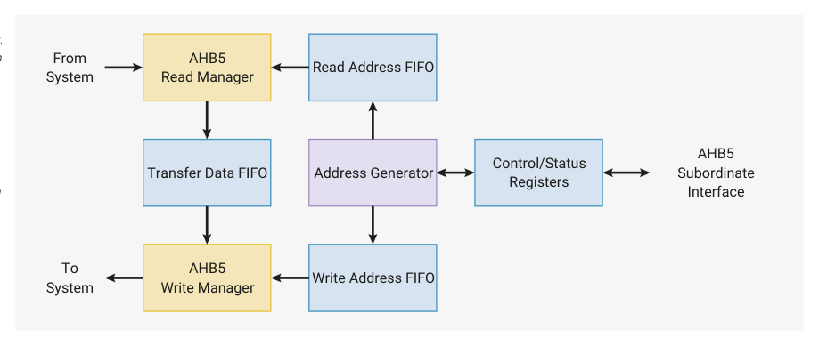

# 12.6. DMA

12.6. DMA

The RP2350 Direct Memory Access (DMA) controller performs bulk data transfers on a processor’s behalf. This leaves

processors free to attend to other tasks or enter low-power sleep states. The DMA dual bus manager ports can issue

one read and one write access per cycle. The data throughput is therefore far greater than one of RP2350’s processors.

12.6. DMA
1094

RP2350 Datasheet

Figure 122. DMA

Architecture Overview.

AHB5 
Read Manager
From 
System

The read manager can

read data from some

address every clock

cycle. Likewise, the

write manager can

write to another

address. The address

generator produces

matched pairs of read

and write addresses,

which the managers

consume through the

address FIFOs. The

AHB5 
Write Manager
To 
System

DMA can run up to 16

transfer sequences

simultaneously,

supervised by

software via the

The DMA can perform one read access and one write access, up to 32 bits in size, every clock cycle. There are 16

control and status

registers.

independent channels, each of which supervises a sequence of bus transfers in one of the following scenarios:

Memory-to-peripheral

a peripheral signals the DMA when it needs more data to transmit. The DMA reads data from an array in RAM or

flash, and writes to the peripheral’s data FIFO.

Peripheral-to-memory

a peripheral signals the DMA when it has received data. The DMA reads this data from the peripheral’s data FIFO,

and writes it to an array in RAM.

Memory-to-memory

the DMA transfers data between two buffers in RAM, as fast as possible.

Each channel has its own control and status registers (CSRs) that software can use to program and monitor the

channel’s progress. When multiple channels are active at the same time, the DMA shares bandwidth evenly between the

channels, with round-robin over all channels that are currently requesting data transfers.

The transfer size can be either 32, 16, or 8 bits. This is configured once for each channel: source transfer size and

destination transfer size are the same. The DMA performs byte lane replication on narrow writes, so byte data is

available in all 4 bytes of the databus, and halfword data in both halfwords.

Channels can be combined in varied ways for more sophisticated behaviour and greater autonomy. For example, one

channel can configure another, loading configuration data from a sequence of control blocks in memory, and the

second can then call back to the first via the CHAIN_TO option when it needs to be reconfigured.

Making the DMA more autonomous means that much less processor supervision is required: overall this allows the

system to do more at once, or to dissipate less power.
