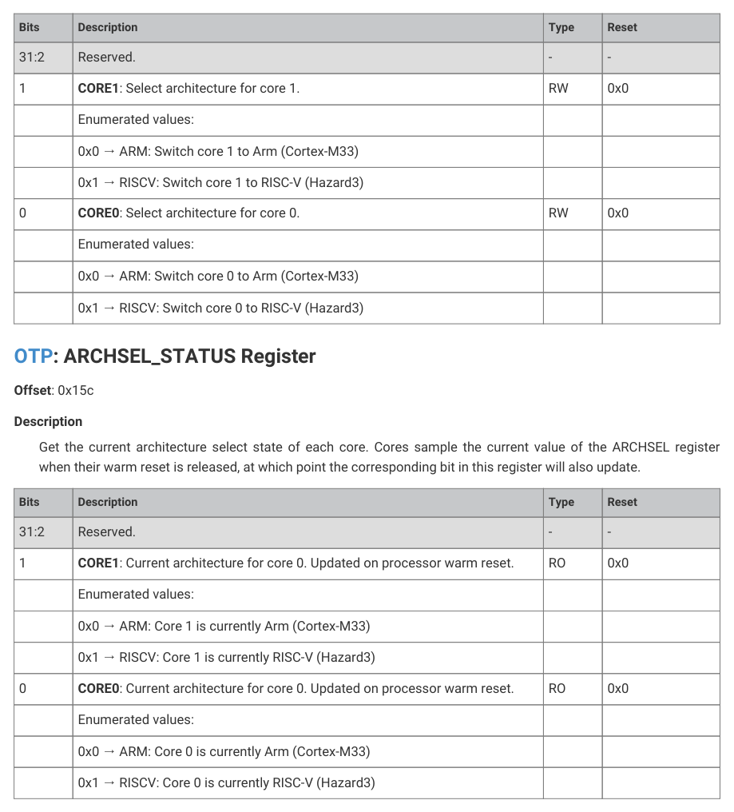

# 13.9. List of registers

13.9. List of registers

The OTP control registers start at a base address of 0x40120000 (defined as OTP_BASE in the SDK).

| Offset | Name | Info |
| --- | --- | --- |
| 0x000 | SW_LOCK0 | Software lock register for page 0. |
| 0x004 | SW_LOCK1 | Software lock register for page 1. |
| 0x008 | SW_LOCK2 | Software lock register for page 2. |
| 0x00c | SW_LOCK3 | Software lock register for page 3. |
| 0x010 | SW_LOCK4 | Software lock register for page 4. |
| 0x014 | SW_LOCK5 | Software lock register for page 5. |
| 0x018 | SW_LOCK6 | Software lock register for page 6. |
| 0x01c | SW_LOCK7 | Software lock register for page 7. |
| 0x020 | SW_LOCK8 | Software lock register for page 8. |
| 0x024 | SW_LOCK9 | Software lock register for page 9. |
| 0x028 | SW_LOCK10 | Software lock register for page 10. |
| 0x02c | SW_LOCK11 | Software lock register for page 11. |
| 0x030 | SW_LOCK12 | Software lock register for page 12. |
| 0x034 | SW_LOCK13 | Software lock register for page 13. |
| 0x038 | SW_LOCK14 | Software lock register for page 14. |
| 0x03c | SW_LOCK15 | Software lock register for page 15. |
| 0x040 | SW_LOCK16 | Software lock register for page 16. |
| 0x044 | SW_LOCK17 | Software lock register for page 17. |
| 0x048 | SW_LOCK18 | Software lock register for page 18. |
| 0x04c | SW_LOCK19 | Software lock register for page 19. |
| 0x050 | SW_LOCK20 | Software lock register for page 20. |
| 0x054 | SW_LOCK21 | Software lock register for page 21. |
| 0x058 | SW_LOCK22 | Software lock register for page 22. |
| 0x05c | SW_LOCK23 | Software lock register for page 23. |
| 0x060 | SW_LOCK24 | Software lock register for page 24. |
| 0x064 | SW_LOCK25 | Software lock register for page 25. |
| 0x068 | SW_LOCK26 | Software lock register for page 26. |
| 0x06c | SW_LOCK27 | Software lock register for page 27. |
| 0x070 | SW_LOCK28 | Software lock register for page 28. |
| 0x074 | SW_LOCK29 | Software lock register for page 29. |
| 0x078 | SW_LOCK30 | Software lock register for page 30. |
| 0x07c | SW_LOCK31 | Software lock register for page 31. |
| 0x080 | SW_LOCK32 | Software lock register for page 32. |
| 0x084 | SW_LOCK33 | Software lock register for page 33. |
| 0x088 | SW_LOCK34 | Software lock register for page 34. |
| 0x08c | SW_LOCK35 | Software lock register for page 35. |
| 0x090 | SW_LOCK36 | Software lock register for page 36. |
| 0x094 | SW_LOCK37 | Software lock register for page 37. |
| 0x098 | SW_LOCK38 | Software lock register for page 38. |
| 0x09c | SW_LOCK39 | Software lock register for page 39. |
| 0x0a0 | SW_LOCK40 | Software lock register for page 40. |
| 0x0a4 | SW_LOCK41 | Software lock register for page 41. |
| 0x0a8 | SW_LOCK42 | Software lock register for page 42. |
| 0x0ac | SW_LOCK43 | Software lock register for page 43. |
| 0x0b0 | SW_LOCK44 | Software lock register for page 44. |
| 0x0b4 | SW_LOCK45 | Software lock register for page 45. |
| 0x0b8 | SW_LOCK46 | Software lock register for page 46. |
| 0x0bc | SW_LOCK47 | Software lock register for page 47. |
| 0x0c0 | SW_LOCK48 | Software lock register for page 48. |
| 0x0c4 | SW_LOCK49 | Software lock register for page 49. |
| 0x0c8 | SW_LOCK50 | Software lock register for page 50. |
| 0x0cc | SW_LOCK51 | Software lock register for page 51. |
| 0x0d0 | SW_LOCK52 | Software lock register for page 52. |
| 0x0d4 | SW_LOCK53 | Software lock register for page 53. |
| 0x0d8 | SW_LOCK54 | Software lock register for page 54. |
| 0x0dc | SW_LOCK55 | Software lock register for page 55. |
| 0x0e0 | SW_LOCK56 | Software lock register for page 56. |
| 0x0e4 | SW_LOCK57 | Software lock register for page 57. |
| 0x0e8 | SW_LOCK58 | Software lock register for page 58. |
| 0x0ec | SW_LOCK59 | Software lock register for page 59. |
| 0x0f0 | SW_LOCK60 | Software lock register for page 60. |
| 0x0f4 | SW_LOCK61 | Software lock register for page 61. |
| 0x0f8 | SW_LOCK62 | Software lock register for page 62. |
| 0x0fc | SW_LOCK63 | Software lock register for page 63. |
| 0x100 | SBPI_INSTR | Dispatch instructions to the SBPI interface, used for programming the OTP fuses. |
| 0x104 | SBPI_WDATA_0 | SBPI write payload bytes 3..0 |
| 0x108 | SBPI_WDATA_1 | SBPI write payload bytes 7..4 |
| 0x10c | SBPI_WDATA_2 | SBPI write payload bytes 11..8 |
| 0x110 | SBPI_WDATA_3 | SBPI write payload bytes 15..12 |
| 0x114 | SBPI_RDATA_0 | Read payload bytes 3..0. Once read, the data in the register will automatically clear to 0. |
| 0x118 | SBPI_RDATA_1 | Read payload bytes 7..4. Once read, the data in the register will automatically clear to 0. |
| 0x11c | SBPI_RDATA_2 | Read payload bytes 11..8. Once read, the data in the register will automatically clear to 0. |
| 0x120 | SBPI_RDATA_3 | Read payload bytes 15..12. Once read, the data in the register will automatically clear to 0. |
| 0x124 | SBPI_STATUS |  |
| 0x128 | USR | Controls for APB data read interface (USER interface) |
| 0x12c | DBG | Debug for OTP power-on state machine |
| 0x134 | BIST | During BIST, count address locations that have at least one leaky bit |
| 0x138 | CRT_KEY_W0 | Word 0 (bits 31..0) of the key. Write only, read returns 0x0 |
| 0x13c | CRT_KEY_W1 | Word 1 (bits 63..32) of the key. Write only, read returns 0x0 |
| 0x140 | CRT_KEY_W2 | Word 2 (bits 95..64) of the key. Write only, read returns 0x0 |
| 0x144 | CRT_KEY_W3 | Word 3 (bits 127..96) of the key. Write only, read returns 0x0 |
| 0x148 | CRITICAL | Quickly check values of critical flags read during boot up |
| 0x14c | KEY_VALID | Which keys were valid (enrolled) at boot time |
| 0x150 | DEBUGEN | Enable a debug feature that has been disabled. Debug features are disabled if one of the relevant critical boot flags is set in OTP (DEBUG_DISABLE or SECURE_DEBUG_DISABLE), OR if a debug key is marked valid in OTP, and the matching key value has not been supplied over SWD. |
| 0x154 | DEBUGEN_LOCK | Write 1s to lock corresponding bits in DEBUGEN. This register is reset by the processor cold reset. |
| 0x158 | ARCHSEL | Architecture select (Arm/RISC-V), applied on next processor reset. The default and allowable values of this register are constrained by the critical boot flags. |
| 0x15c | ARCHSEL_STATUS | Get the current architecture select state of each core. Cores sample the current value of the ARCHSEL register when their warm reset is released, at which point the corresponding bit in this register will also update. |
| 0x160 | BOOTDIS | Tell the bootrom to ignore scratch register boot vectors (both power manager and watchdog) on the next power up. |
| 0x164 | INTR | Raw Interrupts |
| 0x168 | INTE | Interrupt Enable |
| 0x16c | INTF | Interrupt Force |
| 0x170 | INTS | Interrupt status after masking & forcing |

Table 1332. List of

13.9. List of registers
1280

RP2350 Datasheet

13.9. List of registers
1281

RP2350 Datasheet

13.9. List of registers
1282

RP2350 Datasheet

OTP: SW_LOCK0, SW_LOCK1, …, SW_LOCK62, SW_LOCK63 Registers

Offsets: 0x000, 0x004, …, 0x0f8, 0x0fc

Description

Software lock register for page N.

Locks are initialised from the OTP lock pages at reset. This register can be written to further advance the lock state of

each page (until next reset), and read to check the current lock state of a page.

Table 1333.

Bits
Description
Type
Reset

SW_LOCK0,

SW_LOCK1, …,

31:4
Reserved.
-
-

SW_LOCK62,

SW_LOCK63 Registers

3:2
NSEC: Non-secure lock status. Writes are OR’d with the current value.
RW
-

1:0
SEC: Secure lock status. Writes are OR’d with the current value. This field is

13.9. List of registers
1283

RP2350 Datasheet

OTP: SBPI_INSTR Register

Offset: 0x100

Description

Dispatch instructions to the SBPI interface, used for programming the OTP fuses.

| Bits | Description | Type | Reset |
| --- | --- | --- | --- |
| 31 | Reserved. | - | - |
| 30 | EXEC: Execute instruction | SC | 0x0 |
| 29 | IS_WR: Payload type is write | RW | 0x0 |
| 28 | HAS_PAYLOAD: Instruction has payload (data to be written or to be read) | RW | 0x0 |
| 27:24 | PAYLOAD_SIZE_M1: Instruction payload size in bytes minus 1 | RW | 0x0 |
| 23:16 | TARGET: Instruction target, it can be PMC (0x3a) or DAP (0x02) | RW | 0x00 |
| 15:8 | CMD | RW | 0x00 |
| 7:0 | SHORT_WDATA: wdata to be used only when payload_size_m1=0 | RW | 0x00 |

Table 1334.

OTP: SBPI_WDATA_0 Register

Offset: 0x104

| Bits | Description | Type | Reset |
| --- | --- | --- | --- |
| 31:0 | SBPI write payload bytes 3..0 | RW | 0x00000000 |

Table 1335.

SBPI_WDATA_0

Register

OTP: SBPI_WDATA_1 Register

Offset: 0x108

| Bits | Description | Type | Reset |
| --- | --- | --- | --- |
| 31:0 | SBPI write payload bytes 7..4 | RW | 0x00000000 |

Table 1336.

SBPI_WDATA_1

Register

OTP: SBPI_WDATA_2 Register

Offset: 0x10c

| Bits | Description | Type | Reset |
| --- | --- | --- | --- |
| 31:0 | SBPI write payload bytes 11..8 | RW | 0x00000000 |

Table 1337.

SBPI_WDATA_2

Register

OTP: SBPI_WDATA_3 Register

Offset: 0x110

| Bits | Description | Type | Reset |
| --- | --- | --- | --- |
| 31:0 | SBPI write payload bytes 15..12 | RW | 0x00000000 |
| 31:0 | Read payload bytes 3..0. Once read, the data in the register will automatically clear to 0. | RO | 0x00000000 |

Table 1338.

SBPI_WDATA_3

Register

OTP: SBPI_RDATA_0 Register

Offset: 0x114

Table 1339.

SBPI_RDATA_0

Register

13.9. List of registers
1284

RP2350 Datasheet

OTP: SBPI_RDATA_1 Register

Offset: 0x118

| Bits | Description | Type | Reset |
| --- | --- | --- | --- |
| 31:0 | Read payload bytes 7..4. Once read, the data in the register will automatically clear to 0. | RO | 0x00000000 |

Table 1340.

SBPI_RDATA_1

Register

OTP: SBPI_RDATA_2 Register

Offset: 0x11c

| Bits | Description | Type | Reset |
| --- | --- | --- | --- |
| 31:0 | Read payload bytes 11..8. Once read, the data in the register will automatically clear to 0. | RO | 0x00000000 |

Table 1341.

SBPI_RDATA_2

Register

OTP: SBPI_RDATA_3 Register

Offset: 0x120

| Bits | Description | Type | Reset |
| --- | --- | --- | --- |
| 31:0 | Read payload bytes 15..12. Once read, the data in the register will automatically clear to 0. | RO | 0x00000000 |

Table 1342.

SBPI_RDATA_3

Register

OTP: SBPI_STATUS Register

Offset: 0x124

| Bits | Description | Type | Reset |
| --- | --- | --- | --- |
| 31:24 | Reserved. | - | - |
| 23:16 | MISO: SBPI MISO (master in - slave out): response from SBPI | RO | - |
| 15:13 | Reserved. | - | - |
| 12 | FLAG: SBPI flag | RO | - |
| 11:9 | Reserved. | - | - |
| 8 | INSTR_MISS: Last instruction missed (dropped), as the previous has not finished running | WC | 0x0 |
| 7:5 | Reserved. | - | - |
| 4 | INSTR_DONE: Last instruction done | WC | 0x0 |
| 3:1 | Reserved. | - | - |
| 0 | RDATA_VLD: Read command has returned data | WC | 0x0 |
| 31:5 | Reserved. | - | - |
| 4 | PD: Power-down; 1 disables current reference. Must be 0 to read data from the OTP. | RW | 0x0 |
| 3:1 | Reserved. | - | - |
| 0 | DCTRL: 1 enables USER interface; 0 disables USER interface (enables SBPI). This bit must be cleared before performing any SBPI access, such as when programming the OTP. The APB data read interface (USER interface) will be inaccessible during this time, and will return a bus error if any read is attempted. | RW | 0x1 |

Table 1343.

OTP: USR Register

Offset: 0x128

13.9. List of registers
1285

RP2350 Datasheet

Description

Controls for APB data read interface (USER interface)

Table 1344. USR

OTP: DBG Register

Offset: 0x12c

Description

Debug for OTP power-on state machine

| Bits | Description | Type | Reset |
| --- | --- | --- | --- |
| 31:13 | Reserved. | - | - |
| 12 | CUSTOMER_RMA_FLAG: The chip is in RMA mode | RO | - |
| 11:8 | Reserved. | - | - |
| 7:4 | PSM_STATE: Monitor the PSM FSM’s state | RO | - |
| 3 | ROSC_UP: Ring oscillator is up and running | RO | - |
| 2 | ROSC_UP_SEEN: Ring oscillator was seen up and running | WC | 0x0 |
| 1 | BOOT_DONE: PSM boot done status flag | RO | - |
| 0 | PSM_DONE: PSM done status flag | RO | - |

Table 1345. DBG

OTP: BIST Register

Offset: 0x134

Description

During BIST, count address locations that have at least one leaky bit

| Bits | Description | Type | Reset |
| --- | --- | --- | --- |
| 31 | Reserved. | - | - |
| 30 | CNT_FAIL: Flag if the count of address locations with at least one leaky bit exceeds cnt_max | RO | - |
| 29 | CNT_CLR: Clear counter before use | SC | 0x0 |
| 28 | CNT_ENA: Enable the counter before the BIST function is initated | RW | 0x0 |
| 27:16 | CNT_MAX: The cnt_fail flag will be set if the number of leaky locations exceeds this number | RW | 0xfff |
| 15:13 | Reserved. | - | - |
| 12:0 | CNT: Number of locations that have at least one leaky bit. Note: This count is true only if the BIST was initiated without the fix option. | RO | - |

Table 1346. BIST

13.9. List of registers
1286

RP2350 Datasheet

OTP: CRT_KEY_W0 Register

Offset: 0x138

| Bits | Description | Type | Reset |
| --- | --- | --- | --- |
| 31:0 | Word 0 (bits 31..0) of the key. Write only, read returns 0x0 | WO | 0x00000000 |

Table 1347.

OTP: CRT_KEY_W1 Register

Offset: 0x13c

| Bits | Description | Type | Reset |
| --- | --- | --- | --- |
| 31:0 | Word 1 (bits 63..32) of the key. Write only, read returns 0x0 | WO | 0x00000000 |

Table 1348.

OTP: CRT_KEY_W2 Register

Offset: 0x140

| Bits | Description | Type | Reset |
| --- | --- | --- | --- |
| 31:0 | Word 2 (bits 95..64) of the key. Write only, read returns 0x0 | WO | 0x00000000 |

Table 1349.

OTP: CRT_KEY_W3 Register

Offset: 0x144

| Bits | Description | Type | Reset |
| --- | --- | --- | --- |
| 31:0 | Word 3 (bits 127..96) of the key. Write only, read returns 0x0 | WO | 0x00000000 |

Table 1350.

OTP: CRITICAL Register

Offset: 0x148

Description

Quickly check values of critical flags read during boot up

| Bits | Description | Type | Reset |
| --- | --- | --- | --- |
| 31:18 | Reserved. | - | - |
| 17 | RISCV_DISABLE | RO | 0x0 |
| 16 | ARM_DISABLE | RO | 0x0 |
| 15:7 | Reserved. | - | - |
| 6:5 | GLITCH_DETECTOR_SENS | RO | 0x0 |
| 4 | GLITCH_DETECTOR_ENABLE | RO | 0x0 |
| 3 | DEFAULT_ARCHSEL | RO | 0x0 |
| 2 | DEBUG_DISABLE | RO | 0x0 |
| 1 | SECURE_DEBUG_DISABLE | RO | 0x0 |
| 0 | SECURE_BOOT_ENABLE | RO | 0x0 |
| 31:8 | Reserved. | - | - |
| 7:0 | Which keys were valid (enrolled) at boot time | RO | 0x00 |

Table 1351. CRITICAL

13.9. List of registers
1287

RP2350 Datasheet

OTP: KEY_VALID Register

Offset: 0x14c

Table 1352.

OTP: DEBUGEN Register

Offset: 0x150

Description

Enable a debug feature that has been disabled. Debug features are disabled if one of the relevant critical boot flags

is set in OTP (DEBUG_DISABLE or SECURE_DEBUG_DISABLE), OR if a debug key is marked valid in OTP, and the

matching key value has not been supplied over SWD.

Specifically:

• The DEBUG_DISABLE flag disables all debug features. This can be fully overridden by setting all bits of this

register.
• The SECURE_DEBUG_DISABLE flag disables secure processor debug. This can be fully overridden by setting the

PROC0_SECURE and PROC1_SECURE bits of this register.
• If a single debug key has been registered, and no matching key value has been supplied over SWD, then all debug

features are disabled. This can be fully overridden by setting all bits of this register.
• If both debug keys have been registered, and the Non-secure key’s value (key 6) has been supplied over SWD,

secure processor debug is disabled. This can be fully overridden by setting the PROC0_SECURE and

PROC1_SECURE bits of this register.
• If both debug keys have been registered, and the Secure key’s value (key 5) has been supplied over SWD, then no

debug features are disabled by the key mechanism. However, note that in this case debug features may still be

disabled by the critical boot flags.

| Bits | Description | Type | Reset |
| --- | --- | --- | --- |
| 31:9 | Reserved. | - | - |
| 8 | MISC: Enable other debug components. Specifically, the CTI, and the APB-AP used to access the RISC-V Debug Module. These components are disabled by default if either of the debug disable critical flags is set, or if at least one debug key has been enrolled and the least secure of these enrolled key values has not been provided over SWD. | RW | 0x0 |
| 7:4 | Reserved. | - | - |
| 3 | PROC1_SECURE: Permit core 1’s Mem-AP to generate Secure accesses, assuming it is enabled at all. Also enable secure debug of core 1 (SPIDEN and SPNIDEN). Secure debug of core 1 is disabled by default if the secure debug disable critical flag is set, or if at least one debug key has been enrolled and the most secure of these enrolled key values not yet provided over SWD. | RW | 0x0 |
| 2 | PROC1: Enable core 1’s Mem-AP if it is currently disabled. The Mem-AP is disabled by default if either of the debug disable critical flags is set, or if at least one debug key has been enrolled and the least secure of these enrolled key values has not been provided over SWD. | RW | 0x0 |
| 1 | PROC0_SECURE: Permit core 0’s Mem-AP to generate Secure accesses, assuming it is enabled at all. Also enable secure debug of core 0 (SPIDEN and SPNIDEN). Secure debug of core 0 is disabled by default if the secure debug disable critical flag is set, or if at least one debug key has been enrolled and the most secure of these enrolled key values not yet provided over SWD. Note also that core Mem-APs are unconditionally disabled when a core is switched to RISC-V mode (by setting the ARCHSEL bit and performing a warm reset of the core). | RW | 0x0 |
| 0 | PROC0: Enable core 0’s Mem-AP if it is currently disabled. The Mem-AP is disabled by default if either of the debug disable critical flags is set, or if at least one debug key has been enrolled and the least secure of these enrolled key values has not been provided over SWD. Note also that core Mem-APs are unconditionally disabled when a core is switched to RISC-V mode (by setting the ARCHSEL bit and performing a warm reset of the core). | RW | 0x0 |

Table 1353. DEBUGEN

13.9. List of registers
1288

RP2350 Datasheet

OTP: DEBUGEN_LOCK Register

Offset: 0x154

Description

Write 1s to lock corresponding bits in DEBUGEN. This register is reset by the processor cold reset.

| Bits | Description | Type | Reset |
| --- | --- | --- | --- |
| 31:9 | Reserved. | - | - |
| 8 | MISC: Write 1 to lock the MISC bit of DEBUGEN. Can’t be cleared once set. | RW | 0x0 |
| 7:4 | Reserved. | - | - |
| 3 | PROC1_SECURE: Write 1 to lock the PROC1_SECURE bit of DEBUGEN. Can’t be cleared once set. | RW | 0x0 |
| 2 | PROC1: Write 1 to lock the PROC1 bit of DEBUGEN. Can’t be cleared once set. | RW | 0x0 |
| 1 | PROC0_SECURE: Write 1 to lock the PROC0_SECURE bit of DEBUGEN. Can’t be cleared once set. | RW | 0x0 |
| 0 | PROC0: Write 1 to lock the PROC0 bit of DEBUGEN. Can’t be cleared once set. | RW | 0x0 |

Table 1354.

DEBUGEN_LOCK

Register

OTP: ARCHSEL Register

Offset: 0x158

Description

Architecture select (Arm/RISC-V). The default and allowable values of this register are constrained by the critical

boot flags.

13.9. List of registers
1289

RP2350 Datasheet

This register is reset by the earliest reset in the switched core power domain (before a processor cold reset).

Cores sample their architecture select signal on a warm reset. The source of the warm reset could be the system

power-up state machine, the watchdog timer, Arm SYSRESETREQ or from RISC-V hartresetreq.

Note that when an Arm core is deselected, its cold reset domain is also held in reset, since in particular the

SYSRESETREQ bit becomes inaccessible once the core is deselected. Note also the RISC-V cores do not have a cold

reset domain, since their corresponding controls are located in the Debug Module.

Table 1355. ARCHSEL

Register
Bits
Description
Type
Reset

31:2
Reserved.
-
-

1
CORE1: Select architecture for core 1.
RW
0x0

0x0 → ARM: Switch core 1 to Arm (Cortex-M33)

0x1 → RISCV: Switch core 1 to RISC-V (Hazard3)

0
CORE0: Select architecture for core 0.
RW
0x0

0x0 → ARM: Switch core 0 to Arm (Cortex-M33)

0x1 → RISCV: Switch core 0 to RISC-V (Hazard3)

Get the current architecture select state of each core. Cores sample the current value of the ARCHSEL register

when their warm reset is released, at which point the corresponding bit in this register will also update.

Table 1356.

Bits
Description
Type
Reset

ARCHSEL_STATUS

Register

31:2
Reserved.
-
-

1
CORE1: Current architecture for core 0. Updated on processor warm reset.
RO
0x0

0x0 → ARM: Core 1 is currently Arm (Cortex-M33)

0x1 → RISCV: Core 1 is currently RISC-V (Hazard3)

0
CORE0: Current architecture for core 0. Updated on processor warm reset.
RO
0x0

0x0 → ARM: Core 0 is currently Arm (Cortex-M33)

0x1 → RISCV: Core 0 is currently RISC-V (Hazard3)

OTP: BOOTDIS Register

Offset: 0x160

Description

Tell the bootrom to ignore scratch register boot vectors (both power manager and watchdog) on the next power up.

If an early boot stage has soft-locked some OTP pages in order to protect their contents from later stages, there is a risk

that Secure code running at a later stage can unlock the pages by performing a watchdog reset that resets the OTP.

This register can be used to ensure that the bootloader runs as normal on the next power up, preventing Secure code at

13.9. List of registers
1290

RP2350 Datasheet

a later stage from accessing OTP in its unlocked state.

Should be used in conjunction with the power manager BOOTDIS register.

| Bits | Description | Type | Reset |
| --- | --- | --- | --- |
| 31:2 | Reserved. | - | - |
| 1 | NEXT: This flag always ORs writes into its current contents. It can be set but not cleared by software. The BOOTDIS_NEXT bit is OR’d into the BOOTDIS_NOW bit when the core is powered down. Simultaneously, the BOOTDIS_NEXT bit is cleared. Setting this bit means that the boot scratch registers will be ignored following the next core power down. This flag should be set by an early boot stage that has soft-locked OTP pages, to prevent later stages from unlocking it via watchdog reset. | RW | 0x0 |
| 0 | NOW: When the core is powered down, the current value of BOOTDIS_NEXT is OR’d into BOOTDIS_NOW, and BOOTDIS_NEXT is cleared. The bootrom checks this flag before reading the boot scratch registers. If it is set, the bootrom clears it, and ignores the BOOT registers. This prevents Secure software from diverting the boot path before a bootloader has had the chance to soft lock OTP pages containing sensitive data. | WC | 0x0 |

Table 1357. BOOTDIS

OTP: INTR Register

Offset: 0x164

Description

Raw Interrupts

| Bits | Description | Type | Reset |
| --- | --- | --- | --- |
| 31:5 | Reserved. | - | - |
| 4 | APB_RD_NSEC_FAIL | WC | 0x0 |
| 3 | APB_RD_SEC_FAIL | WC | 0x0 |
| 2 | APB_DCTRL_FAIL | WC | 0x0 |
| 1 | SBPI_WR_FAIL | WC | 0x0 |
| 0 | SBPI_FLAG_N | RO | 0x0 |

Table 1358. INTR

OTP: INTE Register

Offset: 0x168

Description

Interrupt Enable

| Bits | Description | Type | Reset |
| --- | --- | --- | --- |
| 31:5 | Reserved. | - | - |
| 4 | APB_RD_NSEC_FAIL | RW | 0x0 |
| 3 | APB_RD_SEC_FAIL | RW | 0x0 |
| 2 | APB_DCTRL_FAIL | RW | 0x0 |
| 1 | SBPI_WR_FAIL | RW | 0x0 |
| 0 | SBPI_FLAG_N | RW | 0x0 |

Table 1359. INTE

13.9. List of registers
1291

RP2350 Datasheet

OTP: INTF Register

Offset: 0x16c

Description

Interrupt Force

| Bits | Description | Type | Reset |
| --- | --- | --- | --- |
| 31:5 | Reserved. | - | - |
| 4 | APB_RD_NSEC_FAIL | RW | 0x0 |
| 3 | APB_RD_SEC_FAIL | RW | 0x0 |
| 2 | APB_DCTRL_FAIL | RW | 0x0 |
| 1 | SBPI_WR_FAIL | RW | 0x0 |
| 0 | SBPI_FLAG_N | RW | 0x0 |

Table 1360. INTF

OTP: INTS Register

Offset: 0x170

Description

Interrupt status after masking & forcing

| Bits | Description | Type | Reset |
| --- | --- | --- | --- |
| 31:5 | Reserved. | - | - |
| 4 | APB_RD_NSEC_FAIL | RO | 0x0 |
| 3 | APB_RD_SEC_FAIL | RO | 0x0 |
| 2 | APB_DCTRL_FAIL | RO | 0x0 |
| 1 | SBPI_WR_FAIL | RO | 0x0 |
| 0 | SBPI_FLAG_N | RO | 0x0 |

Table 1361. INTS
