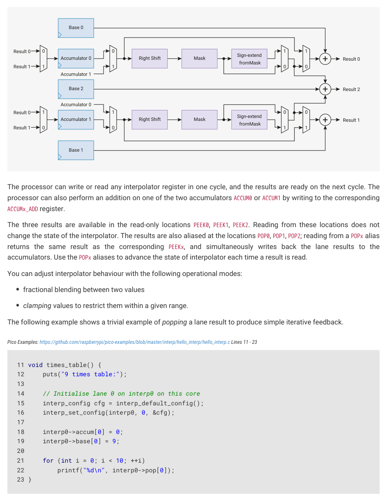

# 3.1.10. Interpolator

3.1.10. Interpolator

Each core is equipped with two interpolators (INTERP0 and INTERP1) that can accelerate tasks by combining certain pre-

configured operations into a single processor cycle. Intended for cases where the pre-configured operation repeats

many times, interpolators result in code which uses both fewer CPU cycles and fewer CPU registers in time-critical

sections.

The interpolators already accelerate audio operations within the SDK. Their flexible configuration makes it possible to

optimise many other tasks, including:

• quantization
• dithering
• table lookup address generation
• affine texture mapping
• decompression
• linear feedback

3.1. SIO
44

RP2350 Datasheet



Figure 8. An

interpolator. The two

accumulator registers

and three base

registers have single-

cycle read/write

Mask
Accumulator 0
Result 0

access from the

processor. The

interpolator is

organised into two

lanes, which perform

masking, shifting and

sign-extension

operations on the two

accumulators. This

produces three

possible results, by

adding the

intermediate

shift/mask values to

the three base

registers. From left to

The processor can write or read any interpolator register in one cycle, and the results are ready on the next cycle. The

right, the multiplexers

processor can also perform an addition on one of the two accumulators ACCUM0 or ACCUM1 by writing to the corresponding

on each lane are

controlled by the

following flags in the

CTRL registers:

The three results are available in the read-only locations PEEK0, PEEK1, PEEK2. Reading from these locations does not

CROSS_RESULT,

change the state of the interpolator. The results are also aliased at the locations POP0, POP1, POP2; reading from a POPx alias

CROSS_INPUT, SIGNED,

returns the same result as the corresponding PEEKx, and simultaneously writes back the lane results to the

and ADD_RAW.

accumulators. Use the POPx aliases to advance the state of interpolator each time a result is read.

You can adjust interpolator behaviour with the following operational modes:

• fractional blending between two values
• clamping values to restrict them within a given range.

The following example shows a trivial example of popping a lane result to produce simple iterative feedback.

Pico Examples: https://github.com/raspberrypi/pico-examples/blob/master/interp/hello_interp/hello_interp.c Lines 11 - 23

```c
12     puts("9 times table:");
14     // Initialise lane 0 on interp0 on this core
15     interp_config cfg = interp_default_config();
16     interp_set_config(interp0, 0, &cfg);
21     for (int i = 0; i < 10; ++i)
22         printf("%d\n", interp0->pop[0]);
```

3.1.10.1. Lane operations

3.1. SIO
45

RP2350 Datasheet


Figure 9. Each lane of

each interpolator can

be configured to

Mask
Accumulator 0
Add to BASE1

perform mask, shift

and sign-extension on

one of the

accumulators. This is

fed into adders which

produce final results,

which may optionally

Each lane performs these three operations, in sequence:

be fed back into the

accumulators with

• A right shift by CTRL_LANEx_SHIFT (0 to 31 bits)
• A mask of bits from CTRL_LANEx_MASK_LSB to CTRL_LANEx_MASK_MSB inclusive (each ranging from bit 0 to bit 31)
• A sign extension from the top of the mask, i.e. take bit CTRL_LANEx_MASK_MSB and OR it into all more-significant bits, if

each read. The

datapath can be

configured using a

handful of 32-bit

multiplexers. From left

to right, these are

controlled by the

following CTRL flags:

CROSS_RESULT,

• ACCUM0 = 0xdeadbeef
• CTRL_LANE0_SHIFT = 8
• CTRL_LANE0_MASK_LSB = 4
• CTRL_LANE0_MASK_MSB = 7
• CTRL_SIGNED = 1

CROSS_INPUT, SIGNED,

and ADD_RAW.

Then lane 0 would produce the following results at each stage:

• Right shift by 8 to produce 0x00deadbe
• Mask bits 7 to 4 to produce 0x00deadbe & 0x000000f0 = 0x000000b0
• Sign-extend up from bit 7 to produce 0xffffffb0

Pico Examples: https://github.com/raspberrypi/pico-examples/blob/master/interp/hello_interp/hello_interp.c Lines 25 - 46

```c
26     interp_config cfg = interp_default_config();
27     interp0->accum[0] = 0x1234abcd;
30     printf("ACCUM0 = %08x\n", interp0->accum[0]);
31     for (int i = 0; i < 8; ++i) {
32         // LSB, then MSB. These are inclusive, so 0,31 means "the entire 32 bit register"
33         interp_config_set_mask(&cfg, i * 4, i * 4 + 3);
34         interp_set_config(interp0, 0, &cfg);
35         // Reading from ACCUMx_ADD returns the raw lane shift and mask value, without BASEx
36         printf("Nibble %d: %08x\n", i, interp0->add_raw[0]);
39     puts("Masking with sign extension:");
40     interp_config_set_signed(&cfg, true);
41     for (int i = 0; i < 8; ++i) {
42         interp_config_set_mask(&cfg, i * 4, i * 4 + 3);
43         interp_set_config(interp0, 0, &cfg);
44         printf("Nibble %d: %08x\n", i, interp0->add_raw[0]);
```

The above example should print the following:

3.1. SIO
46

RP2350 Datasheet

```c
ACCUM0 = 1234abcd
Nibble 0: 0000000d
Nibble 1: 000000c0
Nibble 2: 00000b00
Nibble 3: 0000a000
Nibble 4: 00040000
Nibble 5: 00300000
Nibble 6: 02000000
Nibble 7: 10000000
Masking with sign extension:
Nibble 0: fffffffd
Nibble 1: ffffffc0
Nibble 2: fffffb00
Nibble 3: ffffa000
Nibble 4: 00040000
Nibble 5: 00300000
Nibble 6: 02000000
Nibble 7: 10000000
```

Changing the result and input multiplexers can create feedback between the accumulators. This is useful for audio

dithering.

Pico Examples: https://github.com/raspberrypi/pico-examples/blob/master/interp/hello_interp/hello_interp.c Lines 48 - 66

```c
48 void cross_lanes() {
49     interp_config cfg = interp_default_config();
50     interp_config_set_cross_result(&cfg, true);
51     // ACCUM0 gets lane 1 result:
52     interp_set_config(interp0, 0, &cfg);
53     // ACCUM1 gets lane 0 result:
54     interp_set_config(interp0, 1, &cfg);
55 
56     interp0->accum[0] = 123;
57     interp0->accum[1] = 456;
58     interp0->base[0] = 1;
59     interp0->base[1] = 0;
60     puts("Lane result crossover:");
61     for (int i = 0; i < 10; ++i) {
62         uint32_t peek0 = interp0->peek[0];
63         uint32_t pop1 = interp0->pop[1];
64         printf("PEEK0, POP1: %d, %d\n", peek0, pop1);
65     }
66 }
```

This should print the following :

```c
PEEK0, POP1: 124, 456
PEEK0, POP1: 457, 124
PEEK0, POP1: 125, 457
PEEK0, POP1: 458, 125
PEEK0, POP1: 126, 458
PEEK0, POP1: 459, 126
PEEK0, POP1: 127, 459
PEEK0, POP1: 460, 127
PEEK0, POP1: 128, 460
PEEK0, POP1: 461, 128
```

3.1. SIO
47

RP2350 Datasheet

3.1.10.2. Blend mode

Blend mode is available on INTERP0 on each core, and is enabled by the CTRL_LANE0_BLEND control flag. It performs linear

interpolation, which we define as follows:

Where 
 is the register BASE0, 
 is the register BASE1, and 
 is a fractional value formed from the least significant 8 bits

of the lane 1 shift and mask value.

Blend mode differs from normal mode in the following ways:

• PEEK0, POP0 return the 8-bit alpha value (the 8 LSBs of the lane 1 shift and mask value), with zeroes in result bits 31

down to 24.
• PEEK1, POP1 return the linear interpolation between BASE0 and BASE1
• PEEK2, POP2 do not include lane 1 result in the addition (i.e. it is BASE2 + lane 0 shift and mask value)

The result of the linear interpolation is equal to BASE0 when the alpha value is 0, and equal to BASE0 + 255/256 * (BASE1 -

BASE0) when the alpha value is all-ones.

Pico Examples: https://github.com/raspberrypi/pico-examples/blob/master/interp/hello_interp/hello_interp.c Lines 68 - 87

```c
68 void simple_blend1() {
69     puts("Simple blend 1:");
70 
71     interp_config cfg = interp_default_config();
72     interp_config_set_blend(&cfg, true);
73     interp_set_config(interp0, 0, &cfg);
74 
75     cfg = interp_default_config();
76     interp_set_config(interp0, 1, &cfg);
77 
78     interp0->base[0] = 500;
79     interp0->base[1] = 1000;
80 
81     for (int i = 0; i <= 6; i++) {
82         // set fraction to value between 0 and 255
83         interp0->accum[1] = 255 * i / 6;
84         // ≈ 500 + (1000 - 500) * i / 6;
85         printf("%d\n", (int) interp0->peek[1]);
86     }
87 }
```

This should print the following (note the 255/256 resulting in 998 not 1000):

```c
500
582
666
748
832
914
998
```

CTRL_LANE1_SIGNED controls whether BASE0 and BASE1 are sign-extended for this interpolation (this sign extension is required

because the interpolation produces an intermediate product value 40 bits in size). CTRL_LANE0_SIGNED continues to control

the sign extension of the lane 0 intermediate result in PEEK2, POP2 as normal.

3.1. SIO
48

RP2350 Datasheet

Pico Examples: https://github.com/raspberrypi/pico-examples/blob/master/interp/hello_interp/hello_interp.c Lines 90 - 121

```c
 90 void print_simple_blend2_results(bool is_signed) {
 91     // lane 1 signed flag controls whether base 0/1 are treated as signed or unsigned
 92     interp_config cfg = interp_default_config();
 93     interp_config_set_signed(&cfg, is_signed);
 94     interp_set_config(interp0, 1, &cfg);
 95 
 96     for (int i = 0; i <= 6; i++) {
 97         interp0->accum[1] = 255 * i / 6;
 98         if (is_signed) {
 99             printf("%d\n", (int) interp0->peek[1]);
100         } else {
101             printf("0x%08x\n", (uint) interp0->peek[1]);
102         }
103     }
104 }
105 
106 void simple_blend2() {
107     puts("Simple blend 2:");
108 
109     interp_config cfg = interp_default_config();
110     interp_config_set_blend(&cfg, true);
111     interp_set_config(interp0, 0, &cfg);
112 
113     interp0->base[0] = (uint32_t) -1000;
114     interp0->base[1] = 1000;
115 
116     puts("signed:");
117     print_simple_blend2_results(true);
118 
119     puts("unsigned:");
120     print_simple_blend2_results(false);
121 }
```

This should print the following:

```c
signed:
-1000
-672
-336
-8
328
656
992
unsigned:
0xfffffc18
0xd5fffd60
0xaafffeb0
0x80fffff8
0x56000148
0x2c000290
0x010003e0
```

Finally, in blend mode when using the BASE_1AND0 register to send a 16-bit value to each of BASE0 and BASE1 with a single

32-bit write, the sign-extension of these 16-bit values to full 32-bit values during the write is controlled by

CTRL_LANE1_SIGNED for both bases, as opposed to non-blend-mode operation, where CTRL_LANE0_SIGNED affects extension

into BASE0 and CTRL_LANE1_SIGNED affects extension into BASE1.

3.1. SIO
49

RP2350 Datasheet

Pico Examples: https://github.com/raspberrypi/pico-examples/blob/master/interp/hello_interp/hello_interp.c Lines 124 - 145

```c
124 void simple_blend3() {
125     puts("Simple blend 3:");
126 
127     interp_config cfg = interp_default_config();
128     interp_config_set_blend(&cfg, true);
129     interp_set_config(interp0, 0, &cfg);
130 
131     cfg = interp_default_config();
132     interp_set_config(interp0, 1, &cfg);
133 
134     interp0->accum[1] = 128;
135     interp0->base01 = 0x30005000;
136     printf("0x%08x\n", (int) interp0->peek[1]);
137     interp0->base01 = 0xe000f000;
138     printf("0x%08x\n", (int) interp0->peek[1]);
139 
140     interp_config_set_signed(&cfg, true);
141     interp_set_config(interp0, 1, &cfg);
142 
143     interp0->base01 = 0xe000f000;
144     printf("0x%08x\n", (int) interp0->peek[1]);
145 }
```

This should print the following:

```c
0x00004000
0x0000e800
0xffffe800
```

3.1.10.3. Clamp Mode

Clamp mode is available on INTERP1 on each core. To enable clamp mode, set the CTRL_LANE0_CLAMP control flag to high. In

clamp mode, the PEEK0/POP0 result is the lane value (shifted, masked, sign-extended ACCUM0) clamped between BASE0 and

BASE1. In other words, if the lane value is less than BASE0, a value of BASE0 is produced; if greater than BASE1, a value of BASE1

is produced; otherwise, the value passes through. No addition is performed. The signedness of these comparisons is

controlled by the CTRL_LANE0_SIGNED flag.

Other than this, the interpolator behaves the same as in normal mode.

Pico Examples: https://github.com/raspberrypi/pico-examples/blob/master/interp/hello_interp/hello_interp.c Lines 193 - 211

```c
193 void clamp() {
194     puts("Clamp:");
195     interp_config cfg = interp_default_config();
196     interp_config_set_clamp(&cfg, true);
197     interp_config_set_shift(&cfg, 2);
198     // set mask according to new position of sign bit..
199     interp_config_set_mask(&cfg, 0, 29);
200     // ...so that the shifted value is correctly sign extended
201     interp_config_set_signed(&cfg, true);
202     interp_set_config(interp1, 0, &cfg);
203 
204     interp1->base[0] = 0;
205     interp1->base[1] = 255;
206 
207     for (int i = -1024; i <= 1024; i += 256) {
```

3.1. SIO
50

RP2350 Datasheet

```c
208         interp1->accum[0] = i;
209         printf("%d\t%d\n", i, (int) interp1->peek[0]);
210     }
211 }
```

This should print the following:

```c
-1024   0
-768    0
-512    0
-256    0
0       0
256     64
512     128
768     192
1024    255
```

3.1.10.4. Sample use case: linear interpolation

Linear interpolation combines blend mode with other interpolator functionality. In this example, ACCUM0 tracks a fixed-

point (integer/fraction) position within a list of values to be interpolated. Lane 0 is used to produce an address into the

value array for the integer part of the position. The fractional part of the position is shifted to produce a value from 0-

255 for the blend. The blend is performed between two consecutive values in the array.

Finally the fractional position is updated via a single write to ACCUM0_ADD_RAW.

Pico Examples: https://github.com/raspberrypi/pico-examples/blob/master/interp/hello_interp/hello_interp.c Lines 147 - 191

```c
147 void linear_interpolation() {
148     puts("Linear interpolation:");
149     const int uv_fractional_bits = 12;
150 
151     // for lane 0
152     // shift and mask XXXX XXXX XXXX XXXX XXXX FFFF FFFF FFFF (accum 0)
153     // to             0000 0000 000X XXXX XXXX XXXX XXXX XXX0
154     // i.e. non fractional part times 2 (for uint16_t)
155     interp_config cfg = interp_default_config();
156     interp_config_set_shift(&cfg, uv_fractional_bits - 1);
157     interp_config_set_mask(&cfg, 1, 32 - uv_fractional_bits);
158     interp_config_set_blend(&cfg, true);
159     interp_set_config(interp0, 0, &cfg);
160 
161     // for lane 1
162     // shift XXXX XXXX XXXX XXXX XXXX FFFF FFFF FFFF (accum 0 via cross input)
163     // to    0000 XXXX XXXX XXXX XXXX FFFF FFFF FFFF
164 
165     cfg = interp_default_config();
166     interp_config_set_shift(&cfg, uv_fractional_bits - 8);
167     interp_config_set_signed(&cfg, true);
168     interp_config_set_cross_input(&cfg, true); // signed blending
169     interp_set_config(interp0, 1, &cfg);
170 
171     int16_t samples[] = {0, 10, -20, -1000, 500};
172 
173     // step is 1/4 in our fractional representation
174     uint step = (1 << uv_fractional_bits) / 4;
175 
176     interp0->accum[0] = 0; // initial sample_offset;
```

3.1. SIO
51

RP2350 Datasheet

```c
177     interp0->base[2] = (uintptr_t) samples;
178     for (int i = 0; i < 16; i++) {
179         // result2 = samples + (lane0 raw result)
180         // i.e. ptr to the first of two samples to blend between
181         int16_t *sample_pair = (int16_t *) interp0->peek[2];
182         interp0->base[0] = sample_pair[0];
183         interp0->base[1] = sample_pair[1];
184         uint32_t peek1 = interp0->peek[1];
185         uint32_t add_raw1 = interp0->add_raw[1];
186         printf("%d\t(%d%% between %d and %d)\n", (int) peek1,
187                100 * (add_raw1 & 0xff) / 0xff,
188                sample_pair[0], sample_pair[1]);
189         interp0->add_raw[0] = step;
190     }
191 }
```

This should print the following:

```c
0       (0% between 0 and 10)
2       (25% between 0 and 10)
5       (50% between 0 and 10)
7       (75% between 0 and 10)
10      (0% between 10 and -20)
2       (25% between 10 and -20)
-5      (50% between 10 and -20)
-13     (75% between 10 and -20)
-20     (0% between -20 and -1000)
-265    (25% between -20 and -1000)
-510    (50% between -20 and -1000)
-755    (75% between -20 and -1000)
-1000   (0% between -1000 and 500)
-625    (25% between -1000 and 500)
-250    (50% between -1000 and 500)
125     (75% between -1000 and 500)
```

This method is used for fast approximate audio upscaling in the SDK.

3.1.10.5. Sample use case: simple affine texture mapping

Simple affine texture mapping can be implemented by using fixed-point arithmetic for texture coordinates, and stepping

a fixed amount in each coordinate for every pixel in a scanline. The integer parts of the texture coordinates form an

address into the texture. Reading from POP2 adds the offset to the texture base pointer. The processor loads the

resulting address to sample a pixel colour from the texture.

By using two lanes, all three base values, and the CTRL_LANEx_ADD_RAW flag, you can use the interpolator to reduce an

expensive CPU operation to a single cycle iteration.

Pico Examples: https://github.com/raspberrypi/pico-examples/blob/master/interp/hello_interp/hello_interp.c Lines 214 - 272

```c
214 void texture_mapping_setup(uint8_t *texture, uint texture_width_bits, uint
    texture_height_bits,
215                            uint uv_fractional_bits) {
216     interp_config cfg = interp_default_config();
217     // set add_raw flag to use raw (un-shifted and un-masked) lane accumulator value when
    adding
218     // it to the lane base to make the lane result
219     interp_config_set_add_raw(&cfg, true);
220     interp_config_set_shift(&cfg, uv_fractional_bits);
```

3.1. SIO
52

RP2350 Datasheet

```c
221     interp_config_set_mask(&cfg, 0, texture_width_bits - 1);
222     interp_set_config(interp0, 0, &cfg);
223 
224     interp_config_set_shift(&cfg, uv_fractional_bits - texture_width_bits);
225     interp_config_set_mask(&cfg, texture_width_bits, texture_width_bits +
    texture_height_bits - 1);
226     interp_set_config(interp0, 1, &cfg);
227 
228     interp0->base[2] = (uintptr_t) texture;
229 }
230 
231 void texture_mapped_span(uint8_t *output, uint32_t u, uint32_t v, uint32_t du, uint32_t dv,
    uint count) {
232     // u, v are texture coordinates in fixed point with uv_fractional_bits fractional bits
233     // du, dv are texture coordinate steps across the span in same fixed point.
234     interp0->accum[0] = u;
235     interp0->base[0] = du;
236     interp0->accum[1] = v;
237     interp0->base[1] = dv;
238     for (uint i = 0; i < count; i++) {
239         // equivalent to
240         // uint32_t sm_result0 = (accum0 >> uv_fractional_bits) & (1 << (texture_width_bits -
    1);
241         // uint32_t sm_result1 = (accum1 >> uv_fractional_bits) & (1 << (texture_height_bits -
    1);
242         // uint8_t *address = texture + sm_result0 + (sm_result1 << texture_width_bits);
243         // output[i] = *address;
244         // accum0 = du + accum0;
245         // accum1 = dv + accum1;
246 
247         // result2 is the texture address for the current pixel;
248         // popping the result advances to the next iteration
249         output[i] = *(uint8_t *) interp0->pop[2];
250     }
251 }
252 
253 void texture_mapping() {
254     puts("Affine Texture mapping (with texture wrap):");
255 
256     uint8_t texture[] = {
257             0x00, 0x01, 0x02, 0x03,
258             0x10, 0x11, 0x12, 0x13,
259             0x20, 0x21, 0x22, 0x23,
260             0x30, 0x31, 0x32, 0x33,
261     };
262     // 4x4 texture
263     texture_mapping_setup(texture, 2, 2, 16);
264     uint8_t output[12];
265     uint32_t du = 65536 / 2;  // step of 1/2
266     uint32_t dv = 65536 / 3;  // step of 1/3
267     texture_mapped_span(output, 0, 0, du, dv, 12);
268 
269     for (uint i = 0; i < 12; i++) {
270         printf("0x%02x\n", output[i]);
271     }
272 }
```

This should print the following:

3.1. SIO
53

RP2350 Datasheet

```c
0x00
0x00
0x01
0x01
0x12
0x12
0x13
0x23
0x20
0x20
0x31
0x31
```

## Embedded Images


