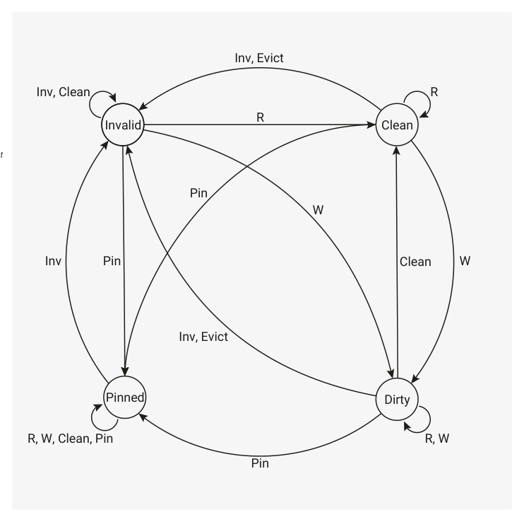

# 4.4.1. XIP cache

4.4.1. XIP cache

The cache is 16 kB, two-way set-associative, 1 cycle hit. It is internal to the XIP subsystem, and only involved in

accesses to the QSPI memory interface, so software does not have to consider cache coherence unless performing

flash programming operations. It caches accesses to a 26-bit downstream XIP address space. On RP2350, the lower

half of this space is occupied by two 16 MB windows for the two QMI chip selects. RP2350 reserves the remainder for

future expansion, but you can use the space to pin cache lines outside of the QMI address space for use as cache-as-

SRAM (Section 4.4.1.3). The 26-bit XIP address space is mirrored multiple times in the RP2350 address space, decoded

on bits 27:26 of the system bus address:

• 0x10… : Cached XIP access
• 0x14… : Uncached XIP access
• 0x18… : Cache maintenance writes
• 0x1c… : Uncached, untranslated XIP access — bypass QMI address translation

You can disable cache lookup separately for Secure and Non-secure accesses via the CTRL.EN_SECURE and

CTRL.EN_NONSECURE register bits. The CTRL register contains controls to disable Secure/Non-secure access to the

uncached and uncached/untranslated XIP windows, which avoids duplicate mappings that may otherwise require

additional SAU or PMP regions.

4.4. External flash and PSRAM (XIP)
341

RP2350 Datasheet

4.4.1.1. Cache maintenance

Cache maintenance is performed on a line-by-line basis by writing into the cache maintenance mirror of the XIP address

space, starting at 0x18000000. Cache lines are 8 bytes in size. Write data is ignored; instead, the 3 LSBs of the address

select the maintenance operation:

• 0x0: Invalidate by set/way
• 0x1: Clean by set/way
• 0x2: Invalidate by address
• 0x3: Clean by address
• 0x7: Pin cache set/way at address (Section 4.4.1.3)

Invalidate

Marks a cache line as no longer containing data; the next access to the same address will miss the cache.

Does not write back any data to external memory. Used when external memory has been modified in a way

that the cache would not automatically know about, such as a flash programming operation.

Clean

Instructs the cache to write out any data stored in the cache as a result of a previous cached write access that

has not yet been written out to external memory. Used to make cached writes available to uncached reads.

Also used when cache contents are about to be lost, but external memory is to stay powered (for example,

when the system is about to power down).

By set/way

Selects a particular cache line to be maintained, out of the 2048 × 8-byte lines that make up the cache. Bit 13 of

the system bus address selects the cache way. Bits 12:3 of the address select a particular cache line within

that way. Mainly used to iterate exhaustively over all cache lines (for example, during a full cache flush).

By address

Looks up an address in the cache, then performs the requested maintenance if that line is currently allocated

in the cache. Used when only a particular range of XIP addresses needs to be maintained, for example, a flash

page that was just programmed. Usually faster than a full flush, because the real cost of a cache flush is not in

the maintenance operations, but the large number of subsequent cache misses.

Pin

Prevents a particular cache line from being evicted. Used to mark important external memory contents that

must get guaranteed cache hits, or to allocate cache lines for use as cache-as-SRAM. If a cached access to

some other address misses the cache and attempts to evict a pinned cache line, the eviction fails, and the

access is downgraded to an uncached access.

Cache maintenance operations operate on the cache’s tag memory. This is the cache’s metadata store, which tracks

the state of each cache line. Maintenance operations do not affect the cache’s data memory, which contains the

cache’s copy of data bytes from external memory.

By default, cache maintenance is Secure-only. Non-secure writes to the cache maintenance address window have no

effect and return a bus error. Non-secure cache maintenance can be enabled by setting the CTRL.MAINT_NONSEC

register bit, but this is not recommended if Secure software may perform cached XIP accesses.

4.4.1.2. Cache line states

The changes to a cache line caused by cached accesses and maintenance operations can be summarised by a set of

state transitions.

4.4. External flash and PSRAM (XIP)
342

RP2350 Datasheet

Figure 17. State

transition diagram for

each cache line. Inv,

Clean and Pin

represent

invalidate/clean/pin

Inv, Clean
R

maintenance

operations,

respectively. R and W

represent cached

reads and writes. Evict

represents a cache

line deallocation to

make room for a new

allocation due to a

read/write cache

miss.

R, W, Clean, Pin
R, W

Initially, the state of all cache lines is undefined. When booting from flash, the bootrom performs an invalidate by

set/way on every line of the cache to force them to a known state. In the diagram above, all states have an Inv arc to the

invalid state.

A dirty cache line contains data not yet propagated to downstream memory.

A clean cache line contains data that matches the downstream memory contents.

Accessing an invalid cache line causes an allocation: the cache fetches the corresponding data from downstream

memory, stores it in the cache, then marks the cache line as clean or dirty. The cache also stores part of the

downstream address, known as the tag, to recall the downstream address stored in each cache line. Read allocations

enter the clean state, so the cache line can be safely freed at any time. Write allocations enter the dirty state, so the

cache line must propagate downstream before it can be freed.

Writing to a clean cache line marks it as dirty because the cache now contains write data that has not propagated

downstream. The line can be explicitly returned to the clean state using a clean maintenance operation (0x1 or 0x3), but

this is not required. Typically, the cache automatically propagates dirty cache lines downstream when it needs to

reallocate them.

Evictions happen when a cached read or write needs to allocate a cache line that is already in the clean or dirty state.

The eviction transitions the line momentarily to the invalid state, ready for allocation. For clean cache lines, this happens

instantaneously. For dirty cache lines, the cache must first propagate the cache line contents downstream before it can

safely enter the invalid state.

Cache lines enter the pinned state using a pin maintenance operation (0x7) and exit only by an invalidate maintenance

operation (0x0 or 0x2).

4.4. External flash and PSRAM (XIP)
343

RP2350 Datasheet

NOTE

The pin maintenance operation only marks the line as pinned; it does not perform any copying of data. When pinning

lines that exist in external memory devices, you must first pin the line, then copy the downstream data into the

pinned line by reading from the uncached XIP window.

4.4.1.3. Cache-as-SRAM

When you disabled the cache of RP2040, the cache would map the entire cache memory at 0x15000000. RP2350 replaces

this with the ability to pin individual cache lines. You can use this in the following ways:

• Pin the entire cache at some address range to use the entire cache as SRAM
• Pin one full cache way to make half of the cache available for cache-as-SRAM use (the remaining cache way still

functions as usual)
• Pin an address range that that maps critical flash contents

NOTE

Pinned cache lines are not accessible when the cache is disabled via the CTRL register (CTRL.EN_SECURE or

CTRL.EN_NONSECURE depending on security level of the bus access).

Because the QMI only occupies the lower half of the 64 MB XIP address space, you can pin cache lines outside of the

QMI address range (e.g. at the top of the XIP space) to avoid interfering with any QMI accesses. As a general rule, the

more cache you pin, the lower the cache hit rate for other accesses.

Cache lines are pinned using the pin maintenance operation (0x7), which performs the following steps:

1. An implicit invalidate-by-address operation (0x2) using the full address of the maintenance operation

◦This ensures that each address is allocated in only one cache way (required for correct cache operation)

2. Select the cache line to be pinned, using bit 13 to select the cache way, and bits 12:3 to select the cache set (as

with 0x0/0x1 invalidate/clean by set/way commands)

3. Write the address to the cache line’s tag entry

4. Change the cache line’s state to pinned (as per the state diagram in Section 4.4.1.2)

5. Update the cache line’s tag with the full address of the maintenance operation

After a pin operation, cached reads and writes to the specified address always hit the cache until that cache line is

either invalidated or pinned to a different address.

NOTE

Pinning two addresses that are equal modulo cache size pins the same cache line twice. It does not pin two different

cache lines. The second pin will overwrite the first.

When a cached access hits a pinned cache line, it behaves the same as a dirty line. The cache reads and writes as if

allocated in the cache by normal means.

Cache eviction policy is random, and the cache only makes one attempt to select an eviction way. If the cache selects

to evict a pinned line, the eviction fails, and the access is demoted to an uncached access. As a result, a cache with one

way pinned does not behave exactly the same as a direct-mapped 8 kB cache, but average-case performance is similar.

Cache line states are stored in the cache tag memory stored in the XIP memory power domain. This memory contents

do not change on reset, so pinned lines remain pinned across resets. If the XIP memory power domain is not powered

down, memory contents do not change across power cycles of the switched core reset domain. The bootrom clears the

tag memory upon entering the flash boot or NSBOOT (USB boot) path, but watchdog scratch vector reboots can boot

directly into pinned XIP cache lines.

4.4. External flash and PSRAM (XIP)
344
