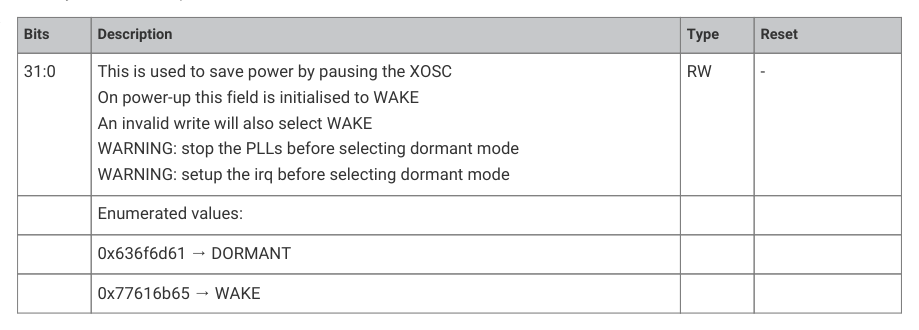

# 8.2.8. List of registers

8.2.8. List of registers

The XOSC registers start at a base address of 0x40048000 (defined as XOSC_BASE in SDK).

| Offset | Name | Info |
| --- | --- | --- |
| 0x00 | CTRL | Crystal Oscillator Control |
| 0x04 | STATUS | Crystal Oscillator Status |
| 0x08 | DORMANT | Crystal Oscillator pause control |
| 0x0c | STARTUP | Controls the startup delay |
| 0x10 | COUNT | A down counter running at the XOSC frequency which counts to zero and stops. |

Table 598. List of

XOSC: CTRL Register

Offset: 0x00

Description

Crystal Oscillator Control

Table 599. CTRL

Register
Bits
Description
Type
Reset

31:24
Reserved.
-
-

23:12
ENABLE: On power-up this field is initialised to DISABLE and the chip runs

If the chip has subsequently been programmed to run from the XOSC then

setting this field to DISABLE may lock-up the chip. If this is a concern then run

the clk_ref from the ROSC and enable the clk_sys RESUS feature.

The 12-bit code is intended to give some protection against accidental writes.

An invalid setting will retain the previous value. The actual value being used

can be read from STATUS_ENABLED

11:0
FREQ_RANGE: The 12-bit code is intended to give some protection against

accidental writes. An invalid setting will retain the previous value. The actual

value being used can be read from STATUS_FREQ_RANGE

8.2. Crystal oscillator (XOSC)
559

RP2350 Datasheet

XOSC: STATUS Register

Offset: 0x04

Description

Crystal Oscillator Status

| Bits | Description | Type | Reset |
| --- | --- | --- | --- |
| 31 | STABLE: Oscillator is running and stable | RO | 0x0 |
| 30:25 | Reserved. | - | - |
| 24 | BADWRITE: An invalid value has been written to CTRL_ENABLE or CTRL_FREQ_RANGE or DORMANT | WC | 0x0 |
| 23:13 | Reserved. | - | - |
| 12 | ENABLED: Oscillator is enabled but not necessarily running and stable, resets to 0 | RO | - |
| 11:2 | Reserved. | - | - |
| 1:0 | FREQ_RANGE: The current frequency range setting | RO | - |
|  | Enumerated values: |  |  |
|  | 0x0 → 1_15MHZ |  |  |
|  | 0x1 → 10_30MHZ |  |  |
|  | 0x2 → 25_60MHZ |  |  |
|  | 0x3 → 40_100MHZ |  |  |

Table 600. STATUS

XOSC: DORMANT Register

Offset: 0x08

Description

Crystal Oscillator pause control

Table 601. DORMANT

Register
Bits
Description
Type
Reset

On power-up this field is initialised to WAKE

An invalid write will also select WAKE

WARNING: stop the PLLs before selecting dormant mode

WARNING: setup the irq before selecting dormant mode

XOSC: STARTUP Register

Offset: 0x0c

Description

Controls the startup delay

| Bits | Description | Type | Reset |
| --- | --- | --- | --- |
| 31:21 | Reserved. | - | - |
| 20 | X4: Multiplies the startup_delay by 4, just in case. The reset value is controlled by a mask-programmable tiecell and is provided in case we are booting from XOSC and the default startup delay is insufficient | RW | 0x0 |
| 19:14 | Reserved. | - | - |
| 13:0 | DELAY: in multiples of 256*xtal_period. The reset value of 0xc4 corresponds to approx 50 000 cycles. | RW | 0x00c4 |

Table 602. STARTUP

8.2. Crystal oscillator (XOSC)
560

RP2350 Datasheet

XOSC: COUNT Register

Offset: 0x10

| Bits | Description | Type | Reset |
| --- | --- | --- | --- |
| 31:16 | Reserved. | - | - |
| 15:0 | A down counter running at the xosc frequency which counts to zero and stops. Can be used for short software pauses when setting up time sensitive hardware. To start the counter, write a non-zero value. Reads will return 1 while the count is running and 0 when it has finished. Minimum count value is 4. Count values <4 will be treated as count value =4. Note that synchronisation to the register clock domain costs 2 register clock cycles and the counter cannot compensate for that. | RW | 0x0000 |

Table 603. COUNT

8.3. Ring oscillator (ROSC)
