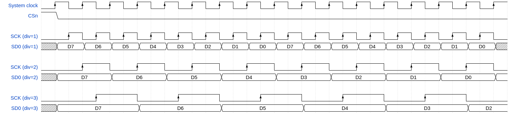

# 12.14.3. Timing

12.14.3. Timing

QMI operates in SPI mode 0, capturing data on each rising edge of SCK. New data is asserted on each subsequent falling

edge. The first output data launches simultaneously with the assertion of the chip select, as illustrated by Figure 136.

*Figure 136. A bidirectional SPI transfer, as used by QMI.*

QMI timing is relative to the system clock. As this is generally quite fast relative to external signals, the

M0_TIMING.CLKDIV/M1_TIMING.CLKDIV field can uniformly slow SCK and data lines by an integer factor.

12.14. QSPI memory interface (QMI)
1231

RP2350 Datasheet

*Figure 137. The CLKDIV controls set the number of system clock cycles per SCK cycle, for each memory window.*

QMI uses DDR input/output registers to enable a resolution of one half system clock cycle for output signal generation

and input sampling. This allows QMI to support odd clock divisors, including divide-by-one (SCK frequency equal to

system clock frequency).

NOTE

In practice, the maximum SCK frequency is constrained by the limits of the attached QSPI device, the signal integrity

afforded by the PCB layout, and IO delays in the pads. See Section 12.14.3.4.

12.14.3.1. Input sampling and RXDELAY

QMI samples input data on the rising edge of SCK (Section 12.14.3). To introduce additional delay to the input delay

register (helpful when the round trip delay is longer than half an SCK cycle), use M0_TIMING.RXDELAY/

M1_TIMING.RXDELAY. RXDELAY counts delay in half system clock cycles, instead of SCK cycles.

12.14.3.2. Chip select timing

To save power, chip select is de-asserted after a transaction completes. To leave chip select asserted after a

transaction, use M0_TIMING.COOLDOWN/M1_TIMING.COOLDOWN. This can reduce latency and increase bus

throughput.

Chip select can be asserted one system clock cycle early via M0_TIMING.SELECT_SETUP/M1_TIMING.SELECT_SETUP.

Some flash devices require this setting at very high SCK frequencies. Without this setting, QMI asserts chip select one

half SCK period before the first rising edge of SCK. This is simultaneous with the assertion of the first data on SDx.

Chip select hold time can also be extended by up to 3 additional system clock cycles via M0_TIMING

.SELECT_HOLD/M1_TIMING.SELECT_HOLD.

To 
enforce 
a 
maximum 
amount 
of 
time 
that 
chip 
select 
can 
remain 
asserted, 
use 
M0_TIMING

.MAX_SELECT/M1_TIMING.MAX_SELECT. This is useful for PSRAM devices, which must issue internal DRAM refresh

cycles when deselected.

To enforce a minimum amount of time that chip select can remain de-asserted, use M0_TIMING

.MIN_DESELECT/M1_TIMING.MIN_DESELECT.

12.14.3.3. Double transfer rate (DTR)

Some QSPI memory devices transfer data on both edges of SCK. This feature, known as double transfer rate (DTR),

allows a lower SCK frequency for a given data transfer rate, reducing EM emissions and the energy cost of toggling the

external clock. To enable DTR mode (per-window and per-direction), set the M0_RFMT.DTR/M1_RFMT.DTR flag (for

reads) or M0_WFMT.DTR/M1_WFMT.DTR (for writes).

QMI implements DTR by halving the clock frequency whilst maintaining the data rate. To achieve this, QMI inverts

alternate single transfer rate SCK clock periods, transforming a low-high-low-high sequence into a low-high-high-low

sequence. When DTR is disabled, the QMI launches data on SCK falling edges and captures on rising edges. When DTR is

enabled, the QMI launches data at the point half-way in between two SCK edges, and captures on each edge, as shown in

*Figure 138.*

12.14. QSPI memory interface (QMI)
1232

RP2350 Datasheet

*Figure 138. DTR is implemented by halving the SCK frequency whilst maintaining data rate.*

Enabling DTR mode does not change the data timing, only the SCK timing. Data is launched at the point where a SCK

negative edge would be, had the clock rate not been halved.

When DTR is enabled, the prefix and dummy phase of a transfer remain single transfer rate. In these phases, data bits

are doubled to match the half-rate SCK, so that new data is ready in time for each rising edge only. Figure 139 shows the

first byte (the command prefix) at single transfer rate and the second byte (address and data) at double transfer rate.

*Figure 139. Parts of DTR-enabled transfers are still single transfer rate: effectively each data bit is sent twice.*

The arrows on the SCK line in Figure 139 show the active edges of SCK (where data is captured). The single transfer rate

portion of the access expects data capture on the rising edge. The double transfer rate portion of the access expects

data capture on both edges.

Data travelling from device to host is likewise launched on both edges of SCK. Each time the QMI launches a new clock

edge, there is some delay as transitions propagate through the RP2350 pad output delay, QSPI device SCK-to-SDx delay,

and back in through the RP2350 SDx pad input delays. QMI captures data simultaneously with the launch of the next SCK

edge, plus any delay configured by M0_TIMING.RXDELAY/M1_TIMING.RXDELAY. The round-trip delay from SCK output

back to SDx input provides the SDx input hold time. If the input setup time is not sufficient, you can increase RXDELAY. For

more information, see the specific QSPI device datasheet, as well as Section 12.14.3.4.

12.14.3.4. AC timing parameters

The QMI interface is timed using the internal system clock. Skew between different QMI pins for inputs or outputs is

kept to a minimum. Any additional setup or hold time is supported by using additional clock cycle delays as mentioned

in other sections. Skew values vary depending on whether we consider just the dedicated QSPI pins (QSPI_SS,

QSPI_SD[3:0], QSPI_SCLK) or include the Bank 0 GPIO XIP special functions (for the additional QMI chip select). Different

package options have different skew timing, shown below.

| Interface | Typical Skew (ps) | Max Skew (ps) |
| --- | --- | --- |
| QSPI input | 15 | 25 |
| QSPI output | 100 | 180 |
| Bank 0 GPIO (QFN-60) output | 1080 | 1725 |
| Bank 0 GPIO (QFN-80) output | 1280 | 2100 |

*Table 1291. QMI*

It is also useful to know the delay from internal register running on system clock to output pin, and similarly the delay

from input pin to the sampling register running on system clock. Table 1292 provides worst case process, voltage, and

temperature timings for inputs and outputs on QSPI, and outputs on GPIO. Note that this delay varies based on the VDDIO

voltage level as shown in the table.

| Path | Max delay (ns) VDDIO=3.3V | Max delay (ns) VDDIO=1.8V |
| --- | --- | --- |
| QSPI input to system clock | 1.5 | 1.2 |
| system clock to QSPI output | 2.5 | 3.6 |
| system clock to GPIO (QFN-60) output | 3.5 | 4.9 |
| system clock to GPIO (QFN-80) output | 4.1 | 5.4 |

*Table 1292. QMI*

12.14. QSPI memory interface (QMI)
1233

RP2350 Datasheet

## Embedded Images

