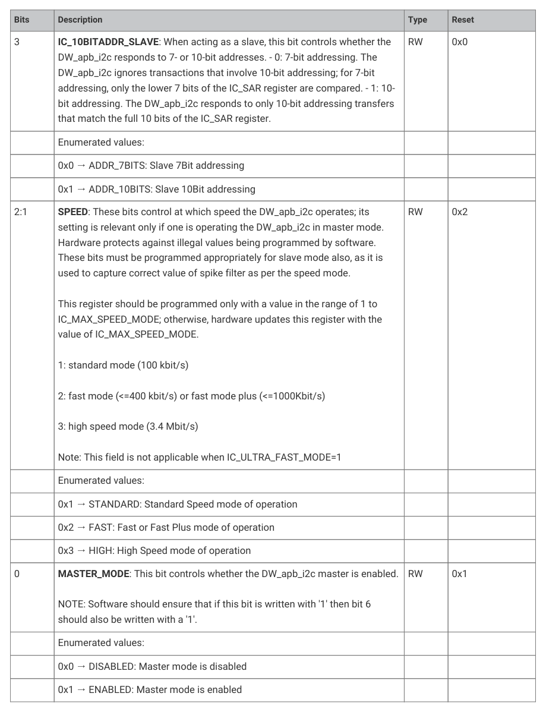
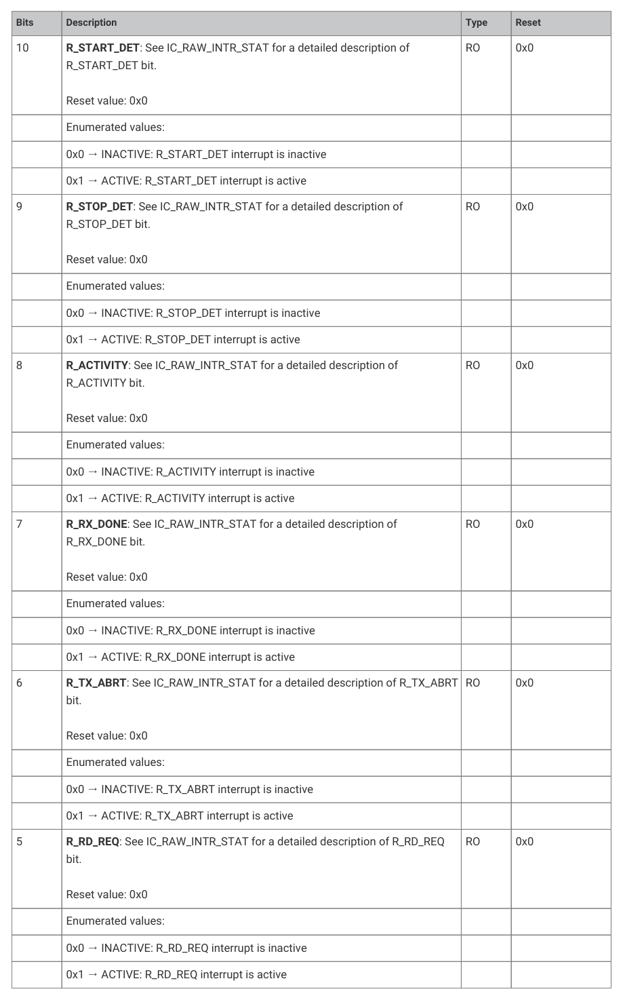
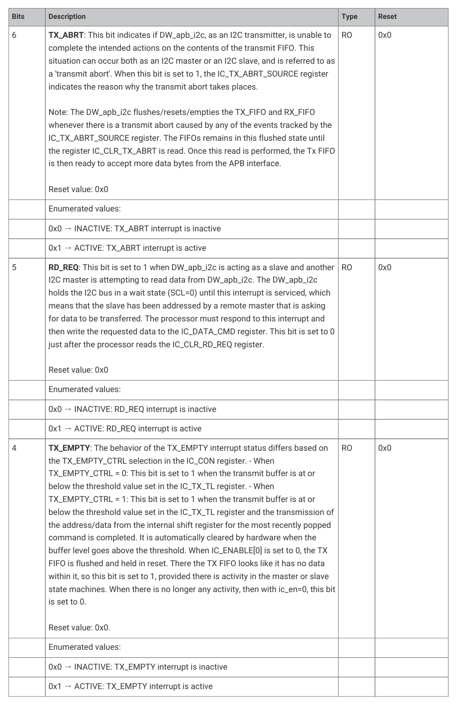
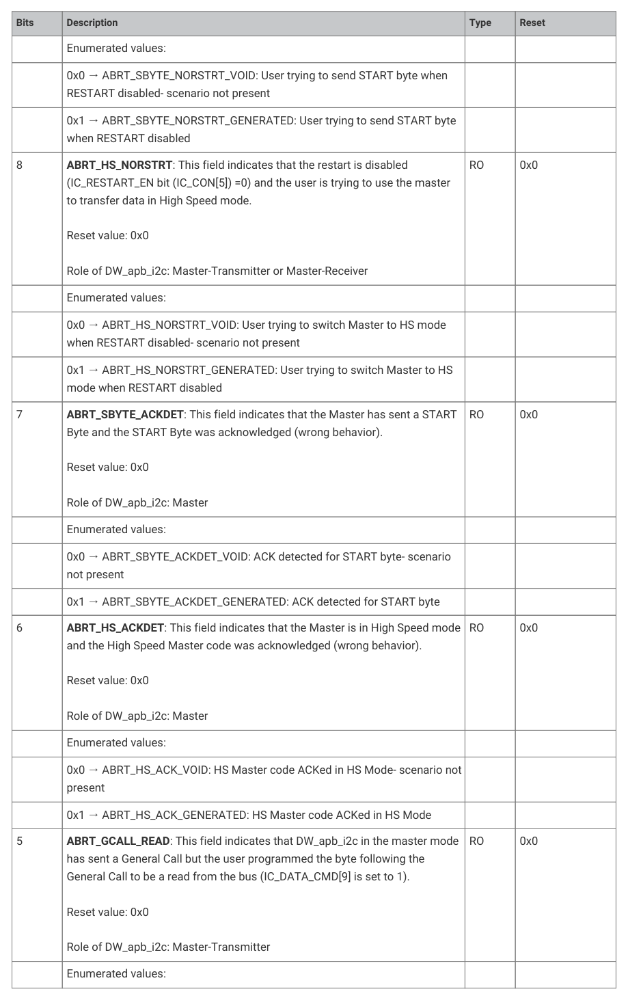
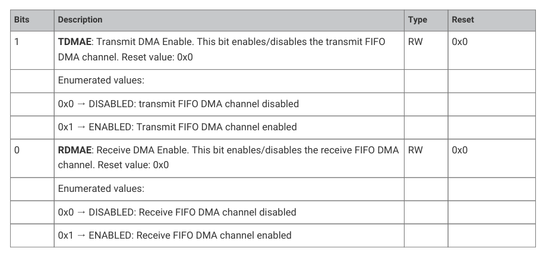
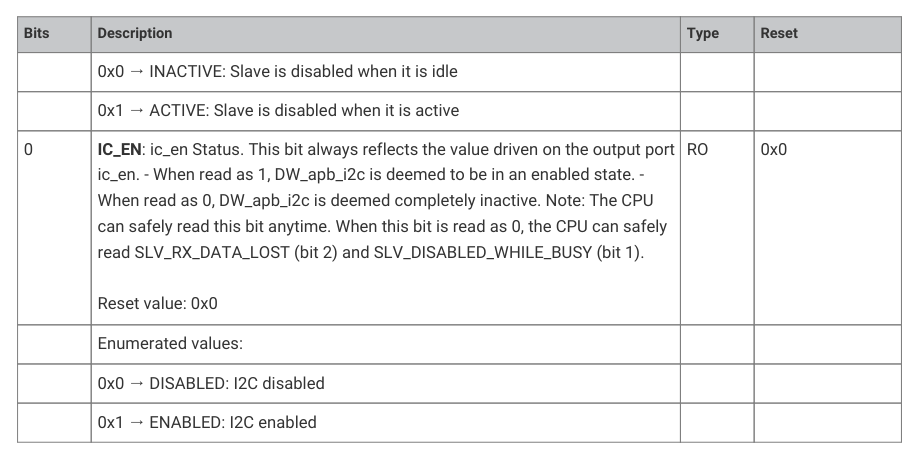

# 12.2.17. List of registers

12.2.17. List of registers

The I2C0 and I2C1 registers start at base addresses of 0x40090000 and 0x40098000 respectively (defined as I2C0_BASE and

I2C1_BASE in SDK).

12.2. I2C
1008

RP2350 Datasheet

NOTE

You may see references to configuration constants in the I2C register descriptions; these are fixed values, set at

hardware design time. A full list of their values can be found in i2c.h in the pico-sdk GitHub repository.

| Offset | Name | Info |
| --- | --- | --- |
| 0x00 | IC_CON | I2C Control Register |
| 0x04 | IC_TAR | I2C Target Address Register |
| 0x08 | IC_SAR | I2C Slave Address Register |
| 0x10 | IC_DATA_CMD | I2C Rx/Tx Data Buffer and Command Register |
| 0x14 | IC_SS_SCL_HCNT | Standard Speed I2C Clock SCL High Count Register |
| 0x18 | IC_SS_SCL_LCNT | Standard Speed I2C Clock SCL Low Count Register |
| 0x1c | IC_FS_SCL_HCNT | Fast Mode or Fast Mode Plus I2C Clock SCL High Count Register |
| 0x20 | IC_FS_SCL_LCNT | Fast Mode or Fast Mode Plus I2C Clock SCL Low Count Register |
| 0x2c | IC_INTR_STAT | I2C Interrupt Status Register |
| 0x30 | IC_INTR_MASK | I2C Interrupt Mask Register |
| 0x34 | IC_RAW_INTR_STAT | I2C Raw Interrupt Status Register |
| 0x38 | IC_RX_TL | I2C Receive FIFO Threshold Register |
| 0x3c | IC_TX_TL | I2C Transmit FIFO Threshold Register |
| 0x40 | IC_CLR_INTR | Clear Combined and Individual Interrupt Register |
| 0x44 | IC_CLR_RX_UNDER | Clear RX_UNDER Interrupt Register |
| 0x48 | IC_CLR_RX_OVER | Clear RX_OVER Interrupt Register |
| 0x4c | IC_CLR_TX_OVER | Clear TX_OVER Interrupt Register |
| 0x50 | IC_CLR_RD_REQ | Clear RD_REQ Interrupt Register |
| 0x54 | IC_CLR_TX_ABRT | Clear TX_ABRT Interrupt Register |
| 0x58 | IC_CLR_RX_DONE | Clear RX_DONE Interrupt Register |
| 0x5c | IC_CLR_ACTIVITY | Clear ACTIVITY Interrupt Register |
| 0x60 | IC_CLR_STOP_DET | Clear STOP_DET Interrupt Register |
| 0x64 | IC_CLR_START_DET | Clear START_DET Interrupt Register |
| 0x68 | IC_CLR_GEN_CALL | Clear GEN_CALL Interrupt Register |
| 0x6c | IC_ENABLE | I2C ENABLE Register |
| 0x70 | IC_STATUS | I2C STATUS Register |
| 0x74 | IC_TXFLR | I2C Transmit FIFO Level Register |
| 0x78 | IC_RXFLR | I2C Receive FIFO Level Register |
| 0x7c | IC_SDA_HOLD | I2C SDA Hold Time Length Register |
| 0x80 | IC_TX_ABRT_SOURCE | I2C Transmit Abort Source Register |
| 0x84 | IC_SLV_DATA_NACK_ONLY | Generate Slave Data NACK Register |
| 0x88 | IC_DMA_CR | DMA Control Register |
| 0x8c | IC_DMA_TDLR | DMA Transmit Data Level Register |
| 0x90 | IC_DMA_RDLR | DMA Transmit Data Level Register |
| 0x94 | IC_SDA_SETUP | I2C SDA Setup Register |
| 0x98 | IC_ACK_GENERAL_CALL | I2C ACK General Call Register |
| 0x9c | IC_ENABLE_STATUS | I2C Enable Status Register |
| 0xa0 | IC_FS_SPKLEN | I2C SS, FS or FM+ spike suppression limit |
| 0xa8 | IC_CLR_RESTART_DET | Clear RESTART_DET Interrupt Register |
| 0xf4 | IC_COMP_PARAM_1 | Component Parameter Register 1 |
| 0xf8 | IC_COMP_VERSION | I2C Component Version Register |
| 0xfc | IC_COMP_TYPE | I2C Component Type Register |

*Table 1055. List of I2C*

12.2. I2C
1009

RP2350 Datasheet

I2C: IC_CON Register

Offset: 0x00

Description

I2C Control Register. This register can be written only when the DW_apb_i2c is disabled, which corresponds to the

IC_ENABLE[0] register being set to 0. Writes at other times have no effect.

Read/Write Access: - bit 10 is read only. - bit 11 is read only - bit 16 is read only - bit 17 is read only - bits 18 and 19 are

read only.

*Table 1056. IC_CON*

12.2. I2C
1010

RP2350 Datasheet

12.2. I2C
1011

RP2350 Datasheet

I2C: IC_TAR Register

Offset: 0x04

Description

I2C Target Address Register

This register is 12 bits wide, and bits 31:12 are reserved. This register can be written to only when IC_ENABLE[0] is set

to 0.

Note: If the software or application is aware that the DW_apb_i2c is not using the TAR address for the pending

12.2. I2C
1012

RP2350 Datasheet

commands in the Tx FIFO, then it is possible to update the TAR address even while the Tx FIFO has entries

(IC_STATUS[2]= 0). - It is not necessary to perform any write to this register if DW_apb_i2c is enabled as an I2C slave

only.

*Table 1057. IC_TAR I2C: IC_SAR Register Offset: 0x08 Description I2C Slave Address Register*

| Bits | Description | Type | Reset |
| --- | --- | --- | --- |
| 31:10 | Reserved. | - | - |
| 9:0 | IC_SAR: The IC_SAR holds the slave address when the I2C is operating as a slave. For 7-bit addressing, only IC_SAR[6:0] is used. This register can be written only when the I2C interface is disabled, which corresponds to the IC_ENABLE[0] register being set to 0. Writes at other times have no effect. Note: The default values cannot be any of the reserved address locations: that is, 0x00 to 0x07, or 0x78 to 0x7f. The correct operation of the device is not guaranteed if you program the IC_SAR or IC_TAR to a reserved value. Refer to Table 1051 for a complete list of these reserved values. | RW | 0x055 |

*Table 1058. IC_SAR*

12.2. I2C
1013

RP2350 Datasheet

I2C: IC_DATA_CMD Register

Offset: 0x10

Description

I2C Rx/Tx Data Buffer and Command Register; this is the register the CPU writes to when filling the TX FIFO and the

CPU reads from when retrieving bytes from RX FIFO.

The size of the register changes as follows:

Write: - 11 bits when IC_EMPTYFIFO_HOLD_MASTER_EN=1 - 9 bits when IC_EMPTYFIFO_HOLD_MASTER_EN=0 Read: -

12 bits when IC_FIRST_DATA_BYTE_STATUS = 1 - 8 bits when IC_FIRST_DATA_BYTE_STATUS = 0 Note: In order for the

DW_apb_i2c to continue acknowledging reads, a read command should be written for every byte that is to be received;

otherwise the DW_apb_i2c will stop acknowledging.

| Bits | Description | Type | Reset |
| --- | --- | --- | --- |
| 31:12 | Reserved. | - | - |
| 11 | FIRST_DATA_BYTE: Indicates the first data byte received after the address phase for receive transfer in Master receiver or Slave receiver mode. Reset value : 0x0 NOTE: In case of APB_DATA_WIDTH=8, 1. The user has to perform two APB Reads to IC_DATA_CMD in order to get status on 11 bit. 2. In order to read the 11 bit, the user has to perform the first data byte read [7:0] (offset 0x10) and then perform the second read [15:8] (offset 0x11) in order to know the status of 11 bit (whether the data received in previous read is a first data byte or not). 3. The 11th bit is an optional read field, user can ignore 2nd byte read [15:8] (offset 0x11) if not interested in FIRST_DATA_BYTE status. | RO | 0x0 |
|  | Enumerated values: |  |  |
|  | 0x0 → INACTIVE: Sequential data byte received |  |  |
|  | 0x1 → ACTIVE: Non sequential data byte received |  |  |

*Table 1059. IC_DATA_CMD Register*

12.2. I2C
1014

RP2350 Datasheet

12.2. I2C
1015

RP2350 Datasheet

| Bits | Description | Type | Reset |
| --- | --- | --- | --- |
|  | 0x1 → READ: Master Read Command |  |  |
| 7:0 | DAT: This register contains the data to be transmitted or received on the I2C bus. If you are writing to this register and want to perform a read, bits 7:0 (DAT) are ignored by the DW_apb_i2c. However, when you read this register, these bits return the value of data received on the DW_apb_i2c interface. Reset value: 0x0 | RW | 0x00 |

I2C: IC_SS_SCL_HCNT Register

Offset: 0x14

Description

Standard Speed I2C Clock SCL High Count Register

| Bits | Description | Type | Reset |
| --- | --- | --- | --- |
| 31:16 | Reserved. | - | - |
| 15:0 | IC_SS_SCL_HCNT: This register must be set before any I2C bus transaction can take place to ensure proper I/O timing. This register sets the SCL clock high-period count for standard speed. For more information, refer to 'IC_CLK Frequency Configuration'. This register can be written only when the I2C interface is disabled which corresponds to the IC_ENABLE[0] register being set to 0. Writes at other times have no effect. The minimum valid value is 6; hardware prevents values less than this being written, and if attempted results in 6 being set. For designs with APB_DATA_WIDTH = 8, the order of programming is important to ensure the correct operation of the DW_apb_i2c. The lower byte must be programmed first. Then the upper byte is programmed. NOTE: This register must not be programmed to a value higher than 65525, because DW_apb_i2c uses a 16-bit counter to flag an I2C bus idle condition when this counter reaches a value of IC_SS_SCL_HCNT + 10. | RW | 0x0028 |

*Table 1060. IC_SS_SCL_HCNT Register I2C: IC_SS_SCL_LCNT Register Offset: 0x18 Description Standard Speed I2C Clock SCL Low Count Register*

| Bits | Description | Type | Reset |
| --- | --- | --- | --- |
| 31:16 | Reserved. | - | - |
| 15:0 | IC_SS_SCL_LCNT: This register must be set before any I2C bus transaction can take place to ensure proper I/O timing. This register sets the SCL clock low period count for standard speed. For more information, refer to 'IC_CLK Frequency Configuration' This register can be written only when the I2C interface is disabled which corresponds to the IC_ENABLE[0] register being set to 0. Writes at other times have no effect. The minimum valid value is 8; hardware prevents values less than this being written, and if attempted, results in 8 being set. For designs with APB_DATA_WIDTH = 8, the order of programming is important to ensure the correct operation of DW_apb_i2c. The lower byte must be programmed first, and then the upper byte is programmed. | RW | 0x002f |

*Table 1061. IC_SS_SCL_LCNT Register*

12.2. I2C
1016

RP2350 Datasheet

I2C: IC_FS_SCL_HCNT Register

Offset: 0x1c

Description

Fast Mode or Fast Mode Plus I2C Clock SCL High Count Register

| Bits | Description | Type | Reset |
| --- | --- | --- | --- |
| 31:16 | Reserved. | - | - |
| 15:0 | IC_FS_SCL_HCNT: This register must be set before any I2C bus transaction can take place to ensure proper I/O timing. This register sets the SCL clock high-period count for fast mode or fast mode plus. It is used in high-speed mode to send the Master Code and START BYTE or General CALL. For more information, refer to 'IC_CLK Frequency Configuration'. This register goes away and becomes read-only returning 0s if IC_MAX_SPEED_MODE = standard. This register can be written only when the I2C interface is disabled, which corresponds to the IC_ENABLE[0] register being set to 0. Writes at other times have no effect. The minimum valid value is 6; hardware prevents values less than this being written, and if attempted results in 6 being set. For designs with APB_DATA_WIDTH == 8 the order of programming is important to ensure the correct operation of the DW_apb_i2c. The lower byte must be programmed first. Then the upper byte is programmed. | RW | 0x0006 |

*Table 1062. IC_FS_SCL_HCNT Register I2C: IC_FS_SCL_LCNT Register Offset: 0x20 Description*

Fast Mode or Fast Mode Plus I2C Clock SCL Low Count Register

| Bits | Description | Type | Reset |
| --- | --- | --- | --- |
| 31:16 | Reserved. | - | - |
| 15:0 | IC_FS_SCL_LCNT: This register must be set before any I2C bus transaction can take place to ensure proper I/O timing. This register sets the SCL clock low period count for fast speed. It is used in high-speed mode to send the Master Code and START BYTE or General CALL. For more information, refer to 'IC_CLK Frequency Configuration'. This register goes away and becomes read-only returning 0s if IC_MAX_SPEED_MODE = standard. This register can be written only when the I2C interface is disabled, which corresponds to the IC_ENABLE[0] register being set to 0. Writes at other times have no effect. The minimum valid value is 8; hardware prevents values less than this being written, and if attempted results in 8 being set. For designs with APB_DATA_WIDTH = 8 the order of programming is important to ensure the correct operation of the DW_apb_i2c. The lower byte must be programmed first. Then the upper byte is programmed. If the value is less than 8 then the count value gets changed to 8. | RW | 0x000d |

*Table 1063. IC_FS_SCL_LCNT Register*

12.2. I2C
1017

RP2350 Datasheet

I2C: IC_INTR_STAT Register

Offset: 0x2c

Description

I2C Interrupt Status Register

Each bit in this register has a corresponding mask bit in the IC_INTR_MASK register. These bits are cleared by reading

the matching interrupt clear register. The unmasked raw versions of these bits are available in the IC_RAW_INTR_STAT

register.

*Table 1064. IC_INTR_STAT Register*

12.2. I2C
1018

RP2350 Datasheet

12.2. I2C
1019

RP2350 Datasheet

I2C: IC_INTR_MASK Register

Offset: 0x30

Description

I2C Interrupt Mask Register.

These bits mask their corresponding interrupt status bits. This register is active low; a value of 0 masks the interrupt,

whereas a value of 1 unmasks the interrupt.

12.2. I2C
1020

RP2350 Datasheet

*Table 1065. IC_INTR_MASK Register*

12.2. I2C
1021

RP2350 Datasheet

12.2. I2C
1022

RP2350 Datasheet

I2C: IC_RAW_INTR_STAT Register

I2C Raw Interrupt Status Register

Unlike the IC_INTR_STAT register, these bits are not masked so they always show the true status of the DW_apb_i2c.

*Table 1066. IC_RAW_INTR_STAT Register*

12.2. I2C
1023

RP2350 Datasheet

12.2. I2C
1024

RP2350 Datasheet

12.2. I2C
1025

RP2350 Datasheet

12.2. I2C
1026

RP2350 Datasheet

I2C: IC_RX_TL Register

Offset: 0x38

Description

I2C Receive FIFO Threshold Register

| Bits | Description | Type | Reset |
| --- | --- | --- | --- |
| 31:8 | Reserved. | - | - |
| 7:0 | RX_TL: Receive FIFO Threshold Level. Controls the level of entries (or above) that triggers the RX_FULL interrupt (bit 2 in IC_RAW_INTR_STAT register). The valid range is 0-255, with the additional restriction that hardware does not allow this value to be set to a value larger than the depth of the buffer. If an attempt is made to do that, the actual value set will be the maximum depth of the buffer. A value of 0 sets the threshold for 1 entry, and a value of 255 sets the threshold for 256 entries. | RW | 0x00 |

*Table 1067. IC_RX_TL I2C: IC_TX_TL Register Offset: 0x3c Description I2C Transmit FIFO Threshold Register*

| Bits | Description | Type | Reset |
| --- | --- | --- | --- |
| 31:8 | Reserved. | - | - |
| 7:0 | TX_TL: Transmit FIFO Threshold Level. Controls the level of entries (or below) that trigger the TX_EMPTY interrupt (bit 4 in IC_RAW_INTR_STAT register). The valid range is 0-255, with the additional restriction that it may not be set to value larger than the depth of the buffer. If an attempt is made to do that, the actual value set will be the maximum depth of the buffer. A value of 0 sets the threshold for 0 entries, and a value of 255 sets the threshold for 255 entries. | RW | 0x00 |
| 31:1 | Reserved. | - | - |
| 0 | CLR_INTR: Read this register to clear the combined interrupt, all individual interrupts, and the IC_TX_ABRT_SOURCE register. This bit does not clear hardware clearable interrupts but software clearable interrupts. Refer to Bit 9 of the IC_TX_ABRT_SOURCE register for an exception to clearing IC_TX_ABRT_SOURCE. Reset value: 0x0 | RO | 0x0 |

*Table 1068. IC_TX_TL I2C: IC_CLR_INTR Register Offset: 0x40 Description Clear Combined and Individual Interrupt Register*

12.2. I2C
1027

RP2350 Datasheet

*Table 1069. I2C: IC_CLR_RX_UNDER Register Offset: 0x44 Description Clear RX_UNDER Interrupt Register*

| Bits | Description | Type | Reset |
| --- | --- | --- | --- |
| 31:1 | Reserved. | - | - |
| 0 | CLR_RX_UNDER: Read this register to clear the RX_UNDER interrupt (bit 0) of the IC_RAW_INTR_STAT register. Reset value: 0x0 | RO | 0x0 |

*Table 1070. IC_CLR_RX_UNDER Register I2C: IC_CLR_RX_OVER Register Offset: 0x48 Description Clear RX_OVER Interrupt Register*

| Bits | Description | Type | Reset |
| --- | --- | --- | --- |
| 31:1 | Reserved. | - | - |
| 0 | CLR_RX_OVER: Read this register to clear the RX_OVER interrupt (bit 1) of the IC_RAW_INTR_STAT register. Reset value: 0x0 | RO | 0x0 |
| 31:1 | Reserved. | - | - |
| 0 | CLR_TX_OVER: Read this register to clear the TX_OVER interrupt (bit 3) of the IC_RAW_INTR_STAT register. Reset value: 0x0 | RO | 0x0 |

*Table 1071. IC_CLR_RX_OVER Register I2C: IC_CLR_TX_OVER Register Offset: 0x4c Description Clear TX_OVER Interrupt Register*

12.2. I2C
1028

RP2350 Datasheet

*Table 1072. IC_CLR_TX_OVER Register I2C: IC_CLR_RD_REQ Register Offset: 0x50 Description Clear RD_REQ Interrupt Register*

| Bits | Description | Type | Reset |
| --- | --- | --- | --- |
| 31:1 | Reserved. | - | - |
| 0 | CLR_RD_REQ: Read this register to clear the RD_REQ interrupt (bit 5) of the IC_RAW_INTR_STAT register. Reset value: 0x0 | RO | 0x0 |

*Table 1073. IC_CLR_RD_REQ Register I2C: IC_CLR_TX_ABRT Register Offset: 0x54 Description Clear TX_ABRT Interrupt Register*

| Bits | Description | Type | Reset |
| --- | --- | --- | --- |
| 31:1 | Reserved. | - | - |
| 0 | CLR_TX_ABRT: Read this register to clear the TX_ABRT interrupt (bit 6) of the IC_RAW_INTR_STAT register, and the IC_TX_ABRT_SOURCE register. This also releases the TX FIFO from the flushed/reset state, allowing more writes to the TX FIFO. Refer to Bit 9 of the IC_TX_ABRT_SOURCE register for an exception to clearing IC_TX_ABRT_SOURCE. Reset value: 0x0 | RO | 0x0 |
| 31:1 | Reserved. | - | - |
| 0 | CLR_RX_DONE: Read this register to clear the RX_DONE interrupt (bit 7) of the IC_RAW_INTR_STAT register. Reset value: 0x0 | RO | 0x0 |

*Table 1074. IC_CLR_TX_ABRT Register I2C: IC_CLR_RX_DONE Register Offset: 0x58 Description Clear RX_DONE Interrupt Register*

12.2. I2C
1029

RP2350 Datasheet

*Table 1075. IC_CLR_RX_DONE Register I2C: IC_CLR_ACTIVITY Register Offset: 0x5c Description Clear ACTIVITY Interrupt Register*

| Bits | Description | Type | Reset |
| --- | --- | --- | --- |
| 31:1 | Reserved. | - | - |
| 0 | CLR_ACTIVITY: Reading this register clears the ACTIVITY interrupt if the I2C is not active anymore. If the I2C module is still active on the bus, the ACTIVITY interrupt bit continues to be set. It is automatically cleared by hardware if the module is disabled and if there is no further activity on the bus. The value read from this register to get status of the ACTIVITY interrupt (bit 8) of the IC_RAW_INTR_STAT register. Reset value: 0x0 | RO | 0x0 |

*Table 1076. IC_CLR_ACTIVITY Register I2C: IC_CLR_STOP_DET Register Offset: 0x60 Description Clear STOP_DET Interrupt Register*

| Bits | Description | Type | Reset |
| --- | --- | --- | --- |
| 31:1 | Reserved. | - | - |
| 0 | CLR_STOP_DET: Read this register to clear the STOP_DET interrupt (bit 9) of the IC_RAW_INTR_STAT register. Reset value: 0x0 | RO | 0x0 |
| 31:1 | Reserved. | - | - |
| 0 | CLR_START_DET: Read this register to clear the START_DET interrupt (bit 10) of the IC_RAW_INTR_STAT register. Reset value: 0x0 | RO | 0x0 |

*Table 1077. IC_CLR_STOP_DET Register I2C: IC_CLR_START_DET Register Offset: 0x64 Description Clear START_DET Interrupt Register*

12.2. I2C
1030

RP2350 Datasheet

*Table 1078. IC_CLR_START_DET Register I2C: IC_CLR_GEN_CALL Register Offset: 0x68 Description Clear GEN_CALL Interrupt Register*

| Bits | Description | Type | Reset |
| --- | --- | --- | --- |
| 31:1 | Reserved. | - | - |
| 0 | CLR_GEN_CALL: Read this register to clear the GEN_CALL interrupt (bit 11) of IC_RAW_INTR_STAT register. Reset value: 0x0 | RO | 0x0 |

*Table 1079. IC_CLR_GEN_CALL Register I2C: IC_ENABLE Register Offset: 0x6c Description I2C Enable Register*

| Bits | Description | Type | Reset |
| --- | --- | --- | --- |
| 31:3 | Reserved. | - | - |
| 2 | TX_CMD_BLOCK: In Master mode: - 1’b1: Blocks the transmission of data on I2C bus even if Tx FIFO has data to transmit. - 1’b0: The transmission of data starts on I2C bus automatically, as soon as the first data is available in the Tx FIFO. Note: To block the execution of Master commands, set the TX_CMD_BLOCK bit only when Tx FIFO is empty (IC_STATUS[2]==1) and Master is in Idle state (IC_STATUS[5] == 0). Any further commands put in the Tx FIFO are not executed until TX_CMD_BLOCK bit is unset. Reset value: IC_TX_CMD_BLOCK_DEFAULT | RW | 0x0 |
|  | Enumerated values: |  |  |
|  | 0x0 → NOT_BLOCKED: Tx Command execution not blocked |  |  |
|  | 0x1 → BLOCKED: Tx Command execution blocked |  |  |

*Table 1080.*

12.2. I2C
1031

RP2350 Datasheet

I2C: IC_STATUS Register

Offset: 0x70

Description

I2C Status Register

This is a read-only register used to indicate the current transfer status and FIFO status. The status register may be read

at any time. None of the bits in this register request an interrupt.

When the I2C is disabled by writing 0 in bit 0 of the IC_ENABLE register: - Bits 1 and 2 are set to 1 - Bits 3 and 10 are set

to 0 When the master or slave state machines goes to idle and ic_en=0: - Bits 5 and 6 are set to 0

12.2. I2C
1032

RP2350 Datasheet

*Table 1081.*

12.2. I2C
1033

RP2350 Datasheet

I2C: IC_TXFLR Register

Offset: 0x74

Description

I2C Transmit FIFO Level Register This register contains the number of valid data entries in the transmit FIFO buffer.

It is cleared whenever: - The I2C is disabled - There is a transmit abort - that is, TX_ABRT bit is set in the

IC_RAW_INTR_STAT register - The slave bulk transmit mode is aborted The register increments whenever data is

placed into the transmit FIFO and decrements when data is taken from the transmit FIFO.

| Bits | Description | Type | Reset |
| --- | --- | --- | --- |
| 31:5 | Reserved. | - | - |
| 4:0 | TXFLR: Transmit FIFO Level. Contains the number of valid data entries in the transmit FIFO. Reset value: 0x0 | RO | 0x00 |

*Table 1082. IC_TXFLR I2C: IC_RXFLR Register Offset: 0x78 Description*

I2C Receive FIFO Level Register This register contains the number of valid data entries in the receive FIFO buffer. It

is cleared whenever: - The I2C is disabled - Whenever there is a transmit abort caused by any of the events tracked

in IC_TX_ABRT_SOURCE The register increments whenever data is placed into the receive FIFO and decrements

when data is taken from the receive FIFO.

| Bits | Description | Type | Reset |
| --- | --- | --- | --- |
| 31:5 | Reserved. | - | - |
| 4:0 | RXFLR: Receive FIFO Level. Contains the number of valid data entries in the receive FIFO. Reset value: 0x0 | RO | 0x00 |

*Table 1083. IC_RXFLR I2C: IC_SDA_HOLD Register Offset: 0x7c Description I2C SDA Hold Time Length Register*

The bits [15:0] of this register are used to control the hold time of SDA during transmit in both slave and master mode

(after SCL goes from HIGH to LOW).

The bits [23:16] of this register are used to extend the SDA transition (if any) whenever SCL is HIGH in the receiver in

12.2. I2C
1034

RP2350 Datasheet

either master or slave mode.

Writes to this register succeed only when IC_ENABLE[0]=0.

The values in this register are in units of ic_clk period. The value programmed in IC_SDA_TX_HOLD must be greater than

the minimum hold time in each mode (one cycle in master mode, seven cycles in slave mode) for the value to be

implemented.

The programmed SDA hold time during transmit (IC_SDA_TX_HOLD) cannot exceed at any time the duration of the low

part of scl. Therefore the programmed value cannot be larger than N_SCL_LOW-2, where N_SCL_LOW is the duration of

the low part of the scl period measured in ic_clk cycles.

| Bits | Description | Type | Reset |
| --- | --- | --- | --- |
| 31:24 | Reserved. | - | - |
| 23:16 | IC_SDA_RX_HOLD: Sets the required SDA hold time in units of ic_clk period, when DW_apb_i2c acts as a receiver. Reset value: IC_DEFAULT_SDA_HOLD[23:16]. | RW | 0x00 |
| 15:0 | IC_SDA_TX_HOLD: Sets the required SDA hold time in units of ic_clk period, when DW_apb_i2c acts as a transmitter. Reset value: IC_DEFAULT_SDA_HOLD[15:0]. | RW | 0x0001 |

*Table 1084. IC_SDA_HOLD Register I2C: IC_TX_ABRT_SOURCE Register Offset: 0x80 Description I2C Transmit Abort Source Register*

This register has 32 bits that indicate the source of the TX_ABRT bit. Except for Bit 9, this register is cleared whenever

the IC_CLR_TX_ABRT register or the IC_CLR_INTR register is read. To clear Bit 9, the source of the

ABRT_SBYTE_NORSTRT must be fixed first; RESTART must be enabled (IC_CON[5]=1), the SPECIAL bit must be cleared

(IC_TAR[11]), or the GC_OR_START bit must be cleared (IC_TAR[10]).

Once the source of the ABRT_SBYTE_NORSTRT is fixed, then this bit can be cleared in the same manner as other bits in

this register. If the source of the ABRT_SBYTE_NORSTRT is not fixed before attempting to clear this bit, Bit 9 clears for

one cycle and is then re-asserted.

| Bits | Description | Type | Reset |
| --- | --- | --- | --- |
| 31:23 | TX_FLUSH_CNT: This field indicates the number of Tx FIFO Data Commands which are flushed due to TX_ABRT interrupt. It is cleared whenever I2C is disabled. Reset value: 0x0 Role of DW_apb_i2c: Master-Transmitter or Slave-Transmitter | RO | 0x000 |
| 22:17 | Reserved. | - | - |
| 16 | ABRT_USER_ABRT: This is a master-mode-only bit. Master has detected the transfer abort (IC_ENABLE[1]) Reset value: 0x0 Role of DW_apb_i2c: Master-Transmitter | RO | 0x0 |
|  | Enumerated values: |  |  |

*Table 1085. IC_TX_ABRT_SOURCE Register*

12.2. I2C
1035

RP2350 Datasheet

12.2. I2C
1036

RP2350 Datasheet

12.2. I2C
1037

RP2350 Datasheet

12.2. I2C
1038

RP2350 Datasheet

12.2. I2C
1039

RP2350 Datasheet

I2C: IC_SLV_DATA_NACK_ONLY Register

Offset: 0x84

Description

Generate Slave Data NACK Register

The register is used to generate a NACK for the data part of a transfer when DW_apb_i2c is acting as a slave-receiver.

This register only exists when the IC_SLV_DATA_NACK_ONLY parameter is set to 1. When this parameter disabled, this

register does not exist and writing to the register’s address has no effect.

A write can occur on this register if both of the following conditions are met: - DW_apb_i2c is disabled (IC_ENABLE[0] =

0) - Slave part is inactive (IC_STATUS[6] = 0) Note: The IC_STATUS[6] is a register read-back location for the internal

slv_activity signal; the user should poll this before writing the ic_slv_data_nack_only bit.

| Bits | Description | Type | Reset |
| --- | --- | --- | --- |
| 31:1 | Reserved. | - | - |
| 0 | NACK: Generate NACK. This NACK generation only occurs when DW_apb_i2c is a slave-receiver. If this register is set to a value of 1, it can only generate a NACK after a data byte is received; hence, the data transfer is aborted and the data received is not pushed to the receive buffer. When the register is set to a value of 0, it generates NACK/ACK, depending on normal criteria. - 1: generate NACK after data byte received - 0: generate NACK/ACK normally Reset value: 0x0 | RW | 0x0 |
|  | Enumerated values: |  |  |
|  | 0x0 → DISABLED: Slave receiver generates NACK normally |  |  |
|  | 0x1 → ENABLED: Slave receiver generates NACK upon data reception only |  |  |

*Table 1086. IC_SLV_DATA_NACK_ ONLY Register I2C: IC_DMA_CR Register Offset: 0x88 Description DMA Control Register*

The register is used to enable the DMA Controller interface operation. There is a separate bit for transmit and receive.

This can be programmed regardless of the state of IC_ENABLE.

| Bits | Description | Type | Reset |
| --- | --- | --- | --- |
| 31:2 | Reserved. | - | - |

*Table 1087.*

12.2. I2C
1040

RP2350 Datasheet

I2C: IC_DMA_TDLR Register

Offset: 0x8c

Description

DMA Transmit Data Level Register

| Bits | Description | Type | Reset |
| --- | --- | --- | --- |
| 31:4 | Reserved. | - | - |
| 3:0 | DMATDL: Transmit Data Level. This bit field controls the level at which a DMA request is made by the transmit logic. It is equal to the watermark level; that is, the dma_tx_req signal is generated when the number of valid data entries in the transmit FIFO is equal to or below this field value, and TDMAE = 1. Reset value: 0x0 | RW | 0x0 |

*Table 1088. IC_DMA_TDLR Register I2C: IC_DMA_RDLR Register Offset: 0x90 Description I2C Receive Data Level Register*

| Bits | Description | Type | Reset |
| --- | --- | --- | --- |
| 31:4 | Reserved. | - | - |
| 3:0 | DMARDL: Receive Data Level. This bit field controls the level at which a DMA request is made by the receive logic. The watermark level = DMARDL+1; that is, dma_rx_req is generated when the number of valid data entries in the receive FIFO is equal to or more than this field value + 1, and RDMAE =1. For instance, when DMARDL is 0, then dma_rx_req is asserted when 1 or more data entries are present in the receive FIFO. Reset value: 0x0 | RW | 0x0 |

*Table 1089. IC_DMA_RDLR Register I2C: IC_SDA_SETUP Register Offset: 0x94*

12.2. I2C
1041

RP2350 Datasheet

Description

I2C SDA Setup Register

This register controls the amount of time delay (in terms of number of ic_clk clock periods) introduced in the rising edge

of SCL - relative to SDA changing - when DW_apb_i2c services a read request in a slave-transmitter operation. The

relevant I2C requirement is tSU:DAT (note 4) as detailed in the I2C Bus Specification. This register must be programmed

with a value equal to or greater than 2.

Writes to this register succeed only when IC_ENABLE[0] = 0.

Note: The length of setup time is calculated using [(IC_SDA_SETUP - 1) * (ic_clk_period)], so if the user requires 10 ic_clk

periods of setup time, they should program a value of 11. The IC_SDA_SETUP register is only used by the DW_apb_i2c

when operating as a slave transmitter.

| Bits | Description | Type | Reset |
| --- | --- | --- | --- |
| 31:8 | Reserved. | - | - |
| 7:0 | SDA_SETUP: SDA Setup. It is recommended that if the required delay is 1000ns, then for an ic_clk frequency of 10 MHz, IC_SDA_SETUP should be programmed to a value of 11. IC_SDA_SETUP must be programmed with a minimum value of 2. | RW | 0x64 |

*Table 1090. IC_SDA_SETUP Register I2C: IC_ACK_GENERAL_CALL Register Offset: 0x98 Description I2C ACK General Call Register*

The register controls whether DW_apb_i2c responds with a ACK or NACK when it receives an I2C General Call address.

This register is applicable only when the DW_apb_i2c is in slave mode.

| Bits | Description | Type | Reset |
| --- | --- | --- | --- |
| 31:1 | Reserved. | - | - |
| 0 | ACK_GEN_CALL: ACK General Call. When set to 1, DW_apb_i2c responds with a ACK (by asserting ic_data_oe) when it receives a General Call. Otherwise, DW_apb_i2c responds with a NACK (by negating ic_data_oe). | RW | 0x1 |
|  | Enumerated values: |  |  |
|  | 0x0 → DISABLED: Generate NACK for a General Call |  |  |
|  | 0x1 → ENABLED: Generate ACK for a General Call |  |  |
| 31:3 | Reserved. | - | - |
| 2 | SLV_RX_DATA_LOST: Slave Received Data Lost. This bit indicates if a Slave- Receiver operation has been aborted with at least one data byte received from an I2C transfer due to the setting bit 0 of IC_ENABLE from 1 to 0. When read as 1, DW_apb_i2c is deemed to have been actively engaged in an aborted I2C transfer (with matching address) and the data phase of the I2C transfer has been entered, even though a data byte has been responded with a NACK. Note: If the remote I2C master terminates the transfer with a STOP condition before the DW_apb_i2c has a chance to NACK a transfer, and IC_ENABLE[0] has been set to 0, then this bit is also set to 1. When read as 0, DW_apb_i2c is deemed to have been disabled without being actively involved in the data phase of a Slave-Receiver transfer. Note: The CPU can safely read this bit when IC_EN (bit 0) is read as 0. Reset value: 0x0 | RO | 0x0 |
|  | Enumerated values: |  |  |
|  | 0x0 → INACTIVE: Slave RX Data is not lost |  |  |
|  | 0x1 → ACTIVE: Slave RX Data is lost |  |  |
| 1 | SLV_DISABLED_WHILE_BUSY: Slave Disabled While Busy (Transmit, Receive). This bit indicates if a potential or active Slave operation has been aborted due to the setting bit 0 of the IC_ENABLE register from 1 to 0. This bit is set when the CPU writes a 0 to the IC_ENABLE register while: (a) DW_apb_i2c is receiving the address byte of the Slave-Transmitter operation from a remote master; OR, (b) address and data bytes of the Slave-Receiver operation from a remote master. When read as 1, DW_apb_i2c is deemed to have forced a NACK during any part of an I2C transfer, irrespective of whether the I2C address matches the slave address set in DW_apb_i2c (IC_SAR register) OR if the transfer is completed before IC_ENABLE is set to 0 but has not taken effect. Note: If the remote I2C master terminates the transfer with a STOP condition before the DW_apb_i2c has a chance to NACK a transfer, and IC_ENABLE[0] has been set to 0, then this bit will also be set to 1. When read as 0, DW_apb_i2c is deemed to have been disabled when there is master activity, or when the I2C bus is idle. Note: The CPU can safely read this bit when IC_EN (bit 0) is read as 0. Reset value: 0x0 | RO | 0x0 |
|  | Enumerated values: |  |  |

*Table 1091. IC_ACK_GENERAL_CA LL Register I2C: IC_ENABLE_STATUS Register Offset: 0x9c Description I2C Enable Status Register*

The register is used to report the DW_apb_i2c hardware status when the IC_ENABLE[0] register is set from 1 to 0; that is,

when DW_apb_i2c is disabled.

If IC_ENABLE[0] has been set to 1, bits 2:1 are forced to 0, and bit 0 is forced to 1.

If IC_ENABLE[0] has been set to 0, bits 2:1 is only be valid as soon as bit 0 is read as '0'.

Note: When IC_ENABLE[0] has been set to 0, a delay occurs for bit 0 to be read as 0 because disabling the DW_apb_i2c

depends on I2C bus activities.

12.2. I2C
1042

RP2350 Datasheet

*Table 1092. IC_ENABLE_STATUS Register*

12.2. I2C
1043

RP2350 Datasheet

I2C: IC_FS_SPKLEN Register

Offset: 0xa0

Description

I2C SS, FS or FM+ spike suppression limit

This register is used to store the duration, measured in ic_clk cycles, of the longest spike that is filtered out by the spike

suppression logic when the component is operating in SS, FS or FM+ modes. The relevant I2C requirement is tSP (table

4) as detailed in the I2C Bus Specification. This register must be programmed with a minimum value of 1.

| Bits | Description | Type | Reset |
| --- | --- | --- | --- |
| 31:8 | Reserved. | - | - |
| 7:0 | IC_FS_SPKLEN: This register must be set before any I2C bus transaction can take place to ensure stable operation. This register sets the duration, measured in ic_clk cycles, of the longest spike in the SCL or SDA lines that will be filtered out by the spike suppression logic. This register can be written only when the I2C interface is disabled which corresponds to the IC_ENABLE[0] register being set to 0. Writes at other times have no effect. The minimum valid value is 1; hardware prevents values less than this being written, and if attempted results in 1 being set. or more information, refer to 'Spike Suppression'. | RW | 0x07 |
| 31:1 | Reserved. | - | - |
| 0 | CLR_RESTART_DET: Read this register to clear the RESTART_DET interrupt (bit 12) of IC_RAW_INTR_STAT register. Reset value: 0x0 | RO | 0x0 |

*Table 1093. IC_FS_SPKLEN Register I2C: IC_CLR_RESTART_DET Register Offset: 0xa8 Description Clear RESTART_DET Interrupt Register*

12.2. I2C
1044

RP2350 Datasheet

*Table 1094. IC_CLR_RESTART_DET Register I2C: IC_COMP_PARAM_1 Register Offset: 0xf4 Description Component Parameter Register 1*

Note This register is not implemented and therefore reads as 0. If it was implemented it would be a constant read-only

register that contains encoded information about the component’s parameter settings. Fields shown below are the

settings for those parameters

| Bits | Description | Type | Reset |
| --- | --- | --- | --- |
| 31:24 | Reserved. | - | - |
| 23:16 | TX_BUFFER_DEPTH: TX Buffer Depth = 16 | RO | 0x00 |
| 15:8 | RX_BUFFER_DEPTH: RX Buffer Depth = 16 | RO | 0x00 |
| 7 | ADD_ENCODED_PARAMS: Encoded parameters not visible | RO | 0x0 |
| 6 | HAS_DMA: DMA handshaking signals are enabled | RO | 0x0 |
| 5 | INTR_IO: COMBINED Interrupt outputs | RO | 0x0 |
| 4 | HC_COUNT_VALUES: Programmable count values for each mode. | RO | 0x0 |
| 3:2 | MAX_SPEED_MODE: MAX SPEED MODE = FAST MODE | RO | 0x0 |
| 1:0 | APB_DATA_WIDTH: APB data bus width is 32 bits | RO | 0x0 |

*Table 1095. IC_COMP_PARAM_1 Register I2C: IC_COMP_VERSION Register Offset: 0xf8 Description I2C Component Version Register*

| Bits | Description | Type | Reset |
| --- | --- | --- | --- |
| 31:0 | IC_COMP_VERSION | RO | 0x3230312a |
| 31:0 | IC_COMP_TYPE: Designware Component Type number = 0x44_57_01_40. This assigned unique hex value is constant and is derived from the two ASCII letters 'DW' followed by a 16-bit unsigned number. | RO | 0x44570140 |

*Table 1096. IC_COMP_VERSION Register I2C: IC_COMP_TYPE Register Offset: 0xfc Description I2C Component Type Register*

12.2. I2C
1045

RP2350 Datasheet

*Table 1097. IC_COMP_TYPE Register*
