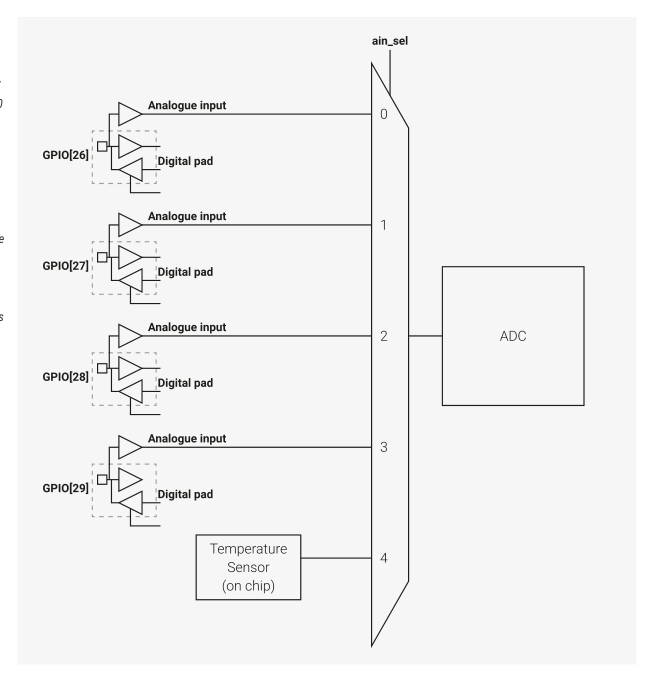

# 12.4. ADC and Temperature Sensor

12.4. ADC and Temperature Sensor

RP2350 has an internal analogue-digital converter (ADC) with the following features:

• SAR ADC (see Section 12.4.3)
• 500 kS/s (using an independent 48 MHz clock)
• 12-bit with 9.2 ENOB (see Section 12.4.4)
• Five or nine input mux:

◦Four inputs available on QFN-60 package pins shared with GPIO[29:26]

◦Eight inputs available on QFN-80 package pins shared with GPIO[47:40]

◦One input dedicated to the internal temperature sensor (see Section 12.4.6)

12.4. ADC and Temperature Sensor
1066

RP2350 Datasheet

• Eight element receive sample FIFO
• Interrupt generation
• DMA interface (see Section 12.4.3.5)

Figure 107 shows the arrangement of ADC channels in the QFN-60 package. Figure 108 shows the same for QFN-80.

*Figure 107. ADC Connection Diagram for QFN-60. This package features four external ADC inputs (0 through 3), on Bank 0 GPIOs 26 through 29. The internal temperature sensor connects to a fifth channel (channel 4).*

This is functionally the

same ADC

arrangement as

RP2040, although the

underlying hardware is

different, to support

the additional

channels on QFN-80.

12.4. ADC and Temperature Sensor
1067

RP2350 Datasheet

*Figure 108. ADC Connection Diagram for QFN-80. This package features eight external ADC inputs (0 through 7), on Bank 0 GPIOs 40 through 47. The internal temperature sensor connects to a ninth channel (channel*

8). Like in QFN-60,

each ADC input shares

a package pin with a

digital Bank 0 GPIO:

generally the digital

functions are disabled

when the ADC is in

use.

When using an ADC input shared with a GPIO pin, always disable the pin’s digital functions by setting IE low and OD high

in the pin’s pad control register. See Section 9.11.3, “Pad Control - User Bank” for details.

The maximum ADC input voltage is determined by the digital IO supply voltage (IOVDD), not the ADC supply voltage

(ADC_AVDD). For example, if IOVDD is powered at 1.8 V, the voltage on the ADC inputs should not exceed 1.8 V + 10% even if

ADC_AVDD is powered at 3.3 V. Voltages greater than IOVDD will result in leakage currents through the ESD protection

diodes. See Section 14.9, “Electrical specifications” for details.
