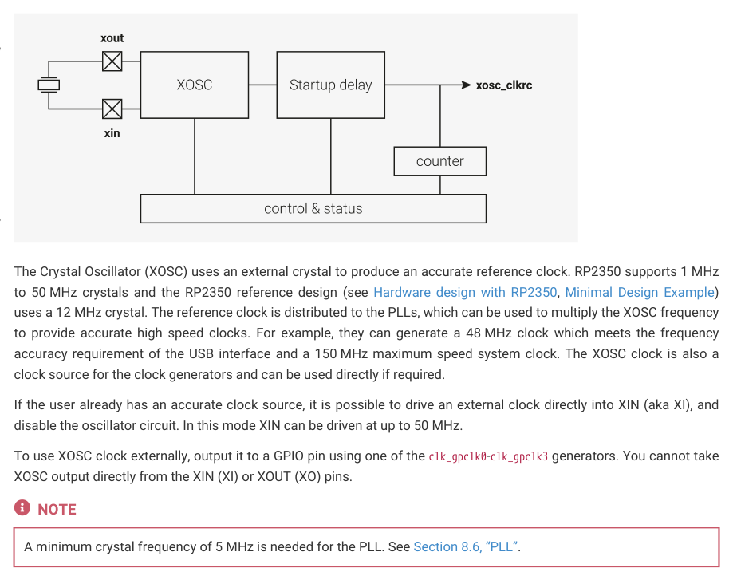

# 8.2.1. Overview

8.2.1. Overview

8.2. Crystal oscillator (XOSC)
554

RP2350 Datasheet

*Figure 38. The XOSC is an amplifier. When a piezoelectric crystal is connected across XIN and XOUT, the amplified feedback drives the crystal into mechanical resonance. This creates a precise reference for on-chip*

clock generation.

External signals can

also be driven directly

into XIN.

The Crystal Oscillator (XOSC) uses an external crystal to produce an accurate reference clock. RP2350 supports 1 MHz

to 50 MHz crystals and the RP2350 reference design (see Hardware design with RP2350, Minimal Design Example)

uses a 12 MHz crystal. The reference clock is distributed to the PLLs, which can be used to multiply the XOSC frequency

to provide accurate high speed clocks. For example, they can generate a 48 MHz clock which meets the frequency

accuracy requirement of the USB interface and a 150 MHz maximum speed system clock. The XOSC clock is also a

clock source for the clock generators and can be used directly if required.

If the user already has an accurate clock source, it is possible to drive an external clock directly into XIN (aka XI), and

disable the oscillator circuit. In this mode XIN can be driven at up to 50 MHz.

To use XOSC clock externally, output it to a GPIO pin using one of the clk_gpclk0-clk_gpclk3 generators. You cannot take

XOSC output directly from the XIN (XI) or XOUT (XO) pins.

A minimum crystal frequency of 5 MHz is needed for the PLL. See Section 8.6, “PLL”.

8.2.1.1. Recommended crystals

For the best performance and stability across typical operating temperature ranges, it is recommended to use the

Abracon ABM8-272-T3. You can source the ABM8-272-T3 directly from Abracon or from an authorised reseller. The

Abracon ABM8-272-T3 has the following specifications:

| Parameters | Minimum | Typical | Maximum | Units | Notes |
| --- | --- | --- | --- | --- | --- |
| Center Frequency | 12.000 | 12.000 | 12.000 | MHz |  |
| Operation Mode | Fundamental-AT | Fundamental-AT | Fundamental-AT |  |  |
| Operating Temperature | -40 |  | +85 | °C |  |
| Storage Temperature | -55 |  | +125 | °C |  |
| Frequency Tolerance (25 °C) | -30 |  | +30 | ppm |  |
| Frequency Stability (25 °C) | -30 |  | +30 | ppm |  |
| Equivalent Series Resistance (R1) |  |  | 50 | Ω |  |
| Shunt Capacitance (C0) |  |  | 3.0 | pF |  |
| Load Capacitance (CL) | 10 | 10 | 10 | pF |  |
| Drive Level |  | 10 | 200 | μW |  |
| Aging | -5 |  | +5 | ppm | @25±3 °C, 1st year |
| Insulation Resistance | 500 |  |  | MΩ | @100 Vdc±15 V |

*Table 597. Key Crystal*

Even if you use a crystal with similar specifications, you will need to test the circuit over a range of temperatures to

8.2. Crystal oscillator (XOSC)
555

RP2350 Datasheet

ensure stability.

The crystal oscillator is powered from the VDDIO voltage. As a result, the Abracon crystal and that particular damping

resistor are tuned for 3.3V operation. If you use a different IO voltage, you will need to re-tune.

Any changes to crystal parameters risk instability across any components connected to the crystal circuit.

If you can’t source the recommended crystal directly from Abracon or a reseller, contact applications@raspberrypi.com.

Raspberry Pi Pico 2 has been specifically tuned for the specifications of the Abracon ABM8-272-T3 crystal. For an

example of how to use a crystal with RP2350, see the Raspberry Pi Pico 2 board schematic in Appendix B of Raspberry

Pi Pico 2 Datasheet and the Raspberry Pi Pico 2 design files.

## Embedded Images

