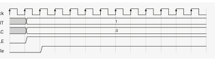
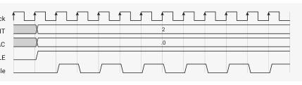
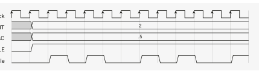

# 11.5.5. Clock Dividers

PIO runs off the system clock, but this is too fast for many interfaces, and the number of Delay cycles which can be

inserted is limited. Some devices, such as UART, require the signalling rate to be precisely controlled and varied, and

ideally multiple state machines can be varied independently while running identical programs. Each state machine is

equipped with a clock divider, for this purpose.

Rather than slowing the system clock itself, the clock divider redefines how many system clock periods are considered

to be "one cycle", for execution purposes. It does this by generating a clock enable signal, which can pause and resume

execution on a per-system-clock-cycle basis. The clock divider generates clock enable pulses at regular intervals, so

that the state machine runs at some steady pace, potentially much slower than the system clock.

Implementing the clock dividers in this way allows interfacing between the state machines and the system to be

simpler, lower-latency, and with a smaller footprint. The state machine is completely idle on cycles where clock enable

is low, though the system can still access the state machine’s FIFOs and change its configuration.

The clock dividers are 16-bit integer, 8-bit fractional, with first-order delta-sigma for the fractional divider. The clock

divisor can vary between 1 and 65536, in increments of 
.

If the clock divisor is set to 1, the state machine runs on every cycle, i.e. full speed:

cycle.
In general, an integer clock divisor of n will cause the state machine to run 1 cycle in every n, giving an effective clock

speed of 
.

when it reaches 1.
Fractional division will maintain a steady state division rate of 
, where n and f are the integer and fractional

fields of this state machine’s CLKDIV register. It does this by selectively extending some division periods from 
 cycles to

*Figure 51. State System Clock machine operation CLKDIV_INT with a clock divisor of CLKDIV_FRAC 1. Once the state CTRL_SM_ENABLE machine is enabled via Clock Enable the CTRL register, its clock enable is asserted on every speed of .*

*Figure 52. Integer System Clock clock divisors yield a CLKDIV_INT periodic clock enable. CLKDIV_FRAC The clock divider CTRL_SM_ENABLE repeatedly counts Clock Enable down from n, and emits an enable pulse .*

*Figure 53. Fractional System Clock clock division with an CLKDIV_INT average divisor of 2.5. CLKDIV_FRAC The clock divider CTRL_SM_ENABLE maintains a running Clock Enable total of the fractional value from each division period, and every time this value much less apparent. wraps through 1, the integer divisor is NOTE increased by one for the next division period.*

For small n, the jitter introduced by a fractional divider may be unacceptable. However, for larger values, this effect is

For fast asynchronous serial, it is recommended to use even divisions or multiples of 1 Mbaud where possible,

rather than the traditional multiples of 300, to avoid unnecessary jitter.

## Embedded Images

