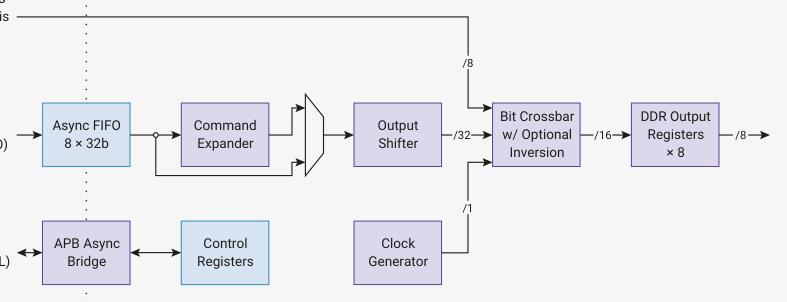

# 12.11. HSTX

The high-speed serial transmit (HSTX) streams data from the system clock domain to up to 8 GPIOs at a rate

independent of the system clock. On RP2350, GPIOs 12 through 19 are HSTX-capable. HSTX is output-only.

*Figure 126. A 32-bit- wide asynchronous Domain: Domain: clk_hstx FIFO provides high- clk_sys bandwidth access PIO Outputs (If clk_hstx is*

APB
(HSTX_CTRL)

HSTX drives data through GPIOs using DDR output registers to transfer up to two bits per clock cycle per pin. The HSTX

balances all delays to GPIO outputs within 300 picoseconds, minimising common-mode components when using

neighbouring GPIOs as a pseudo-differential driver. This also helps maintain destination setup and hold time when a

clock is driven alongside the output data.

The maximum frequency for the HSTX clock is 150 MHz, the same as the system clock. With DDR output operation, this

is a maximum data rate of 300 Mb/s per pin. There are no limits on the frequency ratio of the system and HSTX clocks,

however each clock must be individually fast enough to maintain your required throughput. Very low system clock

frequencies coupled with very high HSTX frequencies might encounter system DMA bandwidth limitations, since the

DMA is capped at one HSTX FIFO write per system clock cycle.
