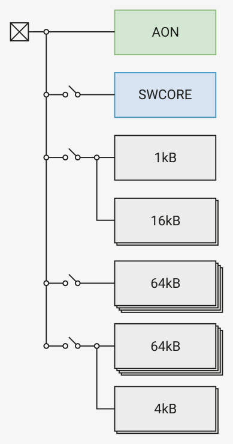

# 6.2.1. Core power domains

RP2350’s core logic is divided into five power domains. With some restrictions, these domains can be selectively

powered off to reduce the chip’s power consumption. The five domains are:

• AON - Always On - a small amount of logic that is always powered on when chip’s core supply (DVDD) is available
• SWCORE - Switched Core - the remaining core logic functions, including processors, bus fabric, peripherals, etc.
• XIP - XIP cache SRAM and Boot RAM
• SRAM0 - SRAM Power Domain 0 - the lower half of the large SRAM banks
• SRAM1 - SRAM Power Domain 1 - the upper half of the large SRAM banks, and the scratch SRAMs

Logic in the AON domain controls the power state of the other power domains, which can be powered on or off

independently. The only exception is the XIP domain, which must always be powered when the SWCORE domain is

powered. SRAMs that are powered on retain their contents when the switched core is powered off.

Figure 18 gives an overview of the core power domains.

DVDD
Always on Power Domain

Switched Core Power Domain

XIP Power Domain
Boot SRAM (1 instances of 1kB)
XIP Cache SRAM (2 instances of 16kB)

SRAM Power Domain 0
SRAM Banks 0–3 (4 instances of 64kB)

SRAM Power Domain 1
SRAM Banks 4–7 (4 instances of 64kB)
SRAM Banks 8–9 (2 instances of 4kB)

*Figure 18. core power domains*
