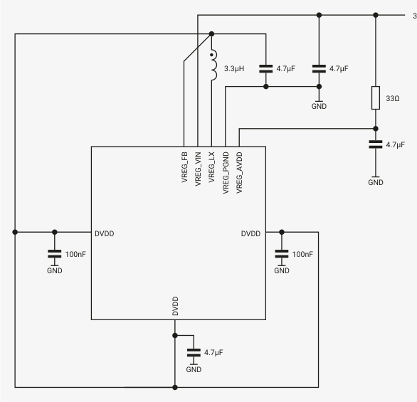
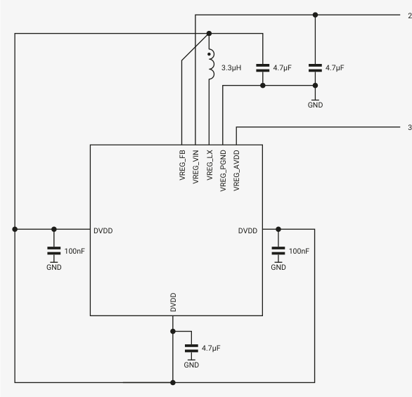
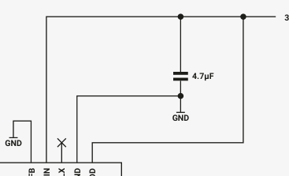
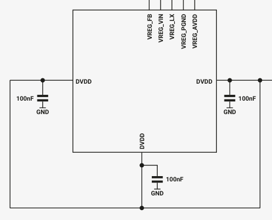

# 6.3.7. Application circuit

The regulator requires two external power supplies, the input supply (VREG_VIN), and a separate low noise supply for its

analogue control circuits (VREG_AVDD). VREG_VIN must be in the range 2.7 V to 5.5 V, and VREG_AVDD must be in the range

3.135 V to 3.63 V.

If VREG_VIN is limited to the range 3.135 V to 3.63 V, a single combined supply can be used for both VREG_VIN and

VREG_AVDD. This approach is shown in Figure 19. Take care to minimise noise on VREG_AVDD.

3.135V to 3.63V supply

Alternatively, to support input voltages above 3.63 V, VREG_VIN and VREG_AVDD can be powered separately. This is shown in

2.7V to 5.5V supply

3.135V to 3.63V supply

*Figure 19. Core voltage regulator with combined supplies*

*Figure 20.*

*Figure 20. Core voltage regulator with separate supplies*

If the digital core supply (DVDD) is powered from an external 1.1V supply, the on-chip regulator can be disabled and the

application circuit simplified. Power must still be provided on the regulator’s analogue supply (VREG_AVDD) and input

supply (VREG_VIN) to power the chip’s power-on reset and brown-out detection blocks. But the inductor can be omitted

and only a single input capacitor is required. Connect VREG_FB directly to ground. This is shown in Figure 21.

3.135V to 3.63V supply

GND

1.1V supply

*Figure 21. External core supply with on- chip regulator disabled. field.*

The on-chip regulator will still power on as soon as VREG_VIN and VREG_AVDD are available, but can be shut down under

software control after the chip is out of reset. This is a safe mode of operation, though the regulator will consume

approximately 400 µA until it’s shut down. The regulator should be shut down by writing a 1 to the VREG register’s HIZ
